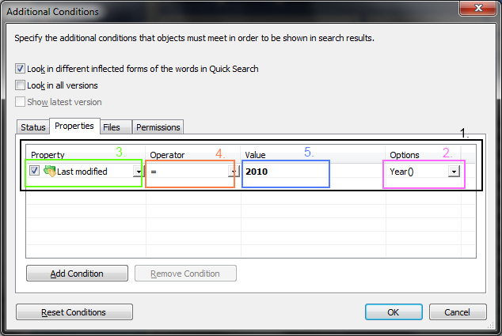

The [DataFunctionCall](https://www.m-files.com/api/documentation/latest/index.html#MFilesAPI~DataFunctionCall.html) API class, and how it relates to executing searches, is often overlooked when building searches.  This class adds additional functionality to the search and broadly corresponds to the `Options` section when building searches using the M-Files Desktop client:



More information on using options (and the associated expected values) is available in the [M-Files User Guide](https://www.m-files.com/user-guide/latest/eng/property_based_conditions.html#filter_settings_properties__options).
{:.note}

## SetDataDate

The [SetDataDate](https://www.m-files.com/api/documentation/latest/MFilesAPI~DataFunctionCall~SetDataDate.html) method states that the search condition should only consider the date portion of the property for comparison.

```csharp
// Search for objects created on the 29th October 2018.
{
	// Set up the data function call.
	var dataFunctionCall = new DataFunctionCall();
	dataFunctionCall.SetDataDate(); // Ignore the time portion of the created timestamp.

	// Create the condition.
	var condition = new SearchCondition();

	// Set the expression.
	condition.Expression.SetPropertyValueExpression(
		(int)MFilesAPI.MFBuiltInPropertyDef.MFBuiltInPropertyDefCreated,
		MFParentChildBehavior.MFParentChildBehaviorNone,
		dataFunctionCall
		);

	// Set the condition type.
	condition.ConditionType = MFConditionType.MFConditionTypeEqual;

	// Set the value.
	condition.TypedValue.SetValue(MFDataType.MFDatatypeDate, new DateTime(2018, 10, 29));

	// Add the condition to the collection for searching.
	conditions.Add(-1, condition);
}
```

## SetDataDaysFrom

The [SetDataDaysFrom](https://www.m-files.com/api/documentation/latest/MFilesAPI~DataFunctionCall~SetDataDaysFrom.html) method is used to perform calculations based on date and timestamp properties.

`DaysFrom` will be positive if the date property is less than the current date (i.e. it is in the past).
{:.note}

```csharp
// Search for objects created more than 10 days ago.
{
	// Set up the data function call.
	var dataFunctionCall = new DataFunctionCall();
	dataFunctionCall.SetDataDaysFrom();

	// Create the condition.
	var condition = new SearchCondition();

	// Set the expression.
	condition.Expression.SetPropertyValueExpression(
		(int)MFilesAPI.MFBuiltInPropertyDef.MFBuiltInPropertyDefCreated,
		MFParentChildBehavior.MFParentChildBehaviorNone,
		dataFunctionCall
		);

	// Set the condition type.
	condition.ConditionType = MFConditionType.MFConditionTypeGreaterThan;

	// Set the value.
	condition.TypedValue.SetValue(MFDataType.MFDatatypeInteger, 10);

	// Add the condition to the collection for searching.
	conditions.Add(-1, condition);
}
```

## SetDataDaysTo

The [SetDataDaysTo](https://www.m-files.com/api/documentation/latest/MFilesAPI~DataFunctionCall~SetDataDaysTo.html) method is used to perform calculations based on date and timestamp properties.  The typical use-case is to find upcoming items, such as contracts that are approaching their renewal date.

`DaysTo` will be positive if the date property is in the future.
{:.note}

```csharp
// Search for objects which require renewal in the next 10 days.
{
	// Set up the data function call.
	var dataFunctionCall = new DataFunctionCall();
	dataFunctionCall.SetDataDaysTo();

	// Create the condition.
	var condition = new SearchCondition();

	// Set the expression.
	condition.Expression.SetPropertyValueExpression(
		1036, // The property ID of the "renewal date" property
		MFParentChildBehavior.MFParentChildBehaviorNone,
		dataFunctionCall
		);

	// Set the condition type.
	condition.ConditionType = MFConditionType.MFConditionTypeLessThan;

	// Set the value.
	condition.TypedValue.SetValue(MFDataType.MFDatatypeInteger, 10);

	// Add the condition to the collection for searching.
	conditions.Add(-1, condition);
}
```

## SetDataMonth

The [SetDataMonth](https://www.m-files.com/api/documentation/latest/MFilesAPI~DataFunctionCall~SetDataMonth.html) method is used to search for items by month, regardless of the day of the month or the year.

The value must be provided as `MFDatatypeText` (a string) and must be two-digits.  For example, March would be `03` and December would be `12`.
{:.note}

```csharp
// Search for objects which are renewed on any day in March (in any year)
{
	// Set up the data function call.
	var dataFunctionCall = new DataFunctionCall();
	dataFunctionCall.SetDataMonth();

	// Create the condition.
	var condition = new SearchCondition();

	// Set the expression.
	condition.Expression.SetPropertyValueExpression(
		1036, // The property ID of the "renewal date" property
		MFParentChildBehavior.MFParentChildBehaviorNone,
		dataFunctionCall
		);

	// Set the condition type.
	condition.ConditionType = MFConditionType.MFConditionTypeEqual;

	// Set the value.
	condition.TypedValue.SetValue(MFDataType.MFDatatypeText, "03");

	// Add the condition to the collection for searching.
	conditions.Add(-1, condition);
}
```

## SetDataYear

The [SetDataYear](https://www.m-files.com/api/documentation/latest/MFilesAPI~DataFunctionCall~SetDataYear.html) method is used to search for items by year, regardless of the day or month portion of the date or timestamp.

The value must be provided as `MFDatatypeInteger`.
{:.note}

```csharp
// Search for objects which require renewal at some point in 2018
{
	// Set up the data function call.
	var dataFunctionCall = new DataFunctionCall();
	dataFunctionCall.SetDataYear();

	// Create the condition.
	var condition = new SearchCondition();

	// Set the expression.
	condition.Expression.SetPropertyValueExpression(
		1036, // The property ID of the "renewal date" property
		MFParentChildBehavior.MFParentChildBehaviorNone,
		dataFunctionCall
		);

	// Set the condition type.
	condition.ConditionType = MFConditionType.MFConditionTypeEqual;

	// Set the value.
	condition.TypedValue.SetValue(MFDataType.MFDatatypeInteger, 2018);

	// Add the condition to the collection for searching.
	conditions.Add(-1, condition);
}
```

## SetDataYearAndMonth

The [SetDataYear](https://www.m-files.com/api/documentation/latest/MFilesAPI~DataFunctionCall~SetDataYear.html) method is used to search for items by year, regardless of the day or month portion of the date or timestamp.

The value must be provided as `MFDatatypeText` (a string) and must contain the year (four digits), a hyphen, then the month (two digits).  For example, March 2018 would be `2018-03` and December 2016 would be `2016-12`.
{:.note}

```csharp
// Search for objects which require are renewed in March 2018
{
	// Set up the data function call.
	var dataFunctionCall = new DataFunctionCall();
	dataFunctionCall.SetDataYearAndMonth();

	// Create the condition.
	var condition = new SearchCondition();

	// Set the expression.
	condition.Expression.SetPropertyValueExpression(
		1036, // The property ID of the "renewal date" property
		MFParentChildBehavior.MFParentChildBehaviorNone,
		dataFunctionCall
		);

	// Set the condition type.
	condition.ConditionType = MFConditionType.MFConditionTypeEqual;

	// Set the value.
	condition.TypedValue.SetValue(MFDataType.MFDatatypeText, "2018-03");

	// Add the condition to the collection for searching.
	conditions.Add(-1, condition);
}
```
