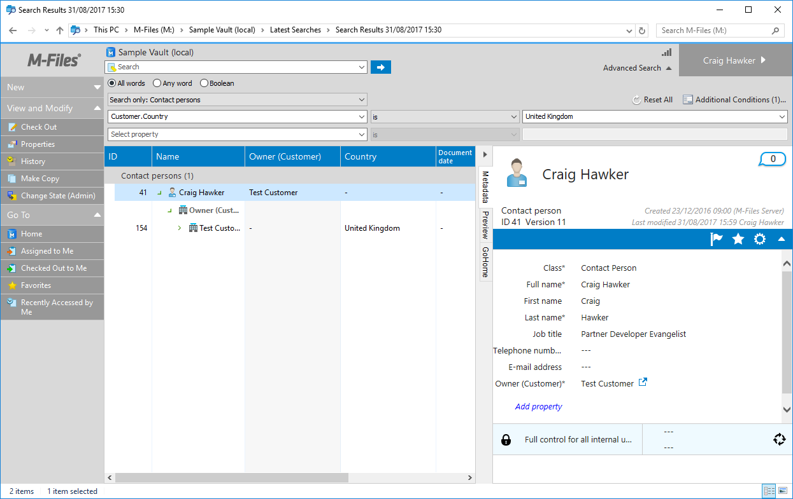
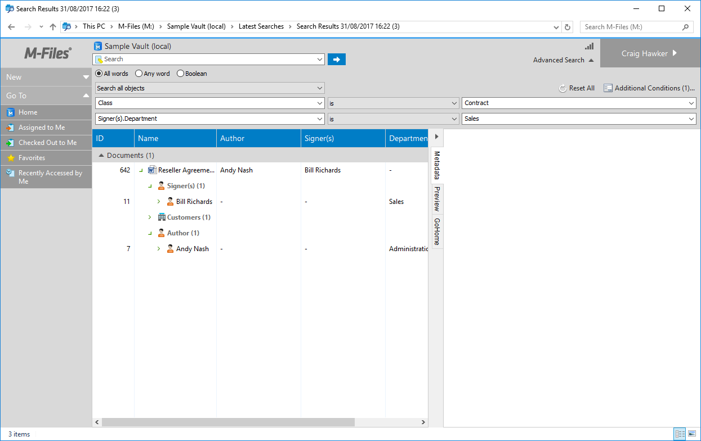
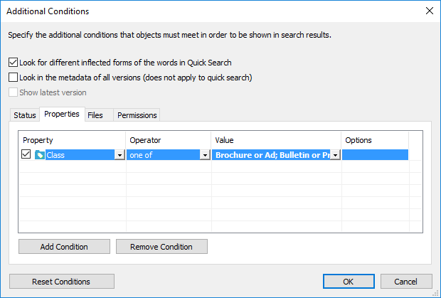

This page is solely applicable to searching for objects within an M-Files vault.  To search for value list items within a value list, please [see this page]({{ site.baseurl }}/APIs/COM-API/Searching/ValueListItems/).
{:.note.warning}

Detailed below are methods of creating individual [SearchCondition](https://www.m-files.com/api/documentation/latest/index.html#MFilesAPI~SearchCondition.html) objects.  These are typically combined into a collection of [SearchConditions](https://www.m-files.com/api/documentation/latest/index.html#MFilesAPI~SearchConditions.html) before being [executed against the vault](https://www.m-files.com/api/documentation/latest/index.html#MFilesAPI~VaultObjectSearchOperations.html).

When using the Vault Application Framework, the <a href="{{ site.baseurl }}/Frameworks/Vault-Application-Framework/Helpers/MFSearchBuilder/">MFSearchBuilder</a> class can be used to more easily construct otherwise-complex search conditions.
{:.note}

## Excluding deleted items

Deleted items are included by default when using the COM API.

Below is an example of creating a [SearchCondition](https://www.m-files.com/api/documentation/latest/index.html#MFilesAPI~SearchCondition.html) which represents the exclusion of deleted items.

```csharp
// Create the condition.
var condition = new SearchCondition();

// Set the expression.
condition.Expression.SetStatusValueExpression(MFStatusType.MFStatusTypeDeleted);

// Set the condition type.
condition.ConditionType = MFConditionType.MFConditionTypeEqual;

// Set the value.
condition.TypedValue.SetValue(MFDataType.MFDatatypeBoolean, false);
```

Alternatively, you may need to only search for deleted items:

```csharp
// Create the condition.
var condition = new SearchCondition();

// Set the expression.
condition.Expression.SetStatusValueExpression(MFStatusType.MFStatusTypeDeleted);

// Set the condition type.
condition.ConditionType = MFConditionType.MFConditionTypeEqual;

// Set the value.
condition.TypedValue.SetValue(MFDataType.MFDatatypeBoolean, true);
```

## Executing a full-text search

A full-text search can search across both the metadata and file contents and is executed when the [SearchForObjectsByString](https://www.m-files.com/api/documentation/latest/index.html#MFilesAPI~VaultObjectSearchOperations~SearchForObjectsByString.html) API method is called.  To use it in combination with other search conditions, the following `SearchCondition` object can be created:

```csharp
// Create the condition.
var condition = new SearchCondition();

// Set the expression (search in file data and metadata).
condition.Expression.SetAnyFieldExpression(MFFullTextSearchFlags.MFFullTextSearchFlagsLookInFileData
		| MFFullTextSearchFlags.MFFullTextSearchFlagsLookInMetaData);

// Set the condition type.
condition.ConditionType = MFConditionType.MFConditionTypeContains;

// Set the value.
// In this case "ESTT" is the text to search for.
condition.TypedValue.SetValue(MFDataType.MFDatatypeText, "ESTT");
```

## Searching by file type

Occasionally it is useful to restrict a search to only specific types of file.  The following `SearchCondition` instance represents searching for files containing ".txt".

```csharp
// Create the condition.
var condition = new SearchCondition();

// Set the expression.
condition.Expression.SetFileValueExpression(MFFileValueType.MFFileValueTypeFileName);

// Set the condition type.
condition.ConditionType = MFConditionType.MFConditionTypeContains;

// Set the value.
condition.TypedValue.SetValue(MFilesAPI.MFDataType.MFDatatypeText, ".txt");

searchConditions.Add(-1, condition);
```

## Searching by property value

### Text values

```csharp
// Create the search condition.
var searchCondition = new SearchCondition();

// We want to search by property - in this case the built-in "name or title" property.
// Alternatively we could pass the ID of the property definition if it's not built-in.
searchCondition.Expression.SetPropertyValueExpression(
	(int)MFBuiltInPropertyDef.MFBuiltInPropertyDefNameOrTitle, 
	MFParentChildBehavior.MFParentChildBehaviorNone );

// We want only items that equal the search string provided.
searchCondition.ConditionType = MFConditionType.MFConditionTypeEqual;

// We want to search for items that are named "hello world".
// Note that the type must both match the property definition type, and be applicable for the
// supplied value.
searchCondition.TypedValue.SetValue(MFilesAPI.MFDataType.MFDatatypeText, "hello world");
```

The most common method for searching for strings is to find items that match (`MFConditionType.MFConditionTypeEqual`) the supplied text.  Other options may include [executing a full-text search]({{ site.baseurl }}/APIs/COM-API/Searching/SearchConditions/#executing-a-full-text-search) or finding items that contain (`MFConditionType.MFConditionTypeContains`) the supplied text:

```csharp
// Create the search condition.
var searchCondition = new SearchCondition();

// We want to search by property - in this case the built-in "name or title" property.
// Alternatively we could pass the ID of the property definition if it's not built-in.
searchCondition.Expression.SetPropertyValueExpression(
	(int)MFBuiltInPropertyDef.MFBuiltInPropertyDefNameOrTitle, 
	MFParentChildBehavior.MFParentChildBehaviorNone );

// We want only items that contain the search string provided.
searchCondition.ConditionType = MFConditionType.MFConditionTypeContains;

// We want to search for items that are named "hello world".
// Note that the type must both match the property definition type, and be applicable for the
// supplied value.
searchCondition.TypedValue.SetValue(MFilesAPI.MFDataType.MFDatatypeText, "hello world");
```

### Lookup values

Lookup values are often used when executing a search for items that refer to other objects, or to value list items.  In the sample below we search for items that refer to a project (in this case with object type Id of 101) with an internal Id of 23.  The property we're using to find the item is 1078:

```csharp
// We want to search by property.
searchCondition.Expression.SetPropertyValueExpression(
	1078, // This is the property that refers from our object to the Project.
	PCBehavior: MFParentChildBehavior.MFParentChildBehaviorNone);

// Set the condition type.
searchCondition.ConditionType = MFConditionType.MFConditionTypeEqual;

// Create a lookup - this is a reference to the project that
// the object must have in the property value.
var lookup = new MFilesAPI.Lookup()
{
	ObjectType = 101, // This is the object type of the Project.
	Item = 23 // This is the internal Id of the Project that we want to find.
};

// We want to search for items that reference the project.
searchCondition.TypedValue.SetValue(MFilesAPI.MFDataType.MFDatatypeLookup, lookup);
```

### Date values

Filtering by date is useful to find items that were processed, signed, etc. on a specific date.

```csharp
// Create the search condition.
var searchCondition = new SearchCondition();

// We want to search by property.
searchCondition.Expression.SetPropertyValueExpression(
	1002, // This is our date property ID
	PCBehavior: MFParentChildBehavior.MFParentChildBehaviorNone);

// Set the condition type (we want items only with the provided date).
searchCondition.ConditionType = MFConditionType.MFConditionTypeEqual;

// We only want documents that have the date of 1st January 2017.
searchCondition.TypedValue.SetValue(MFilesAPI.MFDataType.MFDatatypeDate, new DateTime(2017, 01, 01));
```

Alternatively, multiple conditions could be used to find items which were processed during a date range:

```csharp
// Create our search conditions collection,
// which we will add the individual conditions to.
var searchConditions = new SearchConditions();
{
	// Create the "minimum" search condition.
	var searchCondition = new SearchCondition();

	// We want to search by property.
	searchCondition.Expression.SetPropertyValueExpression(
		1002, // This is our date property ID
		PCBehavior: MFParentChildBehavior.MFParentChildBehaviorNone);

	// Set the condition type.
	searchCondition.ConditionType = MFConditionType.MFConditionTypeGreaterThanOrEqual;

	// We only want documents that are later than 1st January 2017.
	searchCondition.TypedValue.SetValue(MFilesAPI.MFDataType.MFDatatypeDate, new DateTime(2017, 01, 01));

	// Add it to the conditions.
	searchConditions.Add(-1, searchCondition);
}
{
	// Create the "maximum" search condition.
	var searchCondition = new SearchCondition();

	// We want to search by property.
	searchCondition.Expression.SetPropertyValueExpression(
		1002, // This is our date property ID
		PCBehavior: MFParentChildBehavior.MFParentChildBehaviorNone);

	// Set the condition.
	searchCondition.ConditionType = MFConditionType.MFConditionTypeLessThanOrEqual;

	// We only want documents that are before 1st February 2017.
	searchCondition.TypedValue.SetValue(MFilesAPI.MFDataType.MFDatatypeDate, new DateTime(2017, 02, 01));

	// Add it to the conditions.
	searchConditions.Add(-1, searchCondition);
}
```

### Timestamp values

Timestamp property values are most easily searched for by using a range.  For example, the following conditions could be used to find all items that were created on 1st January 2017.  An alternative would be to use a [DataFunctionCall](../DataFunctionCall).

```csharp
// Create our search conditions collection,
// which we will add the individual conditions to.
var searchConditions = new SearchConditions();
{
	// Create the "minimum" search condition.
	var searchCondition = new SearchCondition();

	// We want to search by property.
	searchCondition.Expression.SetPropertyValueExpression(
		(int)MFBuiltInPropertyDef.MFBuiltInPropertyDefCreated,
		PCBehavior: MFParentChildBehavior.MFParentChildBehaviorNone);

	// Set the condition type.
	searchCondition.ConditionType = MFConditionType.MFConditionTypeGreaterThanOrEqual;

	// We only want documents that were created after the start of the day.
	searchCondition.TypedValue.SetValue(MFilesAPI.MFDataType.MFDatatypeTimestamp, new DateTime(2017, 01, 01));

	// Add it to the conditions.
	searchConditions.Add(-1, searchCondition);
}
{
	// Create the "maximum" search condition.
	var searchCondition = new SearchCondition();

	// We want to search by property.
	searchCondition.Expression.SetPropertyValueExpression(
		(int)MFBuiltInPropertyDef.MFBuiltInPropertyDefCreated,
		PCBehavior: MFParentChildBehavior.MFParentChildBehaviorNone);

	// Set the condition.
	searchCondition.ConditionType = MFConditionType.MFConditionTypeLessThan;

	// We only want documents that are before the next day.
	searchCondition.TypedValue.SetValue(MFilesAPI.MFDataType.MFDatatypeTimestamp, new DateTime(2017, 01, 02));

	// Add it to the conditions.
	searchConditions.Add(-1, searchCondition);
}
```

### Searching for empty values

Objects can be found where a property exists on the metadata card, but the property value is empty.

Note that objects that do not have the property on their metadata card will not be returned.
{:.note}

```csharp
// Create our search conditions collection,
// which we will add the individual conditions to.
var searchConditions = new SearchConditions();
{
	{
		// Create the condition.
		var condition = new SearchCondition();

		// Set the expression.
		condition.Expression.SetPropertyValueExpression(
			1078, // This is our "project" property; we want empty ones.
			MFParentChildBehavior.MFParentChildBehaviorNone);

		// Set the condition type.
		condition.ConditionType = MFConditionType.MFConditionTypeEqual;

		// Set the value.
		condition.TypedValue.SetValueToNULL(MFDataType.MFDatatypeMultiSelectLookup);

		conditions.Add(-1, condition);
	}
	// Add it to the conditions.
	searchConditions.Add(-1, searchCondition);
}
```

### Searching for non-empty values

Objects can be found where a property exists on the metadata card and the property value is **not** empty.

```csharp
// Create our search conditions collection,
// which we will add the individual conditions to.
var searchConditions = new SearchConditions();
{
	{
		// Create the condition.
		var condition = new SearchCondition();

		// Set the expression.
		condition.Expression.SetPropertyValueExpression(
			1078, // This is our "project" property; we want empty ones.
			MFParentChildBehavior.MFParentChildBehaviorNone);

		// Set the condition type.
		condition.ConditionType = MFConditionType.MFConditionTypeNotEqual;

		// Set the value.
		condition.TypedValue.SetValueToNULL(MFDataType.MFDatatypeMultiSelectLookup);

		conditions.Add(-1, condition);
	}
	// Add it to the conditions.
	searchConditions.Add(-1, searchCondition);
}
```

## Searching by an external ID

When using [external object types](https://www.m-files.com/user-guide/latest/eng/Connection_to_external_database.html), the object ID shown on the metadata card will be the primary key for the object in the remote system.  A search can be executed to convert the external ID to an internal ID (e.g. to populate a [PropertyValue](https://www.m-files.com/api/documentation/latest/index.html#MFilesAPI~PropertyValue.html) for a lookup):

```csharp
// Create the condition.
var condition = new SearchCondition();

// Set the expression.
condition.Expression.DataStatusValueType = MFStatusType.MFStatusTypeExtID;

// Set the condition type.
condition.ConditionType = MFConditionType.MFConditionTypeEqual;

// Set the value.
// In this case "MyExternalObjectId" is the ID of the object in the remote system.
condition.TypedValue.SetValue(MFDataType.MFDatatypeText, "MyExternalObjectId");
```

An example of searching by display/external ID is available within [the SearchByDisplayId sample in our github repository](https://github.com/M-Files/MFilesSamplesAndLibraries/tree/master/Samples/COM%20API/SearchByDisplayId).
{:.note}

## Excluding an object by ID

It can be useful to exclude an object from the search results by its given internal ID.

```csharp
// Create the condition.
var condition = new SearchCondition();

// Set the expression.
condition.Expression.SetStatusValueExpression(MFStatusType.MFStatusTypeObjectID);

// Set the condition type.
condition.ConditionType = MFConditionType.MFConditionTypeNotEqual;

// Set the value (this excludes all objects with ID 478 - in all object types!).
condition.TypedValue.SetValue(MFDataType.MFDatatypeInteger, 478);
```

## Using indirection levels

Often searches need to return objects that should be filtered by properties on objects they refer to, rather than on their own properties.  For example, a simple search may want to return all `Contact` for `Customer`s based in the `United Kingdom`.  To do this using the M-Files Desktop Client, click the `Advanced Search` button and use an indirect reference in the property dropdown (e.g. `Customer.Country`):



An indirect reference can be either by object type or property.  In the screenshot above, any valid reference to a customer (regardless of the property being used to make the reference) will be included in the search results.  In the result returned above the relationship to the Test Customer was made via the `Owner (Customer)` property, but other valid properties would also be considered.
{:.note}

When searching via the COM API, [Indirection Levels](https://www.m-files.com/api/documentation/latest/index.html#MFilesAPI~Expression~IndirectionLevels.html) are used to describe the relationship between the object being returned and the location of the property being used in the search condition.  In our example above, there is one level of indirection between the `Contact` object and the `Country` property definition: the `Customer` object.

It is important to note that indirection levels only follow relationships 'from' the selected object, not relationships 'to' it, whereas the 360 degree view in the M-Files Desktop Client shows relationships in either direction.
{:.note.warning}

### Referencing by object type

In the example below, we will search using three search conditions:

1. We wish to return `Contact` objects (lines 11-28).
2. We wish to exclude deleted contacts (lines 30-46).
3. The contacts must be associated at a `Customer` based in the UK (lines 48-75).
	1. The search condition will describe the state of the `Country` property, which must equal `United Kingdom` (lines 53-64).
	2. The search condition will define a single indirection level, showing that the `Contact` must be related to a `Customer` object with the correct `Country` (lines 66-71).

In the sample below we have hard-coded the vault structural element Ids.  This is bad practice ([aliases should be used instead]({{ site.baseurl }}/Getting-Started/Aliases/)), but this is shown to keep the code concise.
{:.note}

```csharp
// Declare the Ids of the vault elements that we're searching for.
// HACK: These should instead be loaded at runtime by alias instead.
var contactPersonObjectTypeId = 149;
var customerObjectTypeId = 136;
var countryPropertyDefId = 1090;
var unitedKingdomValueListItemId = 3;

// Create our search conditions.
var searchConditions = new SearchConditions();

// Add an object type filter.
{
	// Create the condition.
	var condition = new SearchCondition();

	// Set the expression.
	condition.Expression.SetStatusValueExpression(MFStatusType.MFStatusTypeObjectTypeID);

	// Set the condition.
	condition.ConditionType = MFConditionType.MFConditionTypeEqual;

	// Set the value.
	condition.TypedValue.SetValue(MFilesAPI.MFDataType.MFDatatypeLookup,
		contactPersonObjectTypeId);

	// Add the condition to the collection.
	searchConditions.Add(-1, condition);
}

// Add a "not deleted" filter.
{
	// Create the condition.
	var condition = new SearchCondition();

	// Set the expression.
	condition.Expression.SetStatusValueExpression(MFStatusType.MFStatusTypeDeleted);

	// Set the condition.
	condition.ConditionType = MFConditionType.MFConditionTypeEqual;

	// Set the value.
	condition.TypedValue.SetValue(MFilesAPI.MFDataType.MFDatatypeBoolean, false);

	// Add the condition to the collection.
	searchConditions.Add(-1, condition);
}

// Add a condition that the customer must be based in the UK.
{
	// Create the condition.
	var condition = new SearchCondition();

	// Set the expression.
	// Note: this is the property on the customer object that we wish to match.
	// In this example, this is the "Country" property.
	condition.Expression.SetPropertyValueExpression(countryPropertyDefId, MFParentChildBehavior.MFParentChildBehaviorNone);

	// Set the condition.
	condition.ConditionType = MFConditionType.MFConditionTypeEqual;

	// Set the value.
	// Note: this is the value of the property to match.
	// In this example, this is the ID of the "UK" value list item.
	condition.TypedValue.SetValue(MFilesAPI.MFDataType.MFDatatypeMultiSelectLookup, unitedKingdomValueListItemId);

	// Describe the indirection between what we're returning (the Contact) and the property we're searching (the Country).
	// In this example, the Contact is associated with a Customer which has the property, so we add the indirection level for that object type.
	var customerObjectTypeIndirectionLevel = new PropertyDefOrObjectType();
	customerObjectTypeIndirectionLevel.PropertyDef = false; // We do not care which property definition is used.
	customerObjectTypeIndirectionLevel.ID = customerObjectTypeId; // Instead care which object type it is related to.
	condition.Expression.IndirectionLevels.Add(-1, customerObjectTypeIndirectionLevel);

	// Add the condition to the collection.
	searchConditions.Add(-1, condition);
}

// Execute the search.
var searchResults = vault.ObjectSearchOperations.SearchForObjectsByConditionsEx(searchConditions,
	MFSearchFlags.MFSearchFlagNone, SortResults: false);
```

### Referencing by property definition

Occasionally an object may be associated with another via multiple properties containing values from the same list.  For example: a `Contract` may have a property named `Author` and one named `Signer`, both of which show objects from the `Employees` list.  In this context it is often useful to specify not just that the contract should be associated with an employee with a specific property value, but that they must be the `Signer`, not the `Author`.



In the screenshot above, the object is returned as `Bill Richards` is the signer and is in the `Sales` department.  If `Bill Richards` was the author of a contract (but not a signer) then the document would not be returned in the search results.
{:.note}

The code below is largely the same as the [example that references by object type]({{ site.baseurl }}/APIs/COM-API/Searching/SearchConditions/#referencing-by-object-type), except for:

1. The `PropertyDefOrObjectType.ID` is assigned the property definition Id (line 71).
2. The `PropertyDefOrObjectType.PropertyDef` value is set to `true`, as the ID refers to a property definition Id rather than an object type Id (line 70).

```csharp
// Declare the Ids of the vault elements that we're searching for.
// HACK: These should instead be loaded at runtime by alias instead.
var contractClassId = 99;
var departmentPropertyDefId = 1136;
var signerPropertyDef = 1174;
var salesValueListItemId = 1;

// Create our search conditions.
var searchConditions = new SearchConditions();

// Add a class filter.
{
	// Create the condition.
	var condition = new SearchCondition();

	// Set the expression.
	condition.Expression.SetPropertyValueExpression((int)MFBuiltInPropertyDef.MFBuiltInPropertyDefClass,
		MFParentChildBehavior.MFParentChildBehaviorNone);

	// Set the condition.
	condition.ConditionType = MFConditionType.MFConditionTypeEqual;

	// Set the value.
	condition.TypedValue.SetValue(MFilesAPI.MFDataType.MFDatatypeLookup,
		contractClassId);

	// Add the condition to the collection.
	searchConditions.Add(-1, condition);
}

// Add a "not deleted" filter.
{
	// Create the condition.
	var condition = new SearchCondition();

	// Set the expression.
	condition.Expression.SetStatusValueExpression(MFStatusType.MFStatusTypeDeleted);

	// Set the condition.
	condition.ConditionType = MFConditionType.MFConditionTypeEqual;

	// Set the value.
	condition.TypedValue.SetValue(MFilesAPI.MFDataType.MFDatatypeBoolean, false);

	// Add the condition to the collection.
	searchConditions.Add(-1, condition);
}

// Add a condition that the signer must be in the sales department.
{
	// Create the condition.
	var condition = new SearchCondition();

	// Set the expression.
	// Note: this is the property on the employee object that we wish to match.
	// In this example, this is the "Department" property.
	condition.Expression.SetPropertyValueExpression(departmentPropertyDefId, MFParentChildBehavior.MFParentChildBehaviorNone);

	// Set the condition.
	condition.ConditionType = MFConditionType.MFConditionTypeEqual;

	// Set the value.
	// Note: this is the value of the property to match.
	// In this example, this is the ID of the "Sales" value list item.
	condition.TypedValue.SetValue(MFilesAPI.MFDataType.MFDatatypeLookup, salesValueListItemId);

	// Describe the indirection between what we're returning (the Contract) and the property we're searching (the Department).
	// In this example, the Contract uses the Signer property to refer to an Employee which has the property, so we add the indirection level for that property definition.
	var signerPropertyDefIndirectionLevel = new PropertyDefOrObjectType();
	signerPropertyDefIndirectionLevel.PropertyDef = true; // The relationship must be via this property.
	signerPropertyDefIndirectionLevel.ID = signerPropertyDef;
	condition.Expression.IndirectionLevels.Add(-1, signerPropertyDefIndirectionLevel);

	// Add the condition to the collection.
	searchConditions.Add(-1, condition);
}

// Execute the search.
var searchResults = vault.ObjectSearchOperations.SearchForObjectsByConditionsEx(searchConditions,
	MFSearchFlags.MFSearchFlagNone, SortResults: false);
```

## Executing a "one of" search

A "one of" search condition can be useful to find items that are in, for example, one of a number of classes.  This can be done easily using the M-Files desktop `Advanced Search`:



### In .NET

Executing the search in .NET-based languages is relatively straight-forward.  In this scenario create the search condition as if it were to match (`MFConditionTypeEqual`) a specific class Id, but instead pass an array of integers for the class Ids that it must match.

```csharp
// Create an array of the class Ids.
// Matched objects must have one of these class Ids.
var classIds = new [] { 
	64, // Brochure or Ad
	42 // Bulletin or Press Release
 };

// Create the search condition.
var searchCondition = new SearchCondition();

// We want to search by property - in this case the built-in "class" property.
// Alternatively we could pass the ID of the property definition if it's not built-in.
searchCondition.Expression.SetPropertyValueExpression(
	(int)MFBuiltInPropertyDef.MFBuiltInPropertyDefClass,
				MFParentChildBehavior.MFParentChildBehaviorNone );

// We want only items that equal one of the class Ids.
searchCondition.ConditionType = MFConditionType.MFConditionTypeEqual;

// We want to search for items whose class property is one of the supplied class Ids.
// This should be MFDatatypeMultiSelectLookup, even though the property is MFDatatypeLookup.
searchCondition.TypedValue.SetValue(MFilesAPI.MFDataType.MFDatatypeMultiSelectLookup, classIds);
```

### In VBScript

Unfortunately, VBScript built-in arrays cannot be passed to SetValue.  Instead, we must instantiate an `ArrayList` from .NET and utilise that instead:

```vbscript
' Create an array of the class Ids.
' Matched objects must have one of these class Ids.
Dim objArrayList: Set objArrayList = CreateObject("System.Collections.ArrayList")
objArrayList.Add 64 ' Brochure or Ad
objArrayList.Add 42 ' Bulletin or Press Release

' Create the search condition.
Dim objSearchCondition
Set objSearchCondition = CreateObject("MFilesAPI.SearchCondition")

' We want to search by property - in this case the built-in "class" property.
' Alternatively we could pass the ID of the property definition if it's not built-in.
objSearchCondition.Expression.SetPropertyValueExpression MFBuiltInPropertyDefClass, MFParentChildBehaviorNone, Nothing

' We want only items that equal one of the class Ids.
objSearchCondition.ConditionType = MFConditionTypeEqual

' We want to search for items whose class property is one of the supplied class Ids.
' This should be MFDatatypeMultiSelectLookup, even though the property is MFDatatypeLookup.
objSearchCondition.TypedValue.SetValue MFDatatypeMultiSelectLookup, objArrayList.ToArray()
```

## Restricting by object flags (e.g. searching for conflict objects)

The following search condition can be used to find objects with specific flags (e.g. objects that are conflicts or shortcuts).  Conflicts can then subsequently be resolved using the [ResolveConflict](https://www.m-files.com/api/documentation/latest/index.html#MFilesAPI~VaultObjectOperations~ResolveConflict.html) API method.

```csharp
// Create the condition.
var condition = new SearchCondition
{
	ConditionType = MFConditionType.MFConditionTypeEqual
};

// Set the expression (we wish to search by the object flags).
condition.Expression.SetStatusValueExpression(MFStatusType.MFStatusTypeObjectFlags);

// Set the value to be the flag to search by (e.g. Conflict, below).
condition.TypedValue.SetValue(MFDataType.MFDatatypeInteger, (int)MFSpecialObjectFlag.MFSpecialObjectFlagConflict);
```

## Restricting the search results by user permissions

Sometimes searches must be undertaken using common credentials.  In these instances it is important to ensure that the objects which are returned are only the ones to which a specific user has access.

```csharp
// Create the condition.
var condition = new SearchCondition();

// Set the expression (must be visible to the provided user).
condition.Expression.SetPermissionExpression(MFPermissionsExpressionType.MFVisibleTo);

// Set the condition type.
condition.ConditionType = MFConditionType.MFConditionTypeEqual;

// Set a lookup representing the user.
var lookup = new MFilesAPI.Lookup()
{
	ObjectType = (int)MFBuiltInValueList.MFBuiltInValueListUsers,
	Item = 25 // User ID = 25
};

// Set the value.
condition.TypedValue.SetValue(MFDataType.MFDatatypeLookup, lookup);
```