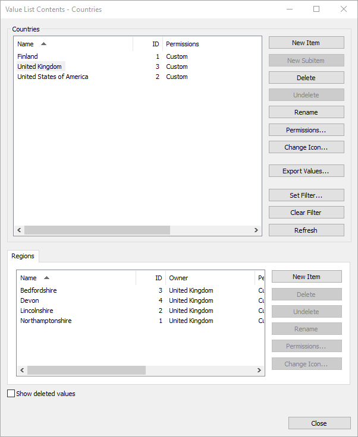

Whilst most search operations are looking for *objects* within the M-Files vault, occasionally we need to search a value list for specific *value list items*.

Value Lists are collections of possible values that can be selected within a property definition.  An example may be `Country`, which may have values for `Finland`, `United States of America`, or `United Kingdom`.  Value Lists may also be hierarchical, so we may have a sub-list of `Regions` which may contain various states underneath `United States of America`, or counties within the `United Kingdom`.



Most value lists are relatively small but occasionally - especially with external value lists - the number of items may be quite large.  When interacting with these value lists we may often need to search for values to find the ones which are appropriate to show to the user.

The M-Files API provides a mechanism for searching for value list items using [VaultValueListItemOperations.SearchForValueListItemsEx](https://www.m-files.com/api/documentation/latest/index.html#MFilesAPI~VaultValueListItemOperations~SearchForValueListItemsEx.html) and [VaultValueListItemOperations.SearchForValueListItemsEx2](https://www.m-files.com/api/documentation/latest/index.html#MFilesAPI~VaultValueListItemOperations~SearchForValueListItemsEx2.html).  The only difference between these two methods is the ability to define the automatic property definition filter and the maximum number of results to return.  Searching for value list items involves the creation of [SearchCondition](https://www.m-files.com/api/documentation/latest/MFilesAPI~SearchCondition.html) objects in the same way as searching for objects.

## Building the search conditions

### Searching by name

The code below will create a [SearchCondition](https://www.m-files.com/api/documentation/latest/MFilesAPI~SearchCondition.html) that finds items that start with `United`.

```csharp
// Create the condition.
var condition = new SearchCondition();

// Set the expression.
// NOTE: 2 is the internal property definition used for the value list item name.
condition.Expression.DataPropertyValuePropertyDef = 2;

// Set the condition type.
condition.ConditionType = MFConditionType.MFConditionTypeStartsWith;

// Set the value.
condition.TypedValue.SetValue(MFDataType.MFDatatypeText, "United");
```

### Filtering out deleted items

The code below will create a [SearchCondition](https://www.m-files.com/api/documentation/latest/MFilesAPI~SearchCondition.html) which excludes deleted items.

```csharp
// Create the condition.
var condition = new SearchCondition();

// Set the expression.
// NOTE: 5 is the internal property definition used for the deletion flag on a value list item.
condition.Expression.DataPropertyValuePropertyDef = 5;

// Set the condition type.
condition.ConditionType = MFConditionType.MFConditionTypeEqual;

// Set the value.
condition.TypedValue.SetValue(MFDataType.MFDatatypeBoolean, false);
```

### Searching by owner

The code below will create a [SearchCondition](https://www.m-files.com/api/documentation/latest/MFilesAPI~SearchCondition.html) which finds value list items that have an owner ID of `3`.  In the example used higher up in this section, this could return all `Regions` within the `United Kingdom`.

```csharp
// Create the condition.
var condition = new SearchCondition();

// Set the expression.
// NOTE: 3 is the internal property definition used for the value list item owner.
condition.Expression.DataPropertyValuePropertyDef = 3;

// Set the condition type.
condition.ConditionType = MFConditionType.MFConditionTypeEqual;

// Set the value.
// NOTE: The '3' shown here is the ID of the "United Kingdom" value list item
// and is not related to the '3' used when setting Expression.DataPropertyValuePropertyDef.
condition.TypedValue.SetValue(MFDataType.MFDatatypeLookup, 3);
```

Searching by owner can only be done with hierarchical value lists.
{:.note}

## Executing the search

In the sample below, the code builds up a set of search conditions and then searches a value list for the items.

```csharp
// Create our search conditions collection.
var conditions = new SearchConditions();

// Exclude deleted items.
{	
	// Create the condition.
	var condition = new SearchCondition();

	// Set the expression.
	// NOTE: 5 is the internal property definition used for the deletion flag on a value list item.
	condition.Expression.DataPropertyValuePropertyDef = 5;

	// Set the condition type.
	condition.ConditionType = MFConditionType.MFConditionTypeEqual;

	// Set the value.
	condition.TypedValue.SetValue(MFDataType.MFDatatypeBoolean, false);

	// Add it to the collection.
	conditions.Add(-1, condition);
}

// Filter by name (starts with "North").
{	
	// Create the condition.
	var condition = new SearchCondition();

	// Set the expression.
	// NOTE: 2 is the internal property definition used for the value list item name.
	condition.Expression.DataPropertyValuePropertyDef = 2;

	// Set the condition type.
	condition.ConditionType = MFConditionType.MFConditionTypeStartsWith;

	// Set the value.
	condition.TypedValue.SetValue(MFDataType.MFDatatypeText, "North");

	// Add it to the collection.
	conditions.Add(-1, condition);
}

// Only where the parent is the value list item with ID 3 (e.g. "United Kingdom").
// NOTE: This is only applicable with hierarchical value lists.
{
	// Create the condition.
	var condition = new SearchCondition();

	// Set the expression.
	// NOTE: 3 is the internal property definition used for the value list item owner.
	condition.Expression.DataPropertyValuePropertyDef = 3;

	// Set the condition type.
	condition.ConditionType = MFConditionType.MFConditionTypeEqual;

	// Set the value.
	// NOTE: The '3' shown here is the ID of the "United Kingdom" owner value list item
	// and is not related to the '3' used when setting Expression.DataPropertyValuePropertyDef.
	condition.TypedValue.SetValue(MFDataType.MFDatatypeLookup, 3);

	// Add it to the collection.
	conditions.Add(-1, condition);
}

// Search value list with ID 102.
// ref: https://www.m-files.com/api/documentation/latest/index.html#MFilesAPI~VaultValueListItemOperations~SearchForValueListItemsEx.html
var results = vault.ValueListItemOperations.SearchForValueListItemsEx(
	ValueList: 102,
	SearchConditions: conditions,
	UpdateFromServer: false,
	RefreshTypeIfExternalValueList: MFExternalDBRefreshType.MFExternalDBRefreshTypeNone,
	ReplaceCurrentUserWithCallersIdentity: true);
```
