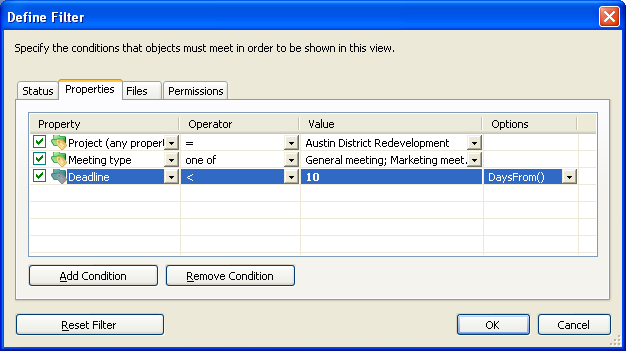

Searching M-Files is required in most M-Files code.

Performing a search typically involves the [VaultObjectSearchOperations](https://www.m-files.com/api/documentation/latest/index.html#MFilesAPI~VaultObjectSearchOperations.html) class, and executing one of the `SearchForObjectsByConditions` methods.  These methods take one or more [SearchCondition](https://www.m-files.com/api/documentation/latest/index.html#MFilesAPI~SearchCondition.html) objects which express a particular rule that the object must match in order to be returned.

Most typical searches will involve the use of multiple search conditions (e.g. the objects must be both [not deleted]({{ site.baseurl }}/APIs/COM-API/Searching/SearchConditions/#excluding-deleted-items) and have a specific object class).  To search by multiple conditions, create a [SearchConditions](https://www.m-files.com/api/documentation/latest/index.html#MFilesAPI~SearchConditions.html) object, add in the specific search conditions one by one, then call [SearchForObjectsBySearchConditionsEx](https://www.m-files.com/api/documentation/latest/index.html#MFilesAPI~VaultObjectSearchOperations~SearchForObjectsByConditionsEx.html).

## An overview of the SearchCondition object

Each `SearchCondition` consists of three parts: an [Expression](https://www.m-files.com/api/documentation/latest/index.html#MFilesAPI~SearchCondition~Expression.html) (what to compare), a [ConditionType](https://www.m-files.com/api/documentation/latest/index.html#MFilesAPI~MFConditionType.html) (what type of match to make), and a [TypedValue](https://www.m-files.com/api/documentation/latest/index.html#MFilesAPI~SearchCondition~TypedValue.html) (what to match).



In the example above, the `Expression` is the property (e.g. "Project"), the `ConditionType` is the operator (e.g. "equals"), and the `TypedValue` is the project to match ("Austin District Redevelopment").

## An example search

Below is an example of searching using the COM API.  This sample restricts by two conditions:

* The object type ID must be a document.

* The object must not be deleted.

```csharp
// Create our search conditions.
var searchConditions = new SearchConditions();

// Add an object type filter.
{
	// Create the condition.
	var condition = new SearchCondition();

	// Set the expression.
	condition.Expression.SetStatusValueExpression(MFStatusType.MFStatusTypeObjectTypeID);

	// Set the condition.
	condition.ConditionType = MFConditionType.MFConditionTypeEqual;

	// Set the value.
	condition.TypedValue.SetValue(MFDataType.MFDatatypeLookup, 
		(int)MFBuiltInObjectType.MFBuiltInObjectTypeDocument);

	// Add the condition to the collection.
	searchConditions.Add(-1, condition);
}

// Add a "not deleted" filter.
{
	// Create the condition.
	var condition = new SearchCondition();

	// Set the expression.
	condition.Expression.SetStatusValueExpression(MFStatusType.MFStatusTypeDeleted);

	// Set the condition.
	condition.ConditionType = MFConditionType.MFConditionTypeEqual;

	// Set the value.
	condition.TypedValue.SetValue(MFDataType.MFDatatypeBoolean, false);

	// Add the condition to the collection.
	searchConditions.Add(-1, condition);
}

// Execute the search.
var searchResults = vault.ObjectSearchOperations.SearchForObjectsByConditionsEx(searchConditions,
	MFSearchFlags.MFSearchFlagNone, SortResults: false);
```

<p class="note">More information on individual search conditions is available <a href="{{ site.baseurl }}/APIs/COM-API/Searching/SearchConditions">in the dedicated page</a>.</p>

## Tips and tricks

### Deleted items are returned by default

It is important to note that items which are deleted are returned by default.  If the current user context has access to deleted items then these items will be returned in the search results.  If deleted items should not be returned then ensure you [add a condition to exclude deleted items]({{ site.baseurl }}/APIs/COM-API/Searching/SearchConditions/#excluding-deleted-items).

### The ID displayed in the object metadata card may not be the internal object ID

Adding a search that restricts by the target object ID (e.g. the object must refer to a specific customer) is [relatively straight-forward]({{ site.baseurl }}/APIs/COM-API/Searching/SearchConditions/#lookup-values), except for [external object types]({{ site.baseurl }}/Built-In/External-Object-Type-Data-Source/).  When viewing the metadata card of external objects, the object's unique ID in the primary system will be shown (i.e. the source column mapped to the "Object ID") instead of the object's internal ID.

To resolve the internal ID from the external ID, you can either [search for the object]({{ site.baseurl }}/APIs/COM-API/Searching/SearchConditions/#searching-by-an-external-id) or look up the ID using the [API directly](https://www.m-files.com/api/documentation/latest/index.html#MFilesAPI~VaultValueListItemOperations~GetValueListItemByDisplayID.html).