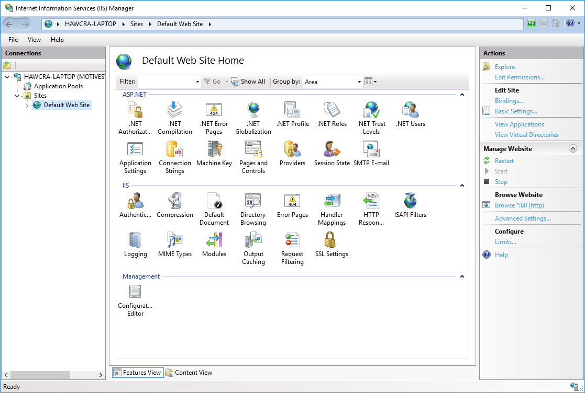
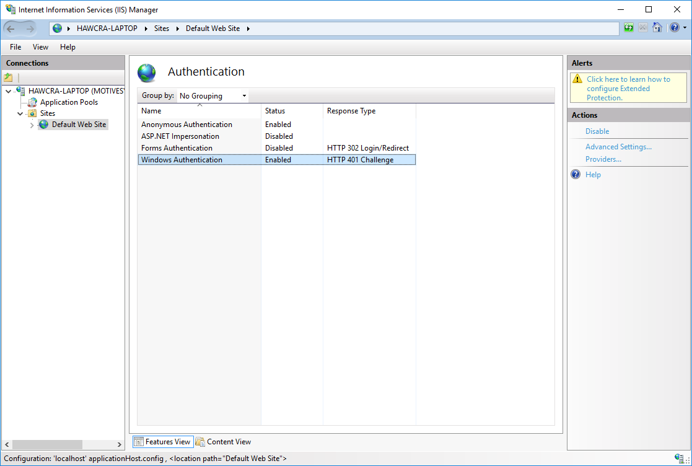
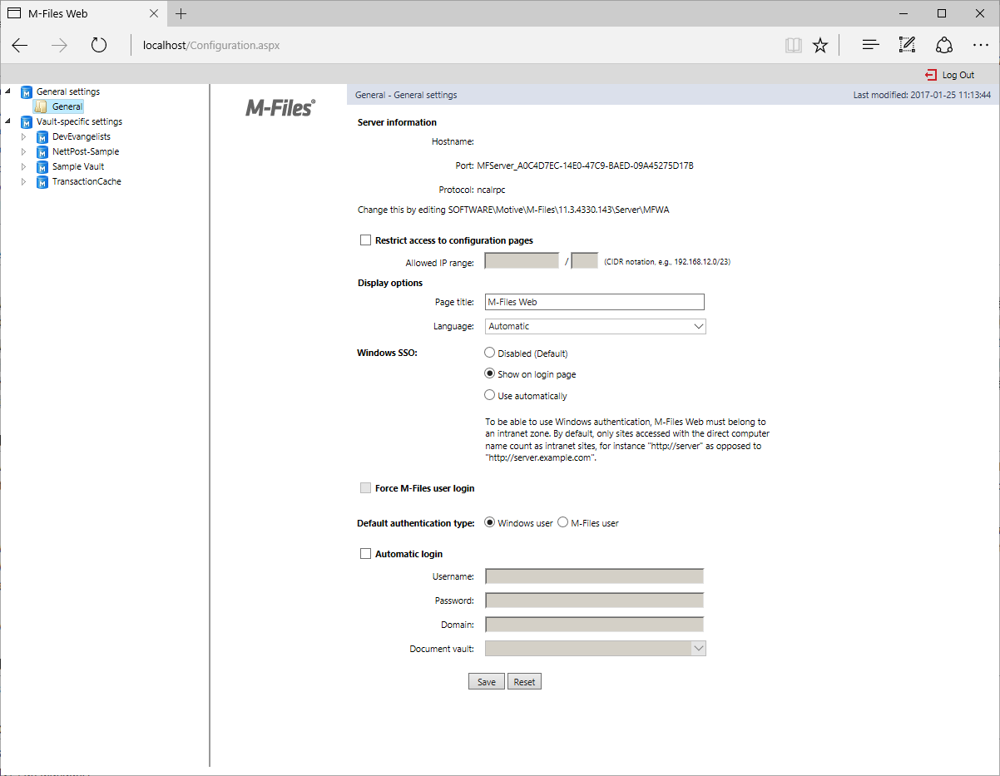

Single Sign-On is a mechanism to allow authenticated users to interact with network resources without explicitly authenticating with each one individually.  M-Files Web Access, and therefore the M-Files Web Service, supports Single Sign-On, but requires some manual steps to enable and configure.
This document details those steps and provides a sample C# class which shows the process of signing into the M-Files Web Access and using the token received to authenticate to the M-Files Web Service and execute further queries.

## Configuring IIS and M-Files Web Access

This document does not deal with setting up M-Files Web Access.  More information is available in the [Web and Mobile Access](https://www.m-files.com/user-guide/latest/eng/Configure_M-Files_Web_Access.html) section of the online user guide.
{:.note}

### Enabling Windows Authentication within IIS

Firstly, open IIS on the server running M-Files Web Access, select the web site that M-Files Web Access is running within, and double-click on the `Authentication` section:



Ensure that `Windows Authentication` is set to `Enabled`:



### Configuring M-Files Web Access to allow SSO

By default, M-Files Web Access does not allow Single Sign-On authentication.  Single Sign-On can be enabled alongside standard ("forms-based") authentication using the M-Files Web Access Configuration page.
To do this, open a web browser and go to `http://myserver/Configuration.aspx`.  This web page allows a server administrator to configure how M-Files Web Access functions, and to enable or disable functionality such as Single Sign-On.
Select `General` on the left, then enable `Windows SSO`:



It is recommended that these changes are tested in a demonstration/test environment prior to changing any live system, as incorrect settings may lead to M-Files Web Access (and therefore the M-Files Web Service) becoming inaccessible.
{:.note}

## Using Single Sign-On from an application

The basic approach to using Single Sign-On from an application is:

* Make a HTTP request to `/WebServiceSSO.aspx`, providing the vault Id to connect to.
* Ensure that a 200 ("OK") status code was returned, and retrieve the session ID cookie from the HTTP response.
* Ensure that the session ID cookie is added to all subsequent requests to the M-Files Web Service.

Please note, though:

* Your application must be executed as a user with rights to the M-Files vault.
* The session ID cookie has a limited timespan and may require refreshing if the timeout elapses.
* The session ID cookie may become invalidated due to server activity (e.g. a server restart) and may require refreshing prior to the expected timeout.

### A C# Sample class

This is meant for information only and is not considered production-quality.
{:.note}

```csharp
using System;
using System.Collections.Generic;
using System.Net;
using MFiles.Mfws.Structs;
using RestSharp;

namespace WebServiceClient
{
	class Program
	{

		private static IRestClient restClient = new RestClient("http://localhost");

		static void Main(string[] args)
		{

			// Authenticate to the sample vault.
			AuthenticateUsingSSO("C840BE1A-5B47-4AC0-8EF7-835C166C8E24");

			// Get the object types.
			var objectTypes = GetObjectTypes();
			Console.WriteLine($"Got {objectTypes.Count} object types.");

		}

		private static void AuthenticateUsingSSO(string vaultGuid)
		{

			// Build a request to WebServiceSSO.aspx.
			var request = new RestRequest($"/WebServiceSSO.aspx?popup=1&vault={vaultGuid}")
			{
				Credentials = CredentialCache.DefaultNetworkCredentials
			};

			// Execute the request.
			var response = restClient.Get(request);

			// Populate our cookie container with the cookies (i.e. session tokens)
			// returned by the request to WebServiceSSO.aspx.
			restClient.CookieContainer = new CookieContainer();
			foreach (var cookie in response.Cookies)
			{
				restClient.CookieContainer.Add(new Cookie(cookie.Name, cookie.Value, cookie.Path, cookie.Domain));
			}

		}

		private static List<ObjType> GetObjectTypes()
		{
			// Issue a request for the object types and parse them into the expected structure.
			// The structures come from https://developer.m-files.com/APIs/REST-API/Reference/samples.html
			return restClient
				.Get<List<ObjType>>(new RestRequest("/REST/structure/objecttypes")).Data;

		}

	}
}

```

This sample uses the <a href="http://restsharp.org/">RestSharp</a> library to avoid boilerplate HTTP request and parsing code.  Please confirm the licenses for any third party libraries prior to their use.
{:.note}