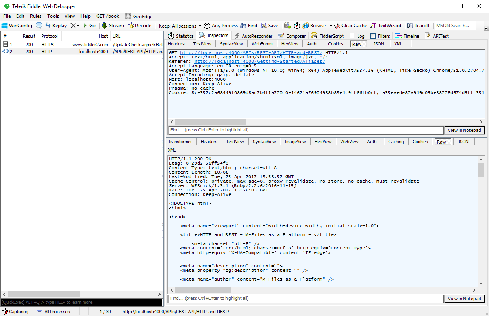
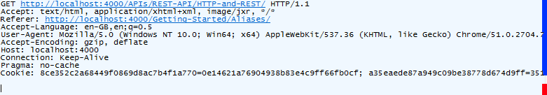
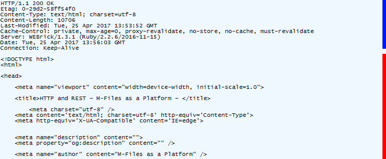
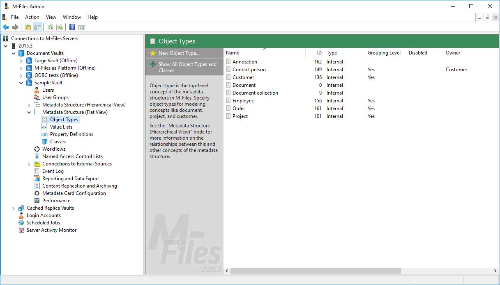

## HTTP

HTTP (HyperText Transfer Protocol) is a request-response protocol that is used by web applications to communicate, typically, with web servers: the client requests content from the server, the server executes that request, and the server then returns a response to the client.  In a typical web browser scenario: your web browser requests a HTML file from the server (the web browser forms and sends a *HTTP request*), the server processes that request, and the server returns the content to the client (the server forms and sends back a *HTTP response*).

A *HTTP request* is built of a number of parts:
* A request line (which denotes the resource which is requested) including the [request method](https://en.wikipedia.org/wiki/Hypertext_Transfer_Protocol#Request_methods).
* Optional [header fields](https://en.wikipedia.org/wiki/HTTP_request_header_field) which further detail the content the client would like, e.g. the accepted content types.
* A newline.
* An optional [message body](https://en.wikipedia.org/wiki/HTTP_message_body).

The HTTP header (including the request line) is highlighted by a blue line, and the request body (blank in this case) highlighted by a red line.

A *HTTP response* is built of similar parts:
* A response [status code](https://en.wikipedia.org/wiki/List_of_HTTP_status_codes).
* Optional [header fields](https://en.wikipedia.org/wiki/HTTP_response_header_field) which further detail the response given, e.g.accepted content type.
* A newline.
* An optional [message body](https://en.wikipedia.org/wiki/HTTP_message_body).

The HTTP header (including the response status code) is highlighted by a blue line, and the response body highlighted by a red line.

[More information on HTTP can be found on Wikipedia](https://en.wikipedia.org/wiki/Hypertext_Transfer_Protocol)

## REST

Unlike HTTP, REST is not a protocol. Whilst REST (Representational state transfer) is not designed to only function over HTTP, HTTP is the most common protocol over which REST functions.  REST is not a language used for communication.  Instead, REST is a set of architectural principles which typically include:

* The use of URIs to identify resources (e.g. `/REST/objects/0/123` may identify an object of type `0` with ID `123`).
* The use of verbs (typically [HTTP request methods](https://en.wikipedia.org/wiki/Hypertext_Transfer_Protocol#Request_methods)) to define the action being taken (e.g. `GET` requests details of the resource, whilst `DELETE` removes it).
* The use of content negotiation (i.e. the ability for the requestor to describe what content types it can accept, and for the server to choose one to describe the content).  *Note that the M-Files Web Service is typically used with the JSON content type.*.

[More information on REST can be found on Wikipedia](https://en.wikipedia.org/wiki/Representational_state_transfer)

## Serialization and Deserialization

In order to pass data structures from the calling application to the server, and back again from the server to the calling application, they must be serialised (converted to structured text) and then deserialised (converted back again).  Whilst the [MFWS has experimental support for data encoded in XML](https://www.m-files.com/mfws/parameters.html), most calling applications use [JavaScript Object Notation](http://json.org) instead, and this will be used in all samples.

## Obtaining metadata structure element IDs

Whilst it is typically advisable to reference metadata structure elements via their [aliases]({{ site.baseurl }}/Concepts/Aliases/), alias support is not available on the M-Files Web Service.  Instead, structural elements (e.g. properties, object types, classes, etc.) must be referenced by their internal ID.

### Via M-Files Admin

The [M-Files Admin](http://www.m-files.com/user-guide/latest/eng/#M-Files_server_administrator_heading.html) is to administer and maintain M-Files document vaults and servers.  IDs of structural elements can easily be found using this application; simply expand the vault in question, then expand the `Metadata Structure (Flat View)` node.  By selecting each of the items within (e.g. `Object Types`, or `Property Definitions`), the item is listed alongside its ID:

By default these lists hide built-in items.  Click the `Show all` button to ensure that built-in items are visibile.

Value list item Ids can be viewed by selecting a value list in the section above and clicking the `Contents` button.

### Via the M-Files Web Service

It is possible to enumerate most structural elements of an M-Files vault directly using the M-Files Web Service.  The following endpoints are useful:

* [/structure/objecttypes](http://www.m-files.com/mfws/resources/structure/objecttypes.html) - returns all "real" object types (not value lists) in the vault.

* [/structure/classes](http://www.m-files.com/mfws/resources/structure/classes.html) - returns all classes in the vault, optionally for a given object type.  Can also return classes in class groups.

* [/structure/properties](http://www.m-files.com/mfws/resources/structure/properties.html) - returns all property definitions in the vault.

* [/structure/classes/(id)](http://www.m-files.com/mfws/resources/structure/classes/id.html) - returns details on a specific class in the vault, including the default property definitions shown on the metadata card and whether they are mandatory or optional.

* /valuelists - returns all value lists within the vault.

* [/valuelists/(id)/items](http://www.m-files.com/mfws/resources/valuelists/id/items.html) - returns the items within a specific value list in the vault.

The <a href="http://www.m-files.com/mfws/resources/structure/objecttypes.html">/structure/objecttypes</a> endpoint incorrectly states that it will return value lists.

