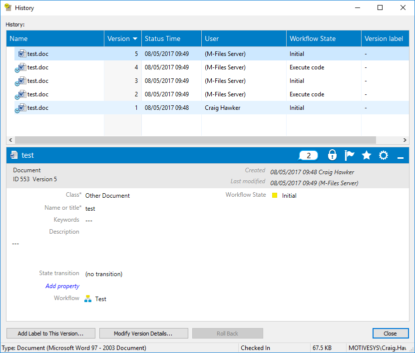
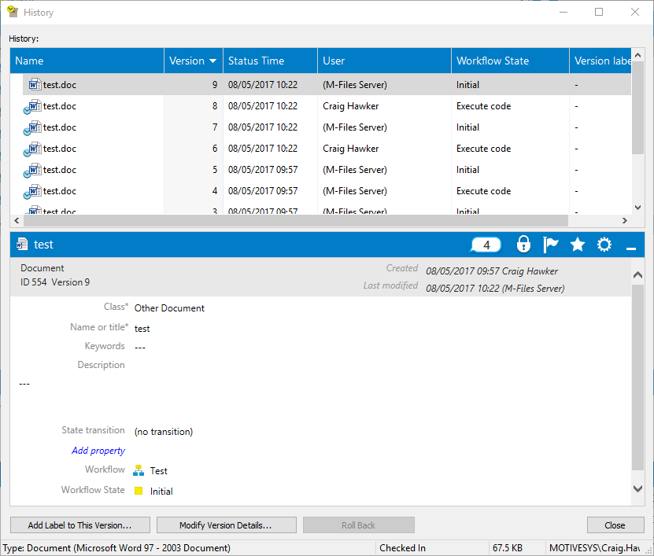

If a server-side script (e.g. event handler, or workflow state action) alters an object during the save process, it can affect the way in which the audit trail records and displays information.

## The broken audit trail

This is most often seen as the user for each action being stored as "(M-Files Server)", rather than the user which altered the object:



This audit trail was caused by the following code on the `Execute code` workflow state, and an automatic state transition back to `Initial`:

```vbscript
Option Explicit

' Create a property value for the comment.
Dim objCommentPropertyValue
Set objCommentPropertyValue = CreateObject("MFilesAPI.PropertyValue")
objCommentPropertyValue.PropertyDef = MFBuiltInPropertyDefComment
objCommentPropertyValue.Value.SetValue MFDatatypeMultiLineText, "hello"

' Update the object.
Vault.ObjectPropertyOperations.SetVersionComment ObjVer, objCommentPropertyValue
```

## How to resolve

### Using VBScript

To resolve this, the [SetLastModificationInfoAdmin](https://www.m-files.com/api/documentation/latest/index.html#MFilesAPI~VaultObjectPropertyOperations~SetLastModificationInfoAdmin.html) method can be called.  This updates the last modification information (either the user, or the date, or both), overriding the change caused by the above code:

```vbscript
Option Explicit

' Create a property value for the comment.
Dim objCommentPropertyValue
Set objCommentPropertyValue = CreateObject("MFilesAPI.PropertyValue")
objCommentPropertyValue.PropertyDef = MFBuiltInPropertyDefComment
objCommentPropertyValue.Value.SetValue MFDatatypeMultiLineText, "hello"

' Update the object.
Vault.ObjectPropertyOperations.SetVersionComment ObjVer, objCommentPropertyValue

' Create a typed value for the "last modified by" value.
Dim objLastModifiedByTypedValue
Set objLastModifiedByTypedValue = CreateObject("MFilesAPI.TypedValue")
objLastModifiedByTypedValue.SetValue MFDatatypeLookup, CurrentUserID

' Update the last modification info.
Vault.ObjectPropertyOperations.SetLastModificationInfoAdmin ObjVer, True, objLastModifiedByTypedValue, False, Nothing
```



<p class="note">In the screenshot above, note that the "Execute code" state now has the correct user against it.  The transition back to "Initial" is still executed by the M-Files Server, as this is an automatic state transition.</p>

### Helpers in the Vault Application Framework

The [ObjVerEx]({{ site.baseurl }}/Frameworks/Vault-Application-Framework/Helpers/ObjVerEx/) helper object in the Vault Application Framework contains two helper methods: [SetCreatedBy and SetModifiedBy]({{ site.baseurl }}/Frameworks/Vault-Application-Framework/Helpers/ObjVerEx/#setcreatedby-and-setmodifiedby).  These helper methods can be used as shortcuts to the above approach when using the Vault Application Framework.