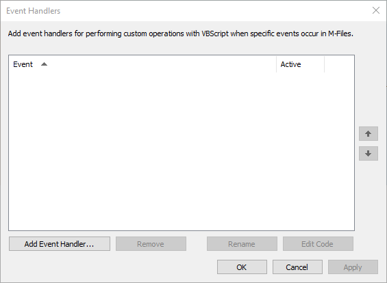
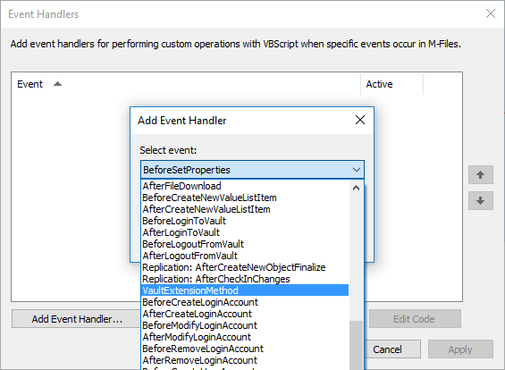

Vault Extension Methods are snippets of code that are only executed when explicitly called using the [ExecuteVaultExtensionMethod method](https://www.m-files.com/api/documentation/latest/index.html#MFilesAPI~VaultExtensionMethodOperations~ExecuteVaultExtensionMethod.html).  Vault Extension Methods can either be written using [VBScript](#vbscript) or registered using the [Vault Application Framework's VaultExtensionMethodAttribute]({{ site.baseurl }}/Frameworks/Vault-Application-Framework/Attributes/Vault-Extension-Methods/).

From M-Files 11.1.4310.124, Vault Extension Methods can also be executed through the [M-Files Web Service]({{ site.baseurl }}/APIs/REST-API/Vault-Extension-Methods/).

## A Note on Security

Vault Extension Methods - regardless of how they are written or called - can be executed by any user.  Additionally, the Vault Extension Method will be executed with administrative permissions, as other processes such as event handlers are.  It is up to the developer implementing the Vault Extension Method to ensure that permissions are validated prior to any operation being executed against the vault.

## How to define a Vault Extension Method

### VBScript

Vault Extension Methods take a single string "Input" and produce a single string "Output".  Vault Extension Methods are created in the same way as Event Handlers.  To register a new one, open the `M-Files Admin` software, expand your server connection, right-click on the vault name and select `Event Handlers`:



Select `Add Event Handler...` and choose `VaultExtensionMethod` from the event dropdown:



A simple extension method may contain code such as :

```vbscript
Option Explicit

' Parrot back the input.
Output = "Input was: " & Input
```

Passing more complex data objects into and out of Vault Extension Methods is possibly by serializing and deserializing the objects.
{:.note}

### Vault Application Framework

An example on defining [Vault Extension Methods through the Vault Application Framework can be found here]({{ site.baseurl }}/Frameworks/Vault-Application-Framework/Attributes/Vault-Extension-Methods/).  The Vault Extension Method will automatically register the VBScript proxy at installation.

