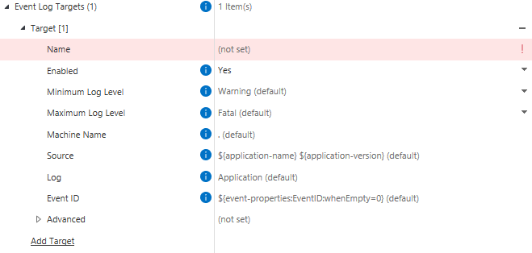

This page contains information that is specific to the available log targets, but does not cover the logging framework in general.  Ensure that you read the [logging page](../) and others in the section thoroughly.
{:.note.warning}

The logging framework supports a number of targets initially, with the potential for more to be supported in the future.  The supported targets are currently:

* The [default log target](#default-log-target),
* [File targets](#file-targets),
* [Event log targets](#event-log-targets),
* [Database targets](#database-targets),
* [Mail targets](#mail-targets)
* [Visual Studio Output Window](#visual-studio-output-window)

The targets are configured within M-Files Admin.  Each target typically supports the following common properties:

* `Enabled` - enables logging to this target
* `Minimum Log Level` - the minimum log level (inclusive) that is logged to this target
* `Maximum Log Level` - the maximum log level (inclusive) that is logged to this target
* `Advanced`
  * `Layout` - an instruction on how the log message (and other environmental information) should be formatted in the target.  In the current implementation these use the [NLog implementation](https://github.com/nlog/nlog/wiki/Configuration-file#layouts-and-layout-renderers), with some additional [custom layout renderers](#custom-layout-renderers)
  * `Log Sensitivity` - details on the [sensitivity level](#log-sensitivity) that should be applied to this target


Some targets can only be configured by system administrators.  Often these targets are incompatible with cloud infrastructures.  More details are available in each target's dedicated documentation below.
{:.note.warning}

## Default log target

The default log target is supported within the [M-Files Cloud](../Cloud) infrastructure.
{:.note}

The default log target logs to a standardized location on disk.  The default log target supports the following properties:

* `Enabled` - changeable by vault administrators and system administrators
* `Minimum Log Level` - changeable by vault administrators and system administrators
* `Maximum Log Level` - changeable by vault administrators and system administrators
* `Log File Rotation` - how to rotate and archive files created by this target, changeable by system administrators
* `Advanced`
  * `Layout` - changeable by vault administrators and system administrators
  * `Keep File Open` - changeable by system administrators
  * `Allow Concurrent Writes` - changeable by system administrators
  * `Log Sensitivity` - changeable by vault administrators and system administrators

In on-premises implementations this is to to a `Logs` directory inside the Windows temporary folder, e.g. `C:\Windows\Logs\`.  Inside this folder it will create a folder with the GUID of the vault, within that a folder with the GUID of the application, within that a folder with the GUID of the server ID, and within that it will create text files according to the configured log rotation/archival settings (e.g. `C:\Windows\Temp\logs\2722f9ab-b96b-4db5-b1a1-8e0618d289b7\6502bb5f-a696-4faa-848a-3f7d5847e00b\f8063303-4501-44b1-8f92-8441959263b3\current.log`).

In M-Files Cloud implementations this is to a persistent storage location.  Note that files in this storage location may be removed by operational processes such as service breaks, or archived due to size or age.  For this reason logs should be considered as temporary and transient, not for long-term use.

The default log target additionally copies the `appdef.xml` file from the vault application into the log location.  This can be used to more easily identify the application that the logs are for.
{:.note}


## File targets

Custom file target locations are **not** supported within the [M-Files Cloud](../Cloud) infrastructure.
{:.note.warning}

File targets log to custom locations on disk.  The file log target supports the following properties:

* `Name` - changeable by vault administrators and system administrators
* `Enabled` - changeable by vault administrators and system administrators
* `Minimum Log Level` - changeable by vault administrators and system administrators
* `Maximum Log Level` - changeable by vault administrators and system administrators
* `Folder Name` - changeable by vault administrators and system administrators
* `File Name` - changeable by vault administrators and system administrators
* `Log File Rotation` - how to rotate and archive files created by this target, changeable by vault administrators and system administrators
* `Advanced`
  * `Layout` - changeable by vault administrators and system administrators
  * `Keep File Open` - changeable by system administrators
  * `Allow Concurrent Writes` - changeable by system administrators
  * `Log Sensitivity` - changeable by vault administrators and system administrators


## Event log targets

Event log targets are **not** supported within the [M-Files Cloud](../Cloud) infrastructure.
{:.note.warning}

Event log targets write to the Windows Event Log.  The Event Log target supports the following properties:

* `Name` - changeable by vault administrators and system administrators
* `Enabled` - changeable by vault administrators and system administrators
* `Minimum Log Level` - changeable by vault administrators and system administrators
* `Maximum Log Level` - changeable by vault administrators and system administrators
* `Machine Name` - changeable by vault administrators and system administrators
* `Source` - changeable by vault administrators and system administrators
* `Log` - changeable by vault administrators and system administrators
* `Event ID` - changeable by vault administrators and system administrators
* `Advanced`
  * `Layout` - changeable by vault administrators and system administrators
  * `Maximum Message Size` - changeable by system administrators
  * `Overflow Action` - changeable by system administrators
  * `Log Sensitivity` - changeable by vault administrators and system administrators



## Database targets

Database targets are supported within the [M-Files Cloud](../Cloud) infrastructure.
{:.note.warning}

Database targets write log data into a target OLEDB database.  The database target supports the following properties:

* `Name` - changeable by vault administrators and system administrators
* `Enabled` - changeable by vault administrators and system administrators
* `Minimum Log Level` - changeable by vault administrators and system administrators
* `Maximum Log Level` - changeable by vault administrators and system administrators
* `Host Name` - changeable by vault administrators and system administrators
* `Database Name` - changeable by vault administrators and system administrators
* `Authentication Type` - changeable by vault administrators and system administrators
* `Command Text` - changeable by vault administrators and system administrators
* `Parameters` - changeable by vault administrators and system administrators
* `Advanced`
  * `Layout` - changeable by vault administrators and system administrators
  * `Log Sensitivity` - changeable by vault administrators and system administrators

 When using a database target, the `Command Text` property sets the SQL statement to use (e.g. `insert into dbo.Log (MachineName, Logged, Level, Message, Logger, Callsite, Exception) values ( @MachineName, @Logged, @Level, @Message, @Logger, @Callsite, @Exception )`).  Each parameter in the command text (e.g. `@MachineName`) is then created in the `Parameters` collection, and assigned data from the event itself.

 **THIS NEEDS MORE EXAMPLES**


## Mail targets

Mail targets are supported within the [M-Files Cloud](../Cloud) infrastructure.
{:.note.warning}

Database targets write log data into a target OLEDB database.  The database target supports the following properties:

* `Name` - changeable by vault administrators and system administrators
* `Enabled` - changeable by vault administrators and system administrators
* `Minimum Log Level` - changeable by vault administrators and system administrators
* `Maximum Log Level` - changeable by vault administrators and system administrators
* `Subject` - changeable by vault administrators and system administrators
* `From` / `To` / `CC` / `BCC` - changeable by vault administrators and system administrators
* `SMTP Configuration`
  * `Server Address` - changeable by vault administrators and system administrators
  * `Use Encrypted Connection` - changeable by vault administrators and system administrators
  * `Port` - changeable by vault administrators and system administrators
  * `Authentication Mode` - changeable by vault administrators and system administrators
  * `Use Local Pickup Folder` - changeable by system administrators
* `Advanced`
  * `Layout` - changeable by vault administrators and system administrators
  * `Encoding` - changeable by vault administrators and system administrators
  * `Header` - changeable by vault administrators and system administrators
  * `Footer` - changeable by vault administrators and system administrators
  * `Add Newlines Between Messages` - changeable by vault administrators and system administrators
  * `Replace Newlines with HTML Breaks` - changeable by vault administrators and system administrators
  * `Log Sensitivity` - changeable by vault administrators and system administrators


## Visual Studio Output Window

The framework supports the easy logging of information to the Visual Studio Debug window via the `LogManager.EnableLoggingToAttachedDebugger` and `LogManager.DisableLoggingToAttachedDebugger` methods.  This can be very useful when initially developing an application.

To start logging to this target, call the appropriate method during your application initialization, e.g.:

 ```csharp
public VaultApplication()
{
#if DEBUG
	// Enable logging to any attached debugger, but do not launch the debugger.
	LogManager.EnableLoggingToAttachedDebugger
	(
		new AttachedDebuggerLoggingSettings()
		{
			LaunchDebugger = false, // If true, will pop up the "Attach a debugger" dialog at this point.
			MinimumLogLevel = LogLevel.Debug,
			MaximumLogLevel = LogLevel.Fatal
		}
	);
#endif
}
 ```

 Once attached, log messages can be found in the Debug window in Visual Studio:


## Future targets

 M-Files are currently considering adding support for additional targets, including:

### Application Insights

 Application Insights is a feature of Azure Monitor that provides extensible application performance management (APM) and monitoring for applications.  Future extensions of the logging library may allow customers to log to their own Application Insights instance.