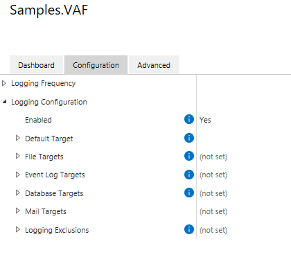

The logging framework is designed for diagnostics, not for auditing.  Information within the log files is controlled partially by the application developer and partially by the administrator configuring logging options, therefore the log files may not contain all available information.  Additionally: log files may be removed or made unavailable without warning for operational reasons.
{:.note.warning}

The creation of log files is an important step in diagnosing the behavior (or misbehavior) of any application.  M-Files has released a package - `MFiles.VaultApplications.Logging` - which can be used to easily implement logging within Vault Applications (VAF and IML) in both on-premises and cloud infrastructures.  When utilized within the M-Files Cloud infrastructure, logs created using this framework can be made available via the `M-Files Manage` web interface.

The framework can be used from both [Vault Application Framework](Vault-Application-Framework) and Intelligent Metadata Layer applications.

## Getting started

The M-Files Vault Application Logging Framework is available as a [nuget package](https://www.nuget.org/packages/MFiles.VaultApplications.Logging/) which can be installed into your vault applications.  **It is strongly recommended that you follow the specific guidance for [Vault Application Framework](Vault-Application-Framework) and Intelligent Metadata Layer applications.**
{:.note.warning}

For the framework to work, you must perform the following two actions:

1. Create a "logger" instance from `LogManager`.
2. Call `LogManager.Initialize` from your code, providing it with a valid vault reference and configuration.

An example application may look something like this:

```csharp
using MFiles.VaultApplications.Logging;
using MFiles.VaultApplications.Logging.NLog;
namespace myApplication
{
	public partial class VaultApplication
	{
		// Each class should have its own logger.
		private ILogger Logger { get; set; }
		public VaultApplication()
		{
			// Populate the logger instance.
			this.Logger = LogManager.GetLogger(this.GetType());
		}
		protected override void StartApplication()
		{
			// Initializing the log manager configures the vault-specific layout renderers (e.g. "${vault-guid}").
			// The optional configuration can be used to define where logs should be stored.
			// NOTE: it is best practice to load this from the configuration,
			// as shown on the technology-specific pages, e.g. https://developer.m-files.com/Frameworks/Logging/Vault-Application-Framework/
			LogManager.Initialize(this.PermanentVault, new NLogLoggingConfiguration());
		}
	}
}
```

## What should be logged?

Care should be taken by application developers that logs do not contain personally-identifiable or other potentially sensitive information.  Application developers may use [log sensitivity filters](#log-sensitivity) to allow administrators to configure whether common content such as object titles should be included in logs.  M-Files Cloud customers that do not wish for any logs to be held within the M-Files Cloud infrastructure may choose to log to other cloud-based log targets such as [Application Insights](#application-insights).
{:.note.warning}

It is important to get into the habit of adding logging to your applications as you build them.  By doing this, and using the appropriate [log level](#log-levels), you will build applications whose logging is flexible and can be scaled up or down as needed to diagnose problems.

Care should be taken when implementing logging so that the information in the logs does not constitute a security or privacy risk.  When writing log statements consider using a syntax that supports [log sensitivity](#log-sensitivity), allowing vault administrators to decide whether information such as object titles should be included in the resulting logs or not.

## General structure

The `MFiles.VaultApplications.Logging` framework is available via a nuget package which can be referenced from your vault applications.  If using the [VAF Extensions library](#using-the-vaf-extensions-library) version `22.2.8-preview` or higher, this package will be included for you automatically.

Each class in your application should expose a [Logger](#loggers), which your application should use to log messages at a [appropriate levels](#log-levels).  At runtime the application can be configured to output some or all of these log messages to one or more enabled [Targets](#targets); depending upon the architecture and client requirements, these targets could be files on disk, the Windows Event Log, email, or some other suitable area.

The current implementation of the logging framework is based on NLog.  Users of NLog may recognize some terms being re-used here.
{:.note}

### Loggers

A logger (an instance of something that implements `ILogger`) is what application code uses to write information to the logs.  Each log entry consists of - at a minimum - the appropriate [log level](#log-levels) and the text to log.  Entries may also include details about any exception.

Each class should declare its own logger, as the type information will be used when writing to the logs.  Creating a logger can be done by using the `LogManager` class:

```csharp
using MFiles.VaultApplications.Logging;
public class MyClass
{
	private ILogger Logger { get; } = LogManager.GetLogger(typeof(MyClass));
}
```

Writing to the log can be done using `ILogger.Log(LogLevel, FormattableString)`, `ILogger.Log(Exception, LogLevel, FormattableString)`, or one of the shorthand methods available, e.g. `ILogger.Debug(FormattableString)`:

```csharp
using MFiles.VaultApplications.Logging;
public class MyClass
{
	private ILogger Logger { get; } = LogManager.GetLogger(typeof(MyClass));
	public void ExportDataToDisk()
	{
		try
		{
			// This logs at the "trace" level, which is the most verbose.
			this.Logger?.Log(LogLevel.Trace, "Export started.");
			
			// TODO: Implement export.

			// This also logs at the "trace" level.
			this.Logger?.Trace("Export completed.");
		}
		catch(Exception e)
		{
			// Log the exception, but allow the exception to bubble up.
			this.Logger?.Error(e, "Exception whilst exporting data");
			throw;
		}
	}
}
```

The methods exposed by `ILogger` take a `FormattableString` instance, but there are extension methods available in `MFiles.VaultApplications.Logging` that will accept simple strings, or strings and associated formatting arguments.
{:.note}

#### Log levels

The logging framework exposes 6 different logging levels: `Trace`, `Debug`, `Info`, `Warn`, `Error`, and `Fatal`.  Your application should log messages at the appropriate level (e.g. detailed messages at the `Trace` level, fewer messages at `Debug`, etc.), and the framework will deal with ensuring that only the correct data is logged according to the [Target configuration](#targets).

NLog provides some guidance on how to [use different log levels](https://github.com/nlog/nlog/wiki/Configuration-file#log-levels).
{:.}

### Targets

Please see the [dedicated targets page](Targets) for more information.
{:.note}

The logging framework supports a number of targets initially, with the potential for more to be supported in the future.  The supported targets are currently:

* The [default log target](Targets/#default-log-target),
* [File targets](Targets/#file-targets),
* [Event log targets](Targets/#event-log-targets),
* [Database targets](Targets/#database-targets),
* [Mail targets](Targets/#mail-targets)
* [Visual Studio Output Window](Targets/#visual-studio-output-window)

The targets are configured within M-Files Admin.  Each target typically supports the following common properties:

* `Enabled` - enables logging to this target
* `Minimum Log Level` - the minimum log level (inclusive) that is logged to this target
* `Maximum Log Level` - the maximum log level (inclusive) that is logged to this target
* `Advanced`
  * `Layout` - an instruction on how the log message (and other environmental information) should be formatted in the target.  In the current implementation these use the [NLog implementation](https://github.com/nlog/nlog/wiki/Configuration-file#layouts-and-layout-renderers), with some additional [custom layout renderers](#custom-layout-renderers)
  * `Log Sensitivity` - details on the [sensitivity level](#log-sensitivity) that should be applied to this target



Some targets can only be configured by system administrators.  Often these targets are incompatible with cloud infrastructures.  More details are available in each target's dedicated documentation below.
{:.note.warning}

### Log sensitivity

Please see the [dedicated log sensitivity page](Sensitivity) for more information.
{:.note}

Logs may, by their nature, contain information which may have privacy or commercial sensitivities; imagine situations where a log is being generated about a file that's being converted to PDF, and the log includes a file named `Upcoming Redundancies.docx`.  The logging framework supports this concept by allowing each log to be allocated a `Sensitivity Level`.  This sensitivity level describes how some information should be logged within the vault.

Log sensitivity filters work by allowing developers to pass structured objects into the logging framework, and for the logging framework to decide how to render that content appropriately.  **Logging sensitivity filters do not attempt to parse log strings to remove information.**  It is imperative that application developers implement logging as described below for the logging sensitivity filters to correctly work.  It is strongly recommended that you test that your log messages are correctly being filtered before deploying any application.
{:.note}

### Logging exclusions

Logging exclusions can be useful if you wish to log more verbose messages, but wish to exclude certain loggers from the logs (as they are too noisy).  Multiple exclusions can be added by providing the logger name (e.g. `MyVaultApplication.VaultApplication`) and the minimum log level (e.g. `Warn`); this would stop any log entries under (and including) warnings from being logged by the logger named `MyVaultApplication.VaultApplication`.

The logger name can include a star ("*") as a wildcard character to match multiple loggers.  e.g. `MFiles.VaultApplications.Logger.*` would match all log entries caused by the library itself.
{:.note}

### Context

By default, log messages contain the name of the logger (the name of the class that instantiated the logger), as well as the message that was logged.  In situations where there may be many simultaneous ongoing processes, or where classes may be used from a variety of different places, this may not be sufficient information to understand what is going on.

When you add context, it can be logged into the target alongside the message.  Consider this code:

```csharp
this.Logger?.Trace("Starting MyClass.MyMethod");
using (var context = this.Logger?.BeginLoggingContext($"Processing {myObjectVersion}"))
{
	context?.Info("Process complete");
}
this.Logger?.Trace("Ending MyClass.MyMethod");
```

In the above example, the context provides information as to which object is being processed.  The log messages are then written using the context instance itself.  The above may result in the following log line (note how "Processing 0-123-1" (the context) has been logged into the text file):

```text
2022-03-02 10:27:52.5088 (v0.1) MyTestApplication.VaultApplication Processing 0-123-1 Info: Process complete
```

Context can also be nested, in which case context messages are concatenated in the resulting log content:

```csharp
using (var outerContext = this.Logger?.BeginLoggingContext($"Processing {myObjectVersion}"))
{
    outerContext?.Info("2");
    using (var innerContext = outerContext?.BeginLoggingContext($"Cleanup"))
    {
        innerContext?.Info($"Process complete");
    }
}
```

```text
2022-03-02 10:27:52.5088 (v0.1) MyTestApplication.VaultApplication Processing 0-123-1;Cleanup Info: Process complete
```

Note that context messages passed to the `BeginLoggingContext` method are subject to [log sensitivity](sensitivity).
{:.note}

#### Providing context to other methods

In situations where functionality may call methods in other classes, it is sometimes useful to pass the current context across so that log messages can render the correct context.  Consider this example:

```csharp
var myModule = new MyModule();
using (var context = this.Logger?.BeginLoggingContext($"Processing {myObjectVersion}"))
{
	myModule.Process(myObjectVersion, context);
}
```

To support this, the `Process` method can take an optional parameter of the current logging context:

```csharp
public void Process(ObjectVersion objectVersion, ILoggingContext externalLoggingContext = null)
{
    using (var context = this.Logger?.BeginLoggingContext(externalLoggingContext, "MyProcessor"))
    {
        context.Info("Object processed");
    }
}
```

### Custom layout renderers

The logging library supports several custom layout renderers in addition to the [standard NLog layout renderers](https://nlog-project.org/config/?tab=layout-renderers).  These layout renderers can be included in any layout string and will be substituted with the appropriate value:

* `${application-guid}` - renders the current application GUID, if available, [in "D" format](https://docs.microsoft.com/en-us/dotnet/api/system.guid.tostring).
* `${application-name}` - renders the current application name, if available.
* `${application-version}` - renders the current application version, if available.
* `${server-guid}` - renders the current server GUID [in "D" format](https://docs.microsoft.com/en-us/dotnet/api/system.guid.tostring).
* `${vault-guid}` - renders the current vault GUID [in "D" format](https://docs.microsoft.com/en-us/dotnet/api/system.guid.tostring).
* `${log-context}` - renders any current [context](#context) information.

## Vault Application Framework applications

Please see the [dedicated Vault Application Framework logging page](Vault-Application-Framework) for more information.
{:.note}
