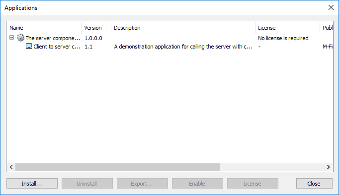

If included in the [application definition file]({{ site.baseurl }}/Frameworks/User-Interface-Extensibility-Framework/Master-Application-Guid/), defines another application to be the parent of this one.  Child applications are listed underneath the parents when viewing a list of installed applications in an M-Files vault:

## Installation

Parent/child applications can be installed separately and the user interface will automatically group them together.  Alternatively, [Vault Application Framework]({{ site.baseurl }}/Frameworks/Vault-Application-Framework/) applications can [distribute and install their child applications when they are installed]({{ site.baseurl }}/Frameworks/Vault-Application-Framework/Distributing-Child-Applications/).

## Samples

This approach is shown within the [Client to Server Communication]({{ site.baseurl }}/Samples-And-Libraries/Samples/Processes/Client-To-Server-Communication/) sample.