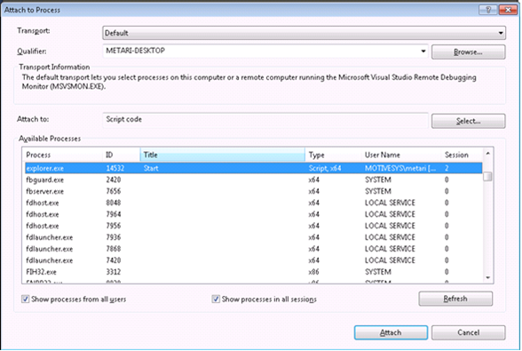

## Debugging on the desktop

Code that executes within a [module]({{ site.baseurl }}/Frameworks/User-Interface-Extensibility-Framework/Modules/) cannot be debugged directly.  Code that executes within a [dashboard]( {{ site.baseurl }}/Frameworks/User-Interface-Extensibility-Framework/Dashboards/) or a [persisted browser window](https://www.m-files.com/UI_Extensibility_Framework/index.html#PersistentWWWSessions.html) - i.e. within a web browser - can be debugged using Microsoft Visual Studio.

### Setup

In order to debug UIX dashboards, the following registry keys must be set on the client:

```reg
Key: HKEY_CURRENT_USER\Software\Motive\M-Files\<version>\Client\Common\NonVaultSpecifics\ScriptHostIESettings\Main
Value #1: Disable Script Debugger (REG_SZ), set to no
Value #2: DisableScriptDebuggerIE (REG_SZ), set to no
```

#### Debugging persistent browser windows

To debug persistent browser windows, you will also need to enable script debugging within Internet Explorer by *unticking* the `Disable script debugging (Internet Explorer)` and `Disable script debugging (Other)` within the Internet Explorer advanced settings.  If you do not do this then the `Attach to Process...` window (detailed in the next section) will not show `explorer.exe`.


### Debugging dashboards and persistent browser windows

Visual Studio 2010 must be used if your computer runs Internet Explorer 9.  If running Internet Explorer 10 or higher, use Visual Studio 2012 or newer.
{:.note}

1. Open Microsoft Visual Studio on the machine executing the User Interface Extensbility Framework application.
2. Select the `Debug` menu, and choose `Attach to Process...`.
3. Ensure that `Script code` is selected in the `Attach to:` option.
4. Select the appropriate process.
	* If the dashboard was launched by a `ShellUI` module then select `explorer.exe`.
	* If the dashboard was launched by a `VaultUI` or `VaultCore` module then select `MFStatus.exe`.



Once the debugger is attached, Visual Studio will allow you to set breakpoints and debug as normal:


## Debugging in M-Files Web Access

User Interface Extensibility Framework applications that [target M-Files Web Access]({{ site.baseurl }}/Frameworks/User-Interface-Extensibility-Framework/Development-Practices/Platform-Targeting/) can be debugged within a web browser.  This includes module-level code that cannot be debugged on the M-Files Desktop client.

Most modern web browsers have built-in debugging tools, e.g. in [Microsoft Edge / Internet Explorer](https://docs.microsoft.com/en-us/microsoft-edge/f12-devtools-guide), [Google Chrome](https://developers.google.com/web/tools/chrome-devtools/), [Mozilla FireFox](https://developer.mozilla.org/en-US/docs/Tools), or [Safari](https://developer.apple.com/safari/tools/).  *This tutorial will focus on the tools available in Microsoft Edge / Internet Explorer, although they are broadly the same in all modern browsers.*

1. Log into the vault using [M-Files Web Access](https://www.m-files.com/user-guide/latest/eng/Web_access.html).
2. Open the Developer Tools dialog (e.g. press `F12`).
3. Click on the `Debugger` tab.
4. Expand the hostname of the web server (in this screenshot the code is running from `localhost`):
5. Expand the node for the application (the application `guid` is shown in the node name).
6. Select the `all` node.  The JavaScript for `ShellUI` modules within the application should be shown in the main window.
7. Breakpoints and other functionality should now be available within the developer tools.


Once a breakpoint is set, you may need to refresh the page for the correct event to be triggered.
{:.note}
