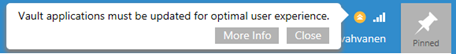

UI Extensibility Applications that have been updated to v4 schema, using the instructions linked above, will not work with M-Files Desktop versions older than 20.12.  It is important that all of your M-Files Desktop clients are updated to version 20.12 or later before updating your UI Extensibility applications.
{:.note.warning}

M-Files 20.12 brings changes in which the M-Files Desktop Client builds and renders the client interface.  These changes can bring significant performance improvements.  These improvements are only activated if **all** UIX applications are marked as "fast browsing compatible".  **If one or more applications is not fast browsing compatible then you may see this dialog in your M-Files Desktop Client**:



The primary difference between the legacy rendering mode and fast-browsing mode is that the [lifecycle](https://www.m-files.com/UI_Extensibility_Framework/#FrontPage.html) for the [ShellFrame](https://www.m-files.com/UI_Extensibility_Framework/#FrontPage.html) instance has changed.  In the legacy rendering mode, a `ShellFrame` instance would be created every time you entered a view, then destroyed when navigating to a new view.  This meant that all UI components that were attached to the `ShellFrame` (such as commands, tabs, etc.) needed to be re-created when the user navigated between views.  In fast-browsing mode the `ShellFrame` is created once - during the `ShellUI` startup process - and is not re-created when navigating between views.

For most applications this new behavior will not directly affect the application's functionality.  Some applications - those that rely on the previous `ShellFrame` lifecycle - may need alterations to correctly function in fast-browsing mode.

## New events

As the `ShellFrame`'s lifecycle cannot be used to identify when the user changes view, M-Files 20.12 adds two additional new events to the `ShellFrame`:

 * `Event_ViewLocationChanged`
 * `Event_ViewLocationChangedAsync`

These events are raised automatically when the user navigates into a new view.  The `Async` event is recommended to be used when the handler logic is more complex and should not block the user interface.

## Converting applications to fast-browsing compatible

### M-Files version requirements

The v4 client schema is only supported in M-Files 20.12 and higher.  Clients older than this version will not run any applications that target the v4 schema.
{:.note}

When enabling fast-browsing compatibility you may wish to change the `required-mfiles-version` value in the `appdef.xml` file to require M-Files 20.12 or newer:

```xml
<required-mfiles-version>20.12.0.0</required-mfiles-version>
```

### Altering the application

Most applications will not require modification.  If your application does not require modification then you can simply [update the application definition file](#updating-the-application-definition-file).

#### Updating the application definition file

The application definition file (`appdef.xml`) requires two changes:

1. The referenced schema must be changed to `http://www.m-files.com/schemas/appdef-client-v4.xsd`.
2. Any and all `ShellUI` module elements should have a `fast-browsing-compatible` attribute added with a value of `true`.
3. **If upgrading from the [v1 schema](../Application-Definition):** Ensure that you add the <platforms> and <platform> elements as appropriate (example below).

Below is a full example of an updated application definition file:

```xml
<?xml version="1.0"?>
<application xmlns:xsi="http://www.w3.org/2001/XMLSchema-instance"
             xsi:noNamespaceSchemaLocation="http://www.m-files.com/schemas/appdef-client-v4.xsd">
  <guid>ff800931-f24a-aa39-99cf-b04b280e1af4</guid>
  <name>Fast-Browsing Compatible application</name>
  <version>0.1</version>
  <description></description>
  <publisher></publisher>
  <copyright></copyright>
  <required-mfiles-version>20.12.0.0</required-mfiles-version>
  <optional>true</optional>
  <enabled-by-default>true</enabled-by-default>
  <platforms>
    <platform>Desktop</platform>
  </platforms>
  <modules>
    <module environment="shellui" fast-browsing-compatible="true">
      <file>shellui.js</file>
    </module>
  </modules>
  <dashboards>
    <dashboard id="wrapper" >
      <content>wrapper.html</content>
    </dashboard>
  </dashboards>
</application>
```

#### Identifying problematic code

The typical use-case which requires modification is when an application uses the  `ShellFrame`'s `Started` event to check the current path.  This may be the case if your application only shows a tab in a certain view, for example.  Code similar to the following is of concern:

```csharp
shellFrame.Events.Register
(
	MFiles.Event.Started,
	function () {
		// Show the current path
		shellFrame.ShowMessage(shellFrame.CurrentPath)
	}
);
```

In the legacy rendering mode this would be executed every time the user went into a view; in the fast-browsing mode this would be executed only when the user first opened the M-Files interface.
{:.note}

#### Using the new events

The `ShellFrame` `Started` event will still fire when the user first opens M-Files but, from then on, the `ViewLocationChanged` event will fire instead.  To behave in the same way, code must now be written as:

```csharp
function reactToPathChanging()
{
	// Show the current path
	shellFrame.ShowMessage(shellFrame.CurrentPath)
}

// React when the user first opens M-Files.
shellFrame.Events.Register
(
	MFiles.Event.Started,
	reactToPathChanging
);

// React when they navigate within a view.
shellFrame.Events.Register
(
	MFiles.Event.ViewLocationChanged,
	reactToPathChanging
);
```

If the application is running on a 20.12 vault but one or more of the applications is not explicitly marked as fast-browsing-compatible, then **all** applications will run in legacy mode.  For this reason it is important that your updated application continues to function using the old event model.
{:.note.warning}

#### Checking the rendering mode

Even if your application is marked as fast-browsing-compatible, it is still possible that the M-Files Desktop Client will be running in legacy rendering mode.  This can happen if other applications are installed in the vault and these applications are not fast-browsing-compatible.

If you need to check the current rendering mode then you can do so using the following code style:

```csharp
// Returns true if the client is running in fast browsing mode,
// i.e. all apps in the vault support fast browsing.
if( shellFrame.ShellUI.FastBrowsingActive )
{
	shellFrame.Events.Register
	(
		MFiles.Event.ViewLocationChanged,
		function () {
			// TODO: React to the location changing.
			shellFrame.ShowMessage(shellFrame.CurrentPath)
		}
	);
}

```

### Additional considerations - an example

Consider an application using an approach such as the one below.  In this code the application checks the current path and adds a tab if it matches some expected value.

```javascript
shellFrame.Events.Register( 
      MFiles.Event.Started,
      function () {
            onShellFrameStarted( shellFrame )
} );

function onShellFrameStarted( shellFrame ) {

// Check if we are in the special view.
      if( shellFrame.CurrentPath === MySpecialViewPath ) {

            // Create tab with dashboard for my special view.
            // NOTE: This tab and dashboard will automatically be destroyed
// when the shellframe location changes.
            var myTab = shellFrame.RightPane.AddTab( "myTab", "My Tab", "_last" );
            myTab.ShowDashboard( "myDashboard", {} );
            myTab.Visible = true;
            myTab.Select();
      }
}

```

If we lifted this code and adapted it so that it instead reacted to the `ViewLocationChanged` event, we could end up with a situation where the code adds multiple tabs to the ShellFrame.  This is because previously all tabs would be removed when the user navigated (and the old ShellFrame destroyed), whereas the tabs would persist with fast-browsing enabled.

In this instance, instead, the code should be modified to ensure that the tab is still only added once, showing and hiding the tab as appropriate as the user navigates between views:

```javascript
shellFrame.Events.Register( 
      MFiles.Event.Started,
      function () {

            // Listen for location changes if necessary.
            // NOTE: We can't access members on shellframe until it has started.
            if( shellFrame.ShellUI.FastBrowsingActive ) {
                  shellFrame.Events.Register( 
                        MFiles.Event.ViewLocationChanged,
                        function () {
                              reactToPathChanging( shellFrame )
                        } );
            }

            // React to initial location of shell frame.
            reactToPathChanging( shellFrame )
      } );

// New global holding our tab if it was already created.
// Would be better as object member, but kept simple for example.
var myTab; 

function reactToPathChanging( shellFrame ) {

      // Check if we are in the special view.
      if( shellFrame.CurrentPath === MySpecialViewPath) {
            // We are in my special view.

            // This shell frame may have visited my special view already,
            // in which case we already would have created the tab, so we
            // need to create it only if we haven't already.
            if( !myTab ){

                  // Create the tab and dashboard.
                  myTab = shellFrame.RightPane.AddTab( "myTab", "My Tab", "_last" );
                  myTab.ShowDashboard( "myDashboard", {} );
            }

            // Make sure the tab is visible.
            myTab.Visible = true;
            myTab.Select();

      } else {

            // We are not in my special view.

            // This shell frame may have visited my special view already,
            // so we need to make sure if myTab was created, that it isn't
            // visible anymore now that we've left my special view.
            if( myTab ) {
                  myTab.Visible = false;
            }
      }
}

```