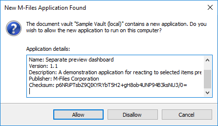
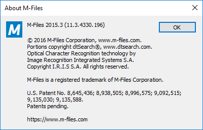
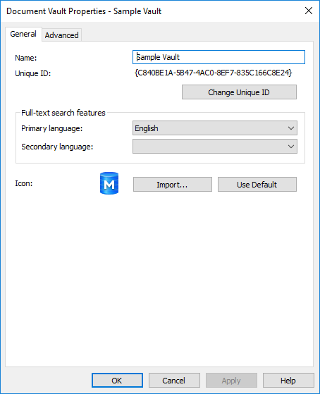
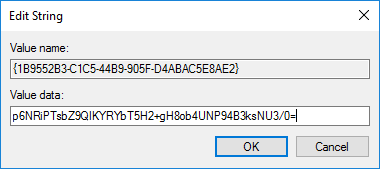

When an M-Files Desktop client connects to the server, it is provided with all the currently-registered User Interface Extensibility Framework applications on the target vault.  If the user has not used this application (or this version of the application) before, they will be prompted to either allow the application to run, or to disallow it.



The user can choose at this point whether to allow (or not) the application to run. The application can note whether it's mandatory to be installed for the vault to run and, if the user chooses not to install it, they will be disconnected from the server.

## M-Files 2018 and upwards

In M-Files 2018, a registry key can be used to whitelist all applications contained in a vault.  This approach is appropriate if you trust the vault in general, i.e., you trust that the administrators who have the rights to install applications into the vault will not install any harmful application.

To do this, retrieve the [M-Files client version](#the-m-files-client-version) and [Vault GUID](#the-m-files-vault-guid) and create a registry key of the format `HKEY_LOCAL_MACHINE\Software\M-Files\<version>\Client\MFClient\ApplicationAccess\<vault guid>`.  Within this key, a string value (`REG_SZ`) must be created with the name `allapps` and the value `any`.

This registry value, exported from the registry, may result in this `.reg` file:

```reg
Windows Registry Editor Version 5.00

[HKEY_LOCAL_MACHINE\SOFTWARE\Motive\M-Files\12.0.6550.8\Client\MFClient\ApplicationAccess\{C840BE1A-5B47-4AC0-8EF7-835C166C8E24}]
"allapps"="any"
```

In addition, the approach below can also be used with M-Files 2018 and upwards.
{:.note}

## M-Files 2015.3 and earlier

In order to pre-approve the application, the following information is required:

* What M-Files client version they are currently running, as a string (e.g. `11.3.4330.196`).
* The GUID of the M-Files vault.
* The GUID of the UIX application.
* The application checksum.

### A note on GUIDs

A GUID is a "Globally Unique ID" and is typically shown as a set of numbers and letters. What's important to note is that there are a number of methods of formatting the GUIDs. Whilst the format of the GUID may be shown in various ways in the applications, pre-approval requires them in [brace format](https://msdn.microsoft.com/en-us/library/97af8hh4(v=vs.110).aspx). Simply put: the GUID needs to be displayed with hyphens in it, and have a starting brace before it and an ending brace after it. So the GUID `1B9552B3-C1C5-44b9-905F-D4ABAC5E8AE2` would need to be formatted as `{1B9552B3-C1C5-44b9-905F-D4ABAC5E8AE2}`.

### Finding the elements

#### The M-Files client version

The M-Files client version can be found in a number of ways.  One way is to open the M-Files vault, click on your username in the top-right of the screen and select `About M-Files`. The version number is shown on the top line.



#### The M-Files vault GUID

The M-Files vault GUID can be found using the M-Files Admin tool on the server.  Right-click on the vault name and select "Properties". The GUID is shown as the "Unique ID".
Note that you need the whole string, including the braces ("curly-brackets") around the value. In the screenshot below it is `{C840BE1A-5B47-4AC0-8EF7-835C166C8E24}`.



#### The UIX application GUID

The UIX application GUID can be found within the [Application Definition]({{ site.baseurl }}/Frameworks/User-Interface-Extensibility-Framework/Application-Definition/) file within the application itself.  The application definition file can be extracted from a UIX by unzipping the application (if the file is named `.mfappx` then rename it to `.zip` first).  The GUID can be found between the `<guid></guid>` tags:

```xml
<?xml version="1.0" encoding="UTF-8"?>
<application xmlns:xsi="http://www.w3.org/2001/XMLSchema-instance"
		xsi:noNamespaceSchemaLocation="http://www.m-files.com/schemas/appdef.xsd">
	<guid>1B9552B3-C1C5-44b9-905F-D4ABAC5E8AE2</guid>	
	<name>Separate preview dashboard</name>
	<version>1.1</version>
	<description>A demonstration application for reacting to selected items previewing them in a separate dashboard.</description>
	<publisher>M-Files Corporation</publisher>
	<copyright>(c) M-Files Corporation 2017</copyright>
	<required-mfiles-version>11.2.4320</required-mfiles-version>
	<modules>
		<module environment="shellui">
			<file>main.js</file>
		</module>
	</modules>
	<dashboards>
		<dashboard id="MyDashboard">	
			<content>dashboard.html</content>
		</dashboard>
	</dashboards>
</application>
```

*In this sample the GUID is `1B9552B3-C1C5-44b9-905F-D4ABAC5E8AE2`.  Note that this will need to be formatted with braces later.*

#### The application checksum

This is more awkward to locate, as it is only shown in the dialog when the client first connects to the vault:


The checksum in this screenshot is the value `p6NRiPTsbZ9QIKYRYbT5H2+gH8ob4UNP94B3ksNU3/0=`.

The checksum is for the application, and does not change if it moves between server or vaults.  It will, however, change if any files within the application are modified.
{:.note}

### Pre-approving the application

To pre-approve the UIX, a registry value must be installed on the client machines. The easiest way to do this is to deploy the the value using group policy. In this sample we will cover the location and value; how it is distributed is a separate topic.  Firstly, a key needs to be created of the following format: `HKEY_LOCAL_MACHINE\SOFTWARE\Motive\M-Files\<version>\Client\MFClient\ApplicationAccess\<vault GUID>`

<code>&lt;version&gt;</code> and <code>&lt;vault GUID&gt;</code> need to be replaced with the <a href="{{ site.baseurl }}/Frameworks/User-Interface-Extensibility-Framework/Pre-Approval/#the-m-files-client-version">M-Files client version</a> and the <a href="{{ site.baseurl }}/Frameworks/User-Interface-Extensibility-Framework/Pre-Approval/#the-m-files-vault-guid">M-Files vault GUID</a>. For example, for a client running `11.3.4330.196 (M-Files 2015.3 SR2)` on a vault with GUID `{C840BE1A-5B47-4AC0-8EF7-835C166C8E24}`, the key would be `HKEY_LOCAL_MACHINE\SOFTWARE\Motive\M-Files\11.3.4330.196\Client\MFClient\ApplicationAccess\{C840BE1A-5B47-4AC0-8EF7-835C166C8E24}`.
{:.note}

Within this key, a string value (`REG_SZ`) must be created. The name of the value should be the [application GUID]({{ site.baseurl }}/Frameworks/User-Interface-Extensibility-Framework/Pre-Approval/#the-uix-application-guid) ([brace-formatted]({{ site.baseurl }}/Frameworks/User-Interface-Extensibility-Framework/Pre-Approval/#a-note-on-guids)) and the data should be the [application checksum]({{ site.baseurl }}/Frameworks/User-Interface-Extensibility-Framework/Pre-Approval/#the-application-checksum). For an application with GUID `1B9552B3-C1C5-44b9-905F-D4ABAC5E8AE2` and checksum `p6NRiPTsbZ9QIKYRYbT5H2+gH8ob4UNP94B3ksNU3/0=`, the registry value would look like this:



This registry value, exported from the registry, may result in this `.reg` file:

```reg
Windows Registry Editor Version 5.00

[HKEY_LOCAL_MACHINE\SOFTWARE\Motive\M-Files\11.3.4330.196\Client\MFClient\ApplicationAccess\{C840BE1A-5B47-4AC0-8EF7-835C166C8E24}]
"{1B9552B3-C1C5-44B9-905F-D4ABAC5E8AE2}"="p6NRiPTsbZ9QIKYRYbT5H2+gH8ob4UNP94B3ksNU3/0="
```

Provided this key is installed into the client machine before they initially connect to the vault, the acceptance dialog will not be shown and the application will be installed and enabled silently.

### Generating registry keys automatically

A sample application that uses the M-Files COM API to generate `.reg` files containing the required registry keys [can be downloaded from our GitHub Samples and Libraries page](https://github.com/M-Files/MFilesSamplesAndLibraries/tree/master/Samples/GenerateApplicationPreApprovalKey).  Information on how to download the sample and compile it can be found on the [GitHub repository readme page](https://github.com/M-Files/MFilesSamplesAndLibraries/#readme).