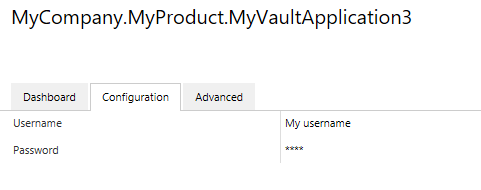

If you are not inheriting from `ConfigurableVaultApplicationBase<T>` then the below approach will not work.  The correct base class should automatically be used when creating new applications from the Visual Studio templates.
{:.note}

## Default configuration visibility

By default any configuration exposed using the VAF 2.1 base class will be **visible** to both vault administrators and system administrators, but will only be **editable** by system administrators.  To allow vault administrators to change this, a [Security(ChangeBy = SecurityAttribute.UserLevel.VaultAdmin)] attribute should be added to the configuration class.
{:.note}

## Restricting who can view and change configuration elements

The `[Security]` attribute can also be used to configure who can change the value of a given element of the configuration.  This can be used to ensure that only system administrators - and not vault administrators - can change specific values.  **This is of increased importance in the M-Files cloud environment where some values must only be configurable by the M-Files Cloud Ops team.**

By default the configuration will be visible to vault administrators and system administrators, but only be editable by system administrators.  When running on the M-Files cloud this means that vault administrators can view, but not change, the configuration.
{:.note.warning}

In the following example the `WebAddress` property can only be changed by the System Administrator.  The value will be hidden from Vault Administrators in the `Configuration` tab, although they will see the value in the 'Advanced' configuration.  Vault Administrators will get an error when trying to save changes to the value.


using System.Runtime.Serialization;
using MFiles.VAF.Configuration;
using MFiles.VAF.Core;

namespace MyCompany.MyProduct.MyVaultApplication3
{
	public class VaultApplication
		: ConfigurableVaultApplicationBase<Configuration>
	{
	}
	
	[DataContract]
	public class Configuration
	{
		// The username and password are visible to, and editable by, vault administrators.
		[DataMember]
		[Security(ChangeBy = SecurityAttribute.UserLevel.VaultAdmin)]
		public string Username { get; set; }

		// Note that the password is marked as a password so will be shown as stars.
		[DataMember]
		[Security(IsPassword = true, ChangeBy = SecurityAttribute.UserLevel.VaultAdmin)]
		public string Password { get; set; }

		// This member can be seen by vault admins, but only changed by system admins.
		[DataMember]
		[Security(ViewBy =SecurityAttribute.UserLevel.VaultAdmin, ChangeBy = SecurityAttribute.UserLevel.SystemAdmin)]
		public bool Enabled { get; set; }

		// This member is not visible to vault administrators.
		[DataMember]
		[Security(ChangeBy = SecurityAttribute.UserLevel.SystemAdmin)]
		public string WebAddress { get; set; }
 
	}
}


## Passwords within configuration elements

Passwords within configuration objects should be marked with the `[Security(IsPassword = true)]` attribute.  When this attribute is used, values displayed in the M-Files Admin software will be obscured and displayed insead as asterisks:


using System.Runtime.Serialization;
using MFiles.VAF.Configuration;
using MFiles.VAF.Core;

namespace MyCompany.MyProduct.MyVaultApplication3
{
	public class VaultApplication
		: ConfigurableVaultApplicationBase<Configuration>
	{
	}
	
	[DataContract]
	public class Configuration
	{
		[DataMember]
		public string Username { get; set; }

		[DataMember]
		[Security(IsPassword = true)]
		public string Password { get; set; }
 
	}
}


Note that configuration elements marked with a `[Security(IsPassword = true)]` attribute are not encrypted before being stored within Name Value Storage.  Whilst the storage location is only accessible to system administrators, it is important to note that these may be accessible by code executing with elevated rights.
{:.note.warning}