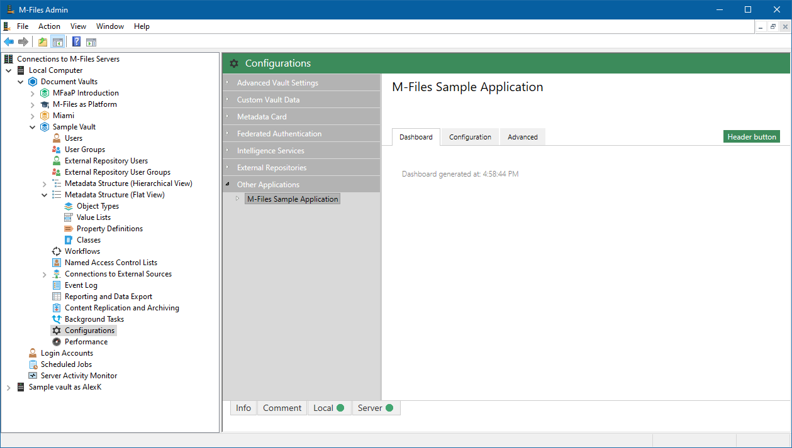
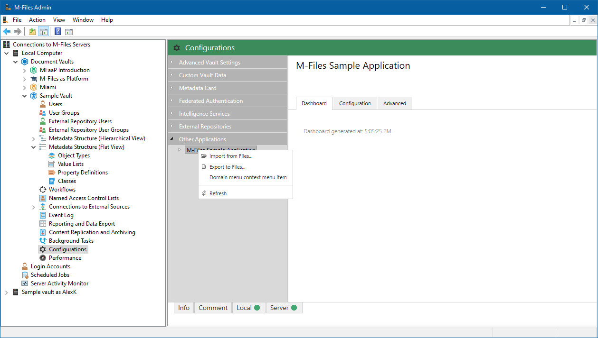
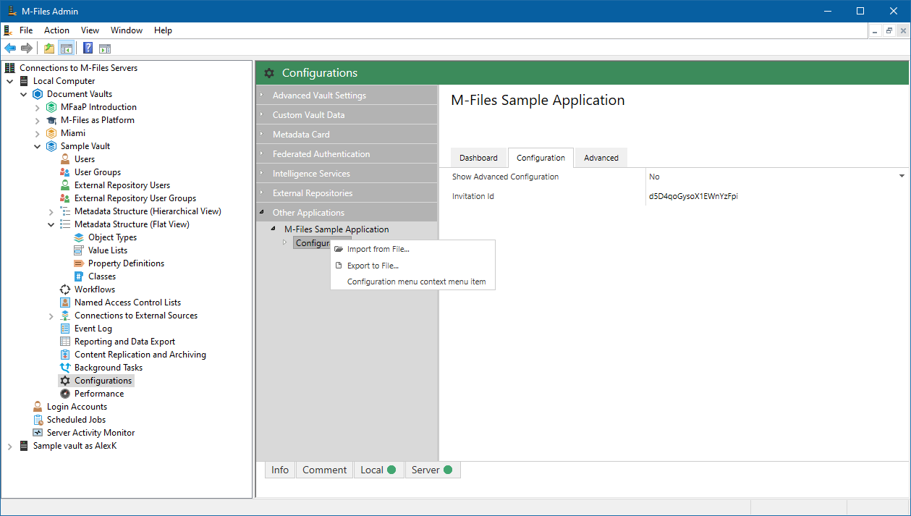

[Version 1]({{ site.baseurl }}/Frameworks/Vault-Application-Framework/Versions/#version-10)
{:.tag.unavailable title="This functionality is NOT available in version 1.0 of the Vault Application Framework."}
[Version 2]({{ site.baseurl }}/Frameworks/Vault-Application-Framework/Versions/#version-20)
{:.tag.unavailable title="This functionality is NOT available in version 2.0 of the Vault Application Framework."}
[Version 2.1]({{ site.baseurl }}/Frameworks/Vault-Application-Framework/Versions/#version-21)
{:.tag.available title="This functionality is available in version 2.1 of the Vault Application Framework."}

The approach shown below is only compatible with version 2.1(and higher) of the Vault Application Framework, where the target audience runs M-Files Online 19.9 or higher.
{:.note.warning}

Commands are used to define a server-side function that can be executed from within the M-Files Admin configuration section.  Commands are typically then shown within the [configuration area header](#displaying-commands-in-the-header), the [domain menu](#creating-context-menu-items-for-the-domain-menu), the [configuration menu](#displaying-context-menu-itms-for-the-configuration-menu), or within [custom dashboards](../Custom-Dashboards/#using-commands-within-dashboards).  This page focuses on command usage outside of custom dashboards.

To create a custom command, you must

* Declare the `CustomDomainCommand`.  The command must include:
	* A unique ID for the command.
	* The code to execute when the command is run.
	* The text to display on the button or context-menu item.
	* The location(s) where the command should be shown.
* Ensure that the command is returned by `GetCommands`.

## Displaying commands in the header

To display a button in the header of the configuration area, set the `Locations` property to include an instance of the `ButtonBarCommandLocation` class:

```csharp
/// <summary>
/// Appears at the top of the configuration page.
/// </summary>
private readonly CustomDomainCommand cmdHeaderButtonCommand = new CustomDomainCommand
{
	ID = "cmdHeaderButtonCommand",
	Execute = (c, o) =>
	{
		o.ShowMessage("Header button");
	},
	DisplayName = "Header button",
	Locations = new List<ICommandLocation>
	{
		new ButtonBarCommandLocation()
	}
};

/// <inheritdoc />
public override IEnumerable<CustomDomainCommand> GetCommands(IConfigurationRequestContext context)
{
	return new List<CustomDomainCommand>(base.GetCommands(context))
	{
		this.cmdHeaderButtonCommand,
	};
}
```



## Displaying context menu items for the domain menu

The domain menu item is the menu item added to the "Other Applications" area in the M-Files Admin Configurations screen.  It is typically the item that displays the name of your vault application, such as `M-Files Sample Application` in the screenshot below.  Adding a context menu item here will be displayed when the user right-clicks on this item.
{:.note}

To display a context menu item under the domain menu item, set the `Locations` property to include an instance of the `DomainMenuCommandLocation` class:

```csharp
/// <summary>
/// Appears when right-clicking on the application node in the Configurations area.
/// </summary>
private readonly CustomDomainCommand cmdDomainMenuContextMenuItem = new CustomDomainCommand
{
	ID = "cmdDomainMenuContextMenuItem",
	Execute = (c, o) =>
	{
		o.ShowMessage("Domain menu context menu item");
	},
	DisplayName = "Domain menu context menu item",
	Locations = new List<ICommandLocation>
	{
		new DomainMenuCommandLocation()
	}
};

/// <inheritdoc />
public override IEnumerable<CustomDomainCommand> GetCommands(IConfigurationRequestContext context)
{
	return new List<CustomDomainCommand>(base.GetCommands(context))
	{
		this.cmdDomainMenuContextMenuItem,
	};
}
```



## Displaying context menu items for the configuration menu

The domain menu item is the menu item named "Configuration" that is automatically added under your domain node.  Adding a context menu item here will be displayed when the user right-clicks on "Configuration".
{:.note}

To display a context menu item under the domain menu item, set the `Locations` property to include an instance of the `DomainMenuCommandLocation` class:

```csharp
/// <summary>
/// Appears when right-clicking on the configuration node in the Configurations area.
/// </summary>
private readonly CustomDomainCommand cmdConfigurationMenuContextMenuItem = new CustomDomainCommand
{
	ID = nameof(VaultApplication.cmdConfigurationMenuContextMenuItem),
	Execute = (c, o) =>
	{
		o.ShowMessage("Configuration menu context menu item");
	},
	DisplayName = "Configuration menu context menu item",
	Locations = new List<ICommandLocation>
	{
		new ConfigurationMenuCommandLocation()
	}
};

/// <inheritdoc />
public override IEnumerable<CustomDomainCommand> GetCommands(IConfigurationRequestContext context)
{
	return new List<CustomDomainCommand>(base.GetCommands(context))
	{
		this.cmdConfigurationMenuContextMenuItem,
	};
}
```



## Command icons

Commands shown in the domain and configuration context menus can optionally have an icon set.  The icon can be any icon in the [jQuery UI icons library](https://api.jqueryui.com/theming/icons/).  To set an icon, provide the appropriate string when setting the command location.  The string should be the name of the icon in jQuery UI with the `ui-icon-` prefix removed; for example to use the `ui-icon-shuffle` icon the string should be `shuffle`:

```csharp
/// <summary>
/// Appears when right-clicking on the application node in the Configurations area.
/// </summary>
private readonly CustomDomainCommand cmdShuffleMenuItem = new CustomDomainCommand
{
	ID = "cmdShuffleMenuItem",
	Execute = (c, o) =>
	{
		// TODO: Shuffle something.
	},
	DisplayName = "Shuffle",
	Locations = new List<ICommandLocation>
	{
		new DomainMenuCommandLocation(icon: "shuffle")
	}
};

/// <inheritdoc />
public override IEnumerable<CustomDomainCommand> GetCommands(IConfigurationRequestContext context)
{
	return new List<CustomDomainCommand>(base.GetCommands(context))
	{
		this.cmdShuffleMenuItem,
	};
}
```


