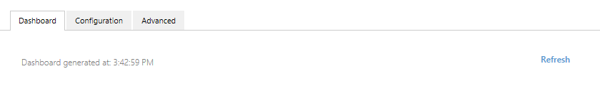

[Version 1]({{ site.baseurl }}/Frameworks/Vault-Application-Framework/Versions/#version-10)
{:.tag.unavailable title="This functionality is NOT available in version 1.0 of the Vault Application Framework."}
[Version 2]({{ site.baseurl }}/Frameworks/Vault-Application-Framework/Versions/#version-20)
{:.tag.available title="This functionality is available in version 2.0 of the Vault Application Framework."}
[Version 2.1]({{ site.baseurl }}/Frameworks/Vault-Application-Framework/Versions/#version-21)
{:.tag.available title="This functionality is available in version 2.1 of the Vault Application Framework."}

The approach shown below is only compatible with version 2.0(and higher) of the Vault Application Framework, where the target audience runs M-Files 2018 or higher.  If using [version 1.0]({{ site.baseurl }}/Frameworks/Vault-Application-Framework/Versions/#version-10), or to maintain compatibility with M-Files 2015.3 and lower, [configuration attributes]({{ site.baseurl }}/Frameworks/Vault-Application-Framework/Attributes/Configuration/) should be used instead.
{:.note.warning}

## VAF 2.1

Version 2.1 of the Vault Application Framework introduces a new base class for your applications to inherit from.  This new base class encapsulates a large chunk of boilerplate code that was previously required to be implemented manually, including the output of a simple dashboard containing the application name, version and description.

Implementing a custom dashboard involves overriding the `GetDashboardContent` method:


using System.Runtime.Serialization;
using MFiles.VAF.Configuration;
using MFiles.VAF.Configuration.AdminConfigurations;
using MFiles.VAF.Core;

namespace MFVaultApplication1
{
	public class VaultApplication
		: ConfigurableVaultApplicationBase<Configuration>
	{
		#region Overrides of ConfigurableVaultApplicationBase<Configuration>

		/// <inheritdoc />
		public override string GetDashboardContent(IConfigurationRequestContext context)
		{
			return "<html><head></head><body>hello world</body></html>";
		}

		#endregion
	}
	
	[DataContract]
	public class Configuration
	{
 
	}
}


### Using commands within dashboards

Version 2.1 of the Vault Application Framework provides an easy way to create commands within dashboards that, when clicked, execute custom server-side code.  This could include, for example, executing a vault extension method or creating objects in the vault.  Creating a dashboard button and reacting to it being clicked involves three steps:

* Declare the `CustomDomainCommand` containing a unique ID for the command and the method to run when the command is executed.
* Override `GetCommands` and ensure that this command is returned in the collection.
* Override `GetDashboardContents` and add the command to the dashboard somewhere so that it can be clicked.

The code below registers one command named `refreshDashboardCommand`.  When executed, this command instructs the dashboard to refresh.  The dashboard simply contains the time that it was rendered, and displays a button that executes this command.


/// <summary>
/// The entry point for this Vault Application Framework application.
/// </summary>
/// <remarks>Examples and further information available on the developer portal: http://developer.m-files.com/. </remarks>
public partial class VaultApplication
	: ConfigurableVaultApplicationBase<Configuration>
{
	/// <summary>
	/// The command which will be executed.
	/// </summary>
	/// <remarks>The "Execute" method will be called when the command is clicked.</remarks>
	private readonly CustomDomainCommand refreshDashboardCommand = new CustomDomainCommand
	{
		ID = "cmdRefreshDashboard",
		ConfirmMessage = "Are you sure you would like to refresh the dashboard?",
		Execute = (c, o) =>
		{
			o.RefreshDashboard();
		}
	};

	#region Overrides of ConfigurableVaultApplicationBase<Configuration>

	/// <inheritdoc />
	public override IEnumerable<CustomDomainCommand> GetCommands(IConfigurationRequestContext context)
	{
		// Return any commands that the base implementation provides, plus our refresh command.
		return new List<CustomDomainCommand>(base.GetCommands(context))
			{
				this.refreshDashboardCommand
		};
	}

	/// <inheritdoc />
	public override string GetDashboardContent(IConfigurationRequestContext context)
	{
		// Create the surrounding dashboard.
		var dashboard = new StatusDashboard();

		// Create a panel showing when the dashboard was rendered.
		var refreshPanel = new DashboardPanel();
		refreshPanel.SetInnerContent( $"Dashboard generated at: {DateTime.Now.ToString( "T" )}" );

		// Add the refresh command to the panel, and the panel to the dashboard.
		refreshPanel.Commands.Add( DashboardHelper.CreateDomainCommand( "Refresh", this.refreshDashboardCommand.ID ) );
		dashboard.AddContent( refreshPanel );

		return dashboard.ToString();
	}

	#endregion

}




## VAF 2.0

Use this approach when using version 2.0 of the Vault Application Framework.  When using version 2.1 or later, use the approach above.
{:.note}

Each configuration node can define a method which builds a dashboard which is shown to the user when they select the "Dashboard" tab for the application within the M-Files Admin software.  In the sample below, the `DashboardGenerator` method has been set as the generator for the configuration node.  This method must return a valid HTML string which will then be displayed.


using System.Runtime.Serialization;
using MFiles.VAF;
using MFiles.VAF.AdminConfigurations;
using MFiles.VAF.Common;
using MFilesAPI;

namespace MFVaultApplication1
{
	[DataContract]
	public class Configuration
	{
		[DataMember]
		public string ConnectionString { get; set; }

	}

	public class VaultApplication
		: VaultApplicationBase, IUsesAdminConfigurations
	{

		private ConfigurationNode<Configuration> config { get; set; }

		public void InitializeAdminConfigurations(IAdminConfigurations adminConfigurations)
		{
			// Add it to the configuration screen.
			this.config = adminConfigurations.AddSimpleConfigurationNode<Configuration>(
				"My Vault Application",
				this.DashboardGenerator);
		}
		private string DashboardGenerator()
		{
			return "<html><head></head><body>hello world</body></html>";
		}
	}
}


Only simple HTML is allowed; elements such as `<script>` will be ignored.
{:.note.warning}


## Using helper functions

Generating the HTML for standard dashboard components can be done through the use of the `StatusDashboard` class.  Once the dashboard is populated, the HTML required to render it can be retrieved by calling its `ToString` method:


using System.Runtime.Serialization;
using MFiles.VAF;
using MFiles.VAF.AdminConfigurations;
using MFiles.VAF.Common;
using MFilesAPI;

namespace MFVaultApplication1
{
	[DataContract]
	public class Configuration
	{
		[DataMember]
		public string ConnectionString { get; set; }

	}

	public class VaultApplication
		: VaultApplicationBase, IUsesAdminConfigurations
	{

		private ConfigurationNode<Configuration> config { get; set; }

		public void InitializeAdminConfigurations(IAdminConfigurations adminConfigurations)
		{
			// Add it to the configuration screen.
			this.config = adminConfigurations.AddSimpleConfigurationNode<Configuration>(
				"My Vault Application",
				this.DashboardGenerator);
		}
		private string DashboardGenerator()
		{
			var statusDashboard = new StatusDashboard();
			return statusDashboard.ToString();
		}
	}
}


### Dashboard contents

The `StatusDashboard` has a property named `Contents` which is a collection of items that are shown within it.  Whilst the built-in implementations are shown below, any class which implements the `IDashboardContent` interface can be added to the collection.

#### Panels

```csharp
// Create the panel.
var panel = new DashboardPanel()
{
	Title = "Dashboard panel 1"
};

// Panels can also contain other dashboard content like lists or text
// (not shown, for clarity).
// panel.InnerContent.Add( ... )

// Set up the dashboard.
var statusDashboard = new StatusDashboard();
statusDashboard.Contents.Add(panel);

// Return the HTML.
return statusDashboard.ToString();
```

#### Lists

```csharp
// Create the list.
var list = new DashboardList()
{
	Title = "My list"
};

// Add a list item.
list.Items.Add(new DashboardListItem()
{
	Title = "First List item",
	StatusSummary = new DomainStatusSummary()
	{
		Status = DomainStatus.Enabled
	}
});

// Set up the dashboard.
var statusDashboard = new StatusDashboard();
statusDashboard.Contents.Add(list);

// Return the HTML.
return statusDashboard.ToString();
```

#### Text

```csharp
// Create the text.
// Any newlines (\n) in the text will be respected in the HTML rendered.
var dashboardText = new DashboardText("line 1\nline 1");

// Set up the dashboard.
var statusDashboard = new StatusDashboard();
statusDashboard.Contents.Add(dashboardText);

// Return the HTML.
return statusDashboard.ToString();
```

#### Custom content

```csharp
// Create the custom content.
var customContent = new DashboardCustomContent("<table><tr><td>Item 1</td><td>Item 2</td></tr></table>");

// Set up the dashboard.
var statusDashboard = new StatusDashboard();
statusDashboard.Contents.Add(customContent);

// Return the HTML.
return statusDashboard.ToString();
```

## Allowed HTML tags and attributes

The following HTML tags are allowed within dashboards:

* &lt;h1&gt;&lt;/h1&gt;
* &lt;h2&gt;&lt;/h2&gt;
* &lt;h3&gt;&lt;/h3&gt;
* &lt;h4&gt;&lt;/h4&gt;
* &lt;h5&gt;&lt;/h5&gt;
* &lt;h6&gt;&lt;/h6&gt;
* &lt;blockquote&gt;&lt;/blockquote&gt;
* &lt;p&gt;&lt;/p&gt;
* &lt;a&gt;&lt;/a&gt;
* &lt;ul&gt;&lt;/ul&gt;
* &lt;ol&gt;&lt;/ol&gt;
* &lt;nl&gt;&lt;/nl&gt;
* &lt;li&gt;&lt;/li&gt;
* &lt;i&gt;&lt;/i&gt;
* &lt;strong&gt;&lt;/strong&gt;
* &lt;em&gt;&lt;/em&gt;
* &lt;strike&gt;&lt;/strike&gt;
* &lt;code&gt;&lt;/code&gt;
* &lt;hr /&gt;
* &lt;br /&gt;
* &lt;div&gt;&lt;/div&gt;
* &lt;span&gt;&lt;/span&gt;
* &lt;button&gt;&lt;/button&gt;
* &lt;table&gt;&lt;/table&gt;
* &lt;thead&gt;&lt;/thead&gt;
* &lt;caption&gt;&lt;/caption&gt;
* &lt;tbody&gt;&lt;/tbody&gt;
* &lt;tr&gt;&lt;/tr&gt;
* &lt;th&gt;&lt;/th&gt;
* &lt;td&gt;&lt;/td&gt;
* &lt;pre&gt;&lt;/pre&gt;

The following attributes are allowed:

* &lt;a&gt;&lt;/a&gt;
	* href
	* name
	* target
* &lt;img /&gt;
	* src
* (all elements)
	* id
	* name
	* class
	* style
	* data-*

## Tips and tricks

### Displaying an image in a dashboard

The content rendered within a dashboard is limited, and HTML `` tags are not directly supported.  It is, however, possible to render an image within a dashboard:

```csharp
// Read the image and convert it to a Base64 encoding format.
var image = DashboardHelper.ImageFileToDataUri("image.png");

// Create a dashboard panel for the content to sit into.
var panel = new DashboardPanel();
panel.InnerContent = new DashboardContentCollection()
{
	// Add the image as a CSS background to a div.
	new DashboardCustomContent($"<div style='background-image: url({image}); background-repeat: no-repeat; height: 92px; width: 92px'></div>"),
};

// Set up the dashboard.
var dashboard = new StatusDashboard();
dashboard.Contents.Add(panel);

// Return the HTML.
return dashboard.ToString();
```
