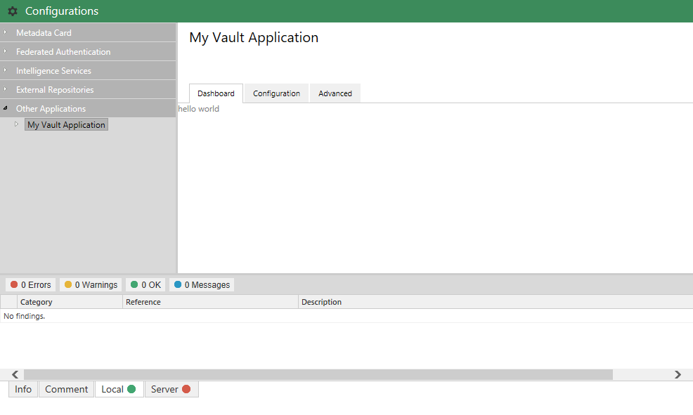



HACK!
THIS PAGE USES HIGHLIGHTER LIQUID COMMANDS RATHER THAN BACKTICKS.
BACKTICKS AREN'T CORRECTLY HIGHLIGHTING THE CODE.
THIS NEEDS LOOKING AT, AT SOME POINT, BUT WORKS FOR NOW.



[Version 1]({{ site.baseurl }}/Frameworks/Vault-Application-Framework/Versions/#version-10)
{:.tag.unavailable title="This functionality is NOT available in version 1.0 of the Vault Application Framework."}
[Version 2]({{ site.baseurl }}/Frameworks/Vault-Application-Framework/Versions/#version-20)
{:.tag.available title="This functionality is available in version 2.0 of the Vault Application Framework."}

The approach shown below is only compatible with [version 2.0]({{ site.baseurl }}/Frameworks/Vault-Application-Framework/Versions/#version-20) of the Vault Application Framework, where the target audience runs M-Files 2018 or higher.  If using [version 1.0]({{ site.baseurl }}/Frameworks/Vault-Application-Framework/Versions/#version-10), or to maintain compatibility with M-Files 2015.3 and lower, [configuration attributes]({{ site.baseurl }}/Frameworks/Vault-Application-Framework/Attributes/Configuration/) should be used instead.
{:.note.warning}

Each configuration node can define a method which builds a dashboard which is shown to the user when they select the "Dashboard" tab for the application within the M-Files Admin software.  In the sample below, the `DashboardGenerator` method has been set as the generator for the configuration node.  This method must return a valid HTML string which will then be displayed.


using System.Runtime.Serialization;
using MFiles.VAF;
using MFiles.VAF.AdminConfigurations;
using MFiles.VAF.Common;
using MFilesAPI;

namespace MFVaultApplication1
{
	[DataContract]
	public class Configuration
	{
		[DataMember]
		public string ConnectionString { get; set; }

	}

	public class VaultApplication
		: VaultApplicationBase, IUsesAdminConfigurations
	{

		private ConfigurationNode<Configuration> config { get; set; }

		public void InitializeAdminConfigurations(IAdminConfigurations adminConfigurations)
		{
			// Add it to the configuration screen.
			this.config = adminConfigurations.AddSimpleConfigurationNode<Configuration>(
				"My Vault Application",
				this.DashboardGenerator);
		}
		private string DashboardGenerator()
		{
			return "<html><head></head><body>hello world</body></html>";
		}
	}
}


Only simple HTML is allowed; elements such as `<script>` will be ignored.
{:.note.warning}



## Using helper functions

Generating the HTML for standard dashboard components can be done through the use of the `StatusDashboard` class.  Once the dashboard is populated, the HTML required to render it can be retrieved by calling its `ToString` method:


using System.Runtime.Serialization;
using MFiles.VAF;
using MFiles.VAF.AdminConfigurations;
using MFiles.VAF.Common;
using MFilesAPI;

namespace MFVaultApplication1
{
	[DataContract]
	public class Configuration
	{
		[DataMember]
		public string ConnectionString { get; set; }

	}

	public class VaultApplication
		: VaultApplicationBase, IUsesAdminConfigurations
	{

		private ConfigurationNode<Configuration> config { get; set; }

		public void InitializeAdminConfigurations(IAdminConfigurations adminConfigurations)
		{
			// Add it to the configuration screen.
			this.config = adminConfigurations.AddSimpleConfigurationNode<Configuration>(
				"My Vault Application",
				this.DashboardGenerator);
		}
		private string DashboardGenerator()
		{
			var statusDashboard = new StatusDashboard();
			return statusDashboard.ToString();
		}
	}
}


### Dashboard contents

The `StatusDashboard` has a property named `Contents` which is a collection of items that are shown within it.  Whilst the built-in implementations are shown below, any class which implements the `IDashboardContent` interface can be added to the collection.

#### Panels

```csharp
// Create the panel.
var panel = new DashboardPanel()
{
	Title = "Dashboard panel 1"
};

// Panels can also contain other dashboard content like lists or text
// (not shown, for clarity).
// panel.InnerContent.Add( ... )

// Set up the dashboard.
var statusDashboard = new StatusDashboard();
statusDashboard.Contents.Add(panel);

// Return the HTML.
return statusDashboard.ToString();
```

#### Lists

```csharp
// Create the list.
var list = new DashboardList()
{
	Title = "My list"
};

// Add a list item.
list.Items.Add(new DashboardListItem()
{
	Title = "First List item",
	StatusSummary = new DomainStatusSummary()
	{
		Status = DomainStatus.Enabled
	}
});

// Set up the dashboard.
var statusDashboard = new StatusDashboard();
statusDashboard.Contents.Add(list);

// Return the HTML.
return statusDashboard.ToString();
```

#### Text

```csharp
// Create the text.
// Any newlines (\n) in the text will be respected in the HTML rendered.
var dashboardText = new DashboardText("line 1\nline 1");

// Set up the dashboard.
var statusDashboard = new StatusDashboard();
statusDashboard.Contents.Add(dashboardText);

// Return the HTML.
return statusDashboard.ToString();
```

#### Custom content

```csharp
// Create the custom content.
var customContent = new DashboardCustomContent("<table><tr><td>Item 1</td><td>Item 2</td></tr></table>");

// Set up the dashboard.
var statusDashboard = new StatusDashboard();
statusDashboard.Contents.Add(customContent);

// Return the HTML.
return statusDashboard.ToString();
```

## Tips and tricks

### Displaying an image in a dashboard

The content rendered within a dashboard is limited, and HTML `` tags are not directly supported.  It is, however, possible to render an image within a dashboard:

```csharp
// Read the image and convert it to a Base64 encoding format.
var image = DashboardHelper.ImageFileToDataUri("image.png");

// Create a dashboard panel for the content to sit into.
var panel = new DashboardPanel();
panel.InnerContent = new DashboardContentCollection()
{
	// Add the image as a CSS background to a div.
	new DashboardCustomContent($"<div style='background-image: url({image}); background-repeat: no-repeat; height: 92px; width: 92px'></div>"),
};

// Set up the dashboard.
var dashboard = new StatusDashboard();
dashboard.Contents.Add(panel);

// Return the HTML.
return dashboard.ToString();
```