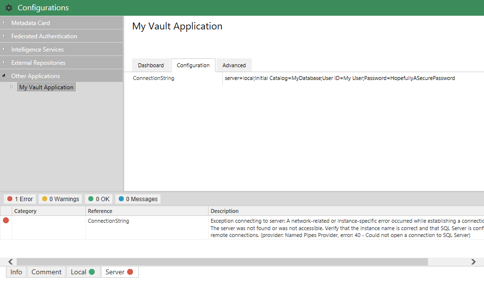

[Version 1]({{ site.baseurl }}/Frameworks/Vault-Application-Framework/Versions/#version-10)
{:.tag.unavailable title="This functionality is NOT available in version 1.0 of the Vault Application Framework."}
[Version 2]({{ site.baseurl }}/Frameworks/Vault-Application-Framework/Versions/#version-20)
{:.tag.available title="This functionality is available in version 2.0 of the Vault Application Framework."}
[Version 2.1]({{ site.baseurl }}/Frameworks/Vault-Application-Framework/Versions/#version-21)
{:.tag.available title="This functionality is available in version 2.1 of the Vault Application Framework."}

The approach shown below is only compatible with [version 2.0]({{ site.baseurl }}/Frameworks/Vault-Application-Framework/Versions/#version-20) of the Vault Application Framework, where the target audience runs M-Files 2018 or higher.  If using [version 1.0]({{ site.baseurl }}/Frameworks/Vault-Application-Framework/Versions/#version-10), or to maintain compatibility with M-Files 2015.3 and lower, [configuration attributes]({{ site.baseurl }}/Frameworks/Vault-Application-Framework/Attributes/Configuration/) should be used instead.
{:.note.warning}

## VAF 2.1

Version 2.1 of the Vault Application Framework introduces a new base class for your applications to inherit from.  This new base class encapsulates a large chunk of boilerplate code that was previously required to be implemented manually.

Implementing a custom dashboard involves overriding the `CustomValidation` method:


using System.Runtime.Serialization;
using MFiles.VAF.Configuration;
using MFiles.VAF.Configuration.AdminConfigurations;
using MFiles.VAF.Core;

namespace MFVaultApplication1
{
	public class VaultApplication
		: ConfigurableVaultApplicationBase<Configuration>
	{
		#region Overrides of ConfigurableVaultApplicationBase<Configuration>

		/// <inheritdoc />
		protected override IEnumerable<ValidationFinding> CustomValidation(Vault vault, Configuration config)
		{
			return base.CustomValidation(vault, config);
		}

		#endregion
	}
	
	[DataContract]
	public class Configuration
	{
 
	}
}


The information returned by the `CustomValidation` method should be the same as with the [VAF 2.0](#vaf-20) implementation.
{:.note}

## VAF 2.0

Each configuration node can define a method which executes additional validation of the configuration.  In the sample below, the `CustomValidator` method has been set as the Validator for the configuration node.


using System.Runtime.Serialization;
using MFiles.VAF;
using MFiles.VAF.AdminConfigurations;
using MFiles.VAF.Common;
using MFilesAPI;

namespace MFVaultApplication1
{
	[DataContract]
	public class Configuration
	{
		[DataMember]
		public string ConnectionString { get; set; }

	}

	public class VaultApplication
		: VaultApplicationBase, IUsesAdminConfigurations
	{

		private ConfigurationNode<Configuration> config { get; set; }

		public void InitializeAdminConfigurations(IAdminConfigurations adminConfigurations)
		{
			// Add it to the configuration screen.
			this.config = adminConfigurations.AddSimpleConfigurationNode<Configuration>("My Vault Application");
			this.config.Validator = this.CustomValidator;
		}

		private IEnumerable<ValidationFinding> CustomValidator(Configuration configuration)
		{
			ValidationFinding finding = null;

			try
			{
				// Connect to the database to test the connection is valid.
				using (var sqlConnection = new System.Data.SqlClient.SqlConnection(configuration.ConnectionString))
				{
					// Connect to the database.
					sqlConnection.Open();

					// If no exception then report okay.
					finding = new ValidationFinding(
						ValidationFindingType.Ok,
						nameof(Configuration.ConnectionString),
						"Connection successful");

					// Disconnect.
					sqlConnection.Close();
				}
			}
			catch (Exception e)
			{
				// Report an exception.
				finding = new ValidationFinding(
					ValidationFindingType.Error,
					nameof(Configuration.ConnectionString),
					$"Exception connecting to server: {e.Message}");
			}

			// Return the finding.
			yield return finding;
		}
	}
}

