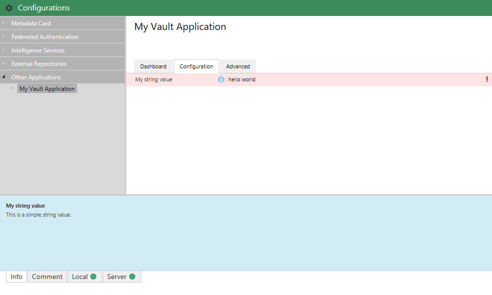
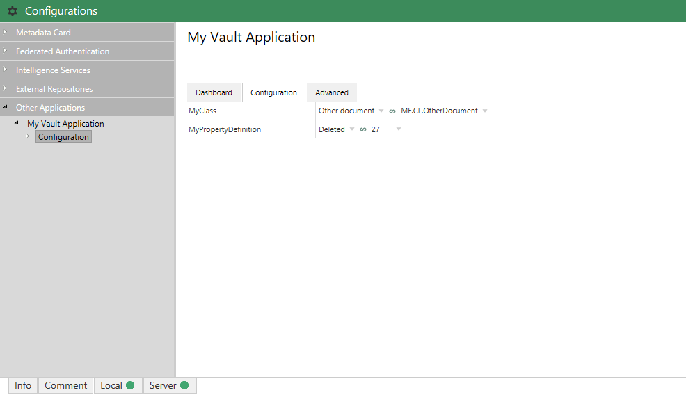
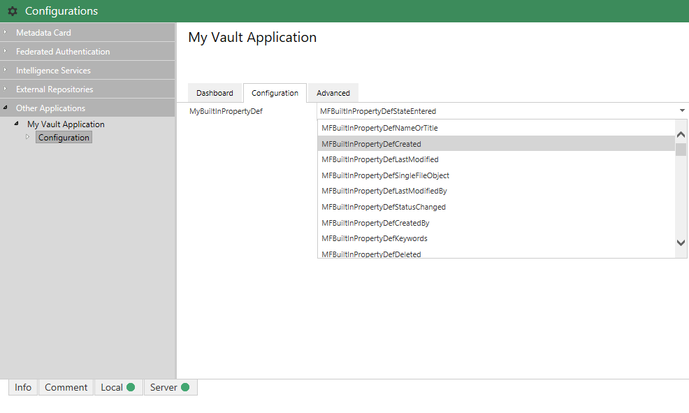
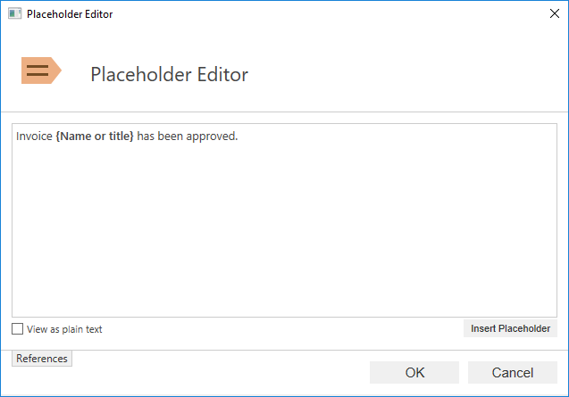
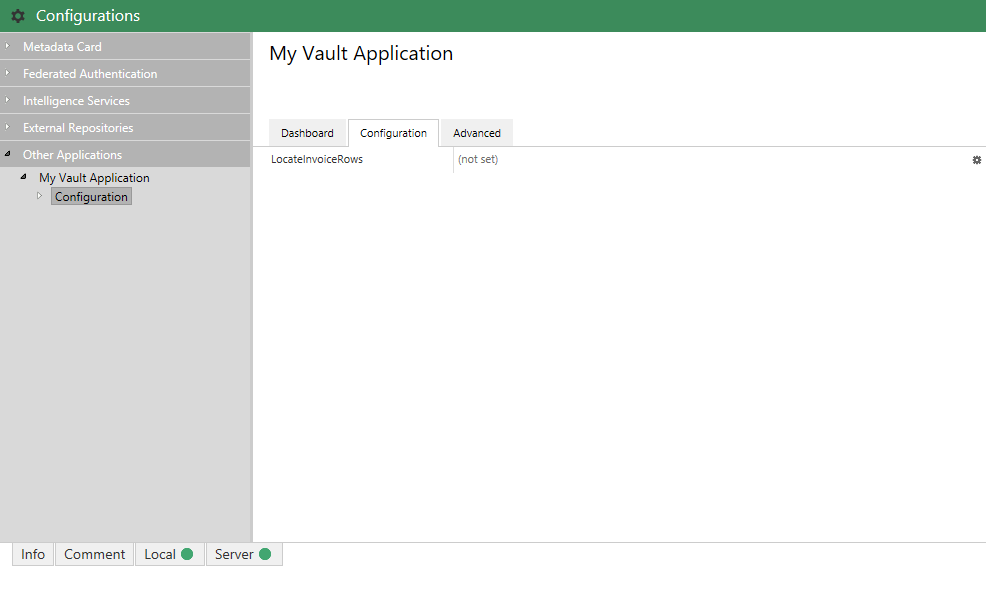
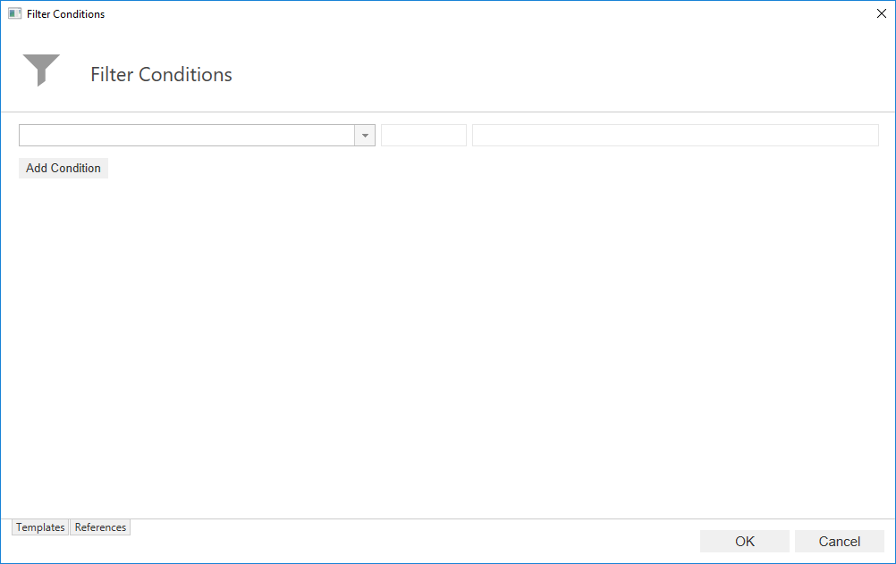
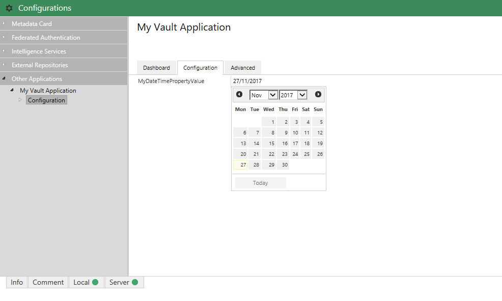
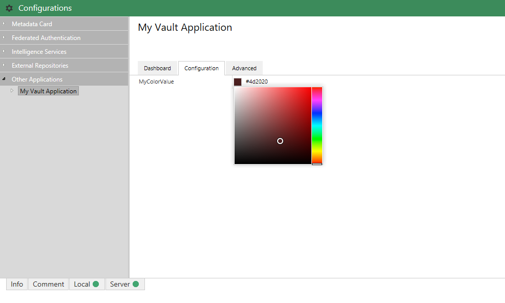



HACK!
THIS PAGE USES HIGHLIGHTER LIQUID COMMANDS RATHER THAN BACKTICKS.
BACKTICKS AREN'T CORRECTLY HIGHLIGHTING THE CODE.
THIS NEEDS LOOKING AT, AT SOME POINT, BUT WORKS FOR NOW.



[Version 1]({{ site.baseurl }}/Frameworks/Vault-Application-Framework/Versions/#version-10)
{:.tag.unavailable title="This functionality is NOT available in version 1.0 of the Vault Application Framework."}
[Version 2]({{ site.baseurl }}/Frameworks/Vault-Application-Framework/Versions/#version-20)
{:.tag.available title="This functionality is available in version 2.0 of the Vault Application Framework."}

The approach shown below is only compatible with [version 2.0]({{ site.baseurl }}/Frameworks/Vault-Application-Framework/Versions/#version-20) of the Vault Application Framework, where the target audience runs M-Files 2018 or higher.  If using [version 1.0]({{ site.baseurl }}/Frameworks/Vault-Application-Framework/Versions/#version-10), or to maintain compatibility with M-Files 2015.3 and lower, [configuration attributes]({{ site.baseurl }}/Frameworks/Vault-Application-Framework/Attributes/Configuration/) should be used instead.
{:.note.warning}

The M-Files Admin Configuration area has a number of built-in editors for common configuration types.  These editors allow users to more easily configure applications without requiring the user to enter formatted/structured text content such as JSON.

The following editors are available to use:

* [Text editor](#text-editor), for string values.
* [Numeric editors](#numeric-editors).
* [MFIdentifier](#mfidentifier-selector) selector, allowing users to select elements from the M-Files vault configuration, such as classes or property definitions.
* [Enumerations](#enumerations-editor) (to choose from a pre-defined static list of values).
* A [Placeholder editor](#placeholder-editor), to allow the user to create a text template that will be filled with metadata.
* A [Search Conditions editor](#search-conditions-editor) to allow the user to specify search conditions for use by the vault application.
* [Date picker](#date-picker), for selecting dates.
* [Time picker](#time-picker), for selecting times.
* [Timestamp picker](#timestamp-picker), for selecting time stamps.
* [Color picker](#color-picker), for selecting dates.

In addition, the `JsonConfEditor` attribute can be used to set the following values on each editor:

* `HelpText` - text shown when the user selects the "i" icon to the left of the setting.
* `Label` - text shown on instead of the property name.
* `RegExMask` - a regular expression mask that will be enforced as a validation requirement.


using System.Runtime.Serialization;
using MFiles.VAF.Configuration;

[DataContract]
public class Configuration
{
	[DataMember]
	[TextEditor(
		RegExMask = @"\d{3}.{4}",
		HelpText = "This is a simple string value.",
		Label = "My string value")]
	public string MyStringValue { get; set; }
}


## Text editor

The text editor is the default editor used by the administration area.  Its display can be further customized through the use of additional attributes.  In addition to the base `JsonConfEditor` attribute listed above, the following can be used with the text editor:

* `JsonConfEditor`
	* `TypeEditor` - defines the sub-type of the editor shown.  Value values are:
		* `date` - the editor is shown as a [date picker](#date-picker).
		* `color` - the editor is shown as a [color picker](#color-picker).
		* `placeholderText` - the editor is shown as a [Placeholder editor](#placeholder-editor).
		* `options` - the editor is shown as a [dropdown list](#dropdown-list).
* `MultilineTextEditor` - allows the text area to accept multiple lines of text; as the user presses "Enter", the box will expand in size.


using System.Runtime.Serialization;
using MFiles.VAF.Configuration;

[DataContract]
public class Configuration
{
	[DataMember]
	[MultilineTextEditor]
	public string MyMultiLineStringValue { get; set; }
}


## Numeric editors

The `JsonConfIntegerEditor` and `JsonConfFloatEditor` attributes can be used to define that a property should only accept numbers, either integers or floats respectively.

The system will highlight invalid characters as a validation exception, and will stop invalid values being saved.  It does not stop values being entered using the keyboard.
{:.note.warning}


using System.Runtime.Serialization;
using MFiles.VAF.Configuration;

[DataContract]
public class Configuration
{
	[DataMember]
	[JsonConfIntegerEditor]
	public int MyIntegerValue { get; set; }

	[DataMember]
	[JsonConfFloatEditor]
	public float MyFloatValue { get; set; }
}


### Integers

When using the `JsonConfIntegerEditor` attribute, the following additional arguments can be set:

* `Max` - defaults to 2147483647.  Values greater than this are invalid.
* `Min` - defaults to -2147483648.  Values less than this are invalid.


using System.Runtime.Serialization;
using MFiles.VAF.Configuration;

[DataContract]
public class Configuration
{
	[DataMember]
	[JsonConfIntegerEditor(Min=100, Max=500)]
	public int MyIntegerValue { get; set; }
}


### Floats

When using the `JsonConfFloatEditor` attribute, the following additional arguments can be set:

* `Max` - defaults to [PositiveInfinity](https://msdn.microsoft.com/en-us/library/system.double.positiveinfinity(v=vs.110).aspx).  Values greater than this are invalid.
* `Min` - defaults to [NegativeInfinity](https://msdn.microsoft.com/en-us/library/system.double.negativeinfinity(v=vs.110).aspx).  Values less than this are invalid.
* `MinPrecision` - defaults to 2.  Lower precisions are shown to this precision.
* `MaxPrecision` - defaults to 7.  Higher precisions may be saved rounded.


using System.Runtime.Serialization;
using MFiles.VAF.Configuration;

[DataContract]
public class Configuration
{
	[DataMember]
	[JsonConfFloatEditor(Min=100, Max=500, MinPrecision=1, MaxPrecision=2)]
	public float MyFloatValue { get; set; }
}


## MFIdentifier selector

The [MFIdentifier](/Frameworks/Vault-Application-Framework/Attributes/Configuration/#mfidentifier) class can be used to reference vault elements such as classes, object types, or properties without having to [hard-code their respective vault IDs](/Getting-Started/Aliases/).  By declaring the member as an `MFIdentifier`, the M-Files Admin software will show the user a selection of items from the vault structure for them to pick.

The `MFIdentifier` class must be used along with an attribute such as `[MFClass]` or `[MFPropertyDef]` to define the type of vault structural element that the identifier points to.  An example is shown below.
{:.note.warning}


using System.Runtime.Serialization;
using MFiles.VAF.Configuration;

[DataContract]
public class Configuration
{
	[MFClass(Required = true)]
	[DataMember]
	public MFIdentifier MyClass { get; set; }
		= "MFiles.Class.PurchaseOrder";

	[MFPropertyDef(Required = true)]
	[DataMember]
	public MFIdentifier MyPropertyDefinition { get; set; }
		= "MFiles.PropertyDef.PurchaseOrderNumber";
}


The user will be first asked to select the vault element to reference (e.g. the `Other document` class or the `Deleted` property definition, in the screenshot above), then the method of referencing the vault element.  In the screenshot above, the user has chosen to reference `Other document` by its alias of `MF.CL.OtherDocument`, but the `Deleted` property definition by its ID (`27`).  Referencing vault structure elements by their alias is recommended if the configuration is expected to be copied between vaults.
{:.note}

## Enumerations editor

By declaring a member as an enumerated value, the M-Files Admin software will render a list of potential options for the user to select.  The user can click the "down" arrow to the right of the configuration row to drop down the available options.


using System.Runtime.Serialization;
using MFiles.VAF.Configuration;

[DataContract]
public class Configuration
{
	[DataMember]
	public MFBuiltInPropertyDef MyBuiltInPropertyDef { get; set; }
}


## Dropdown list

By using the `JsonConfEditor` attribute and a `TypeEditor` value of `options`, the configuration can define a set of custom dropdown options shown to the user.

The Options property takes a string containing a JSON object with a single property named `selectOptions`.  In the simplest form this is an array of string to show to the user (shown below as `MyOptions1`).  If the label (shown text) should be different to the value (returned when selected), this should instead be an array of objects, each with a property for `label` and `value` (shown below as `MyOptions2`).


using System.Runtime.Serialization;
using MFiles.VAF.Configuration;

[DataContract]
public class Configuration
{
	[DataMember]
	[JsonConfEditor(TypeEditor = "options",
		Options = "{selectOptions:[\"MyFirst\",\"MySecond\"]}")]
	public string MyOptions1;

	[DataMember]
	[JsonConfEditor(TypeEditor = "options",
		Options = "{selectOptions:[{label:\"MyFirst\", value:\"1\"},{label:\"MySecond\", value:\"2\"}]}")]
	public string MyOptions2;
}


In most situations, the use of an [enumerated value](#enumerations-editor) may be better.
{:.note}

## Placeholder editor

By using the `JsonConfEditor` attribute and a `TypeEditor` value of `placeholderText`, the configuration allows the user to define a set of text containing placeholders.  These placeholders can be replaced at runtime with values from objects within the vault.  This can be useful to define, for example, text used for custom email notifications, where the object names can be replaced at runtime (e.g. "Invoice 123456 has been approved").


using System.Runtime.Serialization;
using MFiles.VAF.Configuration;

[DataContract]
public class Configuration
{
	[DataMember]
	[JsonConfEditor(TypeEditor = "placeholderText")]
	public string MyTextTemplate;
}


When the cog to the right of the configuration row is selected, the placeholder text editor is shown.  This can be used to create a custom text string including placeholders which can be automatically resolved using [ObjVerEx.ExpandPlaceholderText](/Frameworks/Vault-Application-Framework/Helpers/ObjVerEx/#expandplaceholdertext).

## Search Conditions editor

By declaring a member as a type of `SearchConditionsJA` ("SearchConditions JSON Adapter"), the M-Files Admin software will allow the user to define a set of search conditions within the user interface.  This can then be used at runtime to locate objects within the vault.


using System.Runtime.Serialization;
using MFiles.VAF.Configuration;
using MFiles.VAF.Configuration.JsonAdaptor;

[DataContract]
public class Configuration
{
	[DataMember]
	public SearchConditionsJA LocateInvoiceRows;
}


When the cog to the right of the configuration row is selected, the search conditons editor is displayed.

The search conditions defined can be used to either execute a search in the vault, or to test whether an existing object matches the defined conditions:



private List<ObjVerEx> LocateInvoiceRows()
{
	// Create our search builder.
	var builder = new MFSearchBuilder(this.PermanentVault, this.config.LocateInvoiceRows.ToApiObject(this.PermanentVault));

	// Find items.
	return builder.FindEx();
}

private void DoesObjectMatch(ObjVerEx input)
{
	return this.config.LocateInvoiceRows.IsMatch(input);
}



## Date picker

By declaring a datetime property and marking it with a correctly-configured `JsonConfEditor` attribute, the M-Files Admin software will render a datepicker for the user to select a date.


using System.Runtime.Serialization;
using MFiles.VAF.Configuration;

[DataContract]
public class Configuration
{
	[DataMember]
	[JsonConfEditor(TypeEditor="date")]
	public DateTime? MyDateTimePropertyValue { get; set; }
}


The member can be declared as either a `string` or a `DateTime`.  If it is declared as a `string` then it will receive the date formatted as in locale-neutral ISO format (e.g. `2017-11-27`).  The date may be displayed in the admin area in a locale-specific format.
{:.note}

## Time picker

By declaring a time property and marking it with a correctly-configured `JsonConfEditor` attribute, the M-Files Admin software will render a datepicker for the user to enter a time.


using System.Runtime.Serialization;
using MFiles.VAF.Configuration;

[DataContract]
public class Configuration
{
	[DataMember]
	[JsonConfEditor(TypeEditor="time", Default="00:00:00")]
	public TimeSpan MyTimePropertyValue { get; set; } = TimeSpan.Zero;
}


The member can be declared as either a `string` or a `TimeSpan`.  If it is declared as a `string` then it will receive the date formatted as `HH:MM:SS`.
{:.note}

## Timestamp picker

By declaring a date/time property and marking it with a correctly-configured `JsonConfEditor` attribute, the M-Files Admin software will render a datepicker for the user to select a date and time.


using System.Runtime.Serialization;
using MFiles.VAF.Configuration;

[DataContract]
public class Configuration
{
	[DataMember]
	[JsonConfEditor(TypeEditor="timestamp")]
	public DateTime? MyTimeStampPropertyValue { get; set; };
}


The member can be declared as either a `string` or a `DateTime`.  If it is declared as a `string` then it will receive the date formatted as in locale-neutral ISO format (e.g. `2017-11-27 01:02:59`).  The date may be displayed in the admin area in a locale-specific format.
{:.note}

## Color picker

By declaring a datetime property and marking it with a correctly-configured `JsonConfEditor` attribute, the M-Files Admin software will render a color picker for the user to select a color.


using System.Runtime.Serialization;
using MFiles.VAF.Configuration;

[DataContract]
public class Configuration
{
	[DataMember]
	[JsonConfEditor(TypeEditor = "color")]
	public string MyColorValue { get; set; }
}


The member should be declared as a `string` and will receive the color formatted as a color hex reference (e.g. `#010101`).
{:.note}