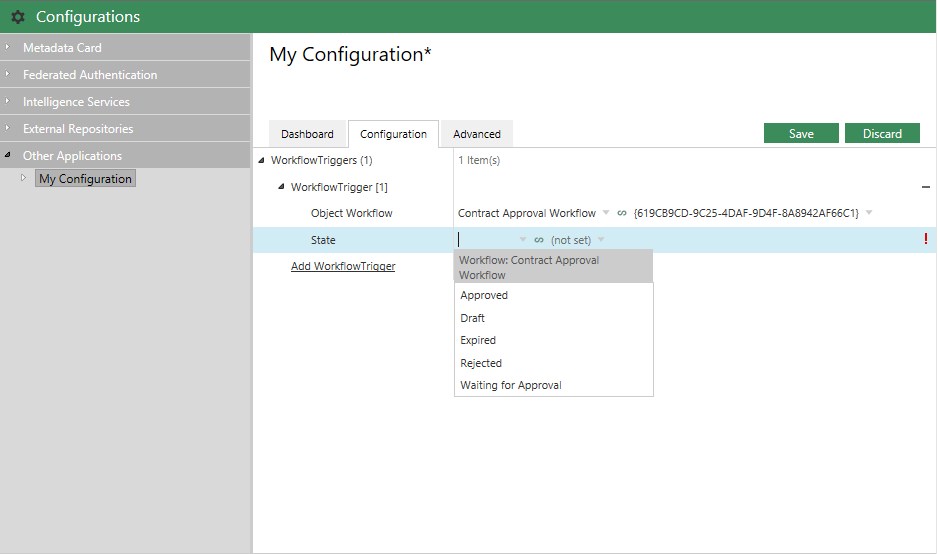
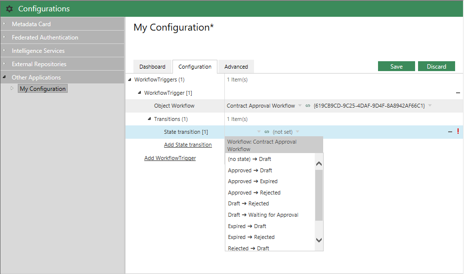

There are situations where configuration options should be filtered according to the values of other options.

## Filtering workflow state by workflow

For the filtering to work, you must:

1. Ensure that the configuration elements are in their own class (e.g. `WorkflowTrigger`, in the sample below).
2. Add the `MFWorkflow` attribute to the new class.  This is the type of the parent that will drive the filtering.
3. Add the `RefMember` property to the `MFWorkflow` attribute, providing it with the name of the `MFIdentifier` member that identifies the parent (e.g. `WorkflowTrigger.Workflow`, in the sample below).
4. Other configuration values within the class which support filtering will now be filtered by the value of the parent (e.g. `State` will be filtered by `Workflow`, in the sample below).

```csharp
using System.Collections.Generic;
using System.Runtime.Serialization;
using MFiles.VAF;
using MFiles.VAF.AdminConfigurations;
using MFiles.VAF.Configuration;

namespace FilteredConfigurationSample
{
	/// <summary>
	/// The entry point for this Vault Application Framework application.
	/// </summary>
	/// <remarks>Examples and further information available on the developer portal: http://developer.m-files.com/. </remarks>
	public class VaultApplication
		: ConfigurableVaultApplicationBase<Configuration>
	{
	}

	[DataContract]
	public class Configuration
	{
		[DataMember]
		public List<WorkflowTrigger> WorkflowTriggers { get; set; }
	}

	[DataContract]
	[MFWorkflow(RefMember = nameof(WorkflowTrigger.Workflow))]
	public class WorkflowTrigger
	{
		[MFWorkflow]
		[JsonConfEditor(Label = "Object Workflow")]
		[DataMember]
		public MFIdentifier Workflow { get; set; }

		[MFState]
		[DataMember]
		[JsonConfEditor(Label = "State")]
		public MFIdentifier State { get; set; }

	}
}
```



In the `MFWorkflow` attribute above, the C# `nameof` operator is used to avoid hard-coding a string value which may change.  This could be altered, instead, to: `[MFWorkflow(RefMember = "Workflow")]`.
{:.note}

## Filtering workflow state transitions by workflow

For the filtering to work, you must:

1. Ensure that the configuration elements are in their own class (e.g. `WorkflowTrigger`, in the sample below).
2. Add the `MFWorkflow` attribute to the new class.  This is the type of the parent that will drive the filtering.
3. Add the `RefMember` property to the `MFWorkflow` attribute, providing it with the name of the `MFIdentifier` member that identifies the parent (e.g. `WorkflowTrigger.Workflow`, in the sample below).
4. Other configuration values within the class which support filtering will now be filtered by the value of the parent (e.g. `Transitions` will be filtered by `Workflow`, in the sample below).

```csharp
using System.Collections.Generic;
using System.Runtime.Serialization;
using MFiles.VAF;
using MFiles.VAF.AdminConfigurations;
using MFiles.VAF.Configuration;

namespace FilteredConfigurationSample
{
	/// <summary>
	/// The entry point for this Vault Application Framework application.
	/// </summary>
	/// <remarks>Examples and further information available on the developer portal: http://developer.m-files.com/. </remarks>
	public class VaultApplication
		: ConfigurableVaultApplicationBase<Configuration>
	{
	}

	[DataContract]
	public class Configuration
	{
		[DataMember]
		public List<WorkflowTrigger> WorkflowTriggers { get; set; }
	}

	[DataContract]
	[MFWorkflow(RefMember = nameof(WorkflowTrigger.Workflow))]
	public class WorkflowTrigger
	{
		[MFWorkflow]
		[JsonConfEditor(Label = "Object Workflow")]
		[DataMember]
		public MFIdentifier Workflow { get; set; }
		
		[MFStateTransition]
		[DataMember]
		[JsonConfEditor(Label = "Transitions")]
		public List<MFIdentifier> Transitions { get; set; }

	}
}
```



In the `MFWorkflow` attribute above, the C# `nameof` operator is used to avoid hard-coding a string value which may change.  This could be altered, instead, to: `[MFWorkflow(RefMember = "Workflow")]`.
{:.note}