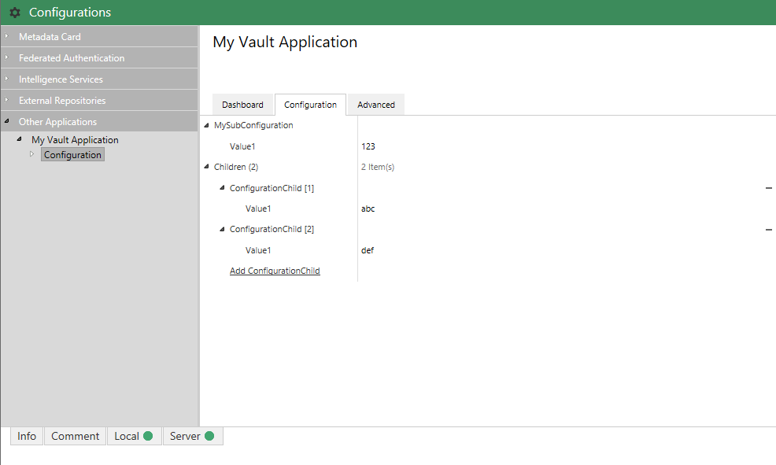
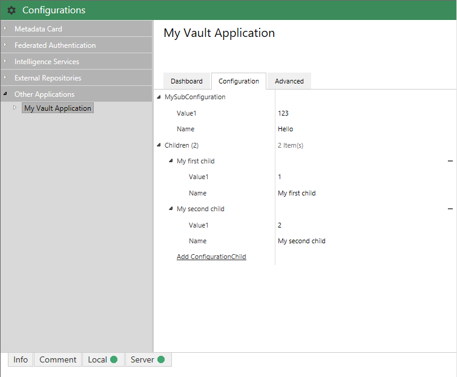

In some situations, using nested configuration objects may be needed to express complex configuration structures.  One such example would be where an application requires the user to configure a collection of rules, similarly to the [Metadata Card Configuration](/Built-In/Metadata-Card-Configuration/).  The sample below defines two configuration classes (`Configuration` and `ConfigurationChild`).  Members exposed by either configuration class could be simple strings (as below), or any other configuration value for which an [editor exists](../Editors).

## Using nested configuration


using System.Collections.Generic;
using System.Runtime.Serialization;
using MFiles.VAF;
using MFiles.VAF.AdminConfigurations;

namespace MFVaultApplication1
{
	[DataContract]
	public class Configuration
	{
		[DataMember]
		public ConfigurationChild MySubConfiguration { get; set; }

		[DataMember]
		public List<ConfigurationChild> Children { get; set; }
	}

	[DataContract]
	public class ConfigurationChild
	{
		[DataMember]
		public string Value1 { get; set; }
	}

	public class VaultApplication
		: ConfigurableVaultApplicationBase<Configuration>
	{
	}
}


## Customising array element names

In the example screenshot above, adding new items to the `Children` collection results in items being added named `ConfigurationChild[1]`, `ConfigurationChild[1]`, etc.  In some situations, it is more useful to show a different value for the item name to make locating the correct item more simple.

This can be done by ensuring that the class in question (`ConfigurationChild`, below) exposes a `Name` property:


using System.Collections.Generic;
using System.Runtime.Serialization;
using MFiles.VAF;
using MFiles.VAF.AdminConfigurations;

namespace MFVaultApplication1
{
	[DataContract]
	public class Configuration
	{
		[DataMember]
		public ConfigurationChild MySubConfiguration { get; set; }

		[DataMember]
		public List<ConfigurationChild> Children { get; set; }
	}

	[DataContract]
	public class ConfigurationChild
	{
		[DataMember]
		public string Value1 { get; set; }

		[DataMember]
		[TextEditor(IsRequired = true)]
		public string Name { get; set; }
	}

	public class VaultApplication
		: ConfigurableVaultApplicationBase<Configuration>
	{
	}
}


Alternatively, if the name should be derived from a different property then it can declared using the `JsonConfEditor` attribute on the class itself.  In the case of the example below, the `NameProperty` property has been explicitly marked as the property to use for the object names.


using System.Collections.Generic;
using System.Runtime.Serialization;
using MFiles.VAF;
using MFiles.VAF.AdminConfigurations;

namespace MFVaultApplication1
{
	[DataContract]
	public class Configuration
	{
		[DataMember]
		public ConfigurationChild MySubConfiguration { get; set; }

		[DataMember]
		public List<ConfigurationChild> Children { get; set; }
	}

	[DataContract]
	[JsonConfEditor(NameMember = "NameProperty")]
	public class ConfigurationChild
	{
		[DataMember]
		public string Value1 { get; set; }

		[DataMember]
		[TextEditor(IsRequired = true)]
		public string NameProperty { get; set; }
	}

	public class VaultApplication
		: ConfigurableVaultApplicationBase<Configuration>
	{
	}
}

