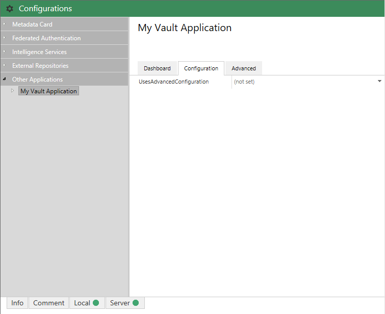
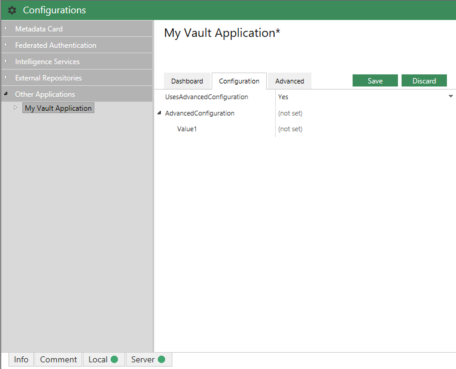



HACK!
THIS PAGE USES HIGHLIGHTER LIQUID COMMANDS RATHER THAN BACKTICKS.
BACKTICKS AREN'T CORRECTLY HIGHLIGHTING THE CODE.
THIS NEEDS LOOKING AT, AT SOME POINT, BUT WORKS FOR NOW.



[Version 1]({{ site.baseurl }}/Frameworks/Vault-Application-Framework/Versions/#version-10)
{:.tag.unavailable title="This functionality is NOT available in version 1.0 of the Vault Application Framework."}
[Version 2]({{ site.baseurl }}/Frameworks/Vault-Application-Framework/Versions/#version-20)
{:.tag.available title="This functionality is available in version 2.0 of the Vault Application Framework."}

The approach shown below is only compatible with [version 2.0]({{ site.baseurl }}/Frameworks/Vault-Application-Framework/Versions/#version-20) of the Vault Application Framework, where the target audience runs M-Files 2018 or higher.  If using [version 1.0]({{ site.baseurl }}/Frameworks/Vault-Application-Framework/Versions/#version-10), or to maintain compatibility with M-Files 2015.3 and lower, [configuration attributes]({{ site.baseurl }}/Frameworks/Vault-Application-Framework/Attributes/Configuration/) should be used instead.
{:.note.warning}

Some configuration settings are only applicable in specific scenarios, and showing all configuration options to users may not be the most user-friendly.  In these situations, configuration options may be shown or hidden depending on the state of other options.

## JSPath

The `ShowWhen` and `HideWhen` configuration both use [JSPath](https://github.com/dfilatov/jspath) syntax to define both the trigger property to test, and the condition which it must meet.  More information on the JSPath syntax is available on [the JSPath official GitHub repository](https://github.com/dfilatov/jspath).

## Showing or hiding options depending on configuration state

In the example below, the `AdvancedConfiguration` option is hidden by default and only shown when the user sets the `UsesAdvancedConfiguration` option to `true`.


using System.Collections.Generic;
using System.Runtime.Serialization;
using MFiles.VAF;
using MFiles.VAF.AdminConfigurations;

namespace MFVaultApplication1
{
	[DataContract]
	public class Configuration
	{
		[DataMember]
		public bool UsesAdvancedConfiguration { get; set; }

		[DataMember]
		[JsonConfEditor(
			Hidden = true,
			ShowWhen = ".parent._children{.key == 'UsesAdvancedConfiguration' && .value == true }")]
		public AdvancedConfiguration AdvancedConfiguration { get; set; }
	}

	[DataContract]
	public class AdvancedConfiguration
	{
		[DataMember]
		public string Value { get; set; }
	}

	public class VaultApplication
		: VaultApplicationBase, IUsesAdminConfigurations
	{

		private ConfigurationNode<Configuration> config { get; set; }

		/// <inheritdoc />
		public void InitializeAdminConfigurations(IAdminConfigurations adminConfigurations)
		{

			// Add it to the configuration screen.
			this.config = adminConfigurations.AddSimpleConfigurationNode<Configuration>("My Vault Application");
		}
	}
}

