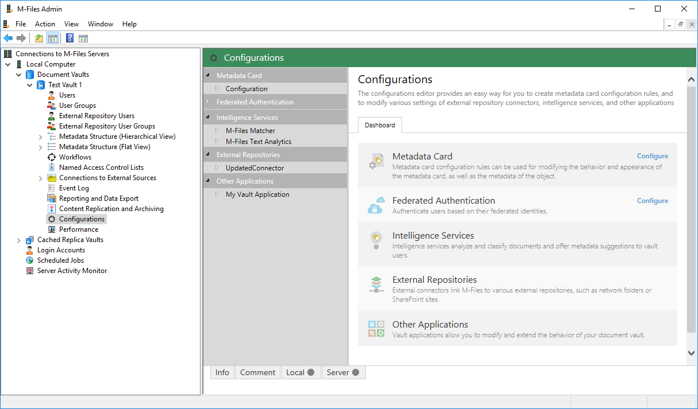
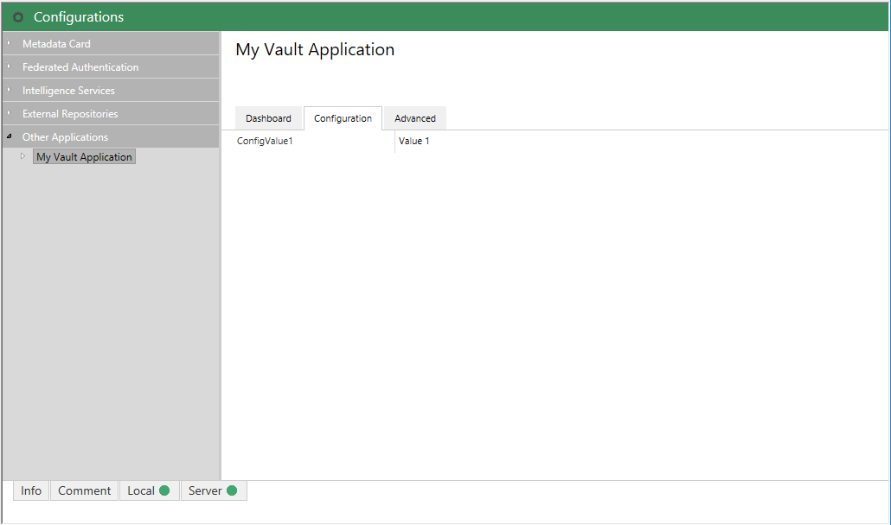



HACK!
THIS PAGE USES HIGHLIGHTER LIQUID COMMANDS RATHER THAN BACKTICKS.
BACKTICKS AREN'T CORRECTLY HIGHLIGHTING THE CODE.
THIS NEEDS LOOKING AT, AT SOME POINT, BUT WORKS FOR NOW.



[Version 1]({{ site.baseurl }}/Frameworks/Vault-Application-Framework/Versions/#version-10)
{:.tag.unavailable title="This functionality is NOT available in version 1.0 of the Vault Application Framework."}
[Version 2]({{ site.baseurl }}/Frameworks/Vault-Application-Framework/Versions/#version-20)
{:.tag.available title="This functionality is available in version 2.0 of the Vault Application Framework."}

The approach shown below is only compatible with [version 2.0]({{ site.baseurl }}/Frameworks/Vault-Application-Framework/Versions/#version-20) of the Vault Application Framework, where the target audience runs M-Files 2018 or higher.  If using [version 1.0]({{ site.baseurl }}/Frameworks/Vault-Application-Framework/Versions/#version-10), or to maintain compatibility with M-Files 2015.3 and lower, [configuration attributes]({{ site.baseurl }}/Frameworks/Vault-Application-Framework/Attributes/Configuration/) should be used instead.
{:.note.warning}

## Background

M-Files 2018 introduces a new section within the M-Files Admin software that collates a variety of customisable configuration options from across the M-Files vault, including:

* Metadata card configuration
* Federated Authentication configuration
* Intelligent Metadata Layer component (e.g. External Repository Connector and Intelligence Service) configuration

The [2.0 release of the Vault Application Framework]({{ site.baseurl }}/Frameworks/Vault-Application-Framework/Versions/#version-20) enables developers to expose the configuration of their Vault Application Framework applications into this same section.

## Base implementation

### Implementing IUsesAdminConfigurations

Ensure that your vault application implements `MFiles.VAF.AdminConfigurations.IUsesAdminConfigurations`.  This will require you to declare one method - `InitializeAdminConfigurations` - as shown below.


using MFiles.VAF;
using MFiles.VAF.AdminConfigurations;

namespace MFVaultApplication1
{
	public class VaultApplication
		: MFiles.VAF.VaultApplicationBase, MFiles.VAF.AdminConfigurations.IUsesAdminConfigurations
	{
		public void InitializeAdminConfigurations(IAdminConfigurations adminConfigurations)
		{
		}
	}
}


### Registering configuration nodes

The `InitializeAdminConfigurations` method allows a developer to add configuration nodes into the M-Files Admin configuration screen, and for these configuration nodes to be rendered within the M-Files Admin.

In the sample below we declare a custom configuration class named `Configuration`, which must be marked with the `[DataContract]` attribute.  All fields and properties of this class that are marked with the `[DataMember]` attribute will be shown within the M-Files Admin interface, as shown in the screenshot below.

Configuration values can be more than just strings.  More information on editor types is available [on the dedicated page](Editors).  Configuration values can even be [hierarchical](Hierarchical-Configuration).
{:.note}


using System.Runtime.Serialization;
using MFiles.VAF;
using MFiles.VAF.AdminConfigurations;
using MFiles.VAF.Common;
using MFilesAPI;

namespace MFVaultApplication1
{
	[DataContract]
	public class Configuration
	{
		[DataMember]
		public string ConfigValue1 = "Value 1";

	}

	public class VaultApplication
		: VaultApplicationBase, IUsesAdminConfigurations
	{

		private ConfigurationNode<Configuration> config { get; set; }

		public void InitializeAdminConfigurations(IAdminConfigurations adminConfigurations)
		{
			// Add it to the configuration screen.
			this.config = adminConfigurations.AddSimpleConfigurationNode<Configuration>("My Vault Application");
		}
	}
}


### Reacting when configuration changes

The configuration can be automatically updated when changes are saved within the M-Files 2018 Admin interface

To  `ConfigurationNode<T>` returned from the call to `AddSimpleConfigurationNode` 


using System.Runtime.Serialization;
using MFiles.VAF;
using MFiles.VAF.AdminConfigurations;
using MFiles.VAF.Common;
using MFilesAPI;

namespace MFVaultApplication1
{
	[DataContract]
	public class Configuration
	{
		[DataMember]
		public string ConfigValue1 = "Value 1";

	}

	public class VaultApplication
		: VaultApplicationBase, IUsesAdminConfigurations
	{

		private ConfigurationNode<Configuration> config { get; set; }

		/// <inheritdoc />
		public override void StartOperations(Vault vaultPersistent)
		{
			base.StartOperations(vaultPersistent);
			SysUtils.ReportInfoToEventLog("Configured value: " + this.config.CurrentConfiguration.ConfigValue1);
		}

		public void InitializeAdminConfigurations(IAdminConfigurations adminConfigurations)
		{
			// Add it to the configuration screen.
			this.config = adminConfigurations.AddSimpleConfigurationNode<Configuration>("My Vault Application");

			// Respond when changed.
			this.config.Changed += (oldConfig, newConfig) => {
				SysUtils.ReportInfoToEventLog("Updated value: " + newConfig.ConfigValue1);
			};
		}
	}
}
