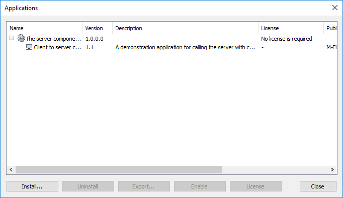

A server-side [Vault Application Framework]({{ site.baseurl }}/Frameworks/Vault-Application-Framework/) application may sometimes be accompanied with a client-site [User Interface Extensibility Framework]({{ site.baseurl }}/Frameworks/User-Interface-Extensibility-Framework/) application, where the two applications are designed to be used together and not independently.  From a usability perspective it is better for the users to have to install and maintain one vault application, rather than have to manage the installation of both.

## Approach

1. Create your Vault Application Framework application and note the `guid` that it is assigned within the `appdef.xml` file.
2. Update your User Interface Extensibility Framework application's `appdef.xml` file, ensuring that the [v3 schema]({{ site.baseurl }}/Frameworks/User-Interface-Extensibility-Framework/Application-Definition/) (or higher) is used, and add a [master application guid]({{ site.baseurl}}/Frameworks/User-Interface-Extensibility-Framework/Application-Definition/Master-Application-Guid/) containing the value found above.
3. Build the User Interface Extensibility Framework application, and produce a deployable `.zip` or `.mfappx` file.
4. Add the UIX application to the Vault Application Framework solution, ensuring that it is set to copy to the output directory.
	1. Right-click on the Vault Application Framework solution name and select `Add`, then `Existing Item...`.
	2. Navigate to the User Interface Extensibility Framework application, select it, and click `Add`.
	3. Right-click on the file that is now visible within the solution and select `Properties`.
	4. Ensure `Copy to Output Directory` is set to `Copy always`.
5. Open your Vault Application Framework class and override the `InitializeApplication` method.  Ensure that the name of the UIX application is altered to the name of your application.

```csharp
/// <summary>
/// Install the UIX application, as it will not be installed by default.
/// </summary>
/// <param name="vault">The vault to install the application into.</param>
protected override void InitializeApplication(Vault vault)
{
	try
	{
		string appPath = "UIX.mfappx";
		if (File.Exists(appPath))
		{
			vault.CustomApplicationManagementOperations.InstallCustomApplication(appPath);
		}
		else
		{
			SysUtils.ReportErrorToEventLog("File: " + appPath + " does not exist");
		}
	}
	catch (Exception ex)
	{
		if (!MFUtils.IsMFilesAlreadyExistsError(ex))
			SysUtils.ReportErrorToEventLog(ex.Message);
	}

	base.InitializeApplication(vault);
}
```

Once the Vault Application Framework application is installed to the vault, it will automatically find and install the User Interface Extensibility Framework application, and list it as a child application:



## Samples

This approach is shown within the [Client to Server Communication]({{ site.baseurl }}/Samples-And-Libraries/Samples/Processes/Client-To-Server-Communication/) sample.