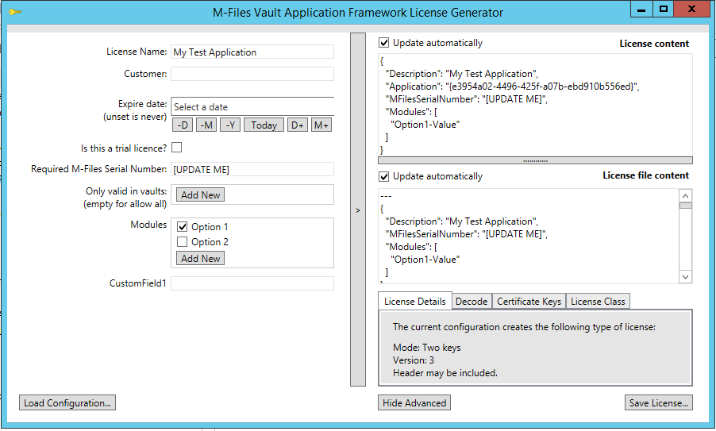
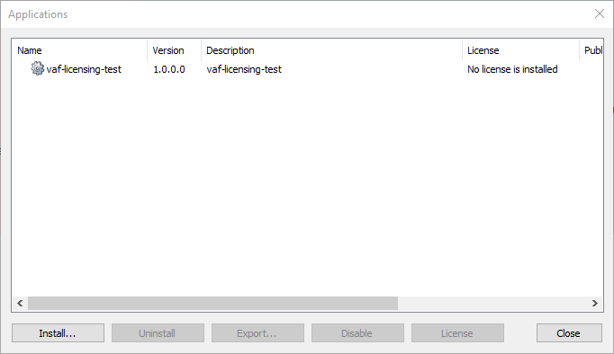

Whilst the Vault Application Framework licensing infrastructure allows a multitude of license types, this document deals solely with the recommended "two-key" approach.
{:.note}

## The M-Files License Generator Application

Generation of license key files (LIC) files is undertaken using the M-Files License Generator application.  This application can be found [within the M-Files Partner Portal](https://partners.cloudvault.m-files.com/Default.aspx?#CE7643CB-C9BB-4536-8187-707DB78EAF2A/object/F47735A7-F6BA-42B5-BDD8-19F332EDAAA7/latest). 
{:.note}

### Installation

To install the application, simply unzip `VAF Licence Generator application.zip` into a new folder. The unzipped folder contents will look like the following:


The important files that we will need are:

* `LicenseGeneratorGUI.exe`
This is the application that will be used to generate the license (`.lic`) files. The application runs from content within configuration (`.mflconf` and `.conf`) files.
* `sample.mflconf`
This file contains a JSON structure representing the application to license, and the options which should be configurable when creating the license. This is a sample file and can be customized as needed. You will need one `.mflconf` file for each Vault Application Framework application that you wish to create a license for.

* `sample.Keys.conf`
This file contains a blank set of licensing keys. When we first run the application, it will complain that the keys are invalid. We will regenerate the keys and overwrite this file.

### Using the Application

To start, run `LicenseGeneratorGUI.exe`. When the application runs, it will ask for an MFLCONF file to be opened. We will select the sample file and select `Open`.



Upon start, the application complains that the main secret key is missing. We will generate keys, but these keys must be stored safely to ensure that nobody else can create licenses for your software.
{:.note}

#### Configuring the Keys (One-Time)

In order to create license keys, we must first create two sets of keys: the main key and the secondary key. The main key is used for encryption of the license file, and the secondary key is used for signing. Each key consists of both a public and a private, secret key.

You may choose whether to use a single set of keys for all the individual applications you create, or you may choose to have individual keys for each application.


In order for our Vault Application Framework application to be able to authenticate and decrypt the license key, it needs access to the public key for the main key, and the private key for the secondary key. These items are shown above in <span style="color: green">green</span> and we will copy them into the Vault Application Framework application itself. **The items shown in <span style="color: red">red</span> must be kept private and available only to your organization.**
{:.note.warning}

To generate a set of keys:

1. Select the `Certificate Keys` tab at the bottom-right of the screen.
2. Click the `Generate` button next to Main key. You can optionally select the bit-length of the key using the slider.
3. Click the `Generate` button next to Secondary key. You can optionally select the bit-length of the key using the slider.
4. Select the `Key File` tab to the right of the buttons and click the `Export...` button next to `All keys`.
5. Select the empty `sample.Keys.conf` sample file to overwrite its contents with the keys.

Your `Keys.conf` file is required to generate new licenses so it must be kept safe and not shared with third parties.
{:.note.warning}

Once the keys have been saved to the configuration file, click the `Load Configuration...` button at the bottom left of the application and re-load the `sample.mflconf` file.

## Creating a Licensed Vault Application Framework Application

### Creating an Application from the Template

Create an application using the [Visual Studio template]({{ site.baseurl }}/Frameworks/Vault-Application-Framework/Visual-Studio-Template/) (compatible with Visual Studio 2017 and upwards), ensuring that you choose version 2.0 of the template (or later).

### Implementing License Loading and Validation

#### Instantiating the License Decoder

The license decoder should be instantiated and configured within the constructor of the VaultApplication class:

```csharp
public VaultApplication()
{
	try
	{
		// Set up the license decoder.
		var licenseDecoder =
			new LicenseDecoder(LicenseDecoder.EncMode.TwoKey);

		// This is from the key file (MainKey.PublicXml).
		licenseDecoder.MainKey = "";

		// This is from the key file (SecondKey.SecretXml)
		licenseDecoder.AltKey ="";
		this.License =
			 new LicenseManagerBase<LicenseContentBase>(licenseDecoder);

	}
	catch (Exception ex)
	{
		SysUtils.ReportErrorToEventLog(this.EventSourceIdentifier,
			ex.Message);
	}
}
```

Note that you must set `licenseDecoder.MainKey` and `licenseDecoder.AltKey` using the values from your `Keys.conf` file. The comments above note which values from the JSON structure should be used.

Do not include the raw `Keys.conf` file in your Visual Studio project, as this contains your private keys that must not be distributed.
{:.note.warning}

#### Validating the License Status

```csharp
/// <inheritdoc />
public override void StartOperations(Vault vaultPersistent)
{
	// Evaluate the license validity.
	this.License.Evaluate(vaultPersistent, false);
	// Output the license status.
	switch (this.License.LicenseStatus)
	{
		case MFApplicationLicenseStatus.MFApplicationLicenseStatusTrial:
		{
			SysUtils.ReportToEventLog(
				"Application is running in a trial mode.",
				EventLogEntryType.Warning);
			break;
		}
		case MFApplicationLicenseStatus.MFApplicationLicenseStatusValid:
		{
			SysUtils.ReportInfoToEventLog("Application is licensed.");
			break;
		}
		default:
		{
			SysUtils.ReportToEventLog(
				$"Application is in an unexpected state: {this.License.LicenseStatus}.",
				EventLogEntryType.Error);
			break;
		}
	}
	base.StartOperations(vaultPersistent);
}
```

Using the above code we can investigate the license validity status at the time when the Vault Application Framework starts.

Using this approach may require the vault be restarted for it to notice any updated licenses.
{:.note}

It is up to your application to decide what functionality should be disabled, and in what way, if the license is not valid.

## Creating and Installing a License File

### Modifying the sample `.mflconf` File

#### Updating the Vault Application Framework Application GUID

It is important that the application ID within the `.mflconf` file matches the GUID of the Vault Application Framework application which it is licensing. If it does not, then the license key will not be deemed as valid.

The GUID for the Vault Application Framework application can be found within the `appdef.xml` file, inside the &lt;guid&gt; element.

To update the application ID in the `.mflconf` file:

1. Open the `.mflconf` file in a text editor, such as Notepad.
2. Find the JSON element that defines the `application` member. The value of the `defaultValue` property must be updated to match the ID from the `appdef.xml` file. Note that the value in the `.mflconf` file has curly brackets ("{}") around the value.
3. Save your changes.

### Creating a License (`.lic`) File

To create a license file, you will need the updated `.mflconf` file from [Updating the Vault Application Framework GUID](#updating-the-vault-application-framework-application-guid).

1. Open the `LicenseGeneratorGUI.exe` application, and select the `.mflconf` file to be used.
2. Enter a customer name into the options on the left-hand side of the screen.
3. Click the `Save License...` button at the bottom-right of the screen.
4. Choose a file name for the license file (for instance, test `license.lic`).

## Installing the Application and License File

### Installing the Vault Application Framework application

The Vault Application Framework application can be installed using any of the standard methods (such as automatic installation upon build, or manually installing the `.zip` or `.mfappx` file using M-Files Admin).

Once installed, the application will be listed in the Applications dialog (right-click the vault in the M-Files Admin, and select Applications from the context menu), along with a note that no license is installed:



Selecting the application in the list and clicking the License button will show that a license is required, but that one is not installed:


Additionally, the Windows event log will show the entry that our code made, showing the current license status:


### Installing a Valid License File

In the Application License Management dialog, click `Install License...` and select the valid `.lic` file created [above](#creating-a-license-lic-file). The license management dialog is updated to reflect the valid license:


 
Depending upon the code implementation, the updated license may not be noticed by the code until the vault is restarted. In the sample code above, the license is only checked when the application is started (installed, or when the vault is brought online).
{:.note}

When the vault is restarted, our license check code is re-executed, and a note is added to the Windows event log stating that the license is valid:


## Extending the License Usage

### Other Built-In Fields

The `LicenseContentBase` base class, used when parsing the license content by the Vault Application Framework, contains a number of other built-in members which you can use; simply define the member in the `.mflconf` file to enable the functionality.

#### Informational

Property | Type | Shown in M-Files Admin | Automatically Enforced
--- | --- | --- | ---
Description	| `String` (required) | Yes
IsTrial	| `Boolean`	| Yes - If true, shows valid license as "trial license" 
LicensedTo | `String` | Yes	
LicenseVersion | `Integer`		
SerialNumber | `String` | Yes	

#### Limits

Property | Type | Shown in M-Files Admin | Automatically Enforced
--- | --- | --- | ---
Application | `String` | Yes | If set, requires that the receiving application's GUID matches.  Should be a GUID in brace-format.
MFilesSerialNumber | `String` | Yes | If set, requires that the current M-Files server license serial number matches.
Vaults | Array of strings | Yes | If set, requires that the vault GUID is one of the listed values.

#### Expiration

Property | Type | Shown in M-Files Admin | Automatically Enforced
--- | --- | --- | ---
MaintenanceExpireDate | `Date-string` - Must be formatted `d.M.yyy` | Yes | If set, requires that the provided application date is not later than set value.
LicenseExpireDate | `Date-string` - Must be formatted `d.M.yyy` | Yes | If set, requires that the current date is not later than the set value (plus optional GraceDays).
GraceDays | `Integer` | If set, used with `LicenseExpireDate`.

#### Other

Property | Type | Shown in M-Files Admin | Automatically Enforced
--- | --- | --- | ---
Modules | Array of strings
ServerVersions | Array of strings | | If set, requires that the current M-Files server version number matches any of the listed values.  Value can include 1-4 values and the missing ones are checked as wildcards: <br />"12" matches all 12.*.*.* versions.<br />Value "11.3" matches all 11.3.*.* versions.<br />Value "11.2.4320.99" matches only the version 11.2.4320.99

#### User limits

Property | Type | Shown in M-Files Admin | Automatically Enforced
--- | --- | --- | ---
NamedUsers | `Integer` | Yes | If set, requires that the number of named user license in the M-Files Server license is less than this value.
ConcurrentUsers | `Integer` | Yes | If set, requires that the number of concurrent user license in the M-Files Server license is less than this value.
ReadOnlyUsers | `Integer` | Yes | If set, requires that the number of read-only user license in the M-Files Server license is less than this value.
Groups | Array of objects: | | Group (`string` - the user group alias)<br/>Len (`integer`) | If set, requires that the number of members in each of the defined user groups is not greater than the defined length.

The application GUID, the M-Files Serial Number, the vault GUID, expiration days, server numbers, and user limitations are all checked as part of the base implementation; simply providing values for these in JSON enables the checks.
{:.note}

## Using Custom Fields

### Altering the Configuration File

Whilst the sample `.mflconf` file contains some basic values, the JSON structure within the `.mflconf` file can be altered to allow you to customize exactly what content is encoded within the licensing file.  To do this, you can add additional members to the `Editor.editors.LicenseConfiguration.members` object:

```json
{
"Editor": {
	"editors" : {
		"LicenseConfiguration" : {
			"members" : {
				"CustomField1" : {
					"type" : "string"
				}
			}
		}
	}
}
```

In the above sample (curtailed to only include the additional field), we have added a new field named `CustomField1` and have specified the type as a `string.  Different supported types are: 

* `string`
	* Any string value. Value put into JSON as string.
* `number`
	* Editor can filter input characters. Value put into JSON as number, integer or real.
* `bool`
	* Editor can use checkbox. Value put into JSON as bool, true or false.
* `date`
	* Editor can use date-picker. Value put into JSON as string. See also below the "format".
* `array`
	* Selectable array of strings. Values put into JSON as array of strings.
* `enumOptions`
	* Value is one of predefined string options.

Your custom fields can be named anything, and do not have to start with `CustomField`.
{:.note}

### Accessing the Custom Fields at Runtime

To access the custom fields, you should create your own class that derives from `LicenseContentBase`.  This class should define the additional fields and mark them with the `[DataMember]` attribute.  The Vault Application Framework will then automatically populate these fields when the license key is read:

```csharp
using System.Runtime.Serialization;
public class LicenseContent
	: LicenseContentBase
{
	[DataMember]
	public string CustomField1 { get; set; }
}
```

The custom field can then be parsed from by using `this.License.Content<LicenseContent>`, where `LicenseContent` is the name of our custom class created above.

```csharp
// Ensure the license is valid.
switch (this.License.LicenseStatus)
{

	case MFApplicationLicenseStatus.MFApplicationLicenseStatusValid:
	{
		SysUtils.ReportInfoToEventLog($"Application is licensed ({this.License.Content<LicenseContent>().CustomField1}).");
		break;
	}
	default:
	{
		SysUtils.ReportToEventLog(
			$"Application is in an unexpected state: {this.License.LicenseStatus}.",
			EventLogEntryType.Error);
		break;
	}
}
```

## Tips and Tricks

### License is incorrect. The file is either not a license or it is corrupt or falsified.

This error can be shown whilst installing a license if the keys do not match correctly. The full error text may say something like:

```text
Unexpected character encountered while parsing value: F. Path '', line 0, position 0.
```

In this case, ensure that the various keys are correctly set, and that the correct `Key.conf` file was used to generate the `.lic` file.

Vault Application Framework must be set with the public key of the main key, and the secret/private key of the secondary key.
{:.note}

### Altering the key file to use

The default `.mflconf` file contains an instruction to load/use keys from `sample.Keys.conf`.  This can be altered by changing the `KeyFile` element within the `.mflconf` file:

From
``` json
{
  // ...
  "KeyFile": "sample.Keys.conf",
  // ...
}
```

To
``` json
{
  // ...
  "KeyFile": "anotherfile.Keys.conf",
  // ...
}
```

## Notes on M-Files Cloud

Note that the M-Files Cloud infrastructure has some additional constraints on how licenses can and cannot be used.  These are detailed in the [dedicated page](../Cloud/).
{:.note.warning}
