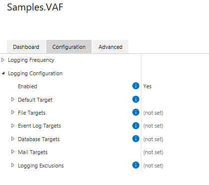

The logging framework is designed for diagnostics, not for auditing.  Information within the log files is controlled partially by the application developer and partially by the administrator configuring logging options, therefore the log files may not contain all available information.  Additionally: log files may be removed or made unavailable without warning for operational reasons.
{:.note.warning}

The creation of log files is an important step in diagnosing the behavior (or misbehavior) of any application.  M-Files has released a package - `MFiles.VaultApplications.Logging` - which can be used to easily implement logging within Vault Applications (VAF and IML) in both on-premises and cloud infrastructures.  When utilized within the M-Files Cloud infrastructure, logs created using this framework can be made available via the `M-Files Manage` web interface.

## What should be logged?

Care should be taken by application developers that logs do not contain personally-identifiable or other potentially sensitive information.  Application developers may use [log sensitivity filters](#log-sensitivity) to allow administrators to configure whether common content such as object titles should be included in logs.  M-Files Cloud customers that do not wish for any logs to be held within the M-Files Cloud infrastructure may choose to log to other cloud-based log targets such as [Application Insights](#application-insights).
{:.note.warning}

It is important to get into the habit of adding logging to your applications as you build them.  By doing this, and using the appropriate [log level](#log-levels), you will build applications whose logging is flexible and can be scaled up or down as needed to diagnose problems.

Care should be taken when implementing logging so that the information in the logs does not constitute a security or privacy risk.  When writing log statements consider using a syntax that supports [log sensitivity](#log-sensitivity), allowing vault administrators to decide whether information such as object titles should be included in the resulting logs or not.

## General structure

The `MFiles.VaultApplications.Logging` framework is available via a nuget package which can be referenced from your vault applications.  If using the [VAF Extensions library](#using-the-vaf-extensions-library) version `22.2.8-preview` or higher, this package will be included for you automatically.

Each class in your application should expose a [Logger](#loggers), which your application should use to log messages at a [appropriate levels](#log-levels).  At runtime the application can be configured to output some or all of these log messages to one or more enabled [Targets](#targets); depending upon the architecture and client requirements, these targets could be files on disk, the Windows Event Log, email, or some other suitable area.

The current implementation of the logging framework is based on NLog.  Users of NLog may recognize some terms being re-used here.
{:.note}

### Loggers

A logger (an instance of something that implements `ILogger`) is what application code uses to write information to the logs.  Each log entry consists of - at a minimum - the appropriate [log level](#log-levels) and the text to log.  Entries may also include details about any exception.

Each class should declare its own logger, as the type information will be used when writing to the logs.  Creating a logger can be done by using the `LogManager` class:

```csharp
using MFiles.VaultApplications.Logging;
public class MyClass
{
	private ILogger Logger { get; } = LogManager.GetLogger(typeof(MyClass));
}
```

Writing to the log can be done using `ILogger.Log(LogLevel, FormattableString)`, `ILogger.Log(Exception, LogLevel, FormattableString)`, or one of the shorthand methods available, e.g. `ILogger.Debug(FormattableString)`:

```csharp
using MFiles.VaultApplications.Logging;
public class MyClass
{
	private ILogger Logger { get; } = LogManager.GetLogger(typeof(MyClass));
	public void ExportDataToDisk()
	{
		try
		{
			// This logs at the "trace" level, which is the most verbose.
			this.Logger?.Log(LogLevel.Trace, "Export started.");
			
			// TODO: Implement export.

			// This also logs at the "trace" level.
			this.Logger?.Trace("Export completed.");
		}
		catch(Exception e)
		{
			// Log the exception, but allow the exception to bubble up.
			this.Logger?.Error(e, "Exception whilst exporting data");
			throw;
		}
	}
}
```

The methods exposed by `ILogger` take a `FormattableString` instance, but there are extension methods available in `MFiles.VaultApplications.Logging` that will accept simple strings, or strings and associated formatting arguments.
{:.note}

#### Log levels

The logging framework exposes 6 different logging levels: `Trace`, `Debug`, `Info`, `Warn`, `Error`, and `Fatal`.  Your application should log messages at the appropriate level (e.g. detailed messages at the `Trace` level, fewer messages at `Debug`, etc.), and the framework will deal with ensuring that only the correct data is logged according to the [Target configuration](#targets).

NLog provides some guidance on how to [use different log levels](https://github.com/nlog/nlog/wiki/Configuration-file#log-levels).
{:.}

### Targets

The logging framework supports a number of targets initially, with the potential for more to be supported in the future.  The supported targets are currently:

* The [default log target](#default-log-target),
* [File targets](#file-targets),
* [Event log targets](#event-log-targets),
* [Database targets](#database-targets),
* [Mail targets](#mail-targets)
* [Visual Studio Output Window](#visual-studio-output-window)

The targets are configured within M-Files Admin.  Each target typically supports the following common properties:

* `Enabled` - enables logging to this target
* `Minimum Log Level` - the minimum log level (inclusive) that is logged to this target
* `Maximum Log Level` - the maximum log level (inclusive) that is logged to this target
* `Advanced`
  * `Layout` - an instruction on how the log message (and other environmental information) should be formatted in the target.  In the current implementation these use the [NLog implementation](https://github.com/nlog/nlog/wiki/Configuration-file#layouts-and-layout-renderers), with some additional [custom layout renderers](#custom-layout-renderers)
  * `Log Sensitivity` - details on the [sensitivity level](#log-sensitivity) that should be applied to this target



Some targets can only be configured by system administrators.  Often these targets are incompatible with cloud infrastructures.  More details are available in each target's dedicated documentation below.
{:.note.warning}

#### Default log target

The default log target is supported within the [M-Files Cloud](../Cloud) infrastructure.
{:.note}

The default log target logs to a standardized location on disk.  The default log target supports the following properties:

* `Enabled` - changeable by vault administrators and system administrators
* `Minimum Log Level` - changeable by vault administrators and system administrators
* `Maximum Log Level` - changeable by vault administrators and system administrators
* `Log File Rotation` - how to rotate and archive files created by this target, changeable by system administrators
* `Advanced`
  * `Layout` - changeable by vault administrators and system administrators
  * `Keep File Open` - changeable by system administrators
  * `Allow Concurrent Writes` - changeable by system administrators
  * `Log Sensitivity` - changeable by vault administrators and system administrators

In on-premises implementations this is to to a `Logs` directory inside the Windows temporary folder, e.g. `C:\Windows\Logs\`.  Inside this folder it will create a folder with the GUID of the vault, within that a folder with the GUID of the application, within that a folder with the GUID of the server ID, and within that it will create text files according to the configured log rotation/archival settings (e.g. `C:\Windows\Temp\logs\2722f9ab-b96b-4db5-b1a1-8e0618d289b7\6502bb5f-a696-4faa-848a-3f7d5847e00b\f8063303-4501-44b1-8f92-8441959263b3\current.log`).

In M-Files Cloud implementations this is to a persistent storage location.  Note that files in this storage location may be removed by operational processes such as service breaks, or archived due to size or age.  For this reason logs should be considered as temporary and transient, not for long-term use.

The default log target additionally copies the `appdef.xml` file from the vault application into the log location.  This can be used to more easily identify the application that the logs are for.
{:.note}


#### File targets

Custom file target locations are **not** supported within the [M-Files Cloud](../Cloud) infrastructure.
{:.note.warning}

File targets log to custom locations on disk.  The file log target supports the following properties:

* `Name` - changeable by vault administrators and system administrators
* `Enabled` - changeable by vault administrators and system administrators
* `Minimum Log Level` - changeable by vault administrators and system administrators
* `Maximum Log Level` - changeable by vault administrators and system administrators
* `Folder Name` - changeable by vault administrators and system administrators
* `File Name` - changeable by vault administrators and system administrators
* `Log File Rotation` - how to rotate and archive files created by this target, changeable by vault administrators and system administrators
* `Advanced`
  * `Layout` - changeable by vault administrators and system administrators
  * `Keep File Open` - changeable by system administrators
  * `Allow Concurrent Writes` - changeable by system administrators
  * `Log Sensitivity` - changeable by vault administrators and system administrators


#### Event log targets

Event log targets are **not** supported within the [M-Files Cloud](../Cloud) infrastructure.
{:.note.warning}

Event log targets write to the Windows Event Log.  The Event Log target supports the following properties:

* `Name` - changeable by vault administrators and system administrators
* `Enabled` - changeable by vault administrators and system administrators
* `Minimum Log Level` - changeable by vault administrators and system administrators
* `Maximum Log Level` - changeable by vault administrators and system administrators
* `Machine Name` - changeable by vault administrators and system administrators
* `Source` - changeable by vault administrators and system administrators
* `Log` - changeable by vault administrators and system administrators
* `Event ID` - changeable by vault administrators and system administrators
* `Advanced`
  * `Layout` - changeable by vault administrators and system administrators
  * `Maximum Message Size` - changeable by system administrators
  * `Overflow Action` - changeable by system administrators
  * `Log Sensitivity` - changeable by vault administrators and system administrators


#### Database targets

Database targets are supported within the [M-Files Cloud](../Cloud) infrastructure.
{:.note.warning}

Database targets write log data into a target OLEDB database.  The database target supports the following properties:

* `Name` - changeable by vault administrators and system administrators
* `Enabled` - changeable by vault administrators and system administrators
* `Minimum Log Level` - changeable by vault administrators and system administrators
* `Maximum Log Level` - changeable by vault administrators and system administrators
* `Host Name` - changeable by vault administrators and system administrators
* `Database Name` - changeable by vault administrators and system administrators
* `Authentication Type` - changeable by vault administrators and system administrators
* `Command Text` - changeable by vault administrators and system administrators
* `Parameters` - changeable by vault administrators and system administrators
* `Advanced`
  * `Layout` - changeable by vault administrators and system administrators
  * `Log Sensitivity` - changeable by vault administrators and system administrators

 When using a database target, the `Command Text` property sets the SQL statement to use (e.g. `insert into dbo.Log (MachineName, Logged, Level, Message, Logger, Callsite, Exception) values ( @MachineName, @Logged, @Level, @Message, @Logger, @Callsite, @Exception )`).  Each parameter in the command text (e.g. `@MachineName`) is then created in the `Parameters` collection, and assigned data from the event itself.

 **THIS NEEDS MORE EXAMPLES**


#### Mail targets

Mail targets are supported within the [M-Files Cloud](../Cloud) infrastructure.
{:.note.warning}

Database targets write log data into a target OLEDB database.  The database target supports the following properties:

* `Name` - changeable by vault administrators and system administrators
* `Enabled` - changeable by vault administrators and system administrators
* `Minimum Log Level` - changeable by vault administrators and system administrators
* `Maximum Log Level` - changeable by vault administrators and system administrators
* `Subject` - changeable by vault administrators and system administrators
* `From` / `To` / `CC` / `BCC` - changeable by vault administrators and system administrators
* `SMTP Configuration`
  * `Server Address` - changeable by vault administrators and system administrators
  * `Use Encrypted Connection` - changeable by vault administrators and system administrators
  * `Port` - changeable by vault administrators and system administrators
  * `Authentication Mode` - changeable by vault administrators and system administrators
  * `Use Local Pickup Folder` - changeable by system administrators
* `Advanced`
  * `Layout` - changeable by vault administrators and system administrators
  * `Encoding` - changeable by vault administrators and system administrators
  * `Header` - changeable by vault administrators and system administrators
  * `Footer` - changeable by vault administrators and system administrators
  * `Add Newlines Between Messages` - changeable by vault administrators and system administrators
  * `Replace Newlines with HTML Breaks` - changeable by vault administrators and system administrators
  * `Log Sensitivity` - changeable by vault administrators and system administrators


#### Visual Studio Output Window

The framework supports the easy logging of information to the Visual Studio Debug window via the `LogManager.EnableLoggingToAttachedDebugger` and `LogManager.DisableLoggingToAttachedDebugger` methods.  This can be very useful when initially developing an application.

To start logging to this target, call the appropriate method during your application initialization, e.g.:

 ```csharp
public VaultApplication()
{
#if DEBUG
	// Enable logging to any attached debugger, but do not launch the debugger.
	LogManager.EnableLoggingToAttachedDebugger
	(
		new AttachedDebuggerLoggingSettings()
		{
			LaunchDebugger = false, // If true, will pop up the "Attach a debugger" dialog at this point.
			MinimumLogLevel = LogLevel.Debug,
			MaximumLogLevel = LogLevel.Fatal
		}
	);
#endif
}
 ```

 Once attached, log messages can be found in the Debug window in Visual Studio:


#### Future targets

 M-Files are currently considering adding support for additional targets, including:

##### Application Insights

 Application Insights is a feature of Azure Monitor that provides extensible application performance management (APM) and monitoring for applications

### Log sensitivity

Log sensitivity filters work by allowing developers to pass structured objects into the logging framework, and for the logging framework to decide how to render that content appropriately.  **Logging sensitivity filters do not attempt to parse log strings to remove information.**  It is imperative that application developers implement logging as described below for the logging sensitivity filters to correctly work.  It is strongly recommended that you test that your log messages are correctly being filtered before deploying any application.
{:.note}

Logs may, by their nature, contain information which may have privacy or commercial sensitivities; imagine situations where a log is being generated about a file that's being converted to PDF, and the log includes a file named `Upcoming Redundancies.docx`.  The logging framework supports this concept by allowing each log to be allocated a `Sensitivity Level`.  This sensitivity level describes how some information should be logged within the vault.

Each target can have its sensitivity set to one of three levels: `Minimum sensitivity` (default), `Maximum sensitivity`, or `Custom`.  If `Custom` is selected then the user can choose which flags should be passed to the sensitivity filter:


When a log message is written to disk, it is passed through a `sensitivity filter`.  This filter will look at the arguments being rendered into the string, along with the target sensitivity level, and choose how the value should be rendered.  Consider this code:

```csharp
// Use the $"" syntax to create a FormattableString.
// Note that we are passing the ObjVerEx instance, not the title!
this.Logger?.Trace($"Starting conversion of {env.ObjVerEx} to PDF...");
```

The resulting log message would depend on the sensitity level:
`Starting conversion of 'hello world.docx (0-123-1)'` (if the sensitivity level allows document titles to be shown)
`Starting conversion of (0-123-1)` (if the sensitivity level does not allow document titles to be shown)

#### Supported logging syntaxes for log sensitivity

The following syntaxes are supported for log sensitivity:

```csharp
// Using the FormattableString approach.
this.Logger?.Trace($"My message {myObjectVersion}");
```

```csharp
// Using the string-with-arguments approach.
// Note: you must have the following using statement for this to work!
// using MFiles.VaultApplications.Logging;
this.Logger?.Trace("My message {0}", myObjectVersion);
```

#### Unsupported logging syntaxes

These logging syntaxes produce simple strings and will not be filtered.  It is advised that you avoid these syntaxes.
{:.note.warning}

```csharp
// Contatenating strings.
this.Logger?.Trace("My message " + myObjectVersion.Title); // DO NOT DO THIS!

// Explicitly using string.format
this.Logger?.Trace(string.format("My message {0}", myObjectVersion)); // DO NOT DO THIS!
this.Logger?.Trace(string.format("My message {0}", myObjectVersion.Title)); // DO NOT DO THIS!

// Using a formattable string, but passing the title directly
this.Logger?.Trace($"My message {myObjectVersion.Title}"); // DO NOT DO THIS!
```

#### Custom log sensitivity filters

The logging library contains built-in sensitivity filters for `ObjectVersion`, `ObjectVersionAndProperties`, and `PropertyValue`.  The VAF Extensions library contains a built-in sensitivity filter for `ObjVerEx`.

To create a custom log sensitivity filter:

1. Create a class that inherits from  `MFiles.VaultApplications.Logging.Sensitivity.LogSensitivityFilterBase<TType>` (where `TType` is the type that your filter handles).
2. The system can only cope with a single filter being registered for any given type.  If you are looking to override a built-in sensitivity filter (e.g. to add your own for `ObjectVersion`), then:
	1. Add the [DoNotAutomaticallyRegister] attribute to your class to stop the system automatically finding and registering it.
	2. After the log manager is initialized, call `LogSensitivityFilterFactory.Default.Register`, passing an instance of the log sensitivity filter and ensuring that `overwriteExistingRegistrations` is true.

### Logging exclusions

Logging exclusions can be useful if you wish to log more verbose messages, but wish to exclude certain loggers from the logs (as they are too noisy).  Multiple exclusions can be added by providing the logger name (e.g. `MyVaultApplication.VaultApplication`) and the minimum log level (e.g. `Warn`); this would stop any log entries under (and including) warnings from being logged by the logger named `MyVaultApplication.VaultApplication`.

The logger name can include a star ("*") as a wildcard character to match multiple loggers.  e.g. `MFiles.VaultApplications.Logger.*` would match all log entries caused by the library itself.
{:.note}

### Custom layout renderers

The logging library supports several custom layout renderers in addition to the [standard NLog layout renderers](https://nlog-project.org/config/?tab=layout-renderers).  These layout renderers can be included in any layout string and will be substituted with the appropriate value:

* `${application-guid}` - renders the current application GUID, if available, [in "D" format](https://docs.microsoft.com/en-us/dotnet/api/system.guid.tostring).
* `${application-name}` - renders the current application name, if available.
* `${application-version}` - renders the current application version, if available.
* `${server-guid}` - renders the current server GUID [in "D" format](https://docs.microsoft.com/en-us/dotnet/api/system.guid.tostring).
* `${vault-guid}` - renders the current vault GUID [in "D" format](https://docs.microsoft.com/en-us/dotnet/api/system.guid.tostring).

## Vault Application Framework applications

It is strongly recommended that applications utilize the [VAF Extensions library](#using-the-vaf-extensions-library) when implemented logging, as this library deals with initializing the logging framework, ensuring that configuration is validated and applied, and rendering the logging configuration to the application's dashboard.
{:.note}

### Using the VAF Extensions library

There are three steps to using the logging framework with the VAF Extensions library:

1. Ensure that you are referencing at least version `22.2.8-preview` with nuget.  Update your reference if you are targeting an earlier version.
2. Ensure that you are using the `MFiles.VAF.Extensions.ConfigurableVaultApplicationBase<TConfiguration>` base class.
3. Alter your configuration to inherit from `MFiles.VAF.Extensions.Configuration.ConfigurationBase` (or alternative; see below), to expose the logging configuration.

Once done, you can then use the logger from within your code:

```csharp
using MFiles.VAF.Extensions.Dashboards;
using MFiles.VaultApplications.Logging;
namespace extensionstest2
{
	public class VaultApplication
		: MFiles.VAF.Extensions.ConfigurableVaultApplicationBase<Configuration>
	{

		[TaskQueue]
		public const string QueueId = "test.VaultApplication.myQueueId";
		public const string TaskTypeA = "taskTypeA";

		[TaskProcessor(QueueId, TaskTypeA, TransactionMode = TransactionMode.Full)]
		[ShowOnDashboard("Import data", ShowRunCommand = true)]
		public void ProcessBackgroundTask(ITaskProcessingJob<TaskDirective> job)
		{
			this.Logger.Info("hello world");
		}

	}
}
```

Remember to enable logging in your application's configuration in M-Files Admin, otherwise no logs will be generated!
{:.note}

#### Exposing logging configuration

The easiest way to expose the logging configuration is to ensure that your top-level configuration class inherits from the class in the VAF Extensions library.  If you have done this then the logging configuration should be visible, and logging should function if enabled:

```csharp
[DataContract]
public class Configuration
		: MFiles.VAF.Extensions.Configuration.ConfigurationBase
{
}
```

In some situations you may not want to expose the logging configuration in this way, or may wish to control how the logging configuration is displayed.  You can optionally choose to instead implement `MFiles.VAF.Extensions.Configuration.IConfigurationWithLoggingConfiguration` yourself in your top-level configuration class:

```csharp
public class MyConfiguration
	: MFiles.VAF.Extensions.Configuration.IConfigurationWithLoggingConfiguration
{
	[DataMember]
	public NLogLoggingConfiguration MyLoggingConfiguration { get; set; } = new NLogLoggingConfiguration();

	/// <inheritdoc />
	public ILoggingConfiguration GetLoggingConfiguration()
		=> this.MyLoggingConfiguration;
}
```

Note that the logging configuration itself could be held anywhere in your configuration, provided that the top-level class implements the above interface, and the `GetLoggingConfiguration` returns the configured value.
{:.note}

### Implementing the functionality yourself

If you cannot use the VAF Extensions, then using the logging framework from a plain Vault Application is also possible.  The example below uses the VAF 2.3 and older versions of the framework may need some additional changes:

```csharp
using MFiles.VAF.AppTasks;
using MFiles.VAF.Configuration;
using MFiles.VAF.Extensions;
using MFiles.VAF.Extensions.Dashboards;
using MFiles.VaultApplications.Logging;
using MFiles.VaultApplications.Logging.Resources;
using MFilesAPI;
using System.Collections.Generic;

namespace Samples.VAF
{
	public class VaultApplication
		: ConfigurableVaultApplicationBase<Configuration>
	{

		/// <summary>
		/// Registers a task queue with ID "LoggingTaskQueue".
		/// </summary>
		// Note: this queue ID must be unique to this application!
		[TaskQueue]
		public const string TaskQueueID = "LoggingTaskQueue";
		public const string TaskType = "LoggingTestType";

		/// <summary>
		/// Processes items of type <see cref="TaskType" /> on queue <see cref="TaskQueueID" />
		/// </summary>
		[TaskProcessor(TaskQueueID, TaskType, TransactionMode = TransactionMode.Unsafe)]
		[ShowOnDashboard("Log something", ShowRunCommand = true)]
		public void MyTaskProcessor(ITaskProcessingJob<TaskDirective> job)
		{
			this.Logger.Info($"Hello, world");
		}

		#region Boilerplate required

		public ILogger Logger { get; private set; }

		protected override void StartApplication()
		{
			base.StartApplication();

#if DEBUG
			// Enable logging to any attached debugger, but do not launch the debugger.
			LogManager.EnableLoggingToAttachedDebugger(launchDebugger: false);
#endif

			LogManager.Initialize(this.PermanentVault, this.Configuration?.GetLoggingConfiguration());
			this.Logger = LogManager.GetLogger(this.GetType());
			this.Logger?.Info("Logging started");

		}

		protected override void UninitializeApplication(Vault vault)
		{
			this.Logger?.Info("Logging stopping");
			LogManager.Shutdown();
			base.UninitializeApplication(vault);
		}

		protected override void OnConfigurationUpdated(Configuration oldConfiguration, bool updateExternals)
		{
			this.Logger?.Info("Logging configuration updating");
			base.OnConfigurationUpdated(oldConfiguration, updateExternals);
			LogManager.UpdateConfiguration(this.Configuration?.GetLoggingConfiguration());
			this.Logger?.Info("Logging configuration updated");
		}

		/// <inheritdoc />
		// Sets up the combined resource manager so that the strings from the logging
		// exceptions and configuration work.
		protected override SecureConfigurationManager<Configuration> GetConfigurationManager()
		{
			var configurationManager = base.GetConfigurationManager();

			// Set the resource manager for the configuration manager.
			var combinedResourceManager = new CombinedResourceManager(true, configurationManager.ResourceManager);

			// Set the resource manager for the configuration.
			configurationManager.ResourceManager = combinedResourceManager;
			return configurationManager;
		}

		protected override IEnumerable<ValidationFinding> CustomValidation(Vault vault, Configuration config)
		{
			foreach(var finding in base.CustomValidation(vault, config) ?? new ValidationFinding[0])
				yield return finding;
			foreach(var finding in config?.GetLoggingConfiguration()?.GetValidationFindings() ?? new ValidationFinding[0])
				yield return finding;
		}

		#endregion


	}
}
```
