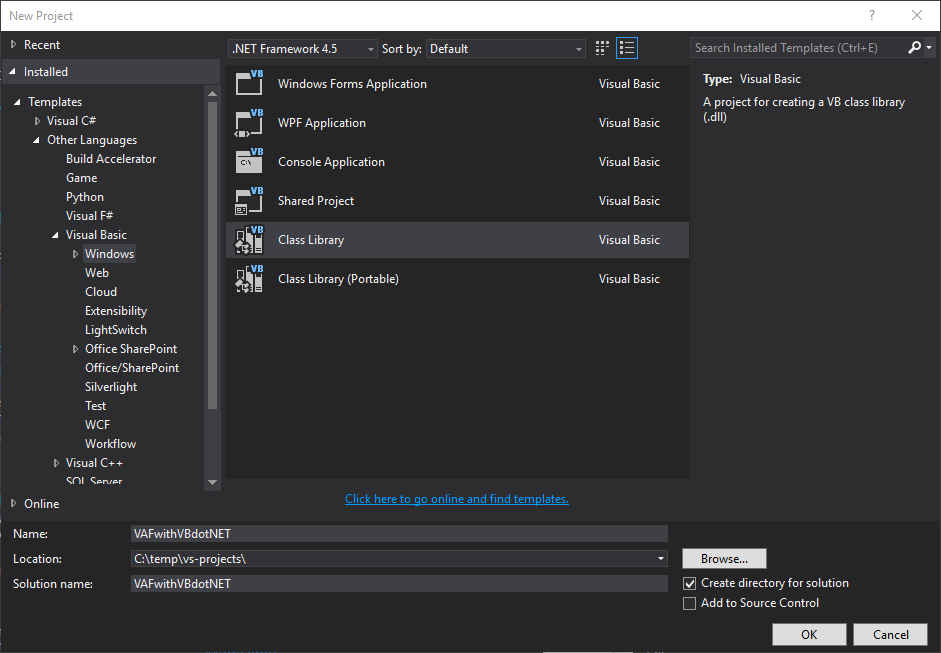
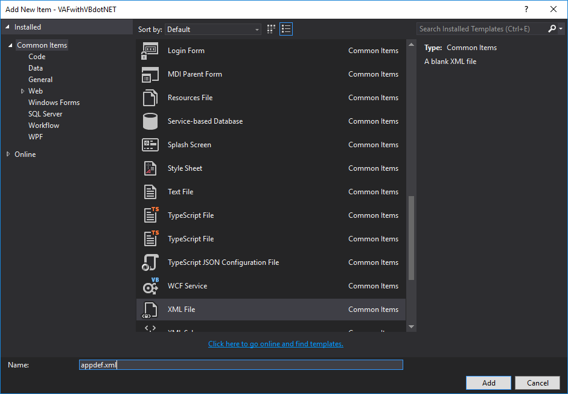
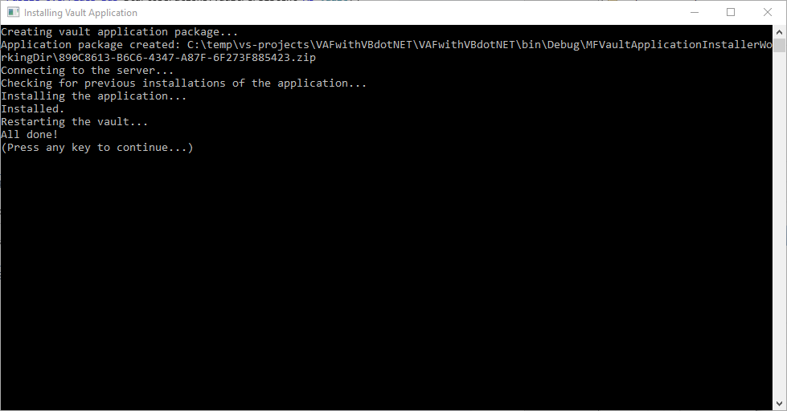
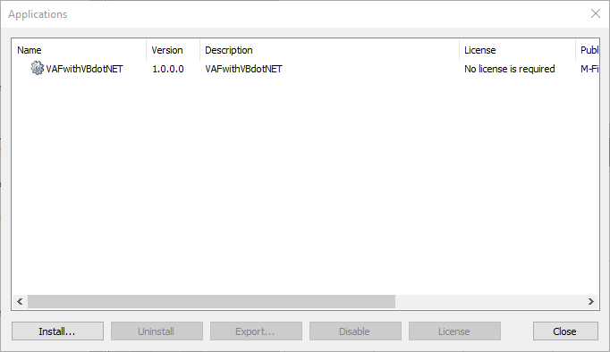
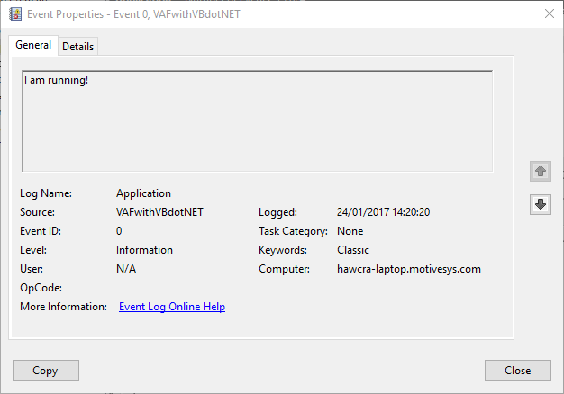

Whilst the Vault Application Framework has C# templates, it can also be used with Visual Basic .NET.  Doing so requires takes some manual steps to get working.  This guide details those steps and provides the developer with the ability to get a Vault Application Framework sample application up-and-running using VB.NET.

## Why does Visual Basic.NET not work natively?

The Vault Application Framework does not require C#, but the [Visual Studio Template](m-files://show/CE7643CB-C9BB-4536-8187-707DB78EAF2A/0-1262/3005?object=EA9E06AA-2F7C-4D23-919A-9C93FD5145F6&file=5425A00C-BE53-4F48-A9E6-675C9242AABC) provided for use with the Vault Application Framework creates a C# project.  To create a Vault Application Framework application using VB.NET, you must create the application infrastructure yourself.

## Getting started with Visual Basic.NET

### Creating the project

To create a Vault Application Framework application, we first need to start with a .NET 4.5 class library.  Create one as normal by going to `File > New Project`.  Within the left-hand area, navigate to the `Visual Basic` section, choose `Windows`, and then choose a `Class Library` as the project template.



### Tidying up the default files

By default, Visual Studio will create some sample files.  We will remove these files before we start.

* Remove the `Settings.settings` file from the project:
  * Click the `Show all files` icon in the Solution Explorer.
  * Expand `My Project`.
  * Select `Settings.settings` and press the `Del` key (or use the right-click context menu).
  * Click the `Show all files` icon in the Solution Explorer to return to the default layout.
* Remove the `Class1.vb file`, as we will create our own later.
  * Select `Class1.vb` and press the `Del` key (or use the right-click context menu).
* Save the project.

<p class="note">If you do not remove the Settings.settings file then your application will not work.</p>

### Adding references and VAF-specific files

#### References

In order to use the Vault Application Framework, we need to first set up some references to libraries that we will use:

* Add a reference to the M-Files API.
  * Right-click on your project within the `Studio Explorer`, select `Add > Reference`.
  * Choose `COM` from the left-hand menu, scroll the right-hand window down to the M-Files API, and click the checkbox next to it.  Note that the name will differ depending upon the version of M-Files that you have running (e.g. `M-Files API 2015.3`).
  * Click `OK` to close the `Add Reference` window.
  * Expand `References` within the project in Solution Explorer (if not already expanded).
  * Right-click on the `MFilesAPI` reference and select Properties.  Ensure `Embed Interop Types` is set to `False`.
* Add a reference to the `M-Files VAF NuGet` package.
  * Right-click on your project within the `Solution Explorer` and select Manage NuGet Packages.
  * Within the new NuGet window, click the `Browse` heading on the left.
  * Enter `M-Files.VAF` into the search box and press enter to search.
  * Select the `MFiles.VAF` package and click `Install` on the right.
  * Follow the prompts to install the package and its prerequisites from NuGet.

<p class="note">The Vault Application Framework requires a specific version of JSON.NET.  If you update it then the application will fail to run.</p>

#### The appdef.xml file

The application definition file is used to define details about your Vault Application Framework application such as the publisher and version, and also to define its Global Unique IDentifier (GUID).  At a minimum you should update:

* The application ID (`<guid>`). This must be a unique ID for the application.  You can create a GUID using a tool such as [https://guidgenerator.com/](https://guidgenerator.com/).  Note that the GUID should be formatted without braces.
* The application name (`<name>`). A human-readable name for the application displayed within the M-Files Admin once installed.
* The application description (`<description>`). A short description of the application.
* Publisher (`<publisher>`). The name of the publisher of the application - typically your company name.
* Copyright (`<copyright>`). Any copyright notices for the application.
* Extension object details (`<extension-object>`). These define the entry point for your application, which we will build in the next step.  You must fill in:
  * The name of the extension object (`<name>`).
  * The assembly (`<assembly>`) that contains your application. This is typically the name of your project output, e.g. `VAFwithVBdotNET.dll`.
  * The class that inherits from VaultApplicationBase (`<class>`). This is the full class name (including namespace) of the class that inherits from VaultApplicationBase, e.g. `VAFwithVBdotNET.VaultApplication`.

To create an `appdef.xml` file:

* Right-click on your project within the `Solution Explorer`,
* Select `Add > New Item`
* Choose `XML File` in the list, and ensure the file's name is `appdef.xml`:



* Right-click on the `appdef.xml` file and select `Properties`.  Ensure that `Copy to Output Directory` is set to `Copy if newer`.
* Enter the following text within the `appdef.xml file`, altering the elements listed above:

```xml
<?xml version="1.0" encoding="utf-8" ?>
<application
			type="server-application"
			xmlns:xsi="http://www.w3.org/2001/XMLSchema-instance"
			xsi:noNamespaceSchemaLocation="http://www.m-files.com/schemas/appdef-server-v1.xsd">
  <guid>890C8613-B6C6-4347-A87F-6F273F885423</guid>
  <name>VAFwithVBdotNET</name>
  <description>VAFwithVBdotNET</description>
  <publisher>M-Files</publisher>
  <version>1.0.0.0</version>
  <copyright></copyright>
  <extension-objects>
    <extension-object>
      <name>VAFwithVBdotNET</name>
      <assembly>VAFwithVBdotNET.dll</assembly>
      <class>VAFwithVBdotNET.VaultApplication</class>
      <installation-method>Install</installation-method>
      <uninstallation-method>Uninstall</uninstallation-method>
      <initialization-method>Initialize</initialization-method>
      <uninitialization-method>Uninitialize</uninitialization-method>
      <start-operations-method>StartOperations</start-operations-method>
    </extension-object>
  </extension-objects>
</application>
```

### Enabling automatic deployment (optional)

Whilst this step is optional, if you choose not to use automatic deployment then you will need to manually create a "zip" file containing the solution output, and install using the M-Files Admin software.  The Vault Application Installer task does this for you, and automatically installs it to a local M-Files server for development/testing.

Automatic deployment is done using the `MFVaultApplicationInstaller.exe` file, along with a build task.  The executable file packages up the various resources from the build folder into a zip file, then connects to a local M-Files server and installs (or updates) the package into a specified vault.

<p class="note">The MFVaultApplicationInstaller.exe is available from the <a href="m-files://show/CE7643CB-C9BB-4536-8187-707DB78EAF2A/0-1694/3768?object=822E5005-5020-433F-A9DD-BC6E0815513D&file=7269C7BD-1564-440E-A6CA-58FC84F1DE96">M-Files Partner Portal</a>.  If you cannot find this file then please contact <a href="mailto:devsupport@m-files.com">devsupport@m-files.com</a>.</p>

To set up the automatic deployment:

* Copy the `MFVaultApplicationInstaller.exe` file to the project.
* Right-click on the `MFVaultApplicationInstaller.exe` file and select `Properties`.  Ensure that `Copy to Output Directory` is set to `Copy if newer`.
* Set up the post-build task:
  * Right-click on your project within the `Solution Explorer` and select `Properties`.
  * Select `Compile` on the left.
  * Click the `Build Events...` button.
  * Within the `Post Build Events`, enter the following text:

`start "Installing Vault Application" /D "$(TargetDir)" "MFVaultApplicationInstaller.exe" "Sample Vault"`

<p class="note">"Sample Vault" should be replaced with the name of the vault you wish to test the application in.</p>

### Creating your first Vault Application Framework application

<p class="note">We will create a class named VaultApplication.  Please note that the class and assembly details must match those entered into the appdef.xml file.</p>

#### Creating the Vault Application class

To create a simple Vault Application we need to add a new class to the project and configure some functionality.  For the sake of this article we will create a basic vault application which starts a recurring background operation every 30 seconds:

* Right-click on your project in the `Solution Explorer` and select `Add > New Item`.
* Select a Class, and change the name to `VaultApplication.vb`.
* Copy in the sample code below:

```vbnet
Imports MFiles.VAF
Imports MFiles.VAF.Common
Imports MFilesAPI

Public Class VaultApplication
    Inherits VaultApplicationBase

    Public Overrides Sub StartOperations(vaultPersistent As Vault)

        ' Register the background operation to run every 30 seconds.
        Me.BackgroundOperations.StartRecurringBackgroundOperation("Test", TimeSpan.FromSeconds(30), AddressOf ExecuteBackgroundOperation)

    End Sub

    Private Sub ExecuteBackgroundOperation(obj As BackgroundOperation)
        
        SysUtils.ReportInfoToEventLog("I am running!")

    End Sub
End Class

```

### Deploying

To deploy the application, simply build the solution using the menu or keyboard shortcuts (`Ctrl-Shift-B`).  The post-build event should run and you will be presented with a console screen detailing the installation process.



Once the application is installed, it can be found by using the `M-Files Admin` software: connect to the server, then right-click on the vault and select `Applications`.  Your application should be listed. 



We can confirm that our application is running by loading the Windows Event Log and checking for an event every 30 seconds from our test application.



## Common pitfalls

### Settings.settings

If the `Settings.settings` file exists in the project then this will cause installation errors.  The file must be removed prior to building.

### Embed Interop Types on M-Files API

If `Embed Interop Types` is set to `True` on the M-Files API, then passing complex types from the Vault Application Framework to the VBScript proxies may fail with an exception complaining that properties or methods don't exist on the object.  `Embed Interop Types` must be set to `False` for the API reference.