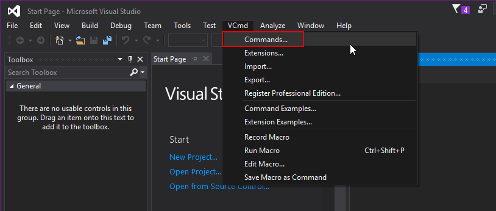
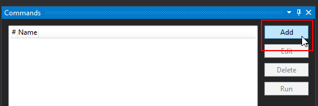
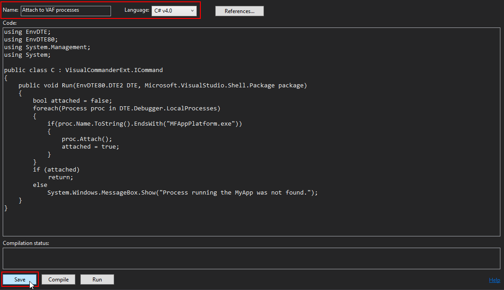
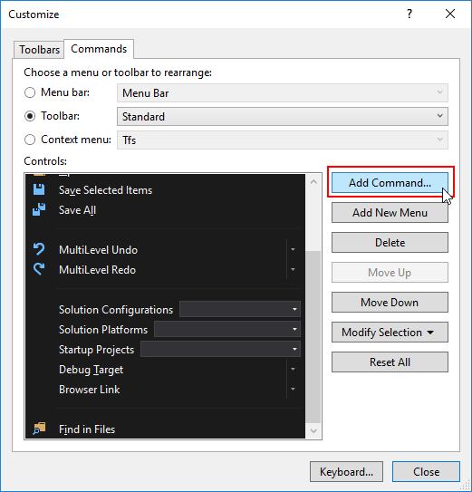
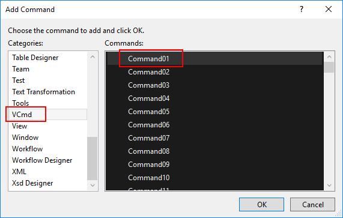
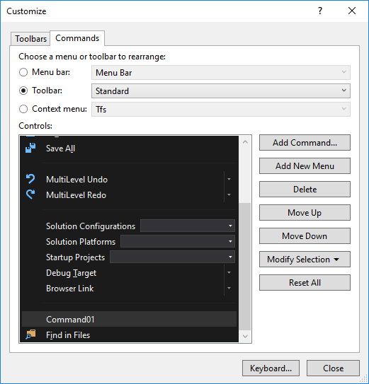
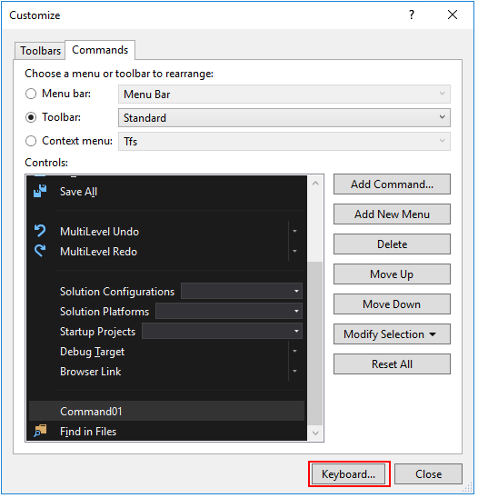
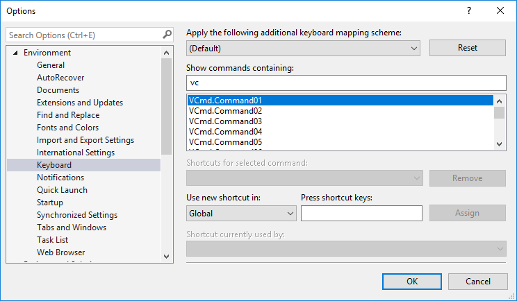
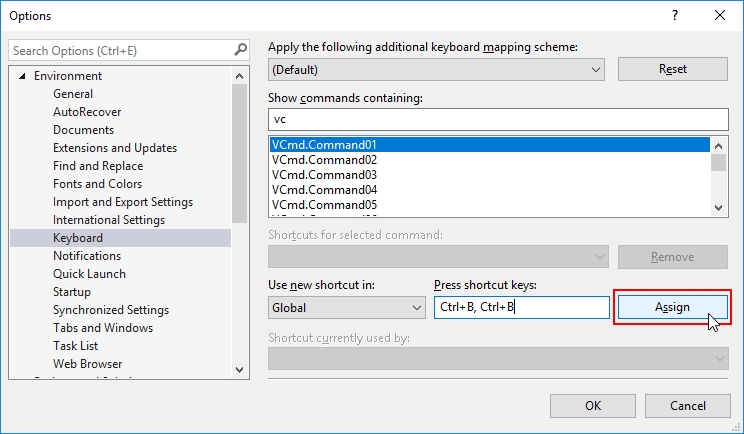

[Manually attaching to processes]({{ site.baseurl }}/Frameworks/Vault-Application-Framework/Development-Practices/Debugging/) whilst debugging Vault Application Framework applications can become tedious.  Instead, [Visual Commander](https://vlasovstudio.com/visual-commander/) - a free extension for Visual Studio 2015 and 2017 - can be used to create a button which will perform the process instead.


The details below were tested using Visual Studio 2017 and Visual Commander 2.8.1.
{:.note}

## Installing Visual Commander

Visual Commander can also be downloaded as a VSIX from their [website](https://vlasovstudio.com/visual-commander/).
{:.note.warning}

Visual Commander can be installed by opening Visual Studio, selecting the `Tools` menu, then `Extensions and Updates`, selecting `Online` on the left, and entering `Visual Commander` into the search box.


Installing the extension will require Visual Studio to be restarted.
{:.note}

## The "Attach to VAF Processes" Command

## Creating the command

Once Visual Commander is installed, a command can be created to automate the process of attaching to the `MFAppPlatform.exe` processes:

* Select the `VCmd` menu, then `Commands...`:



* Add a new command:



* Ensure that the `Language` is set to `C#`, and provide a name.  This name will be displayed on the button:



Remove the existing command code and replace it with the following:

```csharp
using EnvDTE;
using EnvDTE80;
using System.Management;
using System;

public class C : VisualCommanderExt.ICommand
{
    public void Run(EnvDTE80.DTE2 DTE, Microsoft.VisualStudio.Shell.Package package) 
    {
        bool attached = false;
        foreach(Process proc in DTE.Debugger.LocalProcesses)
        {
            if(proc.Name.ToString().EndsWith("MFAppPlatform.exe"))
            {
                proc.Attach();
                attached = true;
            }
        }
        if (attached)
            return;
        else
            System.Windows.MessageBox.Show("There are no MFAppPlatform.exe processes to attach to.");
    }
}

```

Note the number of the command (shown in the `#` column).  This will be used to reference the command.
{:.note.warning}


## Adding the command to the menu

* Right-click on the toolbar in Visual Studio and select `Customize`:


* Select the `Commands` tab, ensure that `Toolbar` is set to `Standard`, and select `Add Command`:



* Select `VCmd` as the category and select the command from the list on the right.  If the command had number `1` then the selected command should be `Command01`:



* Use the `Move Up` and `Move Down` buttons to move the command to the position within the toolbar that you want:



## Assigning a keyboard shortcut

To assign a keyboard shortcut to the command, the click `Keyboard...` when customizing the toolbar:



* In the `Show commands containing` text box, enter `vc` and select the command:



* Select the `Press shortcut keys` text box and press the keys to add as a shortcut.

* Assign the shortcut key by pressing `Assign`.  In the screenshot below, the `Ctrl` key must be held down and `B` pressed twice.


