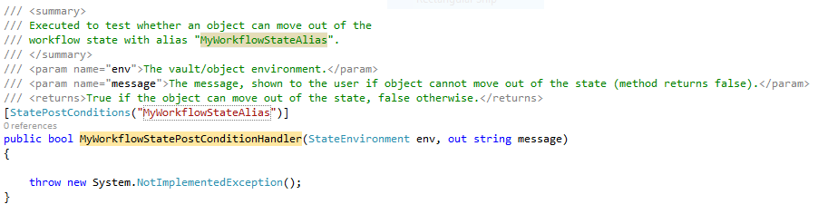
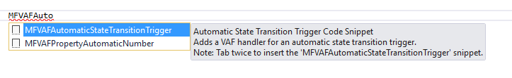
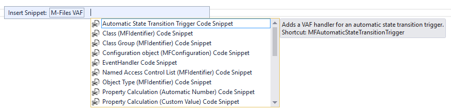

[Visual Studio Code Snippets](https://msdn.microsoft.com/en-us/library/ms165392.aspx) are small blocks of reusable code that can be inserted into a code file using a context menu or set of key-presses.  Code Snippets can be used to quickly create commonly-used code structures such as methods or properties, reducing the amount of code that developers must type to do so.

Code Snippets consist of a block of standardised text, and small editable sections.  When a snippet is first entered, the editable sections are highlighted and the user can overtype the values to customise the code snippet.  The developer can move between the editable elements of the snippet by pressing `Tab`, and press `Enter` or `Esc` to finish editing.

## Executing Code Snippets

### Using the keyboard

To execute a Code Snippet, the developer types the name of the code snippet (e.g. `prop`) and presses `Tab` twice.  Visual Studio then executes the snippet and places it at the current location.

Resharper can alter the standard keyboard shortcuts.  If you are using Resharper then You must press `Ctrl-J`, then type the code snippet name.  The other keyboard shortcuts still work.
{:.note.warning}

### Using the mouse

To execute the code snippet, the developer right-clicks at the appropriate place in the code file and selects `Insert Code Snippet...`.  The available code snippets are listed in a folder-style structure.  The developer can double-click on the required Code Snippet and fill out the editable elements of the snippet by pressing `Tab`.

## Code Snippets and the Vault Application Framework

When developing applications using the Vault Application Framework it is common to create methods that are executed in response to various events within the vault, such as an object reaching a state in a workflow, or a property value requiring validation.  [Attributes]({{ site.baseurl }}/Frameworks/Vault-Application-Framework/Attributes/) are used to ensure that the Vault Application Framework knows which methods need to be executed at what time.  These attributes often require the following method to have a specific [signature](https://en.wikipedia.org/wiki/Type_signature#Method_signature) in order to function; if the method does not match the expected signature then it will not be invoked.

The <a href="{{ site.baseurl }}/Frameworks/Vault-Application-Framework/Attributes/">Vault Application Framework Attributes page</a> details the attributes and their expected method signature, if appropriate.
{:.note}

Code Snippets can be used to automatically generate class members (methods and properties) with the correct structure and signatures, reducing development time.

### Contributing to the Code Snippets

To contribute additional code snippets or to fix issues with existing code snippets, please visit the [GitHub Samples and Libraries repository](https://github.com/M-Files/MFilesSamplesAndLibraries), fork the repository, make the required changes, then submit a [pull request](https://help.github.com/articles/about-pull-requests/).  GitHub has [further information on forking and pull requests](https://help.github.com/articles/creating-a-pull-request-from-a-fork/).

### Available Code Snippets

Code Snippets are available to download from our <a href="https://github.com/M-Files/MFilesSamplesAndLibraries/tree/master/Visual%20Studio%20Snippets/Vault%20Application%20Framework/Snippets/CSharp/MFilesVAF">GitHub Samples and Libraries repository</a>.  Information on how to <a href="#installing-the-vault-application-framework-code-snippets">install the code snippets</a> is in the following section.
{:.note}

The following code snippets exist.  Once the snippets are installed, simply type their name within a code file, select the snippet, and press `Tab` twice.

#### Properties

* `MFVAFPropertyAutomaticNumber` creates a code snippet for [PropertyAutomaticNumberingAttribute]({{ site.baseurl }}/Frameworks/Vault-Application-Framework/Attributes/Properties/#property-calculation).
* `MFVAFPropertyCustomValue` creates a code snippet for [PropertyCustomValueAttribute]({{ site.baseurl }}/Frameworks/Vault-Application-Framework/Attributes/Properties/#property-calculation).
* `MFVAFPropertyValidation` creates a code snippet for [PropertyValueValidationAttribute]({{ site.baseurl }}/Frameworks/Vault-Application-Framework/Attributes/Properties/#property-validation).

#### Vault Extension Methods

* `MFVAFVaultExtensionMethod` creates a code snippet for [VaultExtensionMethodAttribute]({{ site.baseurl }}/Frameworks/Vault-Application-Framework/Attributes/Vault-Extension-Methods/).

#### Workflows

* `MFVAFStateAction` creates a code snippet for [StateActionAttribute]({{ site.baseurl }}/Frameworks/Vault-Application-Framework/Attributes/Workflows/#workflow-state-actions).
* `MFVAFStatePreCondition` creates a code snippet for [StatePreConditionsAttribute]({{ site.baseurl }}/Frameworks/Vault-Application-Framework/Attributes/Workflows/#state-pre-conditions).
* `MFVAFStatePostCondition` creates a code snippet for [StatePostConditionsAttribute]({{ site.baseurl }}/Frameworks/Vault-Application-Framework/Attributes/Workflows/#state-post-conditions).
* `MFVAFAutomaticStateTransitionTrigger` creates a code snippet for [AutomaticStateTransitionTriggerAttribute]({{ site.baseurl }}/Frameworks/Vault-Application-Framework/Attributes/Workflows/#automatic-state-transitions).

#### Event Handlers

* `MFVAFEventHandler` creates a code snippet for [EventHandlerAttribute]({{ site.baseurl }}/Frameworks/Vault-Application-Framework/Attributes/Event-Handlers/).

#### Vault Structural Elements (MFIdentifiers)

* `MFVAFClassGroupIdentifier` creates a code snippet for a [MFIdentifier]({{ site.baseurl }}/Frameworks/Vault-Application-Framework/Attributes/Configuration/#mfidentifier) with a `MFVAFClassGroupAttribute`.
* `MFVAFClassIdentifier` creates a code snippet for a [MFIdentifier]({{ site.baseurl }}/Frameworks/Vault-Application-Framework/Attributes/Configuration/#mfidentifier) with a `MFVAFClassAttribute`.
* `MFVAFObjectTypeIdentifier` creates a code snippet for a [MFIdentifier]({{ site.baseurl }}/Frameworks/Vault-Application-Framework/Attributes/Configuration/#mfidentifier) with a `MFVAFObjTypeAttribute`.
* `MFVAFValueListIdentifier` creates a code snippet for a [MFIdentifier]({{ site.baseurl }}/Frameworks/Vault-Application-Framework/Attributes/Configuration/#mfidentifier) with a `MFVAFValueListAttribute`.
* `MFVAFValueListItemIdentifier` creates a code snippet for a [MFIdentifier]({{ site.baseurl }}/Frameworks/Vault-Application-Framework/Attributes/Configuration/#mfidentifier) with a `MFVAFValueListItemAttribute`.
* `MFVAFNamedAccessControlListIdentifier` creates a code snippet for a [MFIdentifier]({{ site.baseurl }}/Frameworks/Vault-Application-Framework/Attributes/Configuration/#mfidentifier) with a `MFVAFNamedACL`.
* `MFVAFUserGroupIdentifier` creates a code snippet for a [MFIdentifier]({{ site.baseurl }}/Frameworks/Vault-Application-Framework/Attributes/Configuration/#mfidentifier) with a `MFVAFUserGroupAttribute`.
* `MFVAFPropertyDefinitionIdentifier` creates a code snippet for a [MFIdentifier]({{ site.baseurl }}/Frameworks/Vault-Application-Framework/Attributes/Configuration/#mfidentifier) with a `MFVAFPropertyDefAttribute`.
* `MFVAFWorkflowIdentifier` creates a code snippet for a [MFIdentifier]({{ site.baseurl }}/Frameworks/Vault-Application-Framework/Attributes/Configuration/#mfidentifier) with a `MFVAFWorkflowAttribute`.
* `MFVAFWorkflowStateIdentifier` creates a code snippet for a [MFIdentifier]({{ site.baseurl }}/Frameworks/Vault-Application-Framework/Attributes/Configuration/#mfidentifier) with a `MFVAFStateAttribute`.
* `MFVAFWorkflowStateTransitionIdentifier` creates a code snippet for a [MFIdentifier]({{ site.baseurl }}/Frameworks/Vault-Application-Framework/Attributes/Configuration/#mfidentifier) with a `MFVAFStateTransitionAttribute`.
* `MFVAFViewIdentifier` creates a code snippet for a [MFIdentifier]({{ site.baseurl }}/Frameworks/Vault-Application-Framework/Attributes/Configuration/#mfidentifier) with a `MFVAFViewAttribute`.

#### Configuration

* `MFVAFConfiguration` creates a code snippet for a property with a `MFVAFConfigurationAttribute`.

## Installing the Vault Application Framework Code Snippets

### Installing using the Visual Studio installer

[An installer for the Vault Application Framework Code Snippets is available on the Visual Studio Gallery](https://marketplace.visualstudio.com/vsgallery/e85fe8ed-5026-439c-9afd-63b7b4f83767).  Simply press the `Download` button on the gallery page, run the `.vsix` file, and it will install the Code Snippets into Visual Studio for you.

The Vault Application Framework Code Snippets can be uninstalled by opening Visual Studio, clicking `Tools`, then `Extensions and Updates...`, as with other installed extensions.
{:.note}

### Downloading the raw snippet files

The raw snippet files are available for download within our [GitHub Samples and Libraries repository](https://github.com/M-Files/MFilesSamplesAndLibraries/tree/master/Visual%20Studio%20Snippets/Vault%20Application%20Framework/Snippets/CSharp/MFilesVAF).  To install the snippets manually:

* Download the `.snippet` file(s).
* Open Visual Studio.
* Click the `Tools` menu item and select `Code Snippets Manager`.
* Click `Add` and locate the downloaded `.snippet` file.