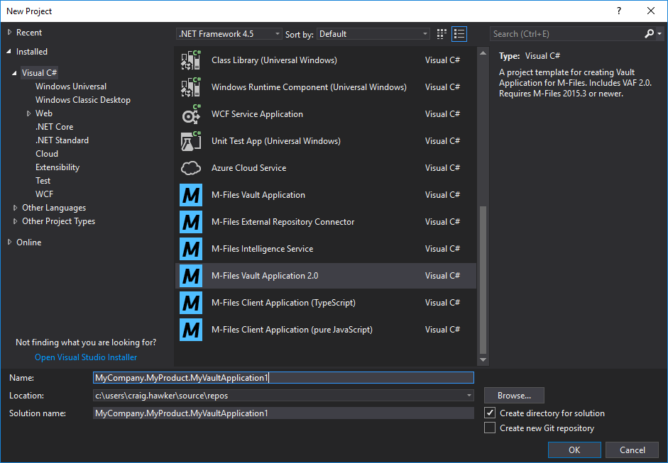
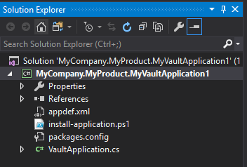
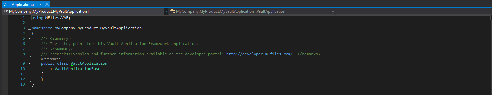
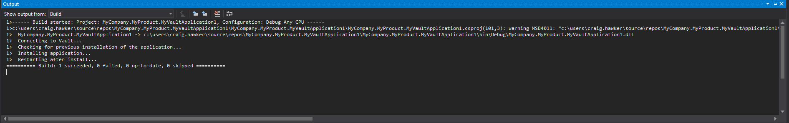
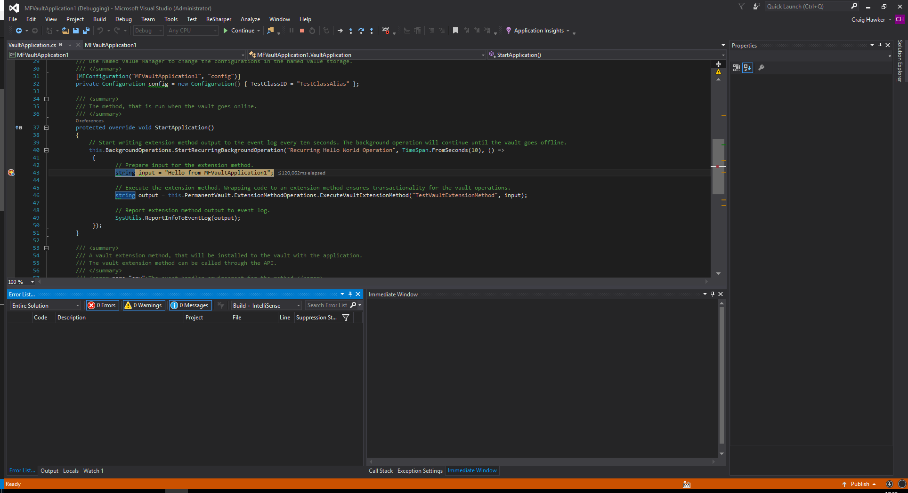

M-Files provides developers with a Visual Studio 2017/2019 template that can be used to rapidly develop Vault Application Framework Applications using C#.

## Downloading the Template

The Vault Application Framework 2.0 template is part of the `M-Files Online Visual Studio template package`, which can be downloaded from the [Visual Studio Marketplace](https://marketplace.visualstudio.com/items?itemName=M-Files.MFilesVisualStudioExtensions).

Different versions of the Vault Application Framework template are available in this package.  You should use the latest one that is compatible with the version of M-Files that you are targeting.  Older versions should only be used if targeting older installations.
{:.note}

## Building your first application

In this example we will create a basic Vault Application Framework application and install it into the Sample Vault, running on the local machine.

If you do not have M-Files installed on the same machine as Visual Studio, then you must [deploy the zip file manually](#manual-deployment).  Debugging can be undertaken on remote applications by [following these instructions]({{ site.baseurl }}/Frameworks/Vault-Application-Framework/Development-Practices/Debugging/#Remote-Debugging).
{:.note}

### Creating an application from the template

Creating a new Vault Application Framework application can be done from within Visual Studio by clicking `File`, `New`, `Project`, then selecting `M-Files Vault Application 2.0` From the list of Visual C# templates:

### An overview of the project contents

The default project contains a number of items:

* `appdef.xml`
The application manifest file, containing information such as the publisher details and the current version number.
* `install-application.ps1`
A PowerShell script used to deploy the installation package to the local M-Files server.
* `VaultApplication.cs`
The actual Vault Application Framework application.
* `packages.conf`
The packages configuration file details the [Nuget packages that are required](https://docs.microsoft.com/en-us/nuget/consume-packages/package-restore) for the Vault Application Framework to run.

### The default application

Unlike previous versions of the VAF template, the default application contains a single class named `VaultApplication`.  This class derives from the correct base class, but declares no additional members.

To customise this default application, check out our samples and libraries or other tutorials.

### The PowerShell script

For flexibility, the Vault Application Framework 2.0 template uses a PowerShell script to control the deployment of the vault application to a specific vault on the local server.  This script can be altered as required, or emptied in the case of no deployment being required.

Deployment information is now found in the Visual Studio `Output` window (`Ctrl-W, O`) instead of a pop-up command prompt.
{:note}

#### Adjusting the deployment vault

By default, the PowerShell script will attempt to deploy to a vault named `Sample Vault`.  This can be altered by opening `install-application.ps1` and altering the target vault on line 6.  By default, the vault name is set to the following:
`$vaultName = "Sample Vault"`

To install the application instead into a vault named "My Test Vault", alter the line to:
`$vaultName = "My Test Vault"`

The name passed to the installer is the name of the vault on the server, not the name of the vault configured within the M-Files Desktop Settings application.
{:.note}

### Building and deploying

To build and deploy the project, either select the `Build` menu item within Visual Studio and select `Build Solution`, or press F6, or press `Ctrl-Shift-B`.  Any errors during build or deployment will be shown within the Visual Studio "Output" window:

If you do not have an M-Files server running locally, the `install-application.ps1` file can be emptied.  In this case, the compiled `.mfappx` file in the `Debug` or `Release` folders can be installed manually using the M-Files Admin software.

#### Deploying to remote M-Files servers

Unfortunately, the PowerShell script cannot directly deploy to remote servers, as the call to [InstallCustomApplication](https://www.m-files.com/api/documentation/index.html#MFilesAPI~VaultCustomApplicationManagementOperations~InstallCustomApplication.html) requires that the path be a path that the M-Files server can resolve.

It may be possible to alter the PowerShell script to copy the application to a remote system before attempting installation.  Doing so is beyond the scope of this article.

## Debugging

[Debugging Vault Application Framework applications]({{ site.baseurl }}/Frameworks/Vault-Application-Framework/Development-Practices/Debugging/) is relatively straight-forward:

1. Place a breakpoint within the code - in this case within the background operation.
2. Select `Debug` and select `Attach to Process`
3. Select all the `MFAppPlatform.exe` processes and select `Attach`.

## Tips and tricks

### Manual deployment

If you do not have an M-Files server running on your local machine, then the build event command cannot automatically deploy your code to the vault.  In this instance, you must manually copy the `.mfappx` file created by the build process to the server, and install it using the M-Files Admin software.

### Nuget packages and versions

The Vault Application Framework 2.0 release (2.0.350.18) requires Newtonsoft.Json (JSON.NET) version 10.0.3.  If this is upgraded to a later version then your Vault Application Framework application will not correctly load.

### Application GUIDs

Whenever an application is created from the Visual Studio template, the `<guid></guid>` element in `appdef.xml` is automatically set to be a new Globally Unique IDentifier.  This GUID is used to uniquely identify each application, as each M-Files vault can only have one application with each GUID installed.

If you manually create an `appdef.xml` file, or copy it from another location, you must ensure that the guid is altered to be unique.  There are a number of [online tools](https://www.bing.com/search?q=guid+generator) that can be used to generate GUIDs.  Note that the GUID should be entered into the `<guid></guid>` element without braces, but with hyphens (e.g. `<guid>f7fbe39a-2031-4b42-9856-05444ecce446</guid>`).