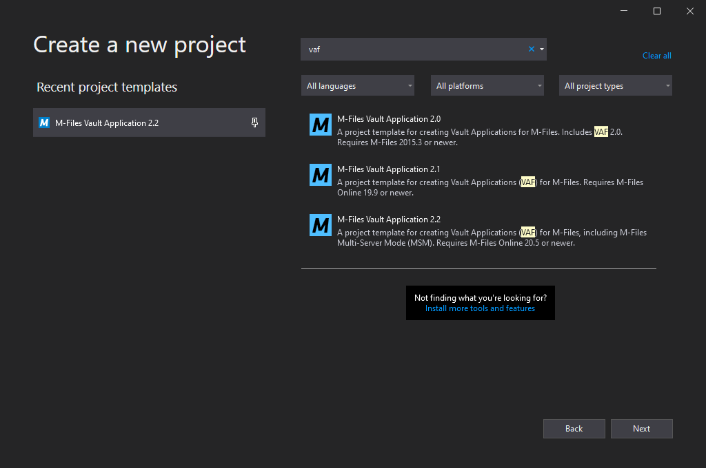
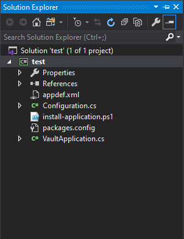
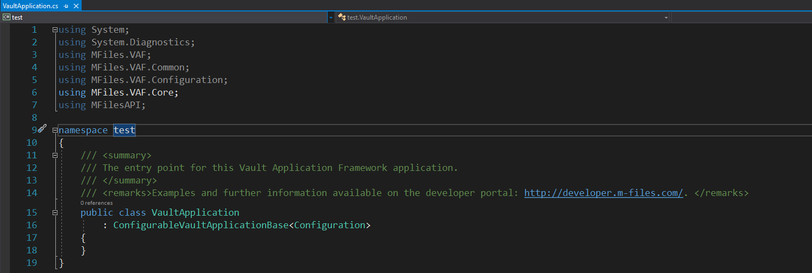

M-Files provides partners with a Visual Studio 2015/2017/2019 template that can be used to rapidly develop Vault Application Framework Applications using C#.

When installing the template into Visual Studio 2017 and 2019, a popup will be shown stating that the template does not use the 2017 format.  This is expected, as the template is backwards compatible with Visual Studio 2015 as well.  Simply accept the popup and continue installation.
{:.note}

## Downloading the Template

The Vault Application Framework 2.2 template is part of the `M-Files Online Visual Studio template package`, which can be downloaded from the [M-Files Partner Portal](https://partners.cloudvault.m-files.com/Default.aspx?#CE7643CB-C9BB-4536-8187-707DB78EAF2A/object/D93538F9-B429-44DE-9840-553A67964438/latest).  If you are a partner and do not have access to the M-Files Partner Portal, then please contact your Channel Account Manager.  To install the template, simply double-click on the ".vsix" file, which will then guide you through installing the templates into the version of Visual Studio that you have installed.

The 2.2 runtime is only compatible with M-Files 20.5 onwards, so previous VAF versions should be used if targeting older installations.
{:.note}

## Building your first application

In this example we will create a basic Vault Application Framework application and install it into the Sample Vault, running on the local machine.

If you do not have M-Files installed on the same machine as Visual Studio, then you can alter the PowerShell script or [deploy the zip file manually](#manual-deployment).  Debugging can be undertaken on remote applications by [following these instructions]({{ site.baseurl }}/Frameworks/Vault-Application-Framework/Development-Practices/Debugging/#Remote-Debugging).
{:.note}

### Creating an application from the template

Creating a new Vault Application Framework application can be done from within Visual Studio by clicking `File`, `New`, `Project`, then selecting `M-Files Vault Application 2.2` From the list of Visual C# templates:

### An overview of the project contents

The default project contains a number of items:

* `appdef.xml`
The application manifest file, containing information such as the publisher details and the current version number.
* `Configuration.cs`
The configuration class used by the Vault Application Framework application.
* `install-application.ps1`
A PowerShell script used to deploy the installation package to the local M-Files server.
* `VaultApplication.cs`
The actual Vault Application Framework application.
* `packages.conf`
The packages configuration file details the [Nuget packages that are required](https://docs.microsoft.com/en-us/nuget/consume-packages/package-restore) for the Vault Application Framework to run.

### The default application

The template automatically creates a `VaultApplication` class, which is the entry point to your application.  This class derives from the VAF 2.2 base class and defines that the `Configuration` class is used for [configuration]({{ site.baseurl }}/Frameworks/Vault-Application-Framework/Configuration/#vaf-22).

To customise this default application, check out our samples and libraries or other tutorials.

### The PowerShell script

The PowerShell script has not changed in functionality from the [VAF 2.1 version]({{ site.baseurl }}/Frameworks/Vault-Application-Framework/Visual-Studio/VAF2.1/#the-powershell-script).
{:.note}

### Building and deploying

Building and deploying has not changed from the [VAF 2.1 version]({{ site.baseurl }}/Frameworks/Vault-Application-Framework/Visual-Studio/VAF2.1/#building-and-deploying).
{:.note}

## Debugging

Debugging has not changed from the [VAF 2.1 version]({{ site.baseurl }}/Frameworks/Vault-Application-Framework/Visual-Studio/VAF2.1/#debugging).
{:.note}

## Tips and tricks

Please also see the tips and tricks for the [VAF 2.1](/Frameworks/Vault-Application-Framework/Visual-Studio/VAF2.1/#tips-and-tricks) and [VAF 2.0](/Frameworks/Vault-Application-Framework/Visual-Studio/VAF2.0/#tips-and-tricks) versions, as they also apply here.
{:.note}

### Nuget packages and versions

The Vault Application Framework 2.2 release requires Newtonsoft.Json (JSON.NET) version 10.0.3.
