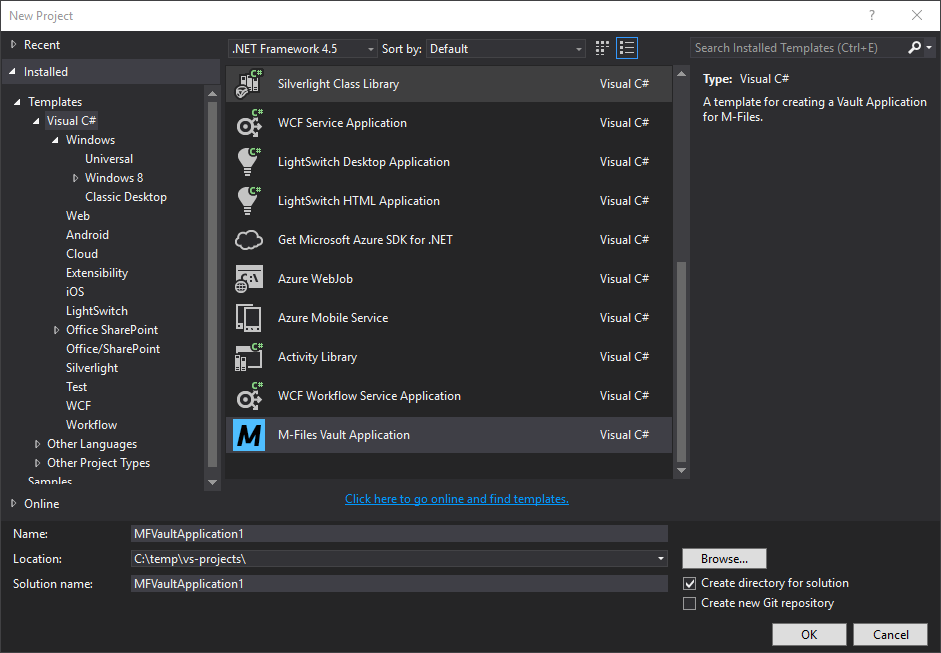
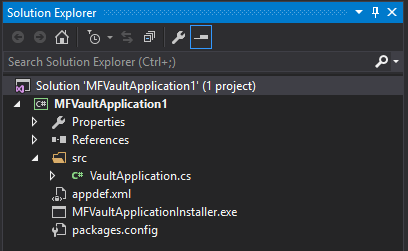
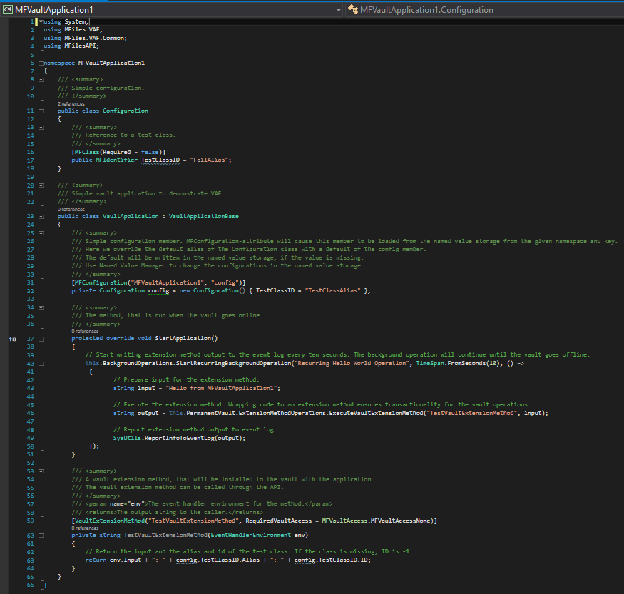
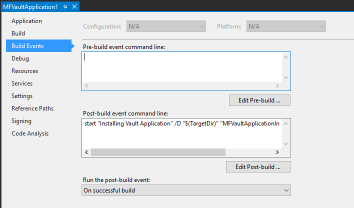
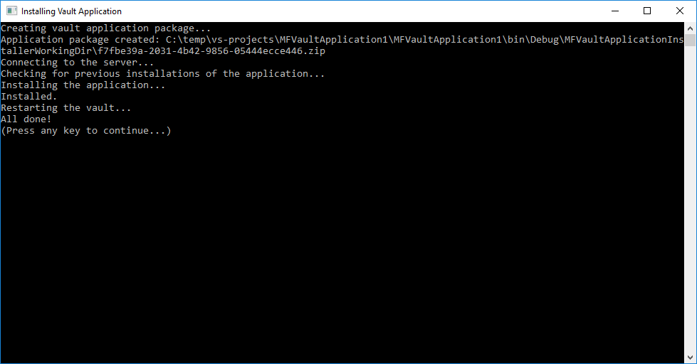
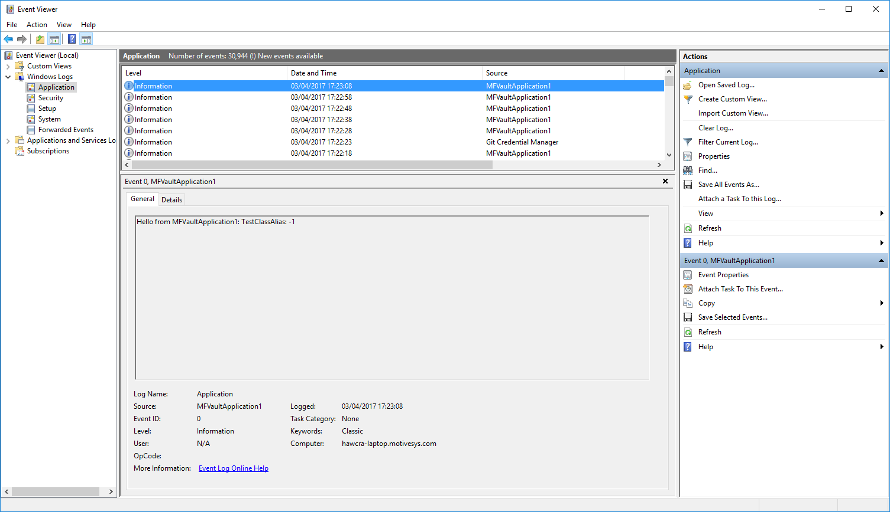
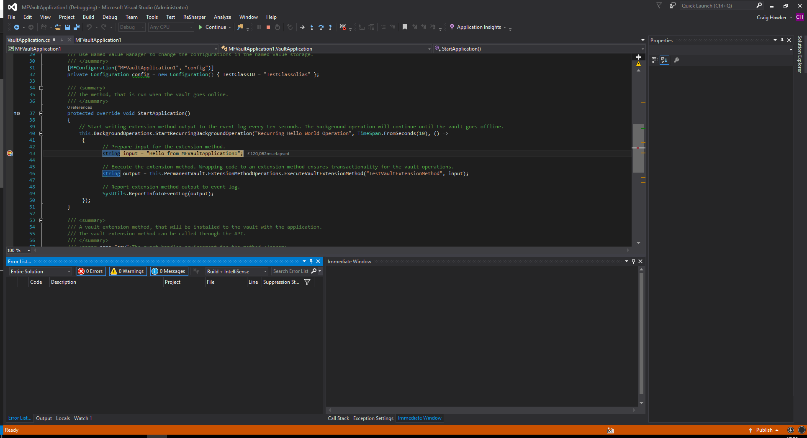

M-Files provides partners with a Visual Studio 2015/2017 template that can be used to rapidly develop Vault Application Framework Applications using C#.  If you would like to use VB.NET then you will need to follow [these instructions]({{ site.baseurl }}/Frameworks/Vault-Application-Framework/Using-VB.NET/).

When installing the template into Visual Studio 2017, a popup will be shown stating that the template does not use the 2017 format.  This is expected, as the template is backwards compatible with Visual Studio 2015 as well.  Simply accept the popup and continue installation.
{:.note}

## Downloading the Template

The template can be downloaded from the [M-Files Partner Portal](https://partners.cloudvault.m-files.com/openfile.aspx?vault=CE7643CB-C9BB-4536-8187-707DB78EAF2A&objtype=0&docid=1262&fileid=3005&filever=-1), which is available to all M-Files Partners.  If you are a partner and do not have access to the M-Files Partner Portal, then please contact your Channel Account Manager.  To install the template, simply double-click on the ".vsix" file, which will then guide you through installing the template into the version of Visual Studio that you have installed.

## Building your first application ("hello, world")

In this example we will create a basic Vault Application Framework application and install it into the Sample Vault, running on the local machine.

If you do not have M-Files installed on the same machine as Visual Studio, then you must <a href="#manual-deployment">deploy the zip file manually</a>.  Debugging can be undertaken on remote applications by [following these instructions]({{ site.baseurl }}/Frameworks/Vault-Application-Framework/Development-Practices/Debugging/#Remote-Debugging).
{:.note}

### Creating an application from the template

Creating a new Vault Application Framework application can be done from within Visual Studio by clicking `File`, `New`, `Project`, then selecting `M-Files Vault Application` From the list of Visual C# templates:

### An overview of the project contents

The default project contains a number of items:

* `src\VaultApplication.cs`
The actual Vault Application Framework application.
* `appdef.xml`
The application manifest file, containing information such as the publisher details and the current version number.
* `MFVaultApplicationInstaller.exe`
Used by the [build event](#adjusting-the-build-event) to create the installation package and, optionally, to deploy it to the local M-Files server.
* `packages.conf`
The packages configuration file details the [Nuget packages that are required](https://docs.microsoft.com/en-us/nuget/consume-packages/package-restore) for the Vault Application Framework to run.

### The default application

The default application consists of two classes.  The first, `Configuration`, contains a single `MFIdentifier` field describing a class with alias `FailAlias`.  The second, `VaultApplication`, contains a sample vault application which defines a method which runs every 10 seconds.  This method calls a Vault Extension Method which is also defined within the class.

When this code is executed it should output an entry to the Windows Event Log every 10 seconds containing the phrase `Hello from MFVaultApplication1: TestClassAlias: -1`.  Note that "MFVaultApplication" is the name of the vault application, "TestClassAlias" is the alias provided to the MFIdentifier when the configuration is instantiated, and "-1" is the ID of the class in the vault with the alias "TestClassAlias" (if one existed - if not it returns -1).

### Items to note

1. [Attributes]({{ site.baseurl }}/Frameworks/Vault-Application-Framework/Attributes/) are used before properties and methods to define how the Vault Application Framework should interact with them.
    1. The `MFClass` attribute within the `Configuration` class denotes that the `MFIdentifier` refers to a class (rather than a property definition, object type, or other vault element.)
    2. The use of the `MFConfiguration` attribute persists the configuration to Named Value Storage.  The attribute is provided with the namespace and key of the configuration item.  Further information can be found within the [Configuration attribute documentation]({{ site.baseurl }}/Frameworks/Vault-Application-Framework/Attributes/Configuration/).
2. The `SysUtils` helper object is used to report information to the event log.
3. The "Permanent Vault" (`this.PermanentVault`) is used within the background operation.  This should only be used where a transactional vault is not provided by the Vault Application Framework.

### Adjusting the build event

Details on the build event can be found by viewing the project properties (right-click on `MFVaultApplication`, or the name of your project, and select `Properties`) and selecting the `Build Events` tab on the left:

By default, the post-build event command line is set to the following:
`start "Installing Vault Application" /D "$(TargetDir)" "MFVaultApplicationInstaller.exe" "Sample Vault"`

This instructs Visual Studio, after the build process has completed, to execute the M-Files Vault Application Installer.  This installer will create a zip file within the output folder and then attempt to deploy the application to the vault named "Sample Vault".  This can be altered to the name of the vault you wish to install to.  For example, the following will instruct the installer to deploy the application into a vault named "My Test Vault".
`start "Installing Vault Application" /D "$(TargetDir)" "MFVaultApplicationInstaller.exe" "My Test Vault"`

The name passed to the installer is the name of the vault on the server, not the name of the vault configured within the M-Files Desktop Settings application.
{:.note}

If you do not have an M-Files server running locally, the build event command line can be altered to avoid the deploy step.  In this scenario the application zip will still be created, and the path to the zip output for manual deployment.  This is done by simply removing the final argument from the command line:
`start "Installing Vault Application" /D "$(TargetDir)" "MFVaultApplicationInstaller.exe"`

### Building and deploying

To build and deploy the project, either select the `Build` menu item within Visual Studio and select `Build Solution`, or press F6, or press Ctrl-Shift-B.  Any errors during build will be shown within the Visual Studio "Error List" window, and any errors during the deployment will be shown within the console window opened for the build task:

This screen shows the full path to the zip file created by the installer.  If you are deploying the application manually, copy this file to the M-Files server and install using the M-Files Admin software.
{:.note}

### Observing the output

Once the Vault Application Framework application has been successfully installed, it can be checked using the Windows Event Log:

## Debugging

[Debugging Vault Application Framework applications]({{ site.baseurl }}/Frameworks/Vault-Application-Framework/Development-Practices/Debugging/) is relatively straight-forward:

1. Place a breakpoint within the code - in this case within the background operation.
2. Select `Debug` and select `Attach to Process`
3. Select all the `MFAppPlatform.exe` processes and select `Attach`.

## Tips and tricks

### Manual deployment

If you do not have an M-Files server running on your local machine, then the build event command cannot automatically deploy your code to the vault.  In this instance, you must manually copy the zip file created by the build event to the server, and install it using the M-Files Admin software.

### Nuget packages and versions

The current Vault Application Framework release (1.0.128.0) requires Newtonsoft.Json (JSON.NET) version 6.0.8.  If this is upgraded to a later version then your Vault Application Framework application will not correctly load.

### Application GUIDs

Whenever an application is created from the Visual Studio template, the `<guid></guid>` element in `appdef.xml` is automatically set to be a new Globally Unique IDentifier.  This GUID is used to uniquely identify each application, as each M-Files vault can only have one application with each GUID installed.

If you manually create an `appdef.xml` file, or copy it from another location, you must ensure that the guid is altered to be unique.  There are a number of [online tools](https://www.bing.com/search?q=guid+generator) that can be used to generate GUIDs.  Note that the GUID should be entered into the `<guid></guid>` element without braces, but with hyphens (e.g. `<guid>f7fbe39a-2031-4b42-9856-05444ecce446</guid>`).