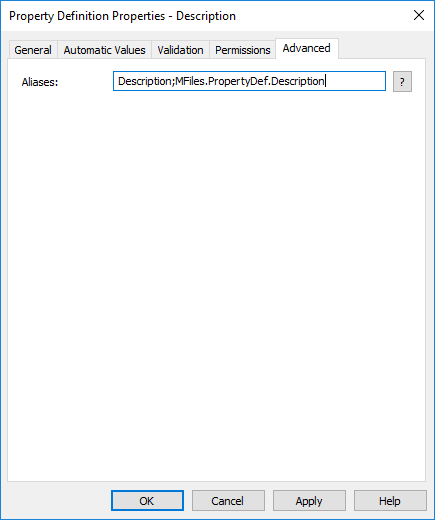

The M-Files API primarily uses IDs when referencing structural vault elements.  For example, the following code may update a "Description" property (with an example ID of 1090) on an object:

```csharp
// Create the property value.
var descriptionPropertyValue = new PropertyValue();
descriptionPropertyValue.PropertyDef = 1090; // This is the internal ID of the description property.
descriptionPropertyValue.SetValue(MFDatatypeMultiLineText, "hello world");

// Update the value.
Vault.ObjectPropertyOperations.SetProperty(objVer, descriptionPropertyValue);
```

However, this same code can often not be used directly on another vault, as the "Description" property's ID will normally not be the same.  This is because the internal ID is assigned at the time that the element is created, and cannot be re-used.  This is additionally important when [replication](https://www.m-files.com/user-guide/latest/eng/Metadata_specifications.html) is used, as the script may be replicated to another vault but not able to function due to the IDs being different.

Instead, one or more aliases should be assigned to the vault element and resolved to the current ID at runtime.

## Items with multiple aliases

Occasionally one vault element may be referenced by a number of scripts, each expecting the property to have a different alias.  For example: a "Description" property may be expected to have an alias of `MFiles.PropertyDef.Description` in one script, but `Description` in another.  Fortunately, elements can have multiple aliases assigned by separating them with a semi-colon (`;`):



## Resolving aliases

Resolving aliases to IDs is done using one of the following methods:

* [GetPropertyDefIDByAlias](https://developer.m-files.com/APIs/COM-API/Reference/MFilesAPI~VaultPropertyDefOperations~GetPropertyDefIDByAlias.html): retrieves the ID of a property definition by its alias.

* [GetObjectClassIDByAlias](https://developer.m-files.com/APIs/COM-API/Reference/MFilesAPI~VaultClassOperations~GetObjectClassIDByAlias.html): retrieves the ID of a class by its alias.

* [GetNamedACLIDByAlias](https://developer.m-files.com/APIs/COM-API/Reference/MFilesAPI~VaultNamedACLOperations~GetNamedACLIDByAlias.html): retrieves the ID of a named ACL by its alias.

* [GetObjectTypeIDByAlias](https://developer.m-files.com/APIs/COM-API/Reference/MFilesAPI~VaultObjectTypeOperations~GetObjectTypeIDByAlias.html): retrieves the ID of an object type by its alias.

* [GetUserGroupIDByAlias](https://developer.m-files.com/APIs/COM-API/Reference/MFilesAPI~VaultUserGroupOperations~GetUserGroupIDByAlias.html): retrieves the ID of a user group by its alias.

* [GetValueListIDByAlias](https://developer.m-files.com/APIs/COM-API/Reference/MFilesAPI~VaultValueListOperations~GetValueListIDByAlias.html): retrieves the ID of a value list by its alias.

* [GetWorkflowIDByAlias](https://developer.m-files.com/APIs/COM-API/Reference/MFilesAPI~VaultWorkflowOperations~GetWorkflowIDByAlias.html): retrieves the ID of a workflow by its alias.

* [GetWorkflowStateIDByAlias](https://developer.m-files.com/APIs/COM-API/Reference/MFilesAPI~VaultWorkflowOperations~GetWorkflowStateIDByAlias.html): retrieves the ID of a workflow state by its alias.

* [GetWorkflowStateTransitionIDByAlias](https://developer.m-files.com/APIs/COM-API/Reference/MFilesAPI~VaultWorkflowOperations~GetWorkflowStateTransitionIDByAlias.html): retrieves the ID of a workflow state transition by its alias.

* [GetMetadataStructureItemIDByAlias](https://developer.m-files.com/APIs/COM-API/Reference/index.html#MFilesAPI~Vault~GetMetadataStructureItemIDByAlias.html): retrieves the ID of a vault structure element by its alias.

The code above could, instead, be written as below:

```csharp
// Retrieve the ID of the property in the current vault (with alias "MFiles.PropertyDef.Description").
var descriptionPropertyDefId = Vault.PropertyDefOperations.GetPropertyDefIDByAlias("MFiles.PropertyDef.Description");

// Create the property value.
var descriptionPropertyValue = new PropertyValue();
descriptionPropertyValue.PropertyDef = descriptionPropertyDefId;
descriptionPropertyValue.SetValue(MFDatatypeMultiLineText, "hello world");

// Update the value.
Vault.ObjectPropertyOperations.SetProperty(objVer, descriptionPropertyValue);
```

## The Vault Application Framework

When using the Vault Application Framework, [the MFIdentifier class, combined with configuration attributes, can be used to automatically resolve aliases to IDs]({{ site.baseurl }}/Frameworks/Vault-Application-Framework/Attributes/Configuration/).  This can significantly reduce the amount of boilerplate code.
