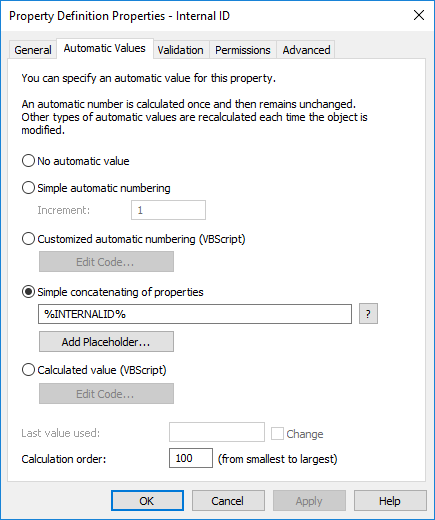
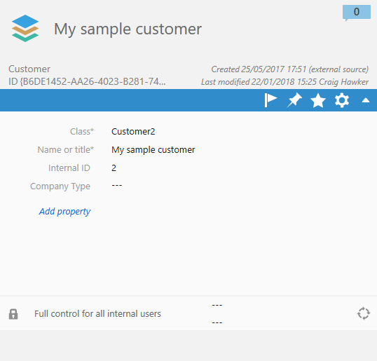

All objects within M-Files (excluding unmanaged objects from [IML repositories](https://www.m-files.com/en/intelligent-metadata-layer-ecm)) are identified using a combination of an *object type ID* and an *object ID*.  The combination of these IDs - which are both positive integers - uniquely identify a specific object within the M-Files vault.  In addition, M-Files maintains a version history for each managed object, with the version number also being defines as a positive integer.

Below is an example of the metadata card of an object that is managed within the M-Files vault.  In this screenshot its internal object ID and version number are visible within the metadata card.  The object type ID is found, typically, from the M-Files Admin software.

## Where the ID shown may not be the internal ID

The term `External ID` and `Display ID` are used interchangeably within the M-Files documentation, but refer to the same thing; this is simply the ID which is shown on the metadata card instead of the internal ID.
{:.note.warning}

In some situations the value which is shown on the metadata card, whilst still unique within the object type, may not be the M-Files internal ID which is used for API calls.  This can cause confusion, especially if the metadata card shows a numeric external ID (e.g. `1000`), but the internal ID needed for API calls is different (e.g. `400`).

### External object types

When using [External Object Types]({{ site.baseurl }}/Built-In/External-Object-Type-Data-Source/), the value shown on the metadata card will not be the internal ID, but will instead be the primary key of the object in the source system.  This may be a number, a GUID, or any other key which is guaranteed to be unique.

### Explicitly-set Display ID

From M-Files 2015.3, the M-Files system has supported the setting of display IDs via the [VaultObjectOperations.SetExternalID method](https://developer.m-files.com/APIs/COM-API/Reference/index.html#MFilesAPI~VaultObjectOperations~SetExternalID.html), subject to the following conditions:

* The external ID must be unique within an object type; the same ID cannot be used for two objects.
* The API call can only set display IDs on internal objects (i.e. an external ID cannot be set for an object type which is already external).
* The maximum length of the external ID is 60 characters.

Implementations that use this technique can be additionally confusing, as some objects within an object type may show the internal ID and some may show the external ID.
{:.note.warning}

## Referencing objects and object versions using the APIs

In order to interact with objects within the vault, the M-Files APIs require information to uniquely identify which objects should be processed.  The way in which these values are passed depends upon the API being used.

### Using the COM API

#### Providing values using the COM API

When using the COM API, the object type ID and object ID are typically passed within an [ObjID](https://developer.m-files.com/APIs/COM-API/Reference/index.html#MFilesAPI~ObjID.html) instance.  Where API calls require specific versions of objects, this information is often passed within an [ObjVer](https://developer.m-files.com/APIs/COM-API/Reference/index.html#MFilesAPI~ObjVer.html) instance, which contains the object type ID, the object ID, and the version number.

#### Retrieving values using the COM API

When using the COM API, many APIs will return an [ObjectVersion](https://developer.m-files.com/APIs/COM-API/Reference/index.html#MFilesAPI~ObjectVersion.html).  This class exposes the following properties:

* `DisplayIDAvailable` - specifies whether the `DisplayID` property is available.
* `DisplayID` - only populated if the object has an `External ID` defined..
* `ObjVer` - will be details on the object version, including the internal object type, object id, and version information.

### Using the REST API

#### Providing values using the REST API

When using the [REST API]({{ site.baseurl }}/APIs/REST-API/), the object type ID, object ID and optionally version number are typically encoded into the endpoint address.  For example, to retrieve information on an object a `GET` request may be sent to [http://m-files.mycompany.com/REST/objects/0/123/latest](https://www.m-files.com/mfws/resources/objects/type/objectid/version.html).  In this example, the object type ID is `0`, the object ID is `123` and the version is specified as `latest`.

#### Retrieving values using the REST API

When using the REST API, many endpoints return an [ObjectVersion](https://www.m-files.com/mfws/structs/extendedobjectversion.html) (or [ExtendedObjectVersion](https://www.m-files.com/mfws/structs/extendedobjectversion.html), which inherits the properties defined on `ObjectVersion`).  Both these classes expose the following properties:

* `DisplayID` - will be empty unless the object has an `External ID` defined.
* `ObjVer` - will be details on the object version, including the internal object type, object id, and version information.

## Methods to locate the internal ID

### Using a calculated property

A calculated property could be created and instructed to always contain the internal M-Files object ID.  The calculated property should be defined to display the value `%INTERNALID%`:

This internal ID can then be displayed on external object's metadata cards:

### Executing a search

To locate an object with a given display ID, a search is often a simple solution.  An example of creating a `SearchCondition` object to do this is shown [in the 'Searching by an external ID' example]({{ site.baseurl }}/APIs/COM-API/Searching/SearchConditions/#searching-by-an-external-id).
