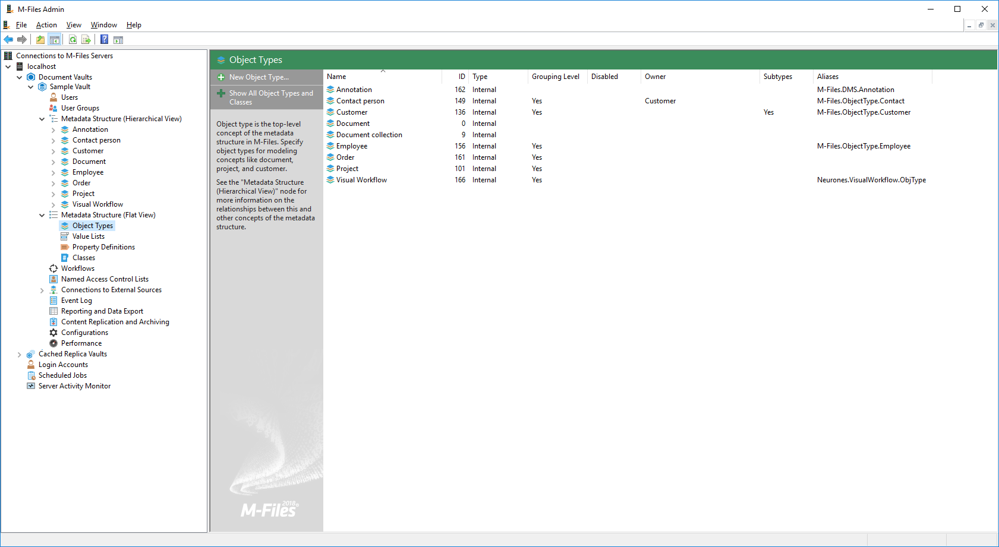
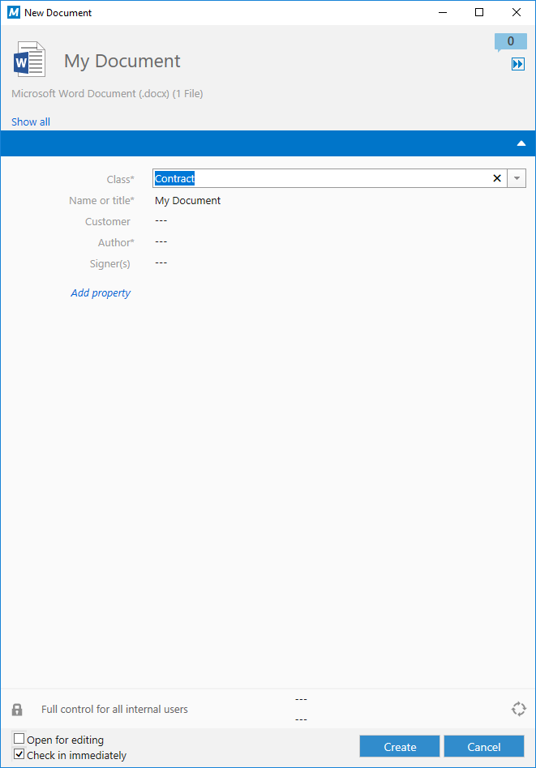
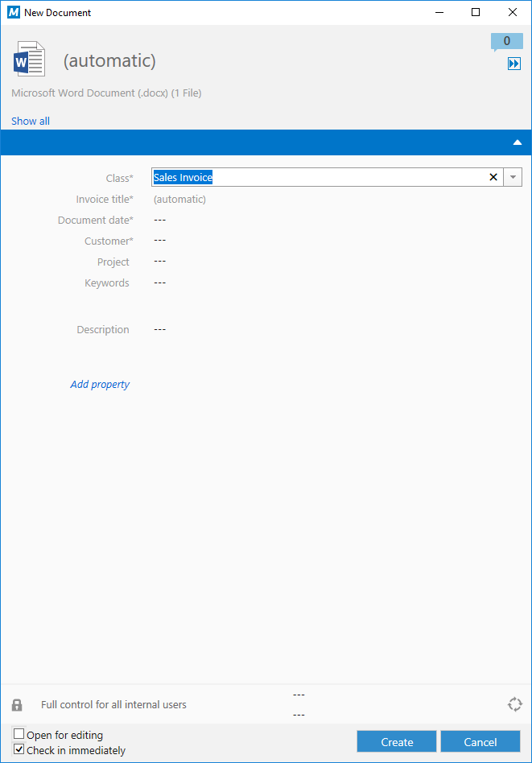

The structure of the M-Files vault can be altered by administrators using the [M-Files Admin](https://www.m-files.com/user-guide/latest/eng/M-Files_server_administrator.html) software.

## Object types

`Object Types` are used by M-Files define the types of objects that can be stored in each vault.  The M-Files system has a built-in object type for `Documents`, but other object types such as `Customer`, `Project` or `Contact` can be defined depending on the needs of the individual organization.

Any object type can be allowed to [have files](https://www.m-files.com/user-guide/latest/eng/New_object_type.html), but it is recommended that documents are always stored within the built-in `Documents` object type.  This object type behaves differently in many situations and is best suited for storage of files.
{:.note.warning}

### Object types in the COM API

`Object Type` information can be accessed via the [VaultObjectTypeOperations](https://www.m-files.com/api/documentation/latest/index.html#MFilesAPI~VaultObjectTypeOperations.html) class.  When working with object types, most information can be obtained from the [ObjType](https://www.m-files.com/api/documentation/latest/index.html#MFilesAPI~VaultObjectTypeOperations~GetObjectType.html) class, although the [ObjTypeAdmin](https://www.m-files.com/api/documentation/latest/index.html#MFilesAPI~ObjTypeAdmin.html) class contains administrative information such as external object type connection and any [aliases]({{ site.baseurl }}/Getting-Started/Aliases/).

### Object types in the REST API

`Object Type` information can be accessed via the [/structure/objecttypes](http://www.m-files.com/mfws/resources/structure/objecttypes.html) endpoint.

### External object types

Many organizations already have other systems of record that contain information that would be useful to reference from within M-Files.  Examples of this may include Customer Relationship Management system that already contain customer and contact information, or Enterprise Resource Planning systems that may contain projects.  This information can automatically be imported into M-Files by setting up [external object types]({{ site.baseurl }}/Built-In/External-Object-Type-Data-Source/).  Once set up, information (e.g. Customers) will be automatically synchronised from the remote system periodically, and the information available within M-Files.  External object types can be one-way (read-only) or two-way (read/write), depending on the system.  M-Files natively supports retrieving content from ODBC-compatible data sources, and [custom data sources]({{ site.baseurl }}/Built-In/External-Object-Type-Data-Source/Custom/) can be created by developers if required.

## Classes

Each `Object Type` in the M-Files vault consists of at least one `Class`.  A `Class` can be thought of as a specific type of object and is used to categorize objects when they are stored into M-Files.  For example when storing documents the vault may have classes for `Contract`, `Invoice` or `Presentation`.  Classes can also be used to logically classify other object types.  For example a `Project` object type may have classes for `Customer Project` and `Internal Project`.

Each `Class` can specify the [properties](#property-definitions) that the user will be asked to complete when adding an object to the vault, including which are mandatory.  Mandatory properties are shown on the M-Files Desktop and M-Files Web Access clients with an asterisk.

Notice in the screenshots below that as the user alters the `Class` of the document they're adding, the metadata requested (and the metadata which is mandatory) changes.

Users can choose to add additional properties to an object by clicking the `Add property` text shown in the metadata card.
{:.note}

Information on the properties defined for each class - including whether they are mandatory or not - can be found via the [ObjectClass.AssociatedPropertyDefs](https://www.m-files.com/api/documentation/latest/index.html#MFilesAPI~ObjectClass~AssociatedPropertyDefs.html) property.
{:.note.api.hint}

### Classes in the COM API

`Class` information can be accessed via the [VaultObjectClassOperations](https://www.m-files.com/api/documentation/latest/index.html#MFilesAPI~VaultObjectClassOperations.html) class.  When working with classes, most information can be obtained from the [ObjectClass](https://www.m-files.com/api/documentation/latest/index.html#MFilesAPI~ObjectClass.html) class, although the [ObjectClassAdmin](https://www.m-files.com/api/documentation/latest/index.html#MFilesAPI~ObjectClassAdmin.html) class contains additional administrative information such as any [aliases]({{ site.baseurl }}/Getting-Started/Aliases/).

### Classes in the REST API

`Class` information can be accessed via the [/structure/classes](http://www.m-files.com/mfws/resources/structure/classes.html) endpoint.

## Property definitions

`Property Definition`s are simply the individual elements of metadata that the system may need to collect.  In addition to the [built-in property definitions](https://www.m-files.com/api/documentation/latest/index.html#MFilesAPI~MFBuiltInPropertyDef.html), the system implementation will typically define many custom property definitions to allow it to function according to the organization's needs.

A property definition is different to a [Property Value](#property-values).  A property definition is soley the declaration of how a property should work, whereas a property value is a specific entry on an object's metadata card (the property definition, and the value that was entered).  When working with objects you will often need to create or parse a collection of property values.
{:.note.warning}

A property definition must be given a name and a [data type](#data-types).  Values for a property can be either entered by the user when the object is created (e.g. on the metadata card), or [calculated through some means](https://www.m-files.com/user-guide/latest/eng/Automatic_values.html?hl=calculate).  [Property value validation](https://www.m-files.com/user-guide/latest/eng/Validation.html) can also be done via VBScript or the Vault Application Framework.

### Data types

The following [data types](https://www.m-files.com/api/documentation/latest/index.html#MFilesAPI~MFDataType.html) are supported within M-Files:

* `Text`: A single line of text, limited to 100 characters.

* `Text (multi-line)`: A text field that accepts line breaks.

* `Choose from list`: The user can choose a single value from a value list, or list of objects of the specified object type.

* `Choose from list (multi-select)`: The user can choose multiple values from a single value list, or a list of objects of the specified object type.

* `Date`: The user can choose a date.

* `Time`: The user can enter a time.

* `Timestamp`: A combination of a date and time.  Users cannot enter these values; they must be provided by script instead.

* `Number (integer)`: The user can enter an integer (whole number).

* `Number (real)`: The user can enter a number in decimal format (e.g. 1.2).

* `Boolean`: The user can choose between true/yes and false/no values.  This property type can be customized using the [metadata card configuration]({{ site.baseurl }}/Built-In/Metadata-Card-Configuration/) to appear as a checkbox.

### Property definitions in the COM API

`Property Definition` information can be accessed via the [VaultPropertyDefOperations](https://www.m-files.com/api/documentation/latest/index.html#MFilesAPI~VaultPropertyDefOperations.html) class.  When working with classes, most information can be obtained from the [PropertyDef](https://www.m-files.com/api/documentation/latest/index.html#MFilesAPI~PropertyDef.html) class, although the [PropertyDefAdmin](https://www.m-files.com/api/documentation/latest/index.html#MFilesAPI~PropertyDefAdmin.html) class contains additional administrative information such as any [aliases]({{ site.baseurl }}/Getting-Started/Aliases/).

### Property definitions in the REST API

`Property Definition` information can be accessed via the [/structure/properties](http://www.m-files.com/mfws/resources/structure/properties.html) endpoint.

## Property values

Each version of an object contains multiple property values.  Some of these property values are built-in and may be automatically maintained (e.g. the creation date, or who last modified the object), and some will be shown on the metadata card and maintained as users add and process objects within M-Files.

Objects may need to be [checked out](../Objects-and-Versions) before their properties can be modified.  Setting properties from VBScript or the Vault Application Framework may cause the [audit trail to become broken]({{ site.baseurl }}/Built-In/VBScript/Audit-Trail-And-Scripting/) unless care is taken.
{:.note.hint}

### Property values in the COM API

Retrieving and setting property values on an object version is done via [VaultObjectPropertyOperations](https://www.m-files.com/api/documentation/latest/index.html#MFilesAPI~VaultObjectPropertyOperations.html).

[GetProperty](https://www.m-files.com/api/documentation/latest/MFilesAPI~VaultObjectPropertyOperations~GetProperty.html) can be used to retrieve a single property value, and [GetProperties](https://www.m-files.com/api/documentation/latest/MFilesAPI~VaultObjectPropertyOperations~GetProperties.html) to retrieve multiple property values on one object.

[SetProperty](https://www.m-files.com/api/documentation/latest/MFilesAPI~VaultObjectPropertyOperations~SetProperty.html) can be used to update a single property value on an object version, and [SetProperties](https://www.m-files.com/api/documentation/latest/MFilesAPI~VaultObjectPropertyOperations~SetProperties.html) to set multiple property values on one object.  Note that [SetAllProperties](https://www.m-files.com/api/documentation/latest/MFilesAPI~VaultObjectPropertyOperations~SetAllProperties.html) must be used if the class of the object is to change.

A property can be removed using [RemoveProperty](https://www.m-files.com/api/documentation/latest/MFilesAPI~VaultObjectPropertyOperations~RemoveProperty.html).

When dealing with multiple objects, [GetPropertiesOfMultipleObjects](https://www.m-files.com/api/documentation/latest/MFilesAPI~VaultObjectPropertyOperations~GetPropertiesOfMultipleObjects.html) and [SetPropertiesOfMultipleObjects](https://www.m-files.com/api/documentation/latest/MFilesAPI~VaultObjectPropertyOperations~SetPropertiesOfMultipleObjects.html) may be used.
{:.note}

### Property values in the REST API

Retrieving and setting property values on an object version is done via the [/objects/(type)/(objectid)/(version)/properties](http://www.m-files.com/mfws/resources/objects/type/objectid/version/properties.html) endpoint.

Issuing a HTTP GET to [/objects/(type)/(objectid)/(version)/properties](http://www.m-files.com/mfws/resources/objects/type/objectid/version/properties.html) will retrieve all property values on an object version, and issuing a GET to [/objects/(type)/(objectid)/(version)/properties/(id)](http://www.m-files.com/mfws/resources/objects/type/objectid/version/properties/id.html) will retrieve a single property value.

Issuing a HTTP PUT to [/objects/(type)/(objectid)/(version)/properties](http://www.m-files.com/mfws/resources/objects/type/objectid/version/properties.html) will set the property values on an object version, and issuing a PUT to [/objects/(type)/(objectid)/(version)/properties/(id)](http://www.m-files.com/mfws/resources/objects/type/objectid/version/properties/id.html) will set a single property value.

A property can be removed by issuing a HTTP DELETE to [/objects/(type)/(objectid)/(version)/properties/(id)](http://www.m-files.com/mfws/resources/objects/type/objectid/version/properties/id.html).

When dealing with multiple objects, the [/objects/properties](http://www.m-files.com/mfws/resources/objects/properties.html) endpoint may be used.

HTTP PUT and DELETE requests may not work in some scenarios.  Instead, it is recommended that [HTTP PUT and DELETE methods are routed via the _method querystring parameter](http://www.m-files.com/mfws/compatibility.html).
{:.note.warning}

## Workflows

[Workflows](https://www.m-files.com/user-guide/latest/eng/Workflows.html) can be used to support and audit processes undertaken by an organization.  Workflows consist of a number of `Workflow State`s which typically map to stages of the process being modelled.  Objects are placed into a workflow and workflow state, and then move between one workflow state and another along a `Workflow State Transition`. Some transitions may only be able to be done by some users, or may be blocked if the object does not meet certain criteria.

Worfklows are created using the M-Files Admin software during initial implementation.  M-Files 2015 and later support a [graphical workflow designer](https://www.m-files.com/user-guide/latest/eng/graphical_workflows.html) to more easily create, visualize and manage workflows.

The current workflow and state of an object are held in its [property values](#property-values), against property definitions [MFBuiltInPropertyDefWorkflow (38) and MFBuiltInPropertyDefState (39), respectively](https://www.m-files.com/api/documentation/latest/index.html#MFilesAPI~MFBuiltInPropertyDef.html).
{:.note}

### Workflows in the COM API

`Workflow` information can be accessed via the [VaultWorkflowOperations](https://www.m-files.com/api/documentation/latest/index.html#MFilesAPI~VaultWorkflowOperations.html) class.  When working with classes, most information can be obtained from the [Workflow](https://www.m-files.com/api/documentation/latest/index.html#MFilesAPI~Workflow.html) and [State](https://www.m-files.com/api/documentation/latest/index.html#MFilesAPI~State.html) classes, although the [WorkflowAdmin](https://www.m-files.com/api/documentation/latest/index.html#MFilesAPI~WorkflowAdmin.html) and [StateAdmin](https://www.m-files.com/api/documentation/latest/index.html#MFilesAPI~StateAdmin.html) classes contains additional administrative information such as any [aliases]({{ site.baseurl }}/Getting-Started/Aliases/).

### Workflows in the REST API

`Worfklow` information can be accessed via the [/structure/workflows](http://www.m-files.com/mfws/resources/structure/workflows.html) endpoint.  Information on states within each workflow can be accessed via the [/structure/workflows/(id)/states/](http://www.m-files.com/mfws/resources/structure/workflows/id/states.html) endpoint.
