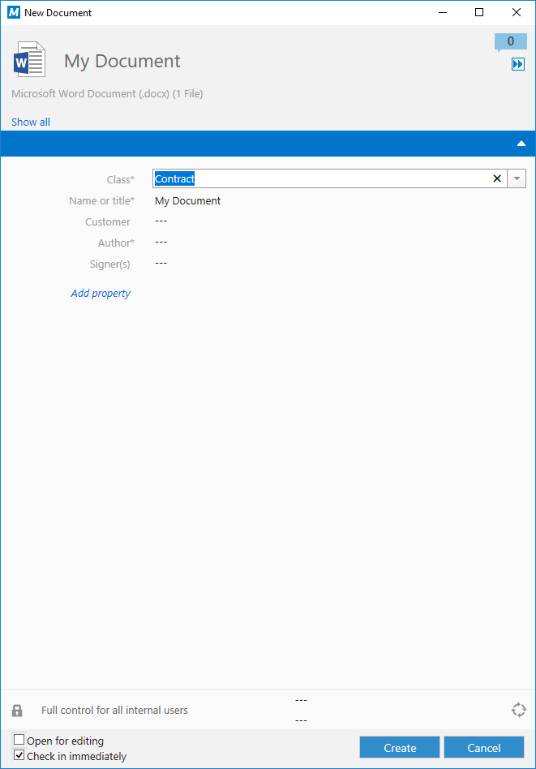
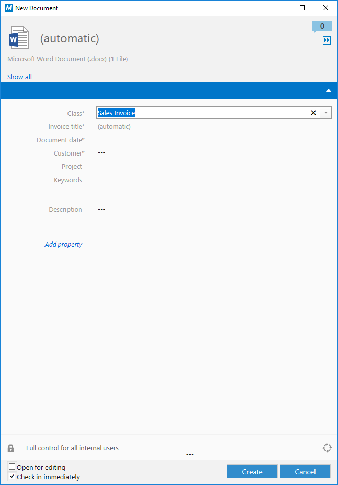

This section introduces the concepts and terminology used within the M-Files software, with particular focus upon the terminology and techniques required to interact with an M-Files vault.

Information held within M-Files is held within one or more `Vaults`.  On the M-Files Server, each vault consists of a database and, optionally, separate file storage.  Each vault has a defined structure - implemented as part of the initial configuration - that controls what types of information can be stored.  By default, M-Files can manage `Documents`, but the system will typically be customised to manage many types of object.

Most organizations simply have one vault which contains everything that they need.  Sometimes separate vaults are created to segregate content for performance (e.g. a content archive) or security reasons (e.g. a separate vault for HR information).

In order to work with information within an M-Files vault, you will typically need to obtain a [Vault](https://www.m-files.com/api/documentation/latest/index.html#MFilesAPI~Vault.html) reference.  When using [VBScript]({{ site.baseurl }}/Built-In/VBScript/) this is often already available as a built-in variable named `Vault`.  When using the [Vault Application Framework]({{ site.baseurl }}/Frameworks/Vault-Application-Framework/) this will be provided as part of the `Environment` method parameter, or the `VaultApplicationBase.PermanentVault` reference can be used.  When using the [COM API]({{ site.baseurl }}/APIs/COM-API/), a reference will be obtained as part of the [connection process](/APIs/COM-API/Connecting-And-Authenticating/).  A vault reference is not required when using the [REST API]({{ site.baseurl }}/APIs/REST-API/).
{:.note.api}

## Objects and versions

Items stored within an M-Files vault - aside from value lists - are considered `Objects`.  Each document stored to M-Files is an object.  Each project - if a vault is configured to store projects - is an object.  Each object is of a specific [object type](#object-types) and [class](#classes), and has a series of [property values](#property-values) which together make up its metadata.  Some objects contain files (e.g. documents) and some objects do not.

### Checking in and out.

Whenever the metadata or files of an object are altered, M-Files automatically creates a new `Object Version`.  These versions can be seen by viewing the object's history.  In order to maintain this audit trail, M-Files uses a process whereby an object is checked out, altered, then checked in.  [Objects can only be checked out by one person at a time](https://www.m-files.com/user-guide/latest/eng/Why_cant_I_edit_a_document_that_has_been_checked_out.html?hl=check%2Cout).

For changes that may take some time (e.g. editing a file), M-Files may prompt the user to [check out the object](https://www.m-files.com/user-guide/latest/eng/Check_out.html?hl=check%2Cout).  No other user can make alterations to this object until it is [checked back in](https://www.m-files.com/user-guide/latest/eng/Check_in.html), the [checkout is discarded](https://www.m-files.com/user-guide/latest/eng/Undo_checkout.html), or an administrator overrides the checkout.

For smaller, atomic, changes, M-Files will often perform the check out and in transparently for the user.  This can be seen by finding an object and altering its metadata: when clicking the `Save` button, M-Files will check out the object, persist the changes, then check it back in again.

Any operation that alters the object's metadata or files causes a new version to be created, including moving items through workflows.
{:.note}

### ObjID

The [ObjID](https://www.m-files.com/api/documentation/latest/index.html#MFilesAPI~ObjID.html) class represents a single object in the M-Files vault.  The combination of the `Type` (the internal ID of the object type) and the `ID` (the M-Files [internal ID](InternalAndExternalIDs)) uniquely identify an object in the system.  The `ObjID` is used to reference items when the version is not important, such as for checking out an object.

### ObjVer

The [ObjVer](https://www.m-files.com/api/documentation/latest/index.html#MFilesAPI~ObjVer.html) class represents a specific version of a single object in the M-Files vault.  The combination of the `Version` number (always a positive integer, starting at 1), the `Type` and the `ID` uniquely identify a specific version of an object in the system.  The `ObjVer` is used to reference items when the version is important, such as loading the property values that were on a specific object version.

## M-Files vault structure

The structure of the M-Files vault can be altered by administrators using the [M-Files Admin](https://www.m-files.com/user-guide/latest/eng/M-Files_server_administrator.html) software.

### Object types

`Object Types` are used by M-Files define the types of objects that can be stored in each vault.  The M-Files system has a built-in object type for `Documents`, but other object types such as `Customer`, `Project` or `Contact` can be defined depending on the needs of the individual organization.

Any object type can be allowed to [have files](https://www.m-files.com/user-guide/latest/eng/New_object_type.html), but it is recommended that documents are always stored within the built-in `Documents` object type.  This object type behaves differently in many situations and is best suited for storage of files.
{:.note.warning}

#### Object types in the COM API

`Object Type` information can be accessed via the [VaultObjectTypeOperations](https://www.m-files.com/api/documentation/latest/index.html#MFilesAPI~VaultObjectTypeOperations.html) class.  When working with object types, most information can be obtained from the [ObjType](https://www.m-files.com/api/documentation/latest/index.html#MFilesAPI~VaultObjectTypeOperations~GetObjectType.html) class, although the [ObjTypeAdmin](https://www.m-files.com/api/documentation/latest/index.html#MFilesAPI~ObjTypeAdmin.html) class contains administrative information such as external object type connection and any [aliases]({{ site.baseurl }}/Getting-Started/Aliases/).

#### Object types in the REST API

`Object Type` information can be accessed via the [/structure/objecttypes](http://www.m-files.com/mfws/resources/structure/objecttypes.html) endpoint.

#### External object types

Many organizations already have other systems of record that contain information that would be useful to reference from within M-Files.  Examples of this may include Customer Relationship Management system that already contain customer and contact information, or Enterprise Resource Planning systems that may contain projects.  This information can automatically be imported into M-Files by setting up [external object types]({{ site.baseurl }}/Built-In/External-Object-Type-Data-Source/).  Once set up, information (e.g. Customers) will be automatically synchronised from the remote system periodically, and the information available within M-Files.  External object types can be one-way (read-only) or two-way (read/write), depending on the system.  M-Files natively supports retrieving content from ODBC-compatible data sources, and [custom data sources]({{ site.baseurl }}/Built-In/External-Object-Type-Data-Source/Custom/) can be created by developers if required.

### Classes

Each `Object Type` in the M-Files vault consists of at least one `Class`.  A `Class` can be thought of as a specific type of object and is used to categorize objects when they are stored into M-Files.  For example when storing documents the vault may have classes for `Contract`, `Invoice` or `Presentation`.  Classes can also be used to logically classify other object types.  For example a `Project` object type may have classes for `Customer Project` and `Internal Project`.

Each `Class` can specify the [properties](#property-definitions) that the user will be asked to complete when adding an object to the vault, including which are mandatory.  Mandatory properties are shown on the M-Files Desktop and M-Files Web Access clients with an asterisk.

Notice in the screenshots below that as the user alters the `Class` of the document they're adding, the metadata requested (and the metadata which is mandatory) changes.

Users can choose to add additional properties to an object by clicking the `Add property` text shown in the metadata card.
{:.note}

Information on the properties defined for each class - including whether they are mandatory or not - can be found via the [ObjectClass.AssociatedPropertyDefs](https://www.m-files.com/api/documentation/latest/index.html#MFilesAPI~ObjectClass~AssociatedPropertyDefs.html) property.
{:.note.api.hint}

#### Classes in the COM API

`Class` information can be accessed via the [VaultObjectClassOperations](https://www.m-files.com/api/documentation/latest/index.html#MFilesAPI~VaultObjectClassOperations.html) class.  When working with classes, most information can be obtained from the [ObjectClass](https://www.m-files.com/api/documentation/latest/index.html#MFilesAPI~ObjectClass.html) class, although the [ObjectClassAdmin](https://www.m-files.com/api/documentation/latest/index.html#MFilesAPI~ObjectClassAdmin.html) class contains additional administrative information such as any [aliases]({{ site.baseurl }}/Getting-Started/Aliases/).

#### Classes in the REST API

`Class` information can be accessed via the [/structure/classes](http://www.m-files.com/mfws/resources/structure/classes.html) endpoint.

### Property definitions

`Property Definition`s are simply the individual elements of metadata that the system may need to collect.  In addition to the [built-in property definitions](https://www.m-files.com/api/documentation/latest/index.html#MFilesAPI~MFBuiltInPropertyDef.html), the system implementation will typically define many custom property definitions to allow it to function according to the organization's needs.

A property definition is different to a [Property Value](#property-values).  A property definition is soley the declaration of how a property should work, whereas a property value is a specific entry on an object's metadata card (the property definition, and the value that was entered).  When working with objects you will often need to create or parse a collection of property values.
{:.note.warning}

A property definition must be given a name and a [data type](#data-types).  Values for a property can be either entered by the user when the object is created (e.g. on the metadata card), or [calculated through some means](https://www.m-files.com/user-guide/latest/eng/Automatic_values.html?hl=calculate).  [Property value validation](https://www.m-files.com/user-guide/latest/eng/Validation.html) can also be done via VBScript or the Vault Application Framework.

#### Property definitions in the COM API

`Property Definition` information can be accessed via the [VaultPropertyDefOperations](https://www.m-files.com/api/documentation/latest/index.html#MFilesAPI~VaultPropertyDefOperations.html) class.  When working with classes, most information can be obtained from the [PropertyDef](https://www.m-files.com/api/documentation/latest/index.html#MFilesAPI~PropertyDef.html) class, although the [PropertyDefAdmin](https://www.m-files.com/api/documentation/latest/index.html#MFilesAPI~PropertyDefAdmin.html) class contains additional administrative information such as any [aliases]({{ site.baseurl }}/Getting-Started/Aliases/).

#### Property definitions in the REST API

`Property Definition` information can be accessed via the [/structure/properties](http://www.m-files.com/mfws/resources/structure/properties.html) endpoint.

#### Data types

The following [data types](https://www.m-files.com/api/documentation/latest/index.html#MFilesAPI~MFDataType.html) are supported within M-Files:

* `Text`: A single line of text, limited to 100 characters.

* `Text (multi-line)`: A text field that accepts line breaks.

* `Choose from list`: The user can choose a single value from a value list, or list of objects of the specified object type.

* `Choose from list (multi-select)`: The user can choose multiple values from a single value list, or a list of objects of the specified object type.

* `Date`: The user can choose a date.

* `Time`: The user can enter a time.

* `Timestamp`: A combination of a date and time.  Users cannot enter these values; they must be provided by script instead.

* `Number (integer)`: The user can enter an integer (whole number).

* `Number (real)`: The user can enter a number in decimal format (e.g. 1.2).

* `Boolean`: The user can choose between true/yes and false/no values.  This property type can be customized using the [metadata card configuration]({{ site.baseurl }}/Built-In/Metadata-Card-Configuration/) to appear as a checkbox.

### Property values

Each version of an object contains multiple property values.  Some of these property values are built-in and may be automatically maintained (e.g. the creation date, or who last modified the object), and some will be shown on the metadata card and maintained as users add and process objects within M-Files.

Objects may need to be [checked out](#objects-and-versions) before their properties can be modified.  Setting properties from VBScript or the Vault Application Framework may cause the [audit trail to become broken]({{ site.baseurl }}/Built-In/VBScript/Audit-Trail-And-Scripting/) unless care is taken.
{:.note.hint}

#### Property values in the COM API

Retrieving and setting property values on an object version is done via [VaultObjectPropertyOperations](https://www.m-files.com/api/documentation/latest/index.html#MFilesAPI~VaultObjectPropertyOperations.html).

[GetProperty](https://www.m-files.com/api/documentation/latest/MFilesAPI~VaultObjectPropertyOperations~GetProperty.html) can be used to retrieve a single property value, and [GetProperties](https://www.m-files.com/api/documentation/latest/MFilesAPI~VaultObjectPropertyOperations~GetProperties.html) to retrieve multiple property values on one object.

[SetProperty](https://www.m-files.com/api/documentation/latest/MFilesAPI~VaultObjectPropertyOperations~SetProperty.html) can be used to update a single property value on an object version, and [SetProperties](https://www.m-files.com/api/documentation/latest/MFilesAPI~VaultObjectPropertyOperations~SetProperties.html) to set multiple property values on one object.  Note that [SetAllProperties](https://www.m-files.com/api/documentation/latest/MFilesAPI~VaultObjectPropertyOperations~SetAllProperties.html) must be used if the class of the object is to change.

A property can be removed using [RemoveProperty](https://www.m-files.com/api/documentation/latest/MFilesAPI~VaultObjectPropertyOperations~RemoveProperty.html).

When dealing with multiple objects, [GetPropertiesOfMultipleObjects](https://www.m-files.com/api/documentation/latest/MFilesAPI~VaultObjectPropertyOperations~GetPropertiesOfMultipleObjects.html) and [SetPropertiesOfMultipleObjects](https://www.m-files.com/api/documentation/latest/MFilesAPI~VaultObjectPropertyOperations~SetPropertiesOfMultipleObjects.html) may be used.
{:.note}

#### Property values in the REST API

Retrieving and setting property values on an object version is done via the [/objects/(type)/(objectid)/(version)/properties](http://www.m-files.com/mfws/resources/objects/type/objectid/version/properties.html) endpoint.

Issuing a HTTP GET to [/objects/(type)/(objectid)/(version)/properties](http://www.m-files.com/mfws/resources/objects/type/objectid/version/properties.html) will retrieve all property values on an object version, and issuing a GET to [/objects/(type)/(objectid)/(version)/properties/(id)](http://www.m-files.com/mfws/resources/objects/type/objectid/version/properties/id.html) will retrieve a single property value.

Issuing a HTTP PUT to [/objects/(type)/(objectid)/(version)/properties](http://www.m-files.com/mfws/resources/objects/type/objectid/version/properties.html) will set the property values on an object version, and issuing a PUT to [/objects/(type)/(objectid)/(version)/properties/(id)](http://www.m-files.com/mfws/resources/objects/type/objectid/version/properties/id.html) will set a single property value.

A property can be removed by issuing a HTTP DELETE to [/objects/(type)/(objectid)/(version)/properties/(id)](http://www.m-files.com/mfws/resources/objects/type/objectid/version/properties/id.html).

When dealing with multiple objects, the [/objects/properties](http://www.m-files.com/mfws/resources/objects/properties.html) endpoint may be used.

HTTP PUT and DELETE requests may not work in some scenarios.  Instead, it is recommended that [HTTP PUT and DELETE methods are routed via the _method querystring parameter](http://www.m-files.com/mfws/compatibility.html).
{:.note.warning}

### Workflows

[Workflows](https://www.m-files.com/user-guide/latest/eng/Workflows.html) can be used to support and audit processes undertaken by an organization.  Workflows consist of a number of `Workflow State`s which typically map to stages of the process being modelled.  Objects are placed into a workflow and workflow state, and then move between one workflow state and another along a `Workflow State Transition`. Some transitions may only be able to be done by some users, or may be blocked if the object does not meet certain criteria.

Worfklows are created using the M-Files Admin software during initial implementation.  M-Files 2015 and later support a [graphical workflow designer](https://www.m-files.com/user-guide/latest/eng/graphical_workflows.html) to more easily create, visualize and manage workflows.

The current workflow and state of an object are held in its [property values](#property-values), against property definitions [MFBuiltInPropertyDefWorkflow (38) and MFBuiltInPropertyDefState (39), respectively](https://www.m-files.com/api/documentation/latest/index.html#MFilesAPI~MFBuiltInPropertyDef.html).
{:.note}

#### Workflows in the COM API

`Workflow` information can be accessed via the [VaultWorkflowOperations](https://www.m-files.com/api/documentation/latest/index.html#MFilesAPI~VaultWorkflowOperations.html) class.  When working with classes, most information can be obtained from the [Workflow](https://www.m-files.com/api/documentation/latest/index.html#MFilesAPI~Workflow.html) and [State](https://www.m-files.com/api/documentation/latest/index.html#MFilesAPI~State.html) classes, although the [WorkflowAdmin](https://www.m-files.com/api/documentation/latest/index.html#MFilesAPI~WorkflowAdmin.html) and [StateAdmin](https://www.m-files.com/api/documentation/latest/index.html#MFilesAPI~StateAdmin.html) classes contains additional administrative information such as any [aliases]({{ site.baseurl }}/Getting-Started/Aliases/).

#### Workflows in the REST API

`Worfklow` information can be accessed via the [/structure/workflows](http://www.m-files.com/mfws/resources/structure/workflows.html) endpoint.  Information on states within each workflow can be accessed via the [/structure/workflows/(id)/states/](http://www.m-files.com/mfws/resources/structure/workflows/id/states.html) endpoint.

## Tips and tricks

### Aliases

When developing applications against M-Files, most API calls require vault structural elements to be referenced by their internal ID.  Aside from built-in properties, these IDs will typically change between vaults, and the ID cannot be defined or altered by code.  To work around this, it is recommended that aliases are assigned to vault structural elements, and used to find the ID of the item at runtime.

More details on aliases are available on their [dedicated page]({{ site.baseurl }}/Getting-Started/Aliases/).

### Internal and External IDs

When using the M-Files API, objects must be referenced by their (unique) internal M-Files object ID.  In certain situations, the ID displayed on an object's metadata card may not be the ID that must be used for API calls.  More details on internal and external IDs are available on the [dedicated page]({{ site.baseurl }}/Getting-Started/InternalAndExternalIDs/).

### Script execution order

The [exection order of scripts is documented in the user guide](https://www.m-files.com/user-guide/latest/eng/execution_order_of_scripts.html).
