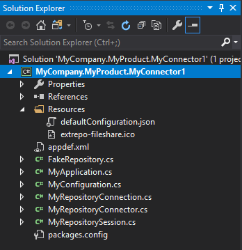
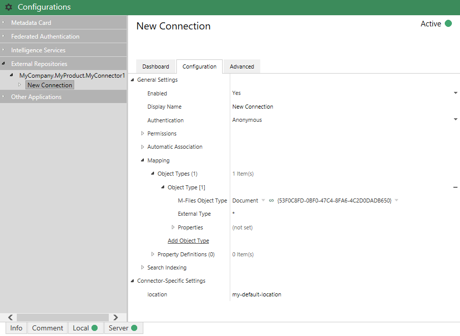
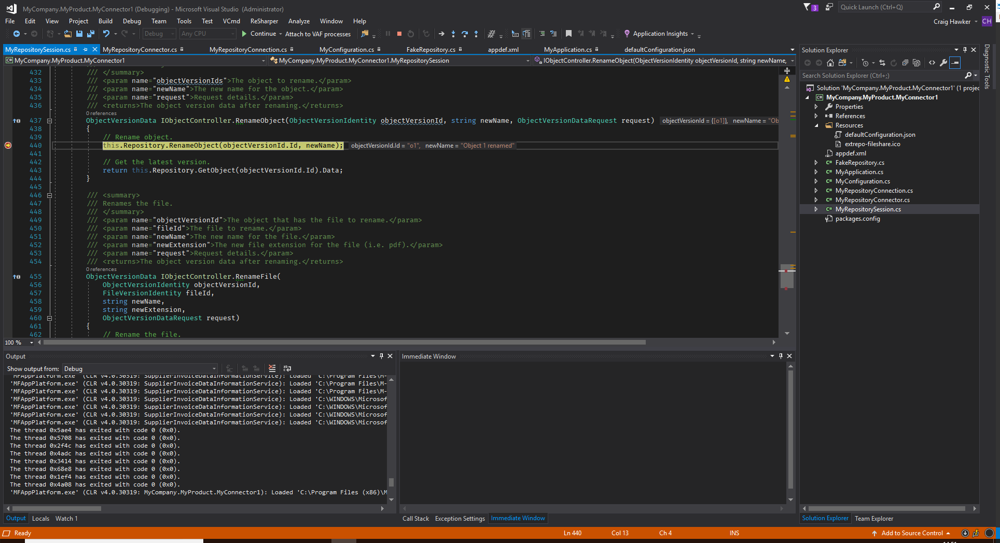

M-Files provides partners with a Visual Studio 2015/2017 template that can be used to develop Intelligent Metadata Layer External Repository Connectors using C#.

When installing the template into Visual Studio 2017, a popup will be shown stating that the template does not use the 2017 format.  This is expected, as the template is backwards compatible with Visual Studio 2015 as well.  Simply accept the popup and continue installation.
{:.note}

Testing of Intelligent Metadata Layer components requires that you are running a version of M-Files that includes the IML Core licence component.  This is typically not included in development licences.
{:.note.warning}

## Downloading the Template

The External Repository Connector template is part of the `M-Files 2018 Visual Studio template package`, which can be downloaded from the [M-Files Partner Portal]().  If you are a partner and do not have access to the M-Files Partner Portal, then please contact your Channel Account Manager.  To install the template, simply double-click on the ".vsix" file, which will then guide you through installing the templates into the version of Visual Studio that you have installed.

## Building your first External Repository Connector

In this example we will create a basic External Repository Connector and install it into the Sample Vault, running on the local machine.  Note the following differences to typical Vault Application Framework development:

* Unlike the Vault Application Framework, External Repository Connectors must be manually deployed into the vault.
* Compared to the Vault Application Framework, the Visual Studio template includes significantly more boilerplate code to aid development.  *The External Repository Connectors template contains a `FakeRepository` which allows you to quickly get an example running, but you will want to replace it during development.*

### Creating an application from the template

Creating a new Vault Application Framework application can be done from within Visual Studio by clicking `File`, `New`, `Project`, then selecting `M-Files External Repository Connector` From the list of Visual C# templates:

### An overview of the project contents

The default project contains a number of items:

* `Resources\defaultConfiguration.json`
The default JSON configuration to apply on installation.
* `Resources\extrepo-fileshare.icon`
The icon to use for the external repository.
* `appdef.xml`
The application manifest file, containing information such as the publisher details and the current version number.
* `FakeRepository.cs`
An in-memory repository of folder and file information.  **This is only included as an example and should typically be removed when development starts.**
* `MyApplication.cs`
The entry point for the application.  Defines the services which the application exposes.
* `MyConfiguration.cs`
The configuration information.  Configuration members are defined in the same way as [Vault Application Framework 2.0 configuration]({{ site.baseurl }}/Frameworks/Vault-Application-Framework/Configuration).
* `MyRepositoryConnector.cs`
Provides basic information about the external repository connector itself (its name, GUID, etc.).
* `MyRepositoryConnection.cs`
Provides information and configuration for a specific connection to the external system (e.g. "A connection to \\server\share").
* `MyRepositorySession.cs`
The class used to interact with the external system as a specific user (e.g. "Bob using \\server\share").  Interfaces are used to describe the functionality available on the external system (e.g. object deletion).
* `packages.conf`
The packages configuration file details the [Nuget packages that are required](https://docs.microsoft.com/en-us/nuget/consume-packages/package-restore) for the Intelligence Service to run.

#### Connectors, connections and sessions

It is important to highlight the difference between connectors, connections and sessions; each have a specific part to play in the operation of the External Repository Connector.

* The `Connector` class describes the application in general (e.g. its name and global ID), and is primarily responsible for the instantiation of the `Connection` objects through the `GetRepositoryConnection` method.  A connector must inherit from `RepositoryConnectorService<RepositoryConnectorConfiguration<T>>`, where `T` is the class used for configuration.

* The `Connection` class describes a specific connection to an external repository connection, and is primarily responsible for the instantiation of the `Session` objects through the `Open` method.  This class describes a connection to a specific repository (e.g. the connection to "\\server\share").  A connection must inherit from `RepositoryConnection<RepositoryConnectorConfiguration<T>>`, where `T` is the class used for configuration.

* The `Session` class describes a connection to a specific external repository by a specific user, and is responsible for serving folder and object data as required.  These classes will be instantiated as required, either by the user interacting with M-Files, or by server processes such as building the full-text index.  The session may have access to the authentication details that the user has provided, and can use these to retrieve user-specific data from the external repository.  A session must inherit from `MarshalByRefObject`, and implements `IRepositorySession` and `IFolderSource` at a minimum.

### Creating an external repository connector

The Visual Studio Template project includes a dummy connector which exposes information held in a set of in-memory objects.  This tutorial will deal with building and running the dummy implementation.
{:.note}

### Building and deploying

To build and deploy the project, either select the `Build` menu item within Visual Studio and select `Build Solution`, or press F6, or press `Ctrl-Shift-B`.  Any errors during build will be shown within the Visual Studio "Output" or "Error List" windows.

Locate the `.mfappx` file in the build output (`/bin/Debug`, or `/bin/Release`, by default), and use the M-Files Admin software to install it into the `Applications` list (right-click on the vault name and select `Applications`).  The vault will require a restart once the application is installed.

### Configuring

To configure the External Repository Connector, expand the vault in the M-Files Admin software and select the `Configurations` node.  Expanding the `External Repositories` list should show the new External Repository Connector.  Click on the name of the connector and select `Add Connection` from the dashboard screen.  The new connection can be configured by selecting the connection on the left, and selecting the `Configuration` tab.  At a minimum, the following needs to be checked:

* Under `General Settings`, `Enabled` must be set to `Yes`.
* Under `General Settings | Mapping`, an object type mapping must exist from `Document` to the external type of `*`.  *The default configuration JSON should create this mapping for you.*
* If any changes have been made, click `Save`.

### Testing

To test the External Repository Connector, open the M-Files desktop client and navigate to the vault into which the connector is installed.  The new connection should appear in the `External Views` section:

If the connection is not shown then check for any build/deployment errors, or for exceptions in the Windows Event Log.
{:.note}

Navigating into the view structure should show objects and subobjects:

## Debugging

Intelligence Services can be debugged in the same manner as [Vault Application Framework applications]({{ site.baseurl }}/Frameworks/Vault-Application-Framework/Development-Practices/Debugging/):

1. Place a breakpoint within the code - in this case within the background operation.
2. Select `Debug` and select `Attach to Process`
3. Select all the `MFAppPlatform.exe` processes and select `Attach`.

## Tips and tricks

### Application GUIDs

Whenever an application is created from the Visual Studio template, the `<guid></guid>` element in `appdef.xml` is automatically set to be a new Globally Unique IDentifier.  This GUID is used to uniquely identify each application, as each M-Files vault can only have one application with each GUID installed.

If you manually create an `appdef.xml` file, or copy it from another location, you must ensure that the guid is altered to be unique.  There are a number of [online tools](https://www.bing.com/search?q=guid+generator) that can be used to generate GUIDs.  Note that the GUID should be entered into the `<guid></guid>` element without braces, but with hyphens (e.g. `<guid>f7fbe39a-2031-4b42-9856-05444ecce446</guid>`).