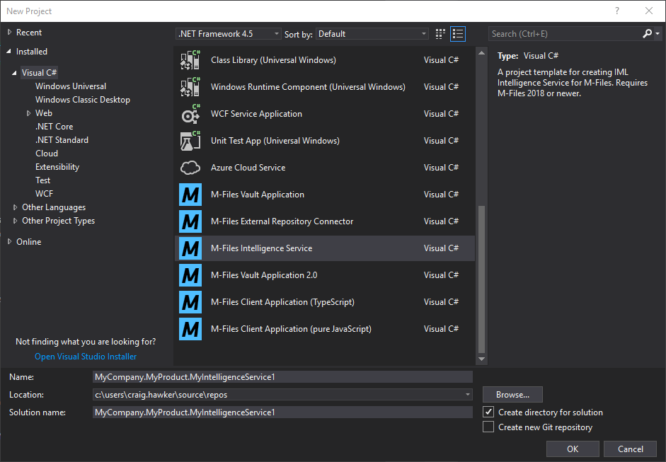
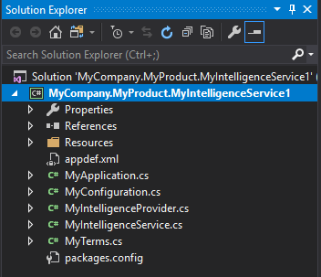
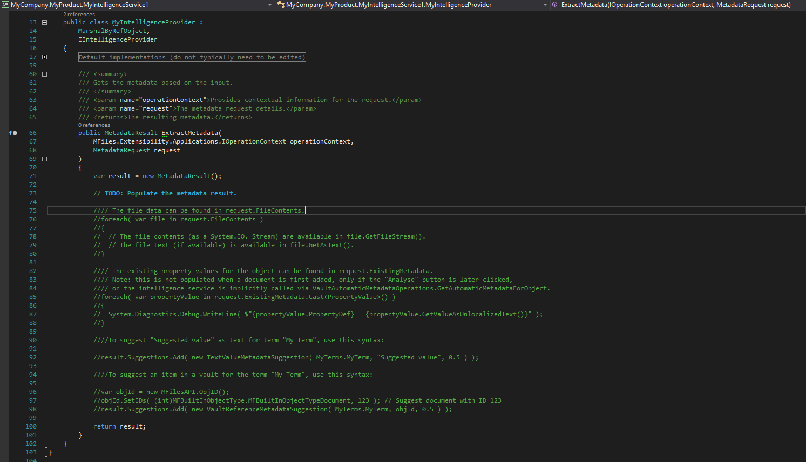
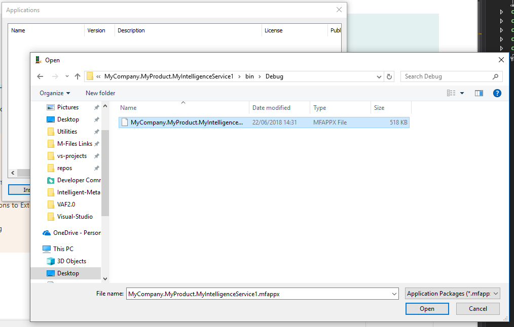
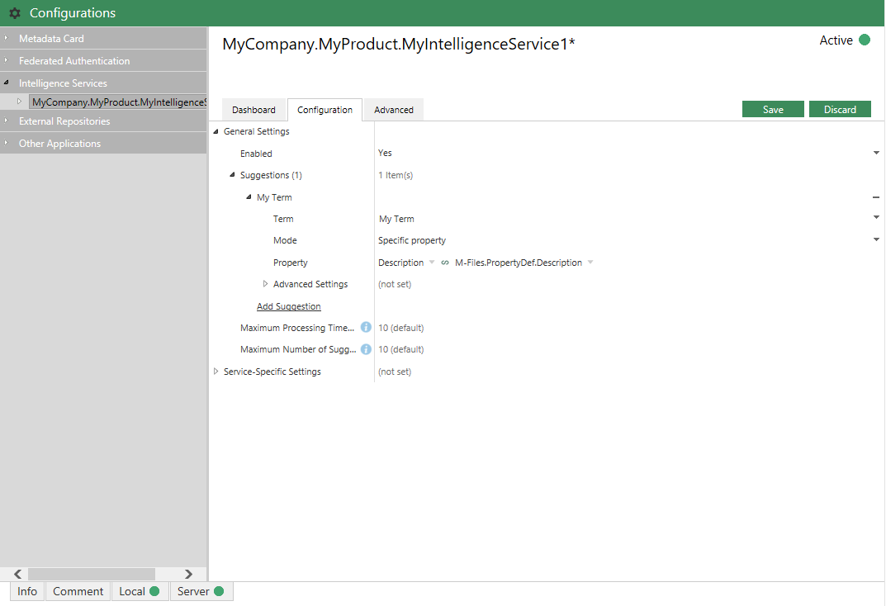
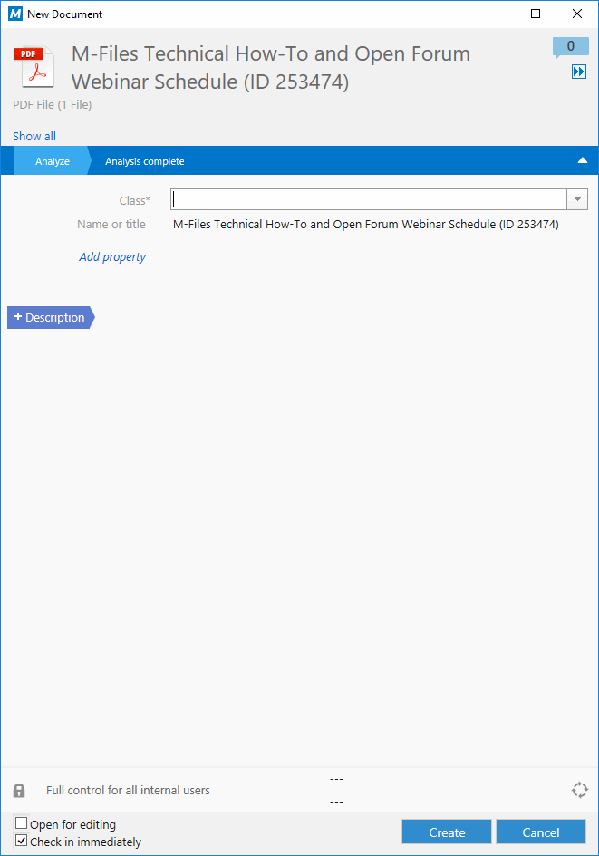
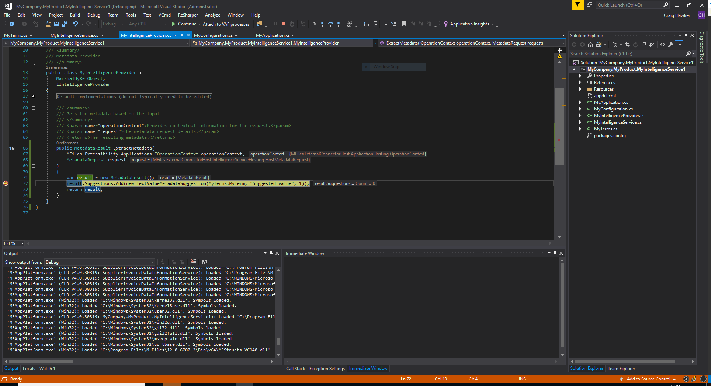

M-Files provides developers with Visual Studio 2017/2019 templates that can be used to rapidly develop Intelligent Metadata Layer Applications using C#.  The template below is part of the M-Files Visual Studio Template Package, which can be downloaded from the [Visual Studio Marketplace](https://marketplace.visualstudio.com/items?itemName=M-Files.MFilesVisualStudioExtensions).
{:.note}

Testing of Intelligent Metadata Layer components requires that you are running a version of M-Files that includes the IML Core licence component.  This is typically not included in development licences.
{:.note.warning}

## Downloading the Template

The Intelligence Service template is part of the `M-Files Online Visual Studio template package`, which can be downloaded from the [Visual Studio Marketplace](https://marketplace.visualstudio.com/items?itemName=M-Files.MFilesVisualStudioExtensions).

## Building your first Intelligence Service

In this example we will create a basic Intelligence Service and install it into the Sample Vault, running on the local machine.  Note the following differences to typical Vault Application Framework development:

* Unlike the Vault Application Framework, Intelligence Services must be manually deployed into the vault.
* Compared to the Vault Application Framework, the Visual Studio template includes significantly more boilerplate code to aid development.

### Creating an application from the template

Creating a new Intelligence Service can be done from within Visual Studio by clicking `File`, `New`, `Project`, then selecting `M-Files Intelligence Service` From the list of Visual C# templates:



### An overview of the project contents



The default project contains a number of items:

* `Resources\defaultConfiguration.json`
The default JSON configuration to apply on installation.
* `appdef.xml`
The application manifest file, containing information such as the publisher details and the current version number.
* `MyApplication.cs`
The entry point for the application.  Defines the services which the application exposes.
* `MyConfiguration.cs`
The configuration information.  Configuration members are defined in the same way as [Vault Application Framework 2.0 configuration]({{ site.baseurl }}/Frameworks/Vault-Application-Framework/Configuration/).
* `MyIntelligenceProvider.cs`
Declares the `ExtractMetadata` method, which provides the metadata suggestions.
* `MyIntelligenceService.cs`
Defines the intelligence providers which the application exposes.
* `MyTerms.cs`
Defines the metadata term suggestions.  Once the service is installed, terms are mapped to individual vault property definitions during configuration.
* `packages.conf`
The packages configuration file details the [Nuget packages that are required](https://docs.microsoft.com/en-us/nuget/consume-packages/package-restore) for the Intelligence Service to run.

### Creating an intelligence service

This tutorial will focus on the minimum required changes to implement a working intelligence service.  To that end, the only required changes are to `MyIntelligenceProvider.cs` and `MyTerms.cs`.
{:.note}

#### Altering MyTerms

The default contents of `MyTerms.cs` defines no actual terms, but a term named `MyTerm` is commented out.  Start by uncommenting the declaration, and ensure that the value is also returned when `MyTerms.All` is retrieved:

```csharp
namespace MyCompany.MyProduct.MyIntelligenceService1
{
	/// <summary>
	/// Terms are used when returning suggested properties.
	/// This class is simply used to declare the terms as constants, rather than
	/// having strings manually typed everywhere.
	/// </summary>
	internal static class MyTerms
	{
		// Terms are used when returning suggested properties.
		// TODO: Add terms as constants here.
		internal const string MyTerm = "My Term";

		public static string[] All =
		{
			// TODO: Return all the available terms here, so they're added to the suggestions in the editor.
			MyTerms.MyTerm
		};
	}
}
```

#### Altering the intelligence provider



The only method that requires modification in `MyIntelligenceProvider.cs` is `ExtractMetadata`.  This method is called automatically by the server when a new document is being added, or when the `Analyse` button is clicked for any existing document.

The comments within the default implementation of `ExtractMetadata` show how to interact with the incoming metadata request, including how to read the file contents either as a [Stream](https://msdn.microsoft.com/en-us/library/system.io.stream(v=vs.110).aspx), or as text (if available).
{:.note}

To create a basic, hard-coded suggestion, we can simply add the suggestion to the result.  The code below will define a suggested value of "Suggested value" for the term "My Term", and provide a confidence level of 1.

```csharp
public MetadataResult ExtractMetadata(
	MFiles.Extensibility.Applications.IOperationContext operationContext,
	MetadataRequest request
)
{
	var result = new MetadataResult();
	result.Suggestions.Add( new TextValueMetadataSuggestion( MyTerms.MyTerm, "Suggested value", 1 ) );
	return result;
}
```

The code above creates a suggestion using the `TextValueMetadataSuggestion` class, which can then be placed into properties of type `Text`.  References to other items within the current vault can be returned using the `VaultReferenceMetadataSuggestion`.
{:.note}

### Building and deploying

To build and deploy the project, either select the `Build` menu item within Visual Studio and select `Build Solution`, or press F6, or press `Ctrl-Shift-B`.  Any errors during build will be shown within the Visual Studio "Output" or "Error List" windows.

Locate the `.mfappx` file in the build output (`/bin/Debug`, or `/bin/Release`, by default), and use the M-Files Admin software to install it into the `Applications` list (right-click on the vault name and select `Applications`).  The vault will require a restart once the application is installed.



### Configuring

To configure the Intelligence Service, expand the vault in the M-Files Admin software and select the `Configurations` node.  Expanding the `Intelligence Services` list should show the new Intelligence Service, and selecting the `Configuration` tab will allow it to be configured.  At a minimum, the following needs to be checked:

* Under `General Settings`, `Enabled` must be set to `Yes`.
* Under `Suggestions`, add one suggestion and map our term (`My Term`) to a property in the vault.  In this example, the suggestion was for a text value, so the Intelligence Service has been configured to put the suggestion into the `Description` (text) property.
* If any changes have been made, click `Save`.



### Testing

To test the Intelligence Service, open the M-Files desktop client and navigate to the vault into which the Intelligence Service is installed.  Add a document through any standard means (e.g. drag and drop from the desktop), and your suggestion should be shown:



If the suggestion is not shown then check for any build/deployment errors, or for exceptions in the Windows Event Log.
{:.note}

## Debugging

Intelligence Services can be debugged in the same manner as [Vault Application Framework applications]({{ site.baseurl }}/Frameworks/Vault-Application-Framework/Development-Practices/Debugging/):

1. Place a breakpoint within the code - in this case within the background operation.
2. Select `Debug` and select `Attach to Process`
3. Select all the `MFAppPlatform.exe` processes and select `Attach`.



## Tips and tricks

### Application GUIDs

Whenever an application is created from the Visual Studio template, the `<guid></guid>` element in `appdef.xml` is automatically set to be a new Globally Unique IDentifier.  This GUID is used to uniquely identify each application, as each M-Files vault can only have one application with each GUID installed.

If you manually create an `appdef.xml` file, or copy it from another location, you must ensure that the guid is altered to be unique.  There are a number of [online tools](https://www.bing.com/search?q=guid+generator) that can be used to generate GUIDs.  Note that the GUID should be entered into the `<guid></guid>` element without braces, but with hyphens (e.g. `<guid>f7fbe39a-2031-4b42-9856-05444ecce446</guid>`).