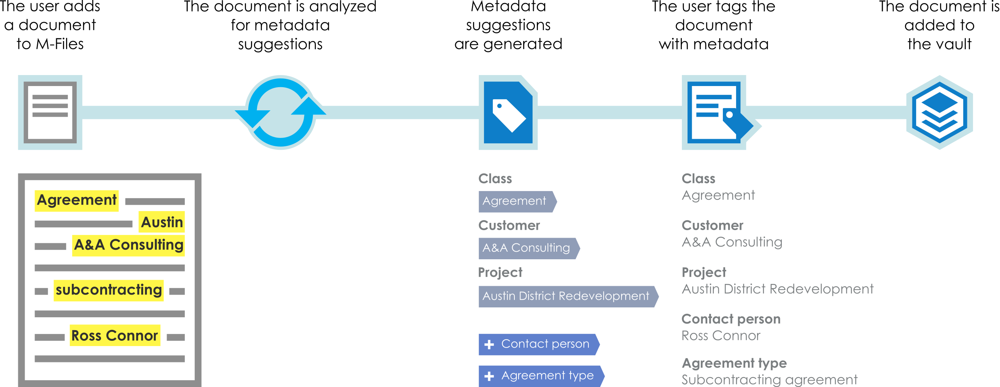

Intelligence Services analyse files being added to M-Files and can suggest values for items on the object's metadata card.  Developers provide their own suggestions by building their own [intelligence services]({{ site.baseurl }}/Intelligent-Metadata-Layer/Intelligence-Services), utilising online services, AI techniques, or their own custom logic.

## Locating Intelligence Services

Intelligence Services built by M-Files or one of our Certified Application Partners can be found on the [M-Files Solution Catalog](https://catalog.m-files.com/product-category/intelligence-services/).
{:.note.store}

## Installing and configuring Intelligence Services

Intelligence Services are installed and configured in an identical way to [Vault Application Framework]({{ site.baseurl }}/Frameworks/Vault-Application-Framework) applications; by using the M-Files Admin tool.  The online user guide [details how to install an Intelligence Service](https://www.m-files.com/user-guide/latest/eng/adding_an_intelligence_service.html).

Intelligence Services may or may not require an additional licence to run.  Licences are installed using the M-Files Admin tool, in the same `Applications` dialog used to install the service itself.
{:.note}

Once installed, the M-Files Admin tool can be used to then configure the Intelligence Service.  Whilst the `Service-specific` configuration process may differ for each individual component, our online user guide [details how to configure Intelligence Services](https://www.m-files.com/user-guide/latest/eng/configuring_an_intelligence_service.html).

## Custom Intelligence Services

M-Files is proactively supporting partners looking to build their own Intelligence Services.  Intelligence Services can be [created using the Visual Studio template](Visual-Studio).

Intelligence Services built by [Certified Application Partners](https://www.m-files.com/en/cap) can be published into the [M-Files Solution Catalog](https://catalog.m-files.com/product-category/intelligence-services/).
{:.note}