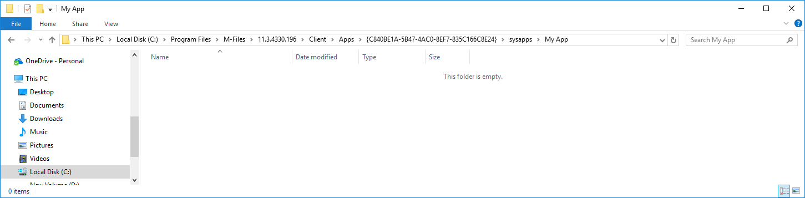

Developing applications can be done without direct access to the M-Files Server.  This allows developers to test code on their machines before deploying it to multiple users.  To develop applications locally you will need to know the [GUID of the vault you wish to test the application in]({{ site.baseurl }}/Frameworks/User-Interface-Extensibility-Framework/Pre-Approval/#the-m-files-vault-guid), and the [version of M-Files that is running on your machine]({{ site.baseurl }}/Frameworks/User-Interface-Extensibility-Framework/Pre-Approval/#the-m-files-client-version) (note: the version of M-Files on your machine may be different to that running on the server).  The application files, such as the [application definition file]({{ site.baseurl }}/Frameworks/User-Interface-Extensibility-Framework/Application-Definition/), [module files]({{ site.baseurl }}/Frameworks/User-Interface-Extensibility-Framework/Modules/) or any [dashboard content]({{ site.baseurl }}/Frameworks/User-Interface-Extensibility-Framework/Dashboards/) can be saved into this folder.

To develop a local application named `My App` locally, create the following folder structure replacing `<version>` with the M-Files client version, and `<guid>` with the GUID of the vault:

`C:\Program Files\M-Files\<version>\Client\Apps\<guid>\sysapps\My App`

For example, for an application running in a vault with GUID `{C840BE1A-5B47-4AC0-8EF7-835C166C8E24}` on M-Files client version `11.3.4330.196`, the following folder should be created:

`C:\Program Files\M-Files\11.3.4330.196\Client\Apps\{C840BE1A-5B47-4AC0-8EF7-835C166C8E24}\sysapps\My App`

Once the applications are complete, the contents of the folder can be zipped up and [deployed to the live vault using the M-Files Admin tool]({{ site.baseurl }}/Frameworks/User-Interface-Extensibility-Framework/Development-Practices/Deployment/).  The application will be offered to users to install next time they connect to the vault.  This screen can be avoided - and the application forcibly installed - by [pre-approving it using registry keys]({{ site.baseurl }}/Frameworks/User-Interface-Extensibility-Framework/Pre-Approval/).

To test your application, simply log into the M-Files vault using the M-Files Desktop client on the same machine as the local development folder.  Changes will only be loaded when you log out and log in again to the vault.
{:.note}

The local development area is also used to hold local copies of applications installed into the vault.  You cannot use this location to develop new versions of an existing application unless you alter the application's <a href="{{ site.baseurl }}/Frameworks/User-Interface-Extensibility-Framework/Application-Definition/#guid-formatting">GUID</a> so that it is different to the live version.
{:.note.warning}