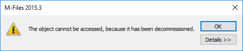

## Handling multiple listings and shell frames

When working with [ShellUI modules]({{ site.baseurl }}/Frameworks/User-Interface-Extensibility-Framework/Modules/#shellui), it is important to understand that multiple objects of the same type may be created within the lifecycle of a module, and it is up to the developer to handle this fact.

For example: in a typical `ShellUI` module,  a developer may [register to be notified](../Event-Registration-And-Entry-Points/) when a `ShellListing` is created within the current `ShellFrame` and, from there, register to be notified when the items selected in the listing change.  However, in many situations there may be multiple listings within each shell frame (e.g. the home page contains one shell listing for the central area, plus others including "Recently accessed by me" and "Assigned to me"), and selecting items in one may cause events to be raised in others.

In this example, the handler may check <a href="https://www.m-files.com/UI_Extensibility_Framework/index.html#MFClientScript~IShellListing~IsActive.html">IsActive</a> on the listing that raised the event to ensure that they only handle events for the listing that the user is interacting with.
{:.note}

In another example - [detailed further below](#global-scoped-variables) - multiple `ShellFrame` objects may be instantiated at the same time within one window.  Code that assumes that there is only one `ShellFrame` at any one time may fail when the second `ShellFrame` is instantiated.


## Global-scoped variables

Care must be taken with global-scope variables.  The code below will seem to function correctly when tested in the following way:

1. Open M-Files.
2. Click the `My Command` button in the task pane.
3. Note the message stating *Command Clicked*.

```javascript
// NOTE! This code is for demonstration purposes only and does not contain any kind of
// 		 error handling. MUST be revised before using in production.

"use strict";

// A reference to the current shell frame.
var g_shellFrame = null;

function OnNewShellUI( shellUI )
{
	/// <summary>Executed by the UIX when a ShellUI module is started.</summary>
	/// <param name="shellUI" type="MFiles.ShellUI">The shell UI object which was created.</param>
 
	// This is the start point of a ShellUI module.
	
	// Register to be notified when a new normal shell frame (Event_NewNormalShellFrame) is created.
	// We use Event_NewNormalShellFrame rather than Event_NewShellFrame as this won't fire for history (etc.) dialogs.
	// ref: https://www.m-files.com/UI_Extensibility_Framework/index.html#Event_NewNormalShellFrame.html
	shellUI.Events.Register(
		Event_NewNormalShellFrame,
		handleNewShellFrame );
}
 
function handleNewShellFrame(shellFrame)
{
	/// <summary>Handles the OnNewNormalShellFrame event for an IShellUI.</summary>
	/// <param name="shellFrame" type="MFiles.ShellFrame">The shell frame object which was created.</param>
 
	// The shell frame was created but it cannot be used yet.
	// The following line would throw an exception ("The object cannot be accessed, because it is not ready."):
	// shellFrame.ShowMessage("A shell frame was created");

	// Update our global shell frame reference.
	g_shellFrame = shellFrame;
 
	// Register to be notified when the shell frame is started.
	shellFrame.Events.Register(
		Event_Started,
		handleShellFrameStarted );
}
 
function handleShellFrameStarted()
{
	/// <summary>Handles the OnStarted event for an IShellFrame.</summary>

	// Create a command (button).  Note that it is not yet visible.
	// ref: https://www.m-files.com/UI_Extensibility_Framework/index.html#MFClientScript~ICommands~CreateCustomCommand.html
	var myCommandId = g_shellFrame.Commands.CreateCustomCommand( "My Command" );

	// Add the first and second commands to the task area.
	// ref: https://www.m-files.com/UI_Extensibility_Framework/index.html#MFClientScript~ITaskPane~AddCustomCommandToGroup.html
	try
	{
		g_shellFrame.TaskPane.AddCustomCommandToGroup( myCommandId, TaskPaneGroup_Main, 1 );
	}
	catch (e) {
		// This will except if the task pane is not available (e.g. in a History view).
	}

	// Register to be notified when a custom command is clicked.
	// Note: this will fire for ALL custom commands, so we need to filter out others.
	g_shellFrame.Commands.Events.Register(
		Event_CustomCommand,
		function(commandId) {
			// Branch depending on the Id of the command that was clicked.
			switch (commandId) {
				case myCommandId:
					// Our first command was clicked.
					g_shellFrame.ShowMessage("Command clicked");
					break;
			}
		} );
}
```

**However** this code will fail in the following scenario:

1. Select an object.
2. Click the `History` item in the task pane (or right-click on the item and select `History`).
3. Close the `History` window.
4. Click `My Command` again.

This will result in the following error:



The following process occurred:

1. A shell frame was created (`handleNewShellFrame` was called and `g_shellFrame` was set to a reference for the main M-Files window).
2. The command was created in the task pane.
3. The user clicked `History`.
4. A shell frame was created (`handleNewShellFrame` was called and `g_shellFrame` was set to a reference for the 'History' window).
5. The user closed the `History` window.
6. The command was clicked but `g_shellFrame` (line 68) referred to a now-disposed object.

Instead, a [closure](https://developer.mozilla.org/en-US/docs/Web/JavaScript/Closures) should be used to ensure that the correctly-scoped object is available.  In the following code, the newly-starrted `shellFrame` is passed into a function (line 33) which returns a function to be executed when the shell frame starts (lines 40-73).  This makes the appropriate `shellFrame` available later in the code, removing the requirement for the global variable:

```javascript
// NOTE! This code is for demonstration purposes only and does not contain any kind of
// 		 error handling. MUST be revised before using in production.

"use strict";

function OnNewShellUI( shellUI )
{
	/// <summary>Executed by the UIX when a ShellUI module is started.</summary>
	/// <param name="shellUI" type="MFiles.ShellUI">The shell UI object which was created.</param>
 
	// This is the start point of a ShellUI module.
	
	// Register to be notified when a new normal shell frame (Event_NewNormalShellFrame) is created.
	// We use Event_NewNormalShellFrame rather than Event_NewShellFrame as this won't fire for history (etc.) dialogs.
	// ref: https://www.m-files.com/UI_Extensibility_Framework/index.html#Event_NewNormalShellFrame.html
	shellUI.Events.Register(
		Event_NewNormalShellFrame,
		handleNewShellFrame );
}
 
function handleNewShellFrame(shellFrame)
{
	/// <summary>Handles the OnNewNormalShellFrame event for an IShellUI.</summary>
	/// <param name="shellFrame" type="MFiles.ShellFrame">The shell frame object which was created.</param>
 
	// The shell frame was created but it cannot be used yet.
	// The following line would throw an exception ("The object cannot be accessed, because it is not ready."):
	// shellFrame.ShowMessage("A shell frame was created");
 
	// Register to be notified when the shell frame is started.
	shellFrame.Events.Register(
		Event_Started,
		getShellFrameStartedHandler(shellFrame) );
}
 
function getShellFrameStartedHandler(shellFrame)
{
	/// <summary>Returns a function which handles the OnStarted event for an IShellFrame.</summary>

	return function()
	{
		// Create a command (button).  Note that it is not yet visible.
		// ref: https://www.m-files.com/UI_Extensibility_Framework/index.html#MFClientScript~ICommands~CreateCustomCommand.html
		var myCommandId = shellFrame.Commands.CreateCustomCommand( "My Command" );

		// Add the first and second commands to the task area.
		// ref: https://www.m-files.com/UI_Extensibility_Framework/index.html#MFClientScript~ITaskPane~AddCustomCommandToGroup.html
		try
		{
			shellFrame.TaskPane.AddCustomCommandToGroup( myCommandId, TaskPaneGroup_Main, 1 );
		}
		catch (e)
		{
			// This will except if the task pane is not available (e.g. in a History view).
		}

		// Register to be notified when a custom command is clicked.
		// Note: this will fire for ALL custom commands, so we need to filter out others.
		shellFrame.Commands.Events.Register(
			Event_CustomCommand,
			function(commandId)
			{
				// Branch depending on the Id of the command that was clicked.
				switch (commandId)
				{
					case myCommandId:
						// Our first command was clicked.
						shellFrame.ShowMessage( "Command clicked" );
						break;
				}
			} );

	};
}
```