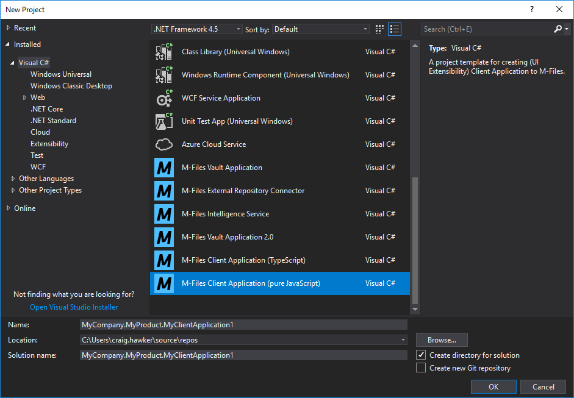
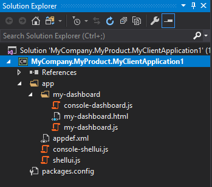
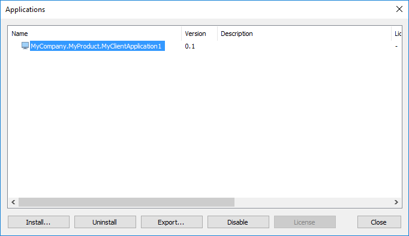
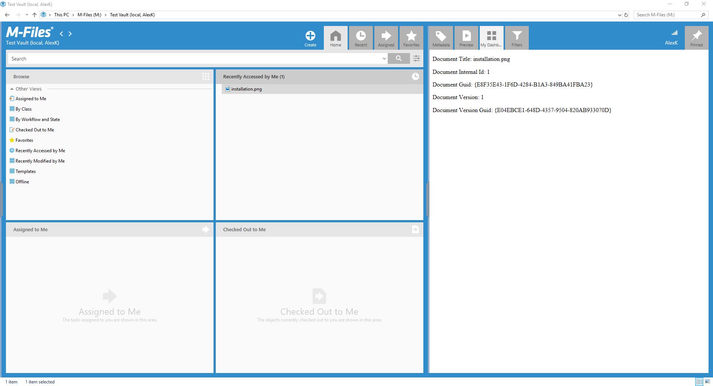

M-Files provides developers with a Visual Studio 2017/2019 template that can be used to develop User Interface Extensibility [ShellUI](../Modules#shellui) components using JScript/Javascript or TypeScript.  Other [module types](../Modules) are not currently supported.

## Downloading the Template

The UIX templates are part of the `M-Files Online Visual Studio template package`, which can be downloaded from the [Visual Studio Marketplace](https://marketplace.visualstudio.com/items?itemName=M-Files.MFilesVisualStudioExtensions).

## JavaScript vs TypeScript

User Interface Extensibility Framework modules are typically developed using JavaScript, but developing native JavaScript components can be frustrating.  By default, JavaScript development typically has no IntelliSense or compile-time type checking, resulting in slower and longer development cycles.

TypeScript aims to resolve some of the primary issues with native JavaScript development.  TypeScript has a similar structure to JavaScript, but incorporates optional type information to make the development process simpler.  This TypeScript is then compiled into native JavaScript before it's run.

This tutorial will not focus on TypeScript, but on developing "pure JavaScript" solutions instead.  More information on TypeScript is available [on the official TypeScript website](https://www.typescriptlang.org/).
{:.note}

### Creating a ShellUI client application from the template

Creating a new ShellUI client application can be done from within Visual Studio by clicking `File`, `New`, `Project`, then selecting `M-Files Client Application (pure JavaScript)` From the list of Visual C# templates:



The template only supports creation of ShellUI-based UIX applications at this time.  The resultant template can be manually altered to contain other modules, or to convert the ShellUI module to VaultUI or VaultCore, as appropriate.
{:.note}

### An overview of the project contents



The default project contains a number of items:

* `app\my-dashboard\console-dashboard.js`
Enables interaction from the dashboard into Jive.
* `app\my-dashboard\my-dashboard.html`
A sample dashboard.
* `app\my-dashboard\my-dashboard.js`
Contains the logic for the sample dashboard.
* `appdef.xml`
The application manifest file, containing information such as the publisher details and the current version number.
* `console-shellui.js`
Enables interaction from the ShellUI module into Jive.
* `shellui.js`
A sample ShellUI module.

## Building and deploying

To build and deploy the project, either select the `Build` menu item within Visual Studio and select `Build Solution`, or press F6, or press `Ctrl-Shift-B`.  Any errors during build will be shown within the Visual Studio "Output" or "Error List" windows.

Locate the `.mfappx` file in the build output (`/out`), and use the M-Files Admin software to install it into the `Applications` list (right-click on the vault name and select `Applications`).  The vault will require a restart once the application is installed.



During the development process it may instead be worth deploying the application to the [local development folder](https://developer.m-files.com/Frameworks/User-Interface-Extensibility-Framework/Development-Practices/Local-Development-Folder/).  Use of this is beyond the scope of this document.
{:.note}

## Testing

To test the application, open the M-Files Desktop client and navigate to a document within the vault.  When the document is selected, a tab named "My Dashboard" is selected on the right-hand section, and content from the sample dashboard is displayed.



## Tips and tricks

### Application GUIDs

Whenever an application is created from the Visual Studio template, the `<guid></guid>` element in `appdef.xml` is automatically set to be a new Globally Unique IDentifier.  This GUID is used to uniquely identify each application, as each M-Files vault can only have one application with each GUID installed.

If you manually create an `appdef.xml` file, or copy it from another location, you must ensure that the guid is altered to be unique.  There are a number of [online tools](https://www.bing.com/search?q=guid+generator) that can be used to generate GUIDs.  Note that the GUID should be entered into the `<guid></guid>` element without braces, but with hyphens (e.g. `<guid>f7fbe39a-2031-4b42-9856-05444ecce446</guid>`).

### Downgrading the UIX template

The template included in the [M-Files Online Visual Studio Template Package](https://marketplace.visualstudio.com/items?itemName=M-Files.MFilesVisualStudioExtensions) targets the [v4 schema](../Application-Definition/#v4-schema).  Applications using this schema cannot be loaded by M-Files Server 20.11 and M-Files Client 20.11 or older.  Therefore, if you must include compatibility for older releases of M-Files, you must manually alter the `appdef.xml` file that the template produces.

Change this:
```
<application xmlns:xsi="http://www.w3.org/2001/XMLSchema-instance"
             xsi:noNamespaceSchemaLocation="http://www.m-files.com/schemas/appdef-client-v4.xsd">
```

To this:
```
<application xmlns:xsi="http://www.w3.org/2001/XMLSchema-instance"
             xsi:noNamespaceSchemaLocation="http://www.m-files.com/schemas/appdef-client-v3.xsd">
```

If you have also added `fast-browsing-compatible` attributes to your ShellUI module declarations then you must also remove these.