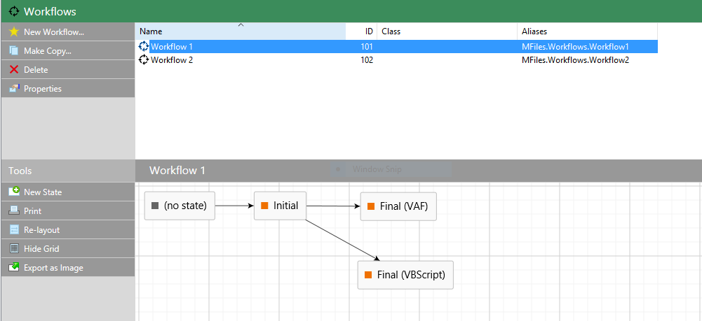
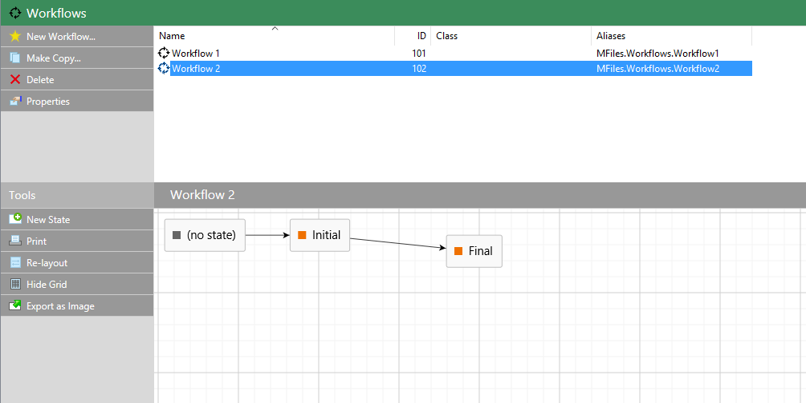
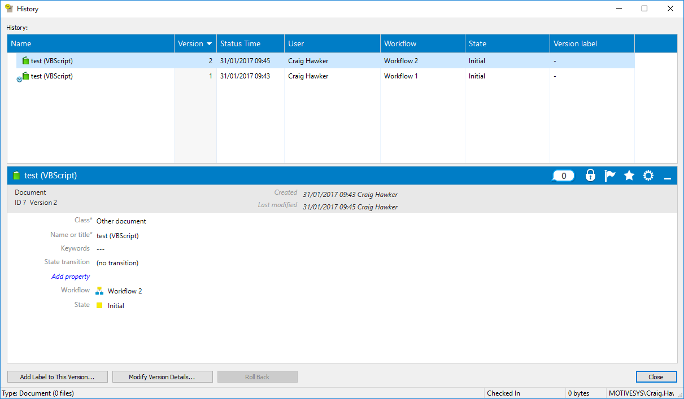

This sample shows how to move an object from one workflow to another once it reaches a specific state.  This technique can be used to split complex workflows into smaller, more managable processes for staff.

## Overview

In our sample, we will create two workflows, imaginatively called `Workflow 1` and `Workflow 2`.  An object will start in Workflow 1 then, when a state is reached, it will be automatically placed into the start of `Workflow 2`.

The sample includes two versions of the code: one written using VBScript, and one written using the Vault Application Framework.  Full source code for the Vault Application Framework application is available on our code library site, along with a vault backup (created in M-Files 2015.3) which can be used to run the code against your own server.

### Workflow 1



This workflow contains three states:

* `Initial`
This is where objects start the first workflow.  The user then can choose to move the object to the `Final (VAF)` or `Final (VBScript)` states.  These states perform the same actions; the only difference is the language that's used for implementation.
* `Final (VAF)`
Contains a VBScript proxy that calls the [Vault Application Framework]({{ site.baseurl }}/Frameworks/Vault-Application-Frameworkn-Framework/) application to move the item to the next workflow.
* `Final (VBScript)
Contains VBScript that moves the item to the next workflow.

### Workflow 2



This workflow contains two states:

* `Initial`
This is where objects start the second workflow.  The user can choose to move the object to the `Final` state, although this does nothing.
* `Final`
A sample further state which the object could progress to.

<p class="note">The workflows and workflow states have been assigned <a href="{{ site.baseurl }}/Concepts/Aliases/">aliases</a> so that the code can reference the new
workflow and state to put the object into.  The Vault Application Framework also uses the alias of the "Final (VAF)" workflow state to automatically create the VBScript proxy that
it uses to run.</p>

## The code

### Pseudo-code

The workflow, and the workflow state, that an object is in are simply metadata properties attached to the object, in exactly the same way that properties such as the name or date created are.  Our script simply needs to alter these properties when the item reaches the correct point in the workflow.  Unfortunately we cannot use the built-in [Set Properties](http://www.m-files.com/user-guide/latest/eng/#State_actions.html) functionality, as these built-in properties don't appear in the list.

The basic process of our code will be:

* Look up the Ids of the workflow and workflow states that we will move to (by using their aliases).
* Find the existing workflow and workflow state properties on the object and update them to the new ids.
* Save our changes to the object.
* Handle issues with the audit trail.

<p class="note">Whenever we update an object during a workflow state action or event handler (e.g. using <a href="https://www.m-files.com/api/documentation/latest/index.html#MFilesAPI~VaultObjectPropertyOperations~SetProperty.html">SetProperty</a> or <a href="https://www.m-files.com/api/documentation/latest/index.html#MFilesAPI~VaultObjectPropertyOperations~SetProperties.html">SetProperties</a>), we must call <a href="https://www.m-files.com/api/documentation/latest/index.html#MFilesAPI~VaultObjectPropertyOperations~SetLastModificationInfoAdmin.html">SetLastModificationInfoAdmin</a> to ensure that the correct user is shown in the audit trail, otherwise "(M-Files Server)" will be shown.</p>

### VBScript

```vbscript
Option Explicit

' These are the element aliases we will use.
Const strWorkflowTwoAlias = "MFiles.Workflows.Workflow2"
Const strWorkflowTwoInitialStateAlias = "MFiles.WorkflowStates.Workflow2.Initial"

' Convert the aliases to IDs in the current vault.
Dim intWorkflowTwoId
intWorkflowTwoId = Vault.WorkflowOperations.GetWorkflowIDByAlias(strWorkflowTwoAlias)
Dim intWorkflowTwoInitialStateId
intWorkflowTwoInitialStateId = Vault.WorkflowOperations.GetWorkflowStateIDByAlias(strWorkflowTwoInitialStateAlias)

' Get the workflow property value (hard-coded as always 38).
' Note: in this context we WILL have a workflow value, but most code
' should be written defensively to assume we do not.
Dim objWorkflowPropertyValue
Set objWorkflowPropertyValue = PropertyValues.SearchForProperty(38)

' Get the workflow state property value (hard-coded as always 39).
' Note: in this context we WILL have a workflow state value, but most code
' should be written defensively to assume we do not.
Dim objWorkflowStatePropertyValue
Set objWorkflowStatePropertyValue = PropertyValues.SearchForProperty(39)

' Set the property values.
objWorkflowPropertyValue.Value.SetValue MFDataTypeLookup, intWorkflowTwoId
objWorkflowStatePropertyValue.Value.SetValue MFDataTypeLookup, intWorkflowTwoInitialStateId

' Set up our collection of property values to save.
Dim objPropertyValuesToSave
Set objPropertyValuesToSave = CreateObject("MFilesAPI.PropertyValues")
objPropertyValuesToSave.Add 0, objWorkflowPropertyValue
objPropertyValuesToSave.Add 0, objWorkflowStatePropertyValue

' Save the changes.
Vault.ObjectPropertyOperations.SetProperties objVer, objPropertyValuesToSave

' Ensure the last modified is correct.
Dim objLastModifiedBy: Set objLastModifiedBy = CreateObject("MFilesAPI.TypedValue")
objLastModifiedBy.SetValue MFDataTypeLookup, CurrentUserId
Vault.ObjectPropertyOperations.SetLastModificationInfoAdmin ObjVer, true, objLastModifiedBy, false, Nothing
```

### Vault Application Framework

<p class="note">The content below only shows the classes required for this to function.  A full set of source code is included in the sample project.</p>

```csharp

	/// <summary>
	/// Configuration for the ChainWorkflows sample to run.
	/// </summary>
	public class Configuration
	{
		/// <summary>
		/// The alias of the first workflow (the one we will move FROM).
		/// </summary>
		internal const string WorkflowOneAlias = "MFiles.Workflows.Workflow1";

		/// <summary>
		/// The alias of the second workflow (the one we will move TO).
		/// </summary>
		internal const string WorkflowTwoAlias = "MFiles.Workflows.Workflow2";

		/// <summary>
		/// The alias of the final state in the first workflow (the one we will move FROM).
		/// </summary>
		internal const string WorkflowOneStateFinalAlias = "MFiles.WorkflowStates.Workflow1.Final";

		/// <summary>
		/// The alias of the initial state in the second workflow (the one we will move TO).
		/// </summary>
		internal const string WorkflowTwoStateInitialAlias = "MFiles.WorkflowStates.Workflow2.Initial";

		/// <summary>
		/// A reference to the first workflow.
		/// </summary>
		/// <remarks>This is initially set to <see cref="WorkflowOneAlias"/>, and is resolved at runtime to the correct Id.</remarks>

		[MFWorkflow(Required = true)]
		public MFIdentifier WorkflowOne = WorkflowOneAlias;

		/// <summary>
		/// A reference to the second workflow.
		/// </summary>
		/// <remarks>This is initially set to <see cref="WorkflowTwoAlias"/>, and is resolved at runtime to the correct Id.</remarks>
		[MFWorkflow(Required = true)]
		public MFIdentifier WorkflowTwo = WorkflowTwoAlias;

		/// <summary>
		/// A reference to the final state on the first workflow.
		/// </summary>
		/// <remarks>This is initially set to <see cref="WorkflowOneStateFinalAlias"/>, and is resolved at runtime to the correct Id.</remarks>
		[MFState(Required = true)]
		public MFIdentifier WorkflowOneStateFinal = WorkflowOneStateFinalAlias;

		/// <summary>
		/// A reference to the initial state on the second workflow.
		/// </summary>
		/// <remarks>This is initially set to <see cref="WorkflowTwoStateInitialAlias"/>, and is resolved at runtime to the correct Id.</remarks>
		[MFState(Required = true)]
		public MFIdentifier WorkflowTwoStateInitial= WorkflowTwoStateInitialAlias;

	}

	/// <summary>
	/// A vault application that moves objects which hit the end of one workflow
	/// to the start of another workflow.
	/// </summary>
	public class VaultApplication 
		: VaultApplicationBase
	{
		/// <summary>
		/// The running configuration, loaded from Name-Value storage.
		/// </summary>
		[MFConfiguration("ChainWorkflows", "config")]
		private readonly Configuration config = new Configuration();
		
		/// <summary>
		/// Handles when the end of the first workflow is hit,
		/// updating the object and moving it to the start of the second workflow.
		/// </summary>
		/// <param name="env">The state environment.</param>
		[StateAction(Configuration.WorkflowOneStateFinalAlias)]
		public void HandleWorkflowOneFinalState(StateEnvironment env)
		{
			// Update the local collection of property values to
			// move it to the next workflow.
			// NOTE: SetProperty only updates the in-memory copy, not the server. The subsequent call to SaveProperties actually updates the object.
			// NOTE: Using SaveProperty instead would update the version on the server immediately. Multiple calls to SaveProperty can slow your code down.
			env.ObjVerEx.SetProperty((int) MFBuiltInPropertyDef.MFBuiltInPropertyDefWorkflow,
				MFDataType.MFDatatypeLookup,
				this.config.WorkflowTwo);

			// Update the local collection of property values to
			// move it to the correct workflow state.
			// NOTE: SetProperty only updates the in-memory copy, not the server. The subsequent call to SaveProperties actually updates the object.
			// NOTE: Using SaveProperty instead would update the version on the server immediately. Multiple calls to SaveProperty can slow your code down.
			env.ObjVerEx.SetProperty((int) MFBuiltInPropertyDef.MFBuiltInPropertyDefState,
				MFDataType.MFDatatypeLookup,
				this.config.WorkflowTwoStateInitial);

			// Save the properties.
			// NOTE: Needed because of the SetProperty calls above.
			env.ObjVerEx.SaveProperties();

			// Ensure the last modified is correct.
			// NOTE: If this was not called then the object would show last modifed by "(M-Files Server)".
			var lastModifiedBy = new TypedValue();
			lastModifiedBy.SetValue(MFDataType.MFDatatypeLookup, env.CurrentUserID);
			env.Vault.ObjectPropertyOperations.SetLastModificationInfoAdmin(env.ObjVer,
				UpdateLastModifiedBy: true,
				LastModifiedBy: lastModifiedBy,
				UpdateLastModified: false,
				LastModifiedUtc: null);
		}
		
	}
```

## Notes

An interesting side-effect of this code is that, if you observe the history of the item that is moved from `Workflow 1` to `Workflow 2`, you will notice that the `Final` state doesn't appear in the history at all.  All you will see is one version at `Initial` in `Workflow 1`, then one version at `Initial` in `Workflow 2`; the `Final` state is effectively transient.  This is because the workflow state action alters the properties of the item before it gets saved into the vault.  It is worth noting this behaviour and designing your workflows so that the object history makes sense to the user.

