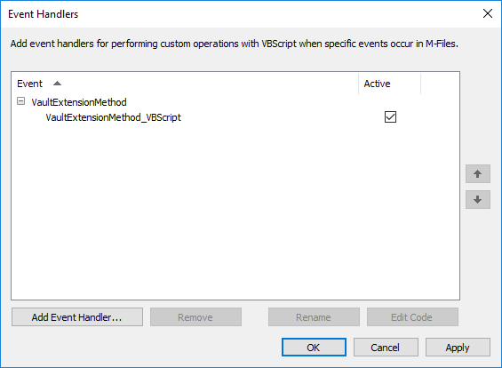
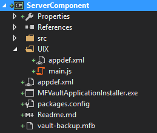
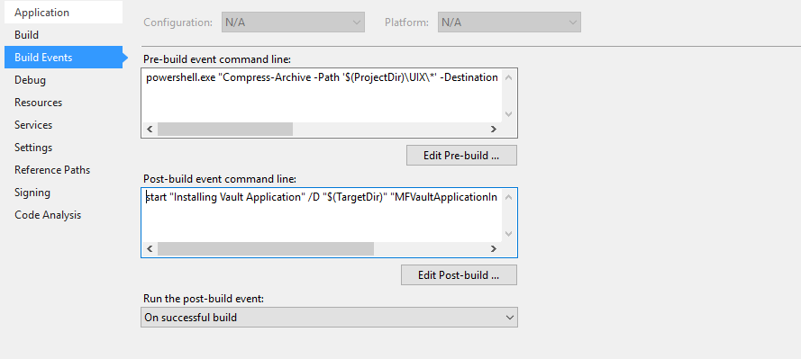
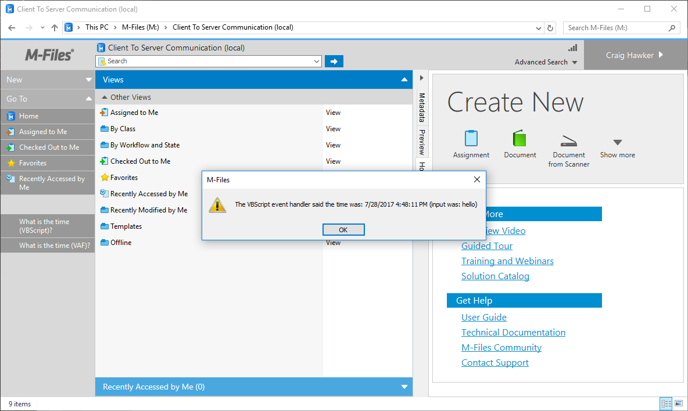
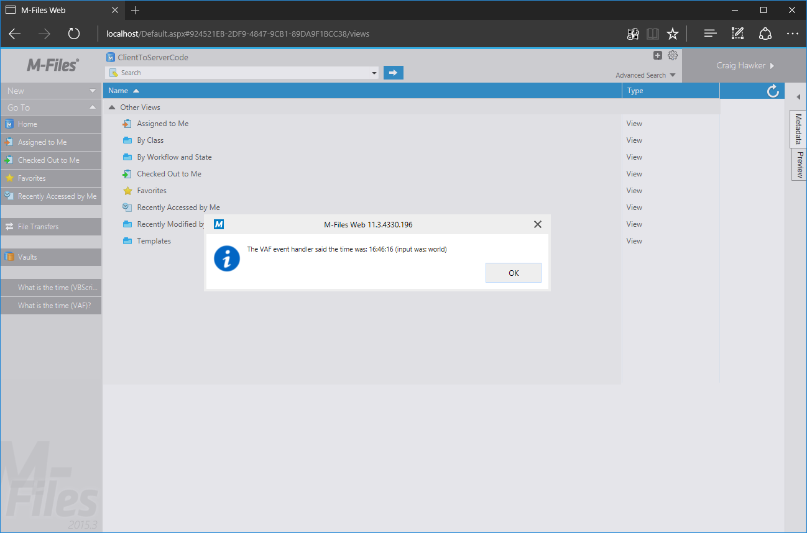

This sample shows how to call server-side code from a client-side event.  In this example we will create a [User Interface Extensibility Framework]({{ site.baseurl }}/Frameworks/User-Interface-Extensibility-Framework/) application which adds commands (buttons) to the task area.  When these buttons are clicked, a [Vault Extension Method]({{ site.baseurl }}/Built-In/VBScript/Vault-Extension-Methods/) will be called asynchronously from the client, and the result shown in a message box.

This technique can be used to execute code on the server rather than the client, which may be useful for reasons such as speed or security.

Full source code for this sample is available <a href="https://github.com/M-Files/MFilesSamplesAndLibraries/tree/master/Samples/Processes/ClientToServerCode">in our GitHub Samples and Libraries repository</a>.
{:.note}

## Creating the VBScript vault extension method

To create the vault extension method:

1. Open the M-Files Admin tool and connect to the appropriate server.
2. Right-click on the vault name and selet `Event Handlers` (vault extension methods are created within the same section as event handlers).
3. Click `Add Event Handler...` and create a new vault extension method.
	1. Choose `Vault extension method` from the `Select event` dropdown.
	2. Provide an appropriate name.  This name will be used to [execute the vault extension method](https://www.m-files.com/api/documentation/latest/index.html#MFilesAPI~VaultExtensionMethodOperations~ExecuteVaultExtensionMethod.html).
4. Select the new vault extension method and click `Edit Code`



Enter the following code into the box:

```vbscript
Option Explicit

Output = "The VBScript event handler said the time was: " & Now() & " (input was: " & Input & ")"
```

In the sample above the name of the vault extension method was `VaultExtensionMethod_VBScript`.
{:.note}

## Creating the Vault Application Framework application

To create the Vault Application Framework application:

1. Follow the instructions in the [Visual Studio Template guide]({{ site.baseurl }}/Frameworks/Vault-Application-Framework/Visual-Studio/) to create a basic Vault Application Framework application.
2. Note the application's `guid`, which can be found in the `appdef.xml` file.
3. Alter the default `VaultApplication.cs` file:

```csharp
using System;
using System.IO;
using MFiles.VAF;
using MFiles.VAF.Common;
using MFilesAPI;

namespace ServerComponent
{
	public class VaultApplication
		: VaultApplicationBase
	{

		/// <summary>
		/// A vault extension method, that will be installed to the vault with the application.
		/// The vault extension method can be called through the API.
		/// </summary>
		/// <param name="env">The event handler environment for the method.</param>
		/// <returns>The output string to the caller.</returns>
		[VaultExtensionMethod("VaultExtensionMethod_VAF", RequiredVaultAccess = MFVaultAccess.MFVaultAccessNone)]
		private string TestVaultExtensionMethod(EventHandlerEnvironment env)
		{
			return "The VAF event handler said the time was: "
				+ DateTime.Now.ToLongTimeString()
				+ " (input was: " + env.Input
			    + ")";
		}
	}
}
```

## Creating the User Interface Extensibility Framework application

To create the User Interface Extensibility Framework application, two files need to be created: the [application definition file (appdef.xml)]({{ site.baseurl }}/Frameworks/User-Interface-Extensibility-Framework/Application-Definition/) and a single ShellUI module (with its code in `main.js`).

### The application definition file

It is important to note:

1. The file must use [version 3 of the client schema]({{ site.baseurl }}/Frameworks/User-Interface-Extensibility-Framework/Application-Definition/#v3-schema).
2. The value shown in the `master-application-guid` is the `guid` of the Vault Application Framework application.

```xml
<?xml version="1.0" encoding="UTF-8"?>
<application xmlns:xsi="http://www.w3.org/2001/XMLSchema-instance"
		xsi:noNamespaceSchemaLocation="http://www.m-files.com/schemas/appdef-client-v3.xsd">
	<guid>1B9552B3-C1C5-44b9-905F-D4ABAC5E7AA2</guid>
	<name>Client to server communication UIX sample</name>
	<version>1.1</version>
	<description>A demonstration application for calling the server with content and retrieving the response.</description>
	<publisher>M-Files Corporation</publisher>
	<copyright>(c) M-Files Corporation 2017</copyright>
	<required-mfiles-version>11.3.0000.0</required-mfiles-version>
	<master-application-guid>b0797ece-4c7e-4e60-8576-8fc74b3bf968</master-application-guid>
	<platforms>
		<platform>Desktop</platform>
		<platform>Web</platform>
	</platforms>
	<modules>
	<module environment="shellui">
		<file>main.js</file>
	</module>
	</modules>
</application>
```

The above code declares <a href="{{ site.baseurl }}/Frameworks/User-Interface-Extensibility-Framework/Development-Practices/Platform-Targeting/#declaring-compatibility-with-both-platforms">platform compatibility with both M-Files Desktop and M-Files Web Access</a>. 
{:.note}

### The module file

We will create a module file that:

1. Declares two buttons and places them in the task pane (lines 43-51).
2. Reacts when the buttons are clicked and executes a vault extension method (lines 56-95).
3. Displays the result of the vault extension method in a message box (lines 71 and 85).

The below code uses the <a href="{{ site.baseurl }}/Frameworks/User-Interface-Extensibility-Framework/Development-Practices/Asynchronous-API-Programming/">asynchronous programming style</a> so that the code is compatible with M-Files Web Access.
{:.note}

```javascript
// NOTE! This code is for demonstration purposes only and does not contain any kind of
// 		 error handling. MUST be revised before using in production.
//		 Created by: Craig Hawker / M-Files

"use strict";

// The name of the vault extension method that should be executed when the "VBScript" command is executed.
var VBScriptVaultExtensionName = "VaultExtensionMethod_VBScript";

// The name of the vault extension method that should be executed when the "VAF" command is executed.
var VAFVaultExtensionName = "VaultExtensionMethod_VAF";

function OnNewShellUI(shellUI) {
	/// <summary>The entry point of ShellUI module.</summary>
	/// <param name="shellUI" type="MFiles.ShellUI">The new shell UI object.</param> 
	
	// Register to be notified when a new normal shell frame (Event_NewNormalShellFrame) is created.
	// We use Event_NewNormalShellFrame rather than Event_NewShellFrame as this won't fire for history (etc.) dialogs.
	// ref: https://www.m-files.com/UI_Extensibility_Framework/index.html#Event_NewNormalShellFrame.html
	shellUI.Events.Register(
		Event_NewNormalShellFrame,
		handleNewShellFrame );
}

function handleNewShellFrame(shellFrame)
{
	/// <summary>Handles the OnNewShellFrame event.</summary>
	/// <param name="shellFrame" type="MFiles.ShellFrame">The new shell frame object.</param> 

	// Register to listen to the started event.
	shellFrame.Events.Register(
		Event_Started,
		getShellFrameStartedHandler( shellFrame ) );
}

function getShellFrameStartedHandler(shellFrame) {
	/// <summary>Gets a function to handle the Started event for shell frame.</summary>
	/// <param name="shellFrame" type="MFiles.ShellFrame">The current shell frame object.</param> 
	/// <returns type="MFiles.Events.OnStarted">The event handler.</returns>

	// Return the handler function for ShellFrame's Started event.
	return function ()
	{
		// Create a command to execute the VBScript version.
		var vbScriptCommand = shellFrame.Commands.CreateCustomCommand( "What is the time (VBScript)?" );

		// Create a command to execute the VAF version.
		var vafCommand = shellFrame.Commands.CreateCustomCommand( "What is the time (VAF)?" );

		// Add the commands to the task pane.
		// ref: http://www.m-files.com/UI_Extensibility_Framework/index.html#MFClientScript~ITaskPane~AddCustomCommandToGroup.html
		shellFrame.TaskPane.AddCustomCommandToGroup( vbScriptCommand, TaskPaneGroup_Main, 0 );
		shellFrame.TaskPane.AddCustomCommandToGroup( vafCommand, TaskPaneGroup_Main, 0 );

		// Register to respond to commands being clicked.
		shellFrame.Commands.Events.Register(
			Event_CustomCommand,
			function(command)
			{
				switch (command)
				{
					case vbScriptCommand: // It was the VBScript command.

						// Call the extension method passing the string "hello" as the parameter.
						// Note: this is called async for compatibility with M-Files Web Access.
						// ref: https://www.m-files.com/api/documentation/latest/index.html#MFilesAPI~VaultExtensionMethodOperations~ExecuteVaultExtensionMethod.html
						shellFrame.ShellUI.Vault.Async.ExtensionMethodOperations.ExecuteVaultExtensionMethod(
							VBScriptVaultExtensionName, // The name of the extension method to execute.
							"hello", // The input (string) to pass it.
							function(response)
							{
								// The output (string) will be in response; show it.
								shellFrame.ShowMessage( response );
							} );
						break;

					case vafCommand: // It was the VAF command.

						// Call the extension method passing the string "world" as the parameter.
						// Note: this is called async for compatibility with M-Files Web Access.
						// ref: https://www.m-files.com/api/documentation/latest/index.html#MFilesAPI~VaultExtensionMethodOperations~ExecuteVaultExtensionMethod.html
						shellFrame.ShellUI.Vault.Async.ExtensionMethodOperations.ExecuteVaultExtensionMethod(
							VAFVaultExtensionName, // The name of the extension method to execute.
							"world", // The input (string) to pass it.
							function(response)
							{
								// The output (string) will be in response; show it.
								shellFrame.ShowMessage( response );
							} );

						break;

					default : // It wasn't one of our commands.
						break;
				}

			} );
	};
}
```

## Deploying both applications together

To deploy both applications together, follow the instructions in the [distributing child applications]({{ site.baseurl }}/Frameworks/Vault-Application-Framework/Distributing-Child-Applications/) page.  Your VAF application class must include the following code (replace `UIX.mfappx` with the name of your UIX package):

```csharp
/// <summary>
/// Install the UIX application, as it will not be installed by default.
/// </summary>
/// <param name="vault">The vault to install the application into.</param>
protected override void InitializeApplication(Vault vault)
{
	try
	{
		string appPath = "UIX.mfappx";
		if (File.Exists(appPath))
		{
			vault.CustomApplicationManagementOperations.InstallCustomApplication(appPath);
		}
		else
		{
			SysUtils.ReportErrorToEventLog("File: " + appPath + " does not exist");
		}
	}
	catch (Exception ex)
	{
		SysUtils.ReportErrorToEventLog(ex.Message);
	}
	
	base.InitializeApplication(vault);
}
```


Technically the User Interface Extensibility Framework application can be uninstalled through the M-Files Admin tool, but it will be re-installed automatically when the vault restarts.
{:.note}

## Automating the build of the UIX application

With the approach listed above, the User Interface Extensibility Framework application needs to be built and managed separately to the Vault Application Framework application.  Whilst this works for smaller projects, having the two managed and deployed together makes development more simplistic.

### Including the UIX application in the Visual Studio project

In this sample, the User Interface Extensibility Framework application will be copied into a folder within the Vault Application Framework solution named `UIX`.  The name can be altered, provided it is also altered in the build event command.



### Using PowerShell to build the UIX

In this approach we will use PowerShell to create a `.mfappx` of the User Interface Extensibility Framework application before the Vault Application Framework application is built.  The build process of the Vault Application Framework application will then ensure that the client application is .  To do this, create a pre-build event in the Visual Studio Project:

1. Right-click on the VAF project name in Visual Studio.
2. Select `Properties`.
3. Select `Build Events` on the left.



The post-build event command line should already be populated due.
{:.note}

Enter the following into the `Pre-build event command line` box:

```
powershell.exe "Compress-Archive -Path '$(ProjectDir)\UIX\*' -DestinationPath '$(TargetDir)\UIX.zip' -Force; Move-Item '$(TargetDir)\UIX.zip' '$(TargetDir)\UIX.mfappx' -Force"
```

This requests for PowerShell to execute two commands:

1. Compress everything within the `UIX` folder into a zip file named `UIX.zip`.
1. Rename the `UIX.zip` file to `UIX.mfappx` (this step is optional).

### Deployment

When the Vault Application Framework application is built within Visual Studio, it should automatically deploy to the local machine.  If you do not have M-Files running locally then [manually deploy the application to the server]({{ site.baseurl }}/Frameworks/Vault-Application-Framework/Visual-Studio/#building-and-deploying).

The two applications should be shown as installed within the M-Files Admin tool:


## Testing

To test the application, open the M-Files Desktop or M-Files Web Access clients and:

1. Ensure that the commands are available within the task area.
2. Click the commands and ensure that the expected message was shown.

### M-Files Desktop




### M-Files Web Access




