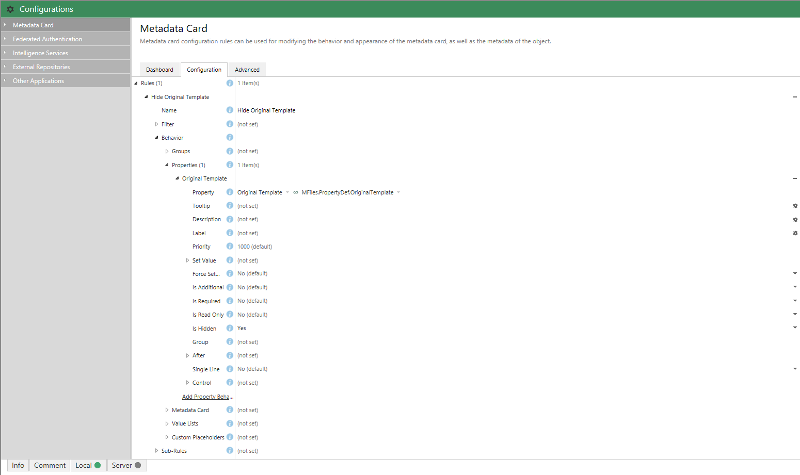

This sample shows how to maintain a property on objects that refers back to the document template which was used to create it.  This can be useful in scenarios such as contract production, where the version of the template used to create a document may indicate the specific clauses or terms and conditions that were the basis of the agreement.

Full source code for this sample is available in [our GitHub Samples and Libraries repository](https://github.com/M-Files/MFilesSamplesAndLibraries/tree/master/Samples/Processes/MaintainOriginalTemplate).
{:.note}

## Overview

If you haven't used document templates in M-Files then you really must try them out. Document templates allow you to partially create documents (e.g. contracts, employment agreements, termination notices) for the rest of your business to use. These documents can even automatically merge in information from the object's metadata (e.g. a project reference number, or to display the document ID as a barcode), or information from its relationships (e.g. the email address of the project manager).  This is all maintained automatically for you as the document is created and processed by the business.

This is exceptionally powerful, and using document templates can be a quick and easy way to produce documents faster and more consistently within a business.

However, one question that comes up occasionally is how to track which template the document originated from. This information isn't automatically stored by M-Files so it can be difficult to answer without a fair amount of manual work.  The approach detailed below shows how a simple event handler can be used to create this relationship automatically.

## How templates work

An object is defined as a template simply by having the built-in `Is Template` property on its metadata card, with a value of `Yes` (or checked, in this case). Any object which has this property will be handled slightly differently by the M-Files desktop client. These differences include:

1. [Mandatory properties](https://www.m-files.com/user-guide/latest/eng/New_class.html) (aside from the class and name or title) are not mandatory when creating templates. For example, even if the class defines that a `Contract` must have a `Customer` property, the property is allowed to be empty for templates.

2. [When double-clicking on a template](https://www.m-files.com/user-guide/latest/eng/using_document_templates.html), the M-Files system creates a new object from that template. For all other objects in the system, double-clicking will either open the object or prompt it for checkout.

When you double-click on a template, M-Files copies the template object (its metadata and files), and allows you to start editing the copy. If the template contains a single file then it'll also open that for you to start making changes to. Most metadata properties are automatically copied across to the new document (except, for example, `Is Template`). We'll use this functionality to maintain a property on the template named `Original Template`, and this property will automatically be copied to documents that use it.

## The vault structure

Next, let's create some of the structure that we need. This structure could be created by importing a replication package, or even created/tested at application installation time using our API, but we'll create it manually. The only structure we need is a new property to hold a reference to the template that was used to create the object. We will create this using the M-Files Admin software. Ensure that the property:

* Has a `Data type` of `Choose from list (single)`, and select the list named `Document`.

* Has an [alias]({{ site.baseurl }}/Getting-Started/Aliases/) of `MFiles.PropertyDef.OriginalTemplate`. This format naming is not important, but a format of `{CompanyName}.{StructuralElementType}.{TextualName}` should help avoid any clashes. The important thing to note is that the alias here will be used in our code to [retrieve the property ID]({{ site.baseurl }}/Getting-Started/Aliases/#resolving-aliases), so we must keep a note of it.


## Maintaining the property

### A VBScript approach

If using VBScript we have to manually attach VBScript to both the `BeforeCreateNewObjectFinalize` and `BeforeCheckInChangesFinalize` events.  The actual code can be the same, though:

```vbscript
Option Explicit

' The alias of the "Original Property" property definition.
Const strOriginalTemplatePropertyDefAlias = "MFiles.PropertyDef.OriginalTemplate"

' Only execute this for documents
If ObjVer.Type = 0 Then

	' Resolve the property definition alias to an ID.
	Dim intOriginalTemplatePropertyDefID
	intOriginalTemplatePropertyDefID = GetPropertyDefIDByAlias(Vault, strOriginalTemplatePropertyDefAlias)

	' Sanity.
	If intOriginalTemplatePropertyDefID = -1 Then
		Err.Raise MFScriptCancel, "A property definition with alias '" & strOriginalTemplatePropertyDefAlias & "' could not be found in the vault."
	End If

	' Load the properties of the current object.
	Dim objPropertyValues
	Set objPropertyValues = Vault.ObjectPropertyOperations.GetProperties(ObjVer, True)

	' Retrieve the "Is template" property.
	Dim objIsTemplateProperty
	Set objIsTemplateProperty = objPropertyValues.SearchForPropertyEx(MFBuiltInPropertyDefIsTemplate, True)

	' Only do this for objects that have the "Is template" property set to true.
	If Not objIsTemplateProperty Is Nothing Then

		If objIsTemplateProperty.Value.Value = True Then

			' The "Is template" property is set to true.

			' Create a lookup pointing at the current object.
			' Ensuring that the "Version" is set will mean that this will point to this specific version of the object.
			Dim objLookup
			Set objLookup = CreateObject("MFilesAPI.Lookup")
			objLookup.ObjectType = ObjVer.Type
			objLookup.Item = ObjVer.ID
			objLookup.Version = ObjVer.Version

			' Create a property value for the "Original Template" property value
			' and set its value to the lookup.
			Dim objOriginalTemplatePropertyValue
			Set objOriginalTemplatePropertyValue = CreateObject("MFilesAPI.PropertyValue")
			objOriginalTemplatePropertyValue.PropertyDef = intOriginalTemplatePropertyDefID
			objOriginalTemplatePropertyValue.Value.SetValueToLookup objLookup

			' Update the object.
			Vault.ObjectPropertyOperations.SetProperty ObjVer, objOriginalTemplatePropertyValue

			' Ensure that the audit is correct.
			' ref: http://developer.m-files.com{{ site.baseurl }}/Built-In/VBScript/Audit-Trail-And-Scripting
			Dim objLastModifiedByTypedValue
			Set objLastModifiedByTypedValue = CreateObject("MFilesAPI.TypedValue")
			objLastModifiedByTypedValue.SetValue MFDatatypeLookup, CurrentUserID
			Vault.ObjectPropertyOperations.SetLastModificationInfoAdmin ObjVer, True, objLastModifiedByTypedValue, False, Nothing

		End If

	End If

End If

''' Helper functions

''' Retrieves the ID of a property definition from its alias.
''' Returns the ID or -1 if the alias is not found, or if more than one property definition uses the alias.
' ref: https://www.m-files.com/api/documentation/latest/index.html#MFilesAPI~VaultPropertyDefOperations~GetPropertyDefIDByAlias.html
Function GetPropertyDefIDByAlias(oVault, sPropertyDefAlias)

	GetPropertyDefIDByAlias = oVault.PropertyDefOperations.GetPropertyDefIDByAlias(sPropertyDefAlias)

End Function
```

### A Vault Application Framework approach

[Create a new VAF application]({{ site.baseurl }}/Frameworks/Vault-Application-Framework/Visual-Studio/), clear down the boilerplate code, and create an [event handler]({{ site.baseurl }}/Frameworks/Vault-Application-Framework/Attributes/Event-Handlers/). This event handler will react before the object is created and will add the `Original Template` property to the object before it's saved. The value for the property will be a pointer to the current version of the current document:

```csharp
using System;
using MFiles.VAF;
using MFiles.VAF.Common;
using MFilesAPI;

namespace MaintainOriginalTemplate
{
	public class Configuration
	{
		[MFPropertyDef(Required = false)]
		public MFIdentifier OriginalTemplatePropertyDef
			= "MFiles.PropertyDef.OriginalTemplate";
	}
 
	public class VaultApplication
	: VaultApplicationBase
	{
		[MFConfiguration("MaintainOriginalTemplate", "config")]
		private Configuration config = new Configuration();

		/// <summary>
		/// Ensures that the "Original Template" property
		/// is maintained on templates.
		/// </summary>
		/// <param name="env">The vault/object environment.</param>
		[EventHandler(MFEventHandlerType.MFEventHandlerBeforeCreateNewObjectFinalize,
			ObjectType = (int)MFBuiltInObjectType.MFBuiltInObjectTypeDocument)]
		[EventHandler(MFEventHandlerType.MFEventHandlerBeforeCheckInChangesFinalize,
			ObjectType = (int)MFBuiltInObjectType.MFBuiltInObjectTypeDocument)]
		public void MaintainOriginalTemplateProperty(EventHandlerEnvironment env)
		{
			// Sanity.
			if (null == env?.ObjVerEx)
			return;

			// Only do this for objects that have the "Is template"
			// property set to true!
			var isTemplatePropertyValue = env
				.ObjVerEx
				.Properties
				.SearchForPropertyEx((int) MFBuiltInPropertyDef.MFBuiltInPropertyDefIsTemplate, true);
			if (null == isTemplatePropertyValue?.Value
			|| true == isTemplatePropertyValue.Value.IsEmpty()
			|| true == isTemplatePropertyValue.Value.IsNULL()
			|| true == isTemplatePropertyValue.Value.IsUninitialized())
				return; // The property was not on the object or was empty in some way.
			if (true != (bool) isTemplatePropertyValue.Value.Value)
				return; // "Is template" was not true.

			// Retrieve (and remove) the current "Original Template" property value,
			// or create one if it's not there.
			var originalTemplatePropertyValue =
				env.
				ObjVerEx
				.Properties
				.RemoveProperty(this.config.OriginalTemplatePropertyDef.ID)
				?? new PropertyValue()
				{
					PropertyDef = this.config.OriginalTemplatePropertyDef.ID
				};

			// Create a lookup pointing at the current object.
			// Ensuring that the "Version" is set will mean that this will point
			// to this specific version of the object.
			var lookup = new Lookup
			{
				ObjectType = env.ObjVer.Type,
				Item = env.ObjVer.ID,
				Version = env.ObjVer.Version
			};

			// Set the property value.
			originalTemplatePropertyValue.Value.SetValueToLookup(lookup);

			// Update the object.
			env.ObjVerEx.Properties.Add(-1, originalTemplatePropertyValue);
			env.ObjVerEx.SaveProperties();

			// Ensure that the audit is correct.
			// ref: http://developer.m-files.com{{ site.baseurl }}/Built-In/VBScript/Audit-Trail-And-Scripting
			env.ObjVerEx.SetModifiedBy(env.CurrentUserID);
		}

	}
}
```

The code above filters the event handler to only run for documents.  This is because the `Original Template` property is a list of documents and will fail when being used for other types of object.
{:.note}

### Creating templates

Note that the property value now states the version number. This is included because the `Lookup` object has an explicit version number set.


### Creating documents

To create a document from this template, simply double-click on it. In the screenshot below a new document has been created from the template, and the system has copied across the `Original Template` property from the template itself. Even if the template gets changed in the future, the lookup continues to point to the specific version that was used to create the document.


## Tidying it up

Having this relationship makes it easy to find the template, but purists may be concerned about the `Original Template` property appearing on the metadata card. Fortunately, the [metadata card configuration functionality]({{ site.baseurl }}/Built-In/Metadata-Card-Configuration/) can be used to easily hide the property in most scenarios. The relationships shown by clicking the small chevron to the left of the document title still work, though!




