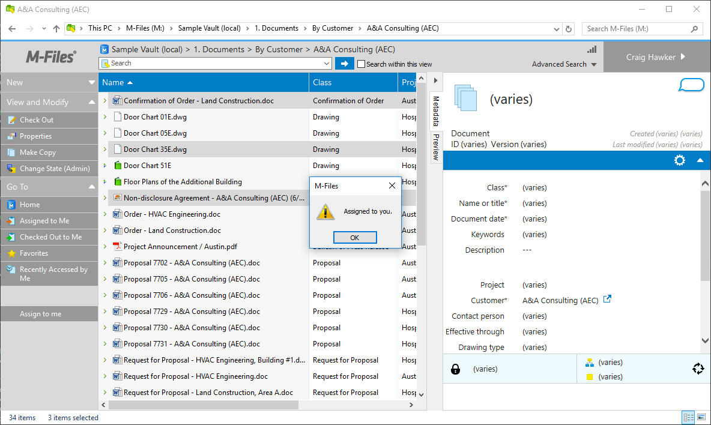
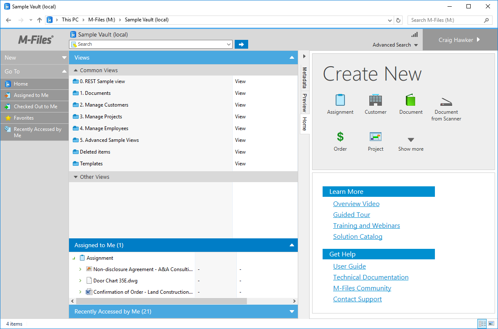
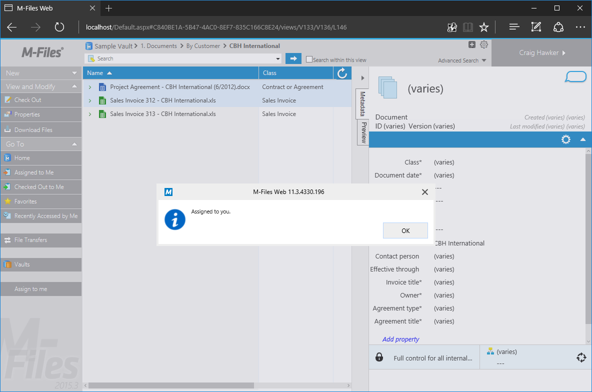
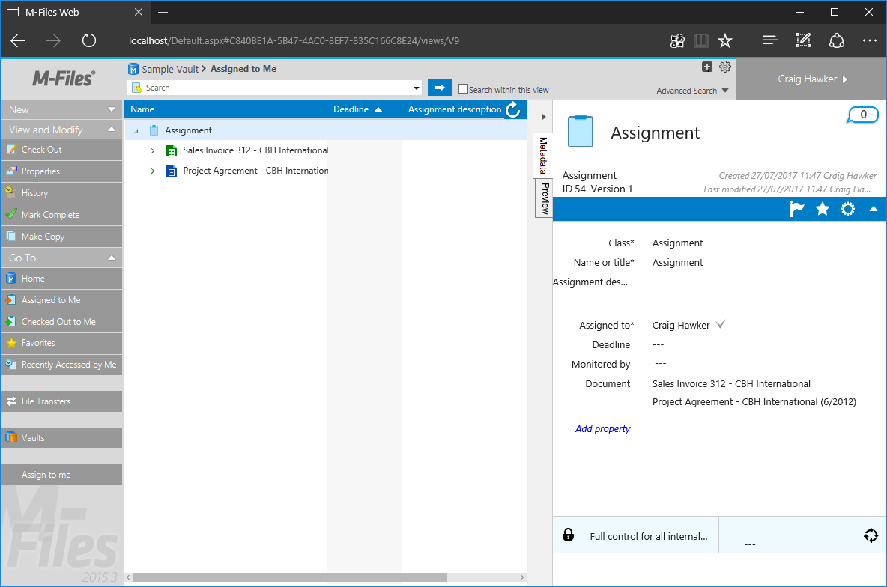

This sample creates a basic User Interface Extensibility Framework application consisting of one [ShellUI module]({{ site.baseurl }}/Frameworks/User-Interface-Extensibility-Framework/Modules/#shellui) which allows the user to select objects within the M-Files vault and assign them to themselves via a button in the task pane.

<p class="note">The source code for this sample is available within our <a href="https://github.com/M-Files/MFilesSamplesAndLibraries/tree/master/Samples/UIX%20Applications/Commands">GitHub Samples and Libraries repository</a>.</p>

## Overview

This sample does not show how to create a [local development folder]({{ site.baseurl }}/Frameworks/User-Interface-Extensibility-Framework/Development-Practices/Local-Development-Folder/) or to [deploy the code to the M-Files server]({{ site.baseurl }}/Frameworks/User-Interface-Extensibility-Framework/Development-Practices/Deployment/).  It is assumed that a local development folder already exists, and that is the location in which the development is occurring.

## Creating the application structure

### Creating the application definition file

Into this folder we will create an [application definition file]({{ site.baseurl }}/Frameworks/User-Interface-Extensibility-Framework/Application-Definition/).  This file must be named `appdef.xml`.  The application will use [version 3 of the client schema]({{ site.baseurl }}/Frameworks/User-Interface-Extensibility-Framework/Application-Definition/#v3-schema) (as we are only targeting newer M-Files versions), and the [supported platform will be set as desktop]({{ site.baseurl }}/Frameworks/User-Interface-Extensibility-Framework/Development-Practices/Platform-Targeting/#declaring-compatibility-with-only-the-m-files-desktop-client) (it will be changed to both desktop and web [later]({{ site.baseurl }}/Samples-And-Libraries/Samples/User-Interface-Extensibility-Framework/AssignToMe/#enabling-compatibility-with-m-files-web-access)).  The application will declare a single Shell UI module (with its code in `main.js`), and no dashboards.

```xml
<?xml version="1.0" encoding="UTF-8"?>
<application xmlns:xsi="http://www.w3.org/2001/XMLSchema-instance"
	xsi:noNamespaceSchemaLocation="http://www.m-files.com/schemas/appdef-client-v3.xsd">
	<guid>1B9552B3-C1C5-44b9-905F-D4ABAC5E7FF2</guid>	
	<name>Assign to me UIX sample</name>
	<version>1.1</version>
	<description>A demonstration application for reacting to selected items and assigning them via a command.</description>
	<publisher>M-Files Corporation</publisher>
	<copyright>(c) M-Files Corporation 2017</copyright>
	<required-mfiles-version>11.3.0000.0</required-mfiles-version>
	<platforms>
		<platform>Desktop</platform>
	</platforms>
	<modules>
		<module environment="shellui">
			<file>main.js</file>
		</module>
	</modules>
</application>
```
<p class="note">Ensure that your application has a unique GUID by using a GUID generator, such as <a href="https://guidgenerator.com/">this one</a>.</p>

### Creating the module

Next we will create a [module file]({{ site.baseurl }}/Frameworks/User-Interface-Extensibility-Framework/Modules/) to contain our actual application logic.  Initially:

* We will declare a [default entry point]({{ site.baseurl }}/Frameworks/User-Interface-Extensibility-Framework/Development-Practices/Event-Registration-And-Entry-Points/#shellui-modules) for the ShellUI module.
* We will react to the `NewShellFrame` event and obtain a reference to the shell frame.
* We will react to the shell frame's `Started` event (as using the shell frame before this point will result in an exception).
* Create a command (button,  place it into the task area, and hide it.
* React to the shellFrame's `CustomCommand` event and add some placeholder code to execute when the command is clicked.

```javascript
// NOTE! This code is for demonstration purposes only and does not contain any kind of
// 		 error handling. MUST be revised before using in production.
//		 Created by: Craig Hawker / M-Files

"use strict";

function OnNewShellUI(shellUI) {
	/// <summary>The entry point of ShellUI module.</summary>
	/// <param name="shellUI" type="MFiles.ShellUI">The new shell UI object.</param> 

	// Register to listen new shell frame creation event.
	shellUI.Events.Register(
		Event_NewShellFrame,
		newShellFrameHandler );
}

function newShellFrameHandler(shellFrame)
{
	/// <summary>Handles the OnNewShellFrame event.</summary>
	/// <param name="shellFrame" type="MFiles.ShellFrame">The new shell frame object.</param> 

	// Register to listen to the started event.
	shellFrame.Events.Register(
		Event_Started,
		getShellFrameStartedHandler( shellFrame ) );
}

function getShellFrameStartedHandler(shellFrame) {
	/// <summary>Gets a function to handle the Started event for shell frame.</summary>
	/// <param name="shellFrame" type="MFiles.ShellFrame">The current shell frame object.</param> 
	/// <returns type="MFiles.Events.OnStarted">The event handler.</returns>

	// Return the handler function for ShellFrame's Started event.
	return function ()
	{
		// Create a command for "assign to me".
		var assignCommandId = shellFrame.Commands.CreateCustomCommand( "Assign to me" );

		// Add the command to the task pane.
		// ref: http://www.m-files.com/UI_Extensibility_Framework/index.html#MFClientScript~ITaskPane~AddCustomCommandToGroup.html
		shellFrame.TaskPane.AddCustomCommandToGroup( assignCommandId, TaskPaneGroup_Main, 0 );

		// Hide the command.  We will show it when the selected items change.
		shellFrame.Commands.SetCommandState( assignCommandId, CommandLocation_All, CommandState_Hidden );

		// Register to respond to commands being clicked.
		shellFrame.Commands.Events.Register(
			Event_CustomCommand,
			function(command)
			{
				// We only care about our command.
				// If the command being clicked is something else then return.
				if (command != assignCommandId)
				{
					return;
				}

				// TODO: Ensure we have items to process.

				// TODO: Create the assignment object.
			} );
}
```

#### Reacting to shell listing selection changes

Each shell frame may have multiple shell listings.  For example: the default M-Files home screen contains one primary listing in the centre (listing the views), along with listings for "Recently accessed by me" and "Assigned to me", as appropriate.  We must be able to react to selection changes in all of the listings, but only process selection changes in the active listing.

<p class="none">If we do not exclude inactive listings then we will process deselections in other listings, as well as selections in the active listing.</p>

We will:

* Declare a global variable to hold the currently-selected items (`currentlySelectedItems`) (line 8).
* React to the shell frame's `NewShellListing` event to attach event handlers to each shell listing (lines 50-52).
* Alter the visibility of the command depending on whether or not any objects are currently selected (lines 103 and 108).
* React to each shell listing's `SelectionChanged` event, saving the currently-selected items in the active listing (line 111).

```javascript
// NOTE! This code is for demonstration purposes only and does not contain any kind of
// 		 error handling. MUST be revised before using in production.
//		 Created by: Craig Hawker / M-Files

"use strict";

// The currently-selected items in the active listing.
var currentlySelectedItems = null;

function OnNewShellUI(shellUI) {
	/// <summary>The entry point of ShellUI module.</summary>
	/// <param name="shellUI" type="MFiles.ShellUI">The new shell UI object.</param> 

	// Register to listen new shell frame creation event.
	shellUI.Events.Register(
		Event_NewShellFrame,
		newShellFrameHandler );
}

function newShellFrameHandler(shellFrame)
{
	/// <summary>Handles the OnNewShellFrame event.</summary>
	/// <param name="shellFrame" type="MFiles.ShellFrame">The new shell frame object.</param> 

	// Register to listen to the started event.
	shellFrame.Events.Register(
		Event_Started,
		getShellFrameStartedHandler( shellFrame ) );
}

function getShellFrameStartedHandler(shellFrame) {
	/// <summary>Gets a function to handle the Started event for shell frame.</summary>
	/// <param name="shellFrame" type="MFiles.ShellFrame">The current shell frame object.</param> 
	/// <returns type="MFiles.Events.OnStarted">The event handler.</returns>

	// Return the handler function for ShellFrame's Started event.
	return function ()
	{
		// Create a command for "assign to me".
		var assignCommandId = shellFrame.Commands.CreateCustomCommand( "Assign to me" );

		// Add the command to the task pane.
		// ref: http://www.m-files.com/UI_Extensibility_Framework/index.html#MFClientScript~ITaskPane~AddCustomCommandToGroup.html
		shellFrame.TaskPane.AddCustomCommandToGroup( assignCommandId, TaskPaneGroup_Main, 0 );

		// Hide the command.  We will show it when the selected items change.
		shellFrame.Commands.SetCommandState( assignCommandId, CommandLocation_All, CommandState_Hidden );
		
		// Register to listen to when new shell listings are created.
		shellFrame.Events.Register(
			Event_NewShellListing,
			getNewShellListingHandler( shellFrame, assignCommandId ) );

		// Register to respond to commands being clicked.
		shellFrame.Commands.Events.Register(
			Event_CustomCommand,
			function(command)
			{
				// We only care about our command.
				// If the command being clicked is something else then return.
				if (command != assignCommandId)
				{
					return;
				}

				// Ensure we have items to process.
				if (null == currentlySelectedItems)
				{
					return;
				}

				// TODO: Create the assignment object.
			} );
	};
}

function getNewShellListingHandler(shellFrame, assignCommandId) {
	/// <summary>Gets a function to handle the NewShellListing event for shell frame.</summary>
	/// <param name="shellFrame" type="MFiles.ShellFrame">The current shell frame object.</param> 
	/// <returns type="MFiles.Events.OnNewShellListing">The event handler.</returns>

	// Return the handler function for NewShellListing event.
	return function (shellListing) {

		// Listen for selection change events on the listing.
		shellListing.Events.Register(
			Event_SelectionChanged,
			function(selectedItems)
			{
				// Sanity.
				if (false == shellListing.IsActive)
				{
					return false;
				}

				// Set the currently-selected items to null (assume nothing selected).
				currentlySelectedItems = null;

				// Has the user got any object versions selected?
				if (selectedItems.ObjectVersions.Count == 0)
				{
					// Hide the menu item - there's nothing selected.
					shellFrame.Commands.SetCommandState( assignCommandId, CommandLocation_All, CommandState_Hidden );
					return false;
				}

				// Show the menu item.
				shellFrame.Commands.SetCommandState( assignCommandId, CommandLocation_All, CommandState_Active );

				// Store the selected items.
				currentlySelectedItems = selectedItems;

				// We succeeded; return true.
				return true;
			} );
	};
}
```

#### Creating the assignment object

We will:

* Create a function that creates the assignment object (`createAssigmentObject`, lines 120-135).  Specifically, it will:
	* Create property values for the built-in properties used by the `Assignment` object type:
		* Class (ID 100, line2 130-133).
		* Name or title (ID 0, lines 136-139).
		* Single file document (ID 22, lines 142-145).
		* Assigned to (ID 44, lines 148-155).
	* Create properties to establish relationships between the assignment object and the currently-selected items (lines 158-127).
	* Create the object (lines 220-229) and check it in (line 232).
* Call the function when the command is clicked (line 73).

<p class="note">The code below uses the API in the standard synchronous manner.  The next section - <a href="{{ site.baseurl }}/Samples-And-Libraries/Samples/User-Interface-Extensibility-Framework/AssignToMe/#enabling-compatibility-with-m-files-web-access">enabling compatibility with M-Files Web</a> - will alter it to use an asynchronous approach.</p>

<p class="note">We have to execute <code class="highlighter-rouge">CreateNewObject</code> and <code class="highlighter-rouge">CheckIn</code> separately (rather than calling <code class="highlighter-rouge">CreateNewObjectEx</code>, which will check it in for us) as <a href="https://www.m-files.com/UI_Extensibility_Framework/index.html#ApiSupportInMFilesWeb.html">only CreateNewObject is supported in M-Files Web Access</a>.</p>

```javascript
// NOTE! This code is for demonstration purposes only and does not contain any kind of
// 		 error handling. MUST be revised before using in production.
//		 Created by: Craig Hawker / M-Files

"use strict";

// The currently-selected items in the active listing.
var currentlySelectedItems = null;

function OnNewShellUI(shellUI) {
	/// <summary>The entry point of ShellUI module.</summary>
	/// <param name="shellUI" type="MFiles.ShellUI">The new shell UI object.</param> 

	// Register to listen new shell frame creation event.
	shellUI.Events.Register(
		Event_NewShellFrame,
		newShellFrameHandler );
}

function newShellFrameHandler(shellFrame)
{
	/// <summary>Handles the OnNewShellFrame event.</summary>
	/// <param name="shellFrame" type="MFiles.ShellFrame">The new shell frame object.</param> 

	// Register to listen to the started event.
	shellFrame.Events.Register(
		Event_Started,
		getShellFrameStartedHandler( shellFrame ) );
}

function getShellFrameStartedHandler(shellFrame) {
	/// <summary>Gets a function to handle the Started event for shell frame.</summary>
	/// <param name="shellFrame" type="MFiles.ShellFrame">The current shell frame object.</param> 
	/// <returns type="MFiles.Events.OnStarted">The event handler.</returns>

	// Return the handler function for ShellFrame's Started event.
	return function ()
	{
		// Create a command for "assign to me".
		var assignCommandId = shellFrame.Commands.CreateCustomCommand( "Assign to me" );

		// Add the command to the task pane.
		// ref: http://www.m-files.com/UI_Extensibility_Framework/index.html#MFClientScript~ITaskPane~AddCustomCommandToGroup.html
		shellFrame.TaskPane.AddCustomCommandToGroup( assignCommandId, TaskPaneGroup_Main, 0 );

		// Hide the command.  We will show it when the selected items change.
		shellFrame.Commands.SetCommandState( assignCommandId, CommandLocation_All, CommandState_Hidden );
		
		// Register to listen to when new shell listings are created.
		shellFrame.Events.Register(
			Event_NewShellListing,
			getNewShellListingHandler( shellFrame, assignCommandId ) );

		// Is there already a listing?  If so then we need to hook into it as well.
		if (null != shellFrame.Listing)
		{
			getNewShellListingHandler( shellFrame, assignCommandId )( shellFrame.Listing );
		}

		// Register to respond to commands being clicked.
		shellFrame.Commands.Events.Register(
			Event_CustomCommand,
			function(command)
			{
				// We only care about our command.
				// If the command being clicked is something else then return.
				if (command != assignCommandId)
				{
					return;
				}

				// Ensure we have items to process.
				if (null == currentlySelectedItems)
				{
					return;
				}

				// Create the assignment object.
				createAssignmentObject( shellFrame );
			} );
	};
}

function getNewShellListingHandler(shellFrame, assignCommandId) {
	/// <summary>Gets a function to handle the NewShellListing event for shell frame.</summary>
	/// <param name="shellFrame" type="MFiles.ShellFrame">The current shell frame object.</param> 
	/// <returns type="MFiles.Events.OnNewShellListing">The event handler.</returns>

	// Return the handler function for NewShellListing event.
	return function (shellListing) {

		// Listen for selection change events on the listing.
		shellListing.Events.Register(
			Event_SelectionChanged,
			function(selectedItems)
			{
				// Sanity.
				if (false == shellListing.IsActive)
				{
					return false;
				}

				// Set the currently-selected items to null (assume nothing selected).
				currentlySelectedItems = null;

				// Has the user got any object versions selected?
				if (selectedItems.ObjectVersions.Count == 0)
				{
					// Hide the menu item - there's nothing selected.
					shellFrame.Commands.SetCommandState( assignCommandId, CommandLocation_All, CommandState_Hidden );
					return false;
				}

				// Show the menu item.
				shellFrame.Commands.SetCommandState( assignCommandId, CommandLocation_All, CommandState_Active );

				// Store the selected items.
				currentlySelectedItems = selectedItems;

				// We succeeded; return true.
				return true;
			} );
	};
}

function createAssignmentObject(shellFrame)
{
	/// <summary>Creates an assignment for the currently-selected items, assigning it to the current user.</summary>
	/// <param name="shellFrame" type="MFiles.ShellFrame">The current shell frame object.</param> 
	/// <returns type="MFiles.ObjectVersionAndProperties">The event handler.</returns>

	// Create the property values for the new object.
	var propertyValues = new MFiles.PropertyValues();

	// Class property value.
	var classPropertyValue = new MFiles.PropertyValue();
	classPropertyValue.PropertyDef = 100; // Built-in property for class.
	classPropertyValue.Value.SetValue( MFDatatypeLookup, -100 ); // Built-in class for assignment.
	propertyValues.Add( -1, classPropertyValue );

	// Name or title property.
	var nameOrTitlePropertyValue = new MFiles.PropertyValue();
	nameOrTitlePropertyValue.PropertyDef = 0; // Built-in property for name or title.
	nameOrTitlePropertyValue.Value.SetValue( MFDatatypeText, "Assignment" );
	propertyValues.Add( -1, nameOrTitlePropertyValue );

	// Single-file-document property.
	var singleFileDocumentPropertyValue = new MFiles.PropertyValue();
	singleFileDocumentPropertyValue.PropertyDef = 22; // Built-in property for single file document.
	singleFileDocumentPropertyValue.Value.SetValue( MFDatatypeBoolean, false );
	propertyValues.Add( -1, singleFileDocumentPropertyValue );

	// Assigned to property.
	var assignedToPropertyValue = new MFiles.PropertyValue();
	assignedToPropertyValue.PropertyDef = 44; // Built-in property for assigned to.
	var userLookups = new MFiles.Lookups();
	var userLookup = new MFiles.Lookup();
	userLookup.Item = shellFrame.ShellUI.Vault.SessionInfo.UserID;
	userLookups.Add( -1, userLookup );
	assignedToPropertyValue.Value.SetValue( MFDatatypeMultiSelectLookup, userLookups );
	propertyValues.Add( -1, assignedToPropertyValue );

	// Create an array to store the (relationship) property values.
	var relationshipPropertyValues = [];
	
	// For each selected item, we need to create the appropriate property value to reference it.
	// Iterate over the objects and populate the (relationship) properties for the assignment.
	for (var i = 0; i < currentlySelectedItems.ObjectVersions.Count; i++)
	{
		// Get the item.
		var selectedItem = currentlySelectedItems.ObjectVersions[i];

		// Load the object type (async) and use the handlers to handle the returned data.
		var objectType = shellFrame.ShellUI.Vault.ObjectTypeOperations.GetObjectType(
			selectedItem.ObjVer.Type );

		// Get the default property definition of this object type.
		// ref: https://www.m-files.com/api/documentation/latest/index.html#MFilesAPI~ObjType~DefaultPropertyDef.html
		var defaultPropertyDef = objectType.DefaultPropertyDef;

		// Do we have a property value already?
		// Will happen if they select two of the same object type.
		var propertyValue = null;
		for (var e = 0; e < relationshipPropertyValues.length; e++)
		{
			if (relationshipPropertyValues[e].PropertyDef == defaultPropertyDef)
			{
				// If so then we can use this existing property value.
				propertyValue = relationshipPropertyValues[e];
				break;
			}
		}

		// If there isn't already a property value for this object type, we need to create it.
		if (propertyValue == null)
		{
			// Create the property value and initialise.
			propertyValue = new MFiles.PropertyValue();
			propertyValue.PropertyDef = defaultPropertyDef;
			propertyValue.Value.SetValue( MFDatatypeMultiSelectLookup, new MFiles.Lookups() );

			// Ensure that the new property value is added to the array.
			relationshipPropertyValues.push( propertyValue );
		}

		// Retrieve the current lookups (if there are any).
		var lookups = propertyValue.Value.GetValueAsLookups();

		// Add this item to the lookup.
		var lookup = new MFiles.Lookup();
		lookup.Item = selectedItem.ObjVer.ID; // The ID of the item selected.
		lookup.ObjectType = selectedItem.ObjVer.Type; // The type of the item selected.
		lookups.Add( -1, lookup );

		// Update the lookups in the property value.
		propertyValue.Value.SetValue( MFDatatypeMultiSelectLookup, lookups );
	}

	// Add the relationship property values to the property values for the assignment.
	for (var i = 0; i < relationshipPropertyValues.length; i++)
	{
		propertyValues.Add( -1, relationshipPropertyValues[i] );
	}

	// Create the default values for the assignment.
	var assignmentObjectTypeId = 10;
	var sourceObjectFiles = new MFiles.SourceObjectFiles();
	var accessControlList = new MFiles.AccessControlList();

	// Create the new object.
	var objectVersionAndProperties = shellFrame.ShellUI.Vault.ObjectOperations.CreateNewObject(
		assignmentObjectTypeId,
		propertyValues,
		sourceObjectFiles,
		accessControlList );

	// Check it in.
	shellFrame.ShellUI.Vault.ObjectOperations.CheckIn( objectVersionAndProperties.ObjVer );

	// Say that it worked.
	shellFrame.ShowMessage( "Assigned to you." );
}
```

## Enabling compatibility with M-Files Web Access

### Altering the application definition file

Firstly, we need to alter the application definition file to [declare compatibility with both M-Files Desktop and M-Files Web Access]({{ site.baseurl }}/Frameworks/User-Interface-Extensibility-Framework/Development-Practices/Platform-Targeting/#declaring-compatibility-with-both-platforms):

```xml
<?xml version="1.0" encoding="UTF-8"?>
<application xmlns:xsi="http://www.w3.org/2001/XMLSchema-instance"
	xsi:noNamespaceSchemaLocation="http://www.m-files.com/schemas/appdef-client-v3.xsd">
	<guid>1B9552B3-C1C5-44b9-905F-D4ABAC5E7FF2</guid>	
	<name>Assign to me UIX sample</name>
	<version>1.1</version>
	<description>A demonstration application for reacting to selected items and assigning them via a command.</description>
	<publisher>M-Files Corporation</publisher>
	<copyright>(c) M-Files Corporation 2017</copyright>
	<required-mfiles-version>11.3.0000.0</required-mfiles-version>
	<platforms>
		<platform>Desktop</platform>
		<platform>Web</platform>
	</platforms>
	<modules>
		<module environment="shellui">
			<file>main.js</file>
		</module>
	</modules>
</application>
```

### Altering the module

When creating code to run on the M-Files Desktop client, using [an asynchronous programming style]({{ site.baseurl }}/Frameworks/User-Interface-Extensibility-Framework/Development-Practices/Asynchronous-API-Programming/) is optional (but recommended).  For our code to execute within M-Files Web Access, it must use the asynchronous programming style.  In order to alter our above (synchronous) code to execute in an asynchronous manner, two changes must be made to all API calls:

1. API calls must use the `Async` object (e.g. change `Vault.ObjectOperations.CheckOut` to `Vault.Async.ObjectOperations.CheckOut`).
2. API calls do not directly return values; the return value can be accessed in a [callback function](/Frameworks/User-Interface-Extensibility-Framework/Development-Practices/Asynchronous-API-Programming/#the-successful-callback) which must be provided in addition to any standard arguments.

<p class="note">In addition, it is also recommended to provide both a <a href="{{ site.baseurl }}/Frameworks/User-Interface-Extensibility-Framework/Development-Practices/Asynchronous-API-Programming/#the-failed-callback">callback to handle any exceptions</a>, and a <a href="{{ site.baseurl }}/Frameworks/User-Interface-Extensibility-Framework/Development-Practices/Asynchronous-API-Programming/#the-cleanup-callback">callback which is executed regardless of success or failure</a>.  The code below uses both.</p>

The specific sections of code to change are:

1. The code which retrieves the [default property definition for an object type](https://www.m-files.com/api/documentation/latest/index.html#MFilesAPI~VaultObjectTypeOperations~GetObjectType.html) (used to create the relationships from assignment to object).
2. The call to [CreateNewObject](https://www.m-files.com/api/documentation/latest/index.html#MFilesAPI~VaultObjectOperations~CreateNewObject.html).
3. The call to [CheckIn](https://www.m-files.com/api/documentation/latest/index.html#MFilesAPI~VaultObjectOperations~CheckIn.html).

<p class="note">Note that <a href="https://www.m-files.com/api/documentation/latest/index.html#MFilesAPI~SourceObjectFiles.html">SourceObjectFiles</a> does not <a href="{{ site.baseurl }}/Frameworks/User-Interface-Extensibility-Framework/Development-Practices/Asynchronous-API-Programming/#an-important-note-on-supported-object-types">support cloning, so cannot be called in an asynchronous manner on the M-Files Desktop client</a>.  To resolve this we will <a href="{{ site.baseurl }}/Frameworks/User-Interface-Extensibility-Framework/Development-Practices/Platform-Targeting/#checking-the-current-platform">check the platform that the code is executing on</a> and use an asynchronous call on M-Files Web Access (which handles this for us), and a synchronous call on the M-Files Desktop client (lines 289-322).</p>

```javascript
// NOTE! This code is for demonstration purposes only and does not contain any kind of
// 		 error handling. MUST be revised before using in production.
//		 Created by: Craig Hawker / M-Files

"use strict";

// The currently-selected items in the active listing.
var currentlySelectedItems = null;

function OnNewShellUI(shellUI) {
	/// <summary>The entry point of ShellUI module.</summary>
	/// <param name="shellUI" type="MFiles.ShellUI">The new shell UI object.</param> 

	// Register to listen new shell frame creation event.
	shellUI.Events.Register(
		Event_NewShellFrame,
		newShellFrameHandler );
}

function newShellFrameHandler(shellFrame)
{
	/// <summary>Handles the OnNewShellFrame event.</summary>
	/// <param name="shellFrame" type="MFiles.ShellFrame">The new shell frame object.</param> 

	// Register to listen to the started event.
	shellFrame.Events.Register(
		Event_Started,
		getShellFrameStartedHandler( shellFrame ) );
}

function getShellFrameStartedHandler(shellFrame) {
	/// <summary>Gets a function to handle the Started event for shell frame.</summary>
	/// <param name="shellFrame" type="MFiles.ShellFrame">The current shell frame object.</param> 
	/// <returns type="MFiles.Events.OnStarted">The event handler.</returns>

	// Return the handler function for ShellFrame's Started event.
	return function ()
	{
		// Create a command for "assign to me".
		var assignCommandId = shellFrame.Commands.CreateCustomCommand( "Assign to me" );

		// Add the command to the task pane.
		// ref: http://www.m-files.com/UI_Extensibility_Framework/index.html#MFClientScript~ITaskPane~AddCustomCommandToGroup.html
		shellFrame.TaskPane.AddCustomCommandToGroup( assignCommandId, TaskPaneGroup_Main, 0 );

		// Hide the command.  We will show it when the selected items change.
		shellFrame.Commands.SetCommandState( assignCommandId, CommandLocation_All, CommandState_Hidden );
		
		// Register to listen to when new shell listings are created.
		shellFrame.Events.Register(
			Event_NewShellListing,
			getNewShellListingHandler( shellFrame, assignCommandId ) );

		// Is there already a listing?  If so then we need to hook into it as well.
		if (null != shellFrame.Listing)
		{
			getNewShellListingHandler( shellFrame, assignCommandId )( shellFrame.Listing );
		}

		// Register to respond to commands being clicked.
		shellFrame.Commands.Events.Register(
			Event_CustomCommand,
			function(command)
			{
				// We only care about our command.
				// If the command being clicked is something else then return.
				if (command != assignCommandId)
				{
					return;
				}

				// Ensure we have items to process.
				if (null == currentlySelectedItems)
				{
					return;
				}

				// Create the assignment object.
				createAssignmentObject( shellFrame );
			} );
	};
}

function getNewShellListingHandler(shellFrame, assignCommandId) {
	/// <summary>Gets a function to handle the NewShellListing event for shell frame.</summary>
	/// <param name="shellFrame" type="MFiles.ShellFrame">The current shell frame object.</param> 
	/// <returns type="MFiles.Events.OnNewShellListing">The event handler.</returns>

	// Return the handler function for NewShellListing event.
	return function (shellListing) {

		// Listen for selection change events on the listing.
		shellListing.Events.Register(
			Event_SelectionChanged,
			function(selectedItems)
			{
				// Sanity.
				if (false == shellListing.IsActive)
				{
					return false;
				}

				// Set the currently-selected items to null (assume nothing selected).
				currentlySelectedItems = null;

				// Has the user got any object versions selected?
				if (selectedItems.ObjectVersions.Count == 0)
				{
					// Hide the menu item - there's nothing selected.
					shellFrame.Commands.SetCommandState( assignCommandId, CommandLocation_All, CommandState_Hidden );
					return false;
				}

				// Show the menu item.
				shellFrame.Commands.SetCommandState( assignCommandId, CommandLocation_All, CommandState_Active );

				// Store the selected items.
				currentlySelectedItems = selectedItems;

				// We succeeded; return true.
				return true;
			} );
	};
}

function getExceptionHandler()
{
	/// <summary>Returns a generic exception handler for exceptions occurring in async calls.</summary>

	return function(shorterror, longerror, errorObject)
	{
		// Failed. Report the error.
		// ref: http://developer.m-files.com/Frameworks/User-Interface-Extensibility-Framework/Development-Practices/Asynchronous-API-Programming/#reporting-exceptions
		MFiles.ReportException( errorObject );
	};
}

function retrieveRelationshipPropertyValues(shellFrame, selectedItems, callback)
{
	/// <summary>Retrieves property values representing relationships to the selecteed items.</summary>
	/// <param name="shellFrame" type="MFiles.ShellFrame">The current shell frame object.</param> 
	/// <param name="selectedItems" type="MFiles.IShellItems">The items that are selected (https://www.m-files.com/UI_Extensibility_Framework/#MFClientScript~IShellItems.html).</param> 
	/// <param name="callback">A function to be called back when the data is loaded.</param> 

	// Note the number of items that we expect to retrieve data for.
	var totalItems = selectedItems.ObjectVersions.Count;

	// The number of items that have been retrieved is zero.
	var itemsComplete = 0;

	// Create an array to store the property values.
	var relationshipPropertyValues = [];

	// Returns a function that can be called when the object type is loaded from GetObjectType.
	function getSuccessHandler(selectedItem)
	{
		return function(objectType)
		{
			// Get the default property definition of this object type.
			// ref: https://www.m-files.com/api/documentation/latest/index.html#MFilesAPI~ObjType~DefaultPropertyDef.html
			var defaultPropertyDef = objectType.DefaultPropertyDef;

			// Do we have a property value already?
			// Will happen if they select two of the same object type.
			var propertyValue = null;
			for (var e = 0; e < relationshipPropertyValues.length; e++)
			{
				if (relationshipPropertyValues[e].PropertyDef == defaultPropertyDef)
				{
					// If so then we can use this existing property value.
					propertyValue = relationshipPropertyValues[e];
					break;
				}
			}

			// If there isn't already a property value for this object type, we need to create it.
			if (propertyValue == null)
			{
				// Create the property value and initialise.
				propertyValue = new MFiles.PropertyValue();
				propertyValue.PropertyDef = defaultPropertyDef;
				propertyValue.Value.SetValue( MFDatatypeMultiSelectLookup, new MFiles.Lookups() );

				// Ensure that the new property value is added to the array.
				relationshipPropertyValues.push( propertyValue );
			}

			// Retrieve the current lookups (if there are any).
			var lookups = propertyValue.Value.GetValueAsLookups();

			// Add this item to the lookup.
			var lookup = new MFiles.Lookup();
			lookup.Item = selectedItem.ObjVer.ID; // The ID of the item selected.
			lookup.ObjectType = selectedItem.ObjVer.Type; // The type of the item selected.
			lookups.Add( -1, lookup );

			// Update the lookups in the property value.
			propertyValue.Value.SetValue( MFDatatypeMultiSelectLookup, lookups );
		}
	}

	// Returns a function that runs whether the call to getobjectype worked or not.
	// This will increment the number of items returned and call the callback if required.
	function getCleanupHandler()
	{
		return function()
		{
			// Increment the items returned.
			itemsComplete++;

			// If we hit the number of items that we expected then execute the callback.
			if (itemsComplete >= totalItems)
			{
				callback( relationshipPropertyValues );
			}
		}
	}

	// Iterate over the objects and populate the properties for the assignment.
	for (var i = 0; i < selectedItems.ObjectVersions.Count; i++)
	{
		// Get the item.
		var selectedItem = selectedItems.ObjectVersions[i];

		// Load the object type (async) and use the handlers to handle the returned data.
		shellFrame.ShellUI.Vault.Async.ObjectTypeOperations.GetObjectType(
			selectedItem.ObjVer.Type,
			getSuccessHandler( selectedItem ),
			getExceptionHandler(),
			getCleanupHandler()
		);
	}
}

function createAssignmentObject(shellFrame)
{
	/// <summary>Creates an assignment for the currently-selected items, assigning it to the current user.</summary>
	/// <param name="shellFrame" type="MFiles.ShellFrame">The current shell frame object.</param> 
	/// <returns type="MFiles.ObjectVersionAndProperties">The event handler.</returns>

	// Create the property values for the new object.
	var propertyValues = new MFiles.PropertyValues();

	// Class property value.
	var classPropertyValue = new MFiles.PropertyValue();
	classPropertyValue.PropertyDef = 100; // Built-in property for class.
	classPropertyValue.Value.SetValue( MFDatatypeLookup, -100 ); // Built-in class for assignment.
	propertyValues.Add( -1, classPropertyValue );

	// Name or title property.
	var nameOrTitlePropertyValue = new MFiles.PropertyValue();
	nameOrTitlePropertyValue.PropertyDef = 0; // Built-in property for name or title.
	nameOrTitlePropertyValue.Value.SetValue( MFDatatypeText, "Assignment" );
	propertyValues.Add( -1, nameOrTitlePropertyValue );

	// Single-file-document property.
	var singleFileDocumentPropertyValue = new MFiles.PropertyValue();
	singleFileDocumentPropertyValue.PropertyDef = 22; // Built-in property for single file document.
	singleFileDocumentPropertyValue.Value.SetValue( MFDatatypeBoolean, false );
	propertyValues.Add( -1, singleFileDocumentPropertyValue );

	// Assigned to property.
	var assignedToPropertyValue = new MFiles.PropertyValue();
	assignedToPropertyValue.PropertyDef = 44; // Built-in property for assigned to.
	var userLookups = new MFiles.Lookups();
	var userLookup = new MFiles.Lookup();
	userLookup.Item = shellFrame.ShellUI.Vault.SessionInfo.UserID;
	userLookups.Add( -1, userLookup );
	assignedToPropertyValue.Value.SetValue( MFDatatypeMultiSelectLookup, userLookups );
	propertyValues.Add( -1, assignedToPropertyValue );

	function getRelationshipPropertyValuesLoadedHandler()
	{
		/// <summary>Returns a handler to be called when the relationship property values are loaded.</summary>
		/// <returns type="MFiles.ObjectVersionAndProperties">The event handler.</returns>

		return function(relationshipPropertyValues)
		{
			/// <summary>Handles property values being loaded for the relationships, and creates the object in the vault.</summary>
			/// <param name="relationshipPropertyValues">An array of the property values for the object relationships.</param> 

			// Add the relationship property values to the property values for the assignment.
			for (var i = 0; i < relationshipPropertyValues.length; i++)
			{
				propertyValues.Add( -1, relationshipPropertyValues[i] );
			}

			// Create the default values for the assignment.
			var assignmentObjectTypeId = 10;
			var sourceObjectFiles = new MFiles.SourceObjectFiles();
			var accessControlList = new MFiles.AccessControlList();

			// If we are running in web then use the async operation.
			// CurrentApplicationPlatform returns a 2 in web mode, but nothing on desktop.
			if (2 == MFiles.CurrentApplicationPlatform)
			{
				shellFrame.ShellUI.Vault.Async.ObjectOperations.CreateNewObject(
					assignmentObjectTypeId,
					propertyValues,
					sourceObjectFiles,
					accessControlList,
					function(objectVersionAndProperties)
					{
						// Check it in.
						shellFrame.ShellUI.Vault.Async.ObjectOperations.CheckIn(
							objectVersionAndProperties.ObjVer,
							function()
							{
								// Say that it worked.
								shellFrame.ShowMessage( "Assigned to you." );
							} );
					},
					getExceptionHandler() );
			}
			else
			{
				// If we are running in desktop then use the sync version.
				// This is because SourceObjectFiles is not cloneable on the desktop, but the web deals with it for us.
				var objectVersionAndProperties = shellFrame.ShellUI.Vault.ObjectOperations.CreateNewObject(
					assignmentObjectTypeId,
					propertyValues,
					sourceObjectFiles,
					accessControlList );

				// Check it in.
				shellFrame.ShellUI.Vault.Async.ObjectOperations.CheckIn( objectVersionAndProperties.ObjVer );
				// Say that it worked.
				shellFrame.ShowMessage( "Assigned to you." );
			}
		};
	}

	// For each selected item, we need to create the appropriate property value to reference it.
	// When the data has been loaded, getRelationshipPropertyValuesLoadedHandler will be called.
	retrieveRelationshipPropertyValues(
		shellFrame,
		currentlySelectedItems,
		getRelationshipPropertyValuesLoadedHandler() );
}
```

## Testing the application

### Testing the application in M-Files Desktop

The command/button appears in the task area, and is shown/hidden as items are selected.  Selecting items and clicking `Assign to me` shows a message that the operation was successful.



Once the button has been clicked, an assignment is created for the current user and is related to the objects that were previously selected.



### Testing the application in M-Files Web Access

The command/button appears in the task area, and is shown/hidden as items are selected.  Selecting items and clicking `Assign to me` shows a message that the operation was successful.



Once the button has been clicked, an assignment is created for the current user and is related to the objects that were previously selected.

