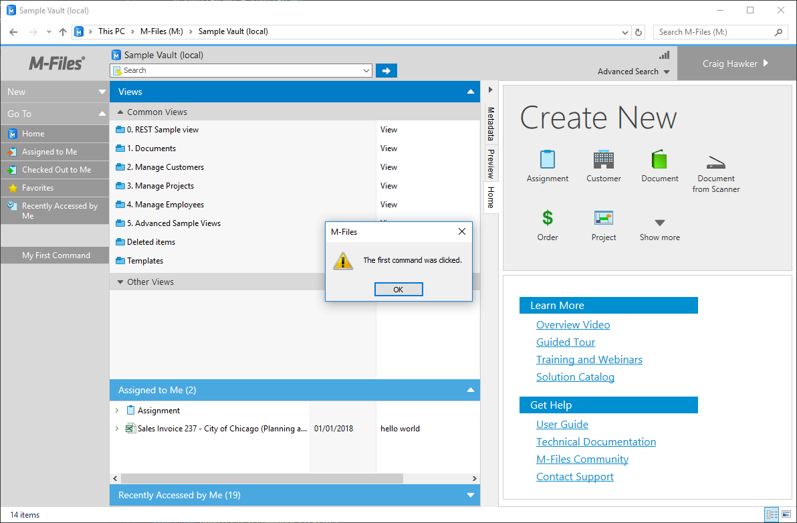
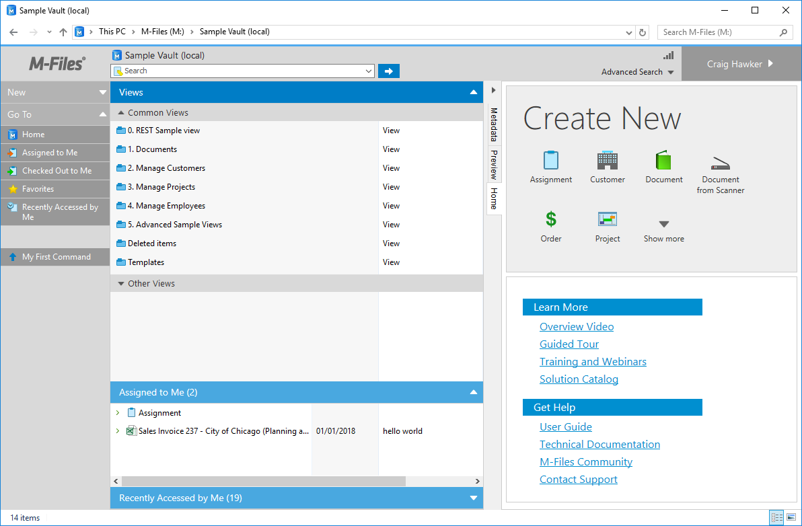
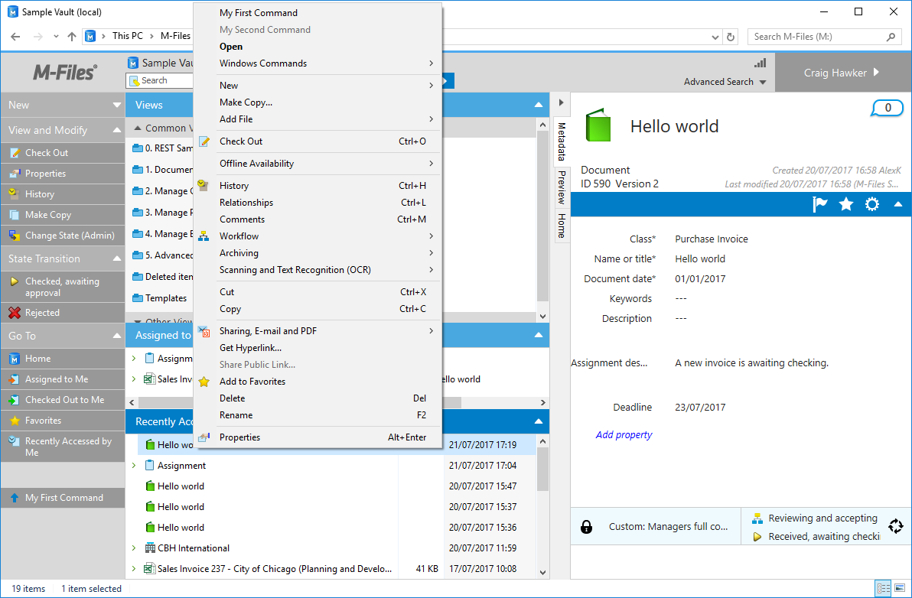

This sample creates a basic User Interface Extensibility Framework application consisting of one [ShellUI module]({{ site.baseurl }}/Frameworks/User-Interface-Extensibility-Framework/Modules/#shellui) which shows a dialog box to the user when the [shell frame (section 2.6)](https://www.m-files.com/UI_Extensibility_Framework/index.html#DevGuide.htm) is available.  The shell frame is a useful object as it allows us to interact with the shell listings and commands (such as buttons) within the user interface.

<p class="note">This sample extends the <a href="../">previous samples</a>.  Whilst all basic steps will be covered, more detail may be found in other samples.</p>

## Overview

This sample does not show how to create a [local development folder]({{ site.baseurl }}/Frameworks/User-Interface-Extensibility-Framework/Development-Practices/Local-Development-Folder/) or to [deploy the code to the M-Files server]({{ site.baseurl }}/Frameworks/User-Interface-Extensibility-Framework/Development-Practices/Deployment/).  It is assumed that a local development folder already exists, and that is the location in which the development is occuring.

## Creating the application structure

### Creating the application definition file

Into this folder we will create an [application definition file]({{ site.baseurl }}/Frameworks/User-Interface-Extensibility-Framework/Application-Definition/).  This file must be named `appdef.xml`.  The application will use [version 3 of the client schema]({{ site.baseurl }}/Frameworks/User-Interface-Extensibility-Framework/Application-Definition/#v3-schema) (as we are only targeting newer M-Files versions), and the [supported platform will be set as desktop only]({{ site.baseurl }}/Frameworks/User-Interface-Extensibility-Framework/Development-Practices/Platform-Targeting/#declaring-compatibility-with-only-the-m-files-desktop-client).  The application will declare a single Shell UI module (with its code in `main.js`), and no dashboards.

```xml
<?xml version="1.0" encoding="UTF-8"?>
<application xmlns:xsi="http://www.w3.org/2001/XMLSchema-instance"
		xsi:noNamespaceSchemaLocation="http://www.m-files.com/schemas/appdef-client-v3.xsd">
	<guid>60c93a08-27c3-4c59-aa61-906aaff52b81</guid>	
	<name>Commands</name>
	<version>0.1</version>
	<description>A basic application showing how to work with commands.</description>
	<publisher>M-Files Corporation</publisher>
	<copyright>(c) M-Files Corporation 2017</copyright>
	<required-mfiles-version>11.3.0000.00</required-mfiles-version>
	<platforms>
		<platform>Desktop</platform>
	</platforms>
	<modules>
		<module environment="shellui">
			<file>main.js</file>
		</module>
	</modules>
</application>
```

<p class="note">Ensure that your application has a unique GUID by using a GUID generator, such as <a href="https://guidgenerator.com/">this one</a>.</p>

### Creating the module

Next we will create a [module file]({{ site.baseurl }}/Frameworks/User-Interface-Extensibility-Framework/Modules/) to contain our actual application logic.  At this point we will just register to be notified of main lifecycle events:

* We will declare a [default entry point]({{ site.baseurl }}/Frameworks/User-Interface-Extensibility-Framework/Development-Practices/Event-Registration-And-Entry-Points/#shellui-modules) for the ShellUI module.
* We will react to the `NewShellFrame` event and obtain a reference to the shell frame.
* We will react to the shell frame's `Started` event (as using the shell frame before this point will result in an exception).

```javascript
// NOTE! This code is for demonstration purposes only and does not contain any kind of
// 		 error handling. MUST be revised before using in production.
//		 Authored by: Craig Hawker / M-Files

"use strict";
 
function OnNewShellUI( shellUI )
{
	/// <summary>Executed by the UIX when a ShellUI module is started.</summary>
	/// <param name="shellUI" type="MFiles.ShellUI">The shell UI object which was created.</param>
 
	// This is the start point of a ShellUI module.
 
	// Register to be notified when a new shell frame (Event_NewShellFrame) is created.
	shellUI.Events.Register(
		Event_NewShellFrame,
		handleNewShellFrame );
}
 
function handleNewShellFrame(shellFrame)
{
	/// <summary>Handles the OnNewShellFrame event for an IShellUI.</summary>
	/// <param name="shellFrame" type="MFiles.ShellFrame">The shell frame object which was created.</param>
 
	// The shell frame was created but it cannot be used yet.
	// The following line would throw an exception ("The object cannot be accessed, because it is not ready."):
	// shellFrame.ShowMessage("A shell frame was created");
 
	// Register to be notified when the shell frame is started.
	shellFrame.Events.Register(
		Event_Started,
		getNewShellListingHandler( shellFrame ) );
}
 
function getShellFrameStartedHandler(shellFrame)
{
	/// <summary>Gets a function to handle the OnStarted event for an IShellFrame.</summary>
 
	// The shell frame is now started and can be used.
	return function(){};
}
```

## Creating a button in the task area

Adding a button into the task area involves two steps:
1. Creating a new `ICommand` using [CreateCustomCommand](https://www.m-files.com/UI_Extensibility_Framework/index.html#MFClientScript~ICommands~CreateCustomCommand.html) (line 47).
2. Adding the command into the task area using [AddCustomCommandToGroup](https://www.m-files.com/UI_Extensibility_Framework/index.html#MFClientScript~ITaskPane~AddCustomCommandToGroup.html) (line 52).

<p class="note">The group that the button will be added to is either one of the built-in <a href="https://www.m-files.com/UI_Extensibility_Framework/index.html#MFClientScript~TaskPaneGroup.html">task pane groups</a> or the ID of a group that has previously been created with <a href="https://www.m-files.com/UI_Extensibility_Framework/index.html#MFClientScript~ITaskPane~CreateGroup.html">CreateGroup</a>.</p>

```javascript
// NOTE! This code is for demonstration purposes only and does not contain any kind of
// 		 error handling. MUST be revised before using in production.
//		 Authored by: Craig Hawker / M-Files

"use strict";
 
function OnNewShellUI( shellUI )
{
	/// <summary>Executed by the UIX when a ShellUI module is started.</summary>
	/// <param name="shellUI" type="MFiles.ShellUI">The shell UI object which was created.</param>
 
	// This is the start point of a ShellUI module.
 
	// Register to be notified when a new shell frame (Event_NewShellFrame) is created.
	shellUI.Events.Register(
		Event_NewShellFrame,
		handleNewShellFrame );
}
 
function handleNewShellFrame(shellFrame)
{
	/// <summary>Handles the OnNewShellFrame event for an IShellUI.</summary>
	/// <param name="shellFrame" type="MFiles.ShellFrame">The shell frame object which was created.</param>
 
	// The shell frame was created but it cannot be used yet.
	// The following line would throw an exception ("The object cannot be accessed, because it is not ready."):
	// shellFrame.ShowMessage("A shell frame was created");
 
	// Register to be notified when the shell frame is started.
	shellFrame.Events.Register(
		Event_Started,
		getShellFrameStartedHandler(shellFrame) );
}
 
function getShellFrameStartedHandler(shellFrame)
{
	/// <summary>Returns a function which handles the OnStarted event for an IShellFrame.</summary>
 
	// The shell frame is now started and can be used.

	return function()
	{

		// Create a command (button).  Note that it is not yet visible.
		// ref: https://www.m-files.com/UI_Extensibility_Framework/index.html#MFClientScript~ICommands~CreateCustomCommand.html
		var commandOneId = shellFrame.Commands.CreateCustomCommand("My First Command");

		// Add the command to the task area.
		// ref: https://www.m-files.com/UI_Extensibility_Framework/index.html#MFClientScript~ITaskPane~AddCustomCommandToGroup.html
		try {
			shellFrame.TaskPane.AddCustomCommandToGroup(commandOneId, TaskPaneGroup_Main, 1);
		}
		catch (e) {
			// This will except if the task pane is not available (e.g. in a History view).
		}

	}

}
```

Logging into the M-Files vault should now show a button in the task area with the text `My First Command`:


### Reacting when the command is clicked

Reacting to a command being clicked involves three steps:
1. Register to be notified of the [CustomCommand](https://www.m-files.com/UI_Extensibility_Framework/index.html#Event_CustomCommand.html) event (line 59).
2. Ensure that the command that was clicked was the one we want to handle (line 61).
3. Execute the required code (line 68).

```javascript
// NOTE! This code is for demonstration purposes only and does not contain any kind of
// 		 error handling. MUST be revised before using in production.
//		 Authored by: Craig Hawker / M-Files

"use strict";

function OnNewShellUI( shellUI )
{
	/// <summary>Executed by the UIX when a ShellUI module is started.</summary>
	/// <param name="shellUI" type="MFiles.ShellUI">The shell UI object which was created.</param>
 
	// This is the start point of a ShellUI module.
 
	// Register to be notified when a new shell frame (Event_NewShellFrame) is created.
	shellUI.Events.Register(
		Event_NewShellFrame,
		handleNewShellFrame );
}
 
function handleNewShellFrame(shellFrame)
{
	/// <summary>Handles the OnNewShellFrame event for an IShellUI.</summary>
	/// <param name="shellFrame" type="MFiles.ShellFrame">The shell frame object which was created.</param>
 
	// The shell frame was created but it cannot be used yet.
	// The following line would throw an exception ("The object cannot be accessed, because it is not ready."):
	// shellFrame.ShowMessage("A shell frame was created");
 
	// Register to be notified when the shell frame is started.
	shellFrame.Events.Register(
		Event_Started,
		getShellFrameStartedHandler(shellFrame) );
}
 
ffunction getShellFrameStartedHandler(shellFrame)
{
	/// <summary>Returns a function which handles the OnStarted event for an IShellFrame.</summary>
 
	// The shell frame is now started and can be used.

	return function() {

		// Create a command (button).  Note that it is not yet visible.
		// ref: https://www.m-files.com/UI_Extensibility_Framework/index.html#MFClientScript~ICommands~CreateCustomCommand.html
		var commandOneId = shellFrame.Commands.CreateCustomCommand("My First Command");

		// Add the command to the task area.
		// ref: https://www.m-files.com/UI_Extensibility_Framework/index.html#MFClientScript~ITaskPane~AddCustomCommandToGroup.html
		try {
			shellFrame.TaskPane.AddCustomCommandToGroup(commandOneId, TaskPaneGroup_Main, 1);
		}
		catch (e) {
			// This will except if the task pane is not available (e.g. in a History view).
		}

		// Register to be notified when a custom command is clicked.
		// Note: this will fire for ALL custom commands, so we need to filter out others.
		shellFrame.Commands.Events.Register(
			Event_CustomCommand,
			function(commandId)
			{
				// Branch depending on the Id of the command that was clicked.
				switch(commandId)
				{
					case commandOneId:
						// Our first command was clicked.
						shellFrame.ShowMessage("The first command was clicked.")
						break;
				}
			});

	};

}
```



### Setting an icon for the command

To set an icon for the command:
1. Ensure that you have an icon in the [correct format](https://www.m-files.com/UI_Extensibility_Framework/index.html#MFClientScript~ICommands~SetIconFromPath.html).  This should be a `.ico` file with at least a 16x16 image.
2. Ensure that the icon file is included within the User Interface Extensibility Framework application.
3. Call [SetIconFromPath](https://www.m-files.com/UI_Extensibility_Framework/index.html#MFClientScript~ICommands~SetIconFromPath.html), passing both the command Id and the *relative* path to the icon (line 50).

<p class="note">Setting an icon only works if the command is shown in the task area.  Icons will not be shown for items in the context menu.</p>

```javascript
// NOTE! This code is for demonstration purposes only and does not contain any kind of
// 		 error handling. MUST be revised before using in production.
//		 Authored by: Craig Hawker / M-Files

"use strict";

function OnNewShellUI( shellUI )
{
	/// <summary>Executed by the UIX when a ShellUI module is started.</summary>
	/// <param name="shellUI" type="MFiles.ShellUI">The shell UI object which was created.</param>
 
	// This is the start point of a ShellUI module.
 
	// Register to be notified when a new shell frame (Event_NewShellFrame) is created.
	shellUI.Events.Register(
		Event_NewShellFrame,
		handleNewShellFrame );
}
 
function handleNewShellFrame(shellFrame)
{
	/// <summary>Handles the OnNewShellFrame event for an IShellUI.</summary>
	/// <param name="shellFrame" type="MFiles.ShellFrame">The shell frame object which was created.</param>
 
	// The shell frame was created but it cannot be used yet.
	// The following line would throw an exception ("The object cannot be accessed, because it is not ready."):
	// shellFrame.ShowMessage("A shell frame was created");
 
	// Register to be notified when the shell frame is started.
	shellFrame.Events.Register(
		Event_Started,
		getShellFrameStartedHandler(shellFrame) );
}
 
function getShellFrameStartedHandler(shellFrame)
{
	/// <summary>Returns a function which handles the OnStarted event for an IShellFrame.</summary>
 
	// The shell frame is now started and can be used.

	return function() {

		// Create a command (button).  Note that it is not yet visible.
		// ref: https://www.m-files.com/UI_Extensibility_Framework/index.html#MFClientScript~ICommands~CreateCustomCommand.html
		var commandOneId = shellFrame.Commands.CreateCustomCommand("My First Command");

		// Set the icon for the command.
		// ref: https://www.m-files.com/UI_Extensibility_Framework/index.html#MFClientScript~ICommands~SetIconFromPath.html
		shellFrame.Commands.SetIconFromPath(commandOneId, "icons/uparrow.ico");

		// Add the command to the task area.
		// ref: https://www.m-files.com/UI_Extensibility_Framework/index.html#MFClientScript~ITaskPane~AddCustomCommandToGroup.html
		try {
			shellFrame.TaskPane.AddCustomCommandToGroup(commandOneId, TaskPaneGroup_Main, 1);
		}
		catch (e) {
			// This will except if the task pane is not available (e.g. in a History view).
		}

		// Register to be notified when a custom command is clicked.
		// Note: this will fire for ALL custom commands, so we need to filter out others.
		shellFrame.Commands.Events.Register(
			Event_CustomCommand,
			function(commandId)
			{
				// Branch depending on the Id of the command that was clicked.
				switch(commandId)
				{
					case commandOneId:
						// Our first command was clicked.
						shellFrame.ShowMessage("The first command was clicked.")
						break;
				}
			});

	};

}
```



## Adding a command to both the task area and the context menu

To add a command created with [CreateCustomCommand](https://www.m-files.com/UI_Extensibility_Framework/index.html#MFClientScript~ICommands~CreateCustomCommand.html) to the context menu, call [AddCustomCommandToMenu](https://www.m-files.com/UI_Extensibility_Framework/index.html#MFClientScript~ICommands~AddCustomCommandToMenu.html) (line 62).  In the example below, it is the same command object added to both task pane and context menu, so our [code to react when the button is clicked](#reacting-when-the-command-is-clicked) will be fired for the context menu item and the task pane.

<p class="note">The command can be added in one of <a href="https://www.m-files.com/UI_Extensibility_Framework/index.html#MFClientScript~ICommands~AddCustomCommandToMenu.html">a number of locations</a> within the context menu.  Some of these locations are only shown in some scenarios (e.g. some sections are not shown when files are right-clicked, but are when objects are right-clicked).</p>

```javascript
// NOTE! This code is for demonstration purposes only and does not contain any kind of
// 		 error handling. MUST be revised before using in production.
//		 Authored by: Craig Hawker / M-Files

"use strict";

function OnNewShellUI( shellUI )
{
	/// <summary>Executed by the UIX when a ShellUI module is started.</summary>
	/// <param name="shellUI" type="MFiles.ShellUI">The shell UI object which was created.</param>
 
	// This is the start point of a ShellUI module.
 
	// Register to be notified when a new shell frame (Event_NewShellFrame) is created.
	shellUI.Events.Register(
		Event_NewShellFrame,
		handleNewShellFrame );
}
 
function handleNewShellFrame(shellFrame)
{
	/// <summary>Handles the OnNewShellFrame event for an IShellUI.</summary>
	/// <param name="shellFrame" type="MFiles.ShellFrame">The shell frame object which was created.</param>
 
	// The shell frame was created but it cannot be used yet.
	// The following line would throw an exception ("The object cannot be accessed, because it is not ready."):
	// shellFrame.ShowMessage("A shell frame was created");
 
	// Register to be notified when the shell frame is started.
	shellFrame.Events.Register(
		Event_Started,
		getShellFrameStartedHandler(shellFrame) );
}
 
function getShellFrameStartedHandler(shellFrame)
{
	/// <summary>Returns a function which handles the OnStarted event for an IShellFrame.</summary>
 
	// The shell frame is now started and can be used.

	return function() {

		// Create a command (button).  Note that it is not yet visible.
		// ref: https://www.m-files.com/UI_Extensibility_Framework/index.html#MFClientScript~ICommands~CreateCustomCommand.html
		var commandOneId = shellFrame.Commands.CreateCustomCommand("My First Command");

		// Set the icon for the command.
		shellFrame.Commands.SetIconFromPath(commandOneId, "icons/uparrow.ico");

		// Add the command to the task area.
		// ref: https://www.m-files.com/UI_Extensibility_Framework/index.html#MFClientScript~ITaskPane~AddCustomCommandToGroup.html
		try {
			shellFrame.TaskPane.AddCustomCommandToGroup(commandOneId, TaskPaneGroup_Main, 1);
		}
		catch (e) {
			// This will except if the task pane is not available (e.g. in a History view).
		}

		// Add the command to the context menu.
		// ref: https://www.m-files.com/UI_Extensibility_Framework/index.html#MFClientScript~ICommands~AddCustomCommandToMenu.html
		shellFrame.Commands.AddCustomCommandToMenu(commandOneId, MenuLocation_ContextMenu_Top, 1);

		// Register to be notified when a custom command is clicked.
		// Note: this will fire for ALL custom commands, so we need to filter out others.
		shellFrame.Commands.Events.Register(
			Event_CustomCommand,
			function(commandId)
			{
				// Branch depending on the Id of the command that was clicked.
				switch(commandId)
				{
					case commandOneId:
						// Our first command was clicked.
						shellFrame.ShowMessage("The first command was clicked.")
						break;
				}
			});

	};

}
```


## Showing and hiding buttons

The visibility of commands can be controlled by calling [SetCommandState](https://www.m-files.com/UI_Extensibility_Framework/index.html#MFClientScript~ICommands~SetCommandState.html).  To show this, we will create a second command (line 50) and initially set it to hidden (line 54).  Clicking the first command will show and enable the second command (line 83), and clicking the second command will disable itself (line 89).

<p class="note">Setting a command state to <code class="highlighter-rouge">CommandState_Active</code> will make it both active and visible.</p>

```javascript
// NOTE! This code is for demonstration purposes only and does not contain any kind of
// 		 error handling. MUST be revised before using in production.
//		 Authored by: Craig Hawker / M-Files

"use strict";

function OnNewShellUI( shellUI )
{
	/// <summary>Executed by the UIX when a ShellUI module is started.</summary>
	/// <param name="shellUI" type="MFiles.ShellUI">The shell UI object which was created.</param>
 
	// This is the start point of a ShellUI module.
 
	// Register to be notified when a new shell frame (Event_NewShellFrame) is created.
	shellUI.Events.Register(
		Event_NewShellFrame,
		handleNewShellFrame );
}
 
function handleNewShellFrame(shellFrame)
{
	/// <summary>Handles the OnNewShellFrame event for an IShellUI.</summary>
	/// <param name="shellFrame" type="MFiles.ShellFrame">The shell frame object which was created.</param>
 
	// The shell frame was created but it cannot be used yet.
	// The following line would throw an exception ("The object cannot be accessed, because it is not ready."):
	// shellFrame.ShowMessage("A shell frame was created");
 
	// Register to be notified when the shell frame is started.
	shellFrame.Events.Register(
		Event_Started,
		getShellFrameStartedHandler(shellFrame));
}
 
function getShellFrameStartedHandler(shellFrame)
{
	/// <summary>Returns a function which handles the OnStarted event for an IShellFrame.</summary>
 
	// The shell frame is now started and can be used.

	return function() {

		// Create a command (button).  Note that it is not yet visible.
		// ref: https://www.m-files.com/UI_Extensibility_Framework/index.html#MFClientScript~ICommands~CreateCustomCommand.html
		var commandOneId = shellFrame.Commands.CreateCustomCommand( "My First Command" );

		// Create a command (button).  Note that it is not yet visible.
		// ref: https://www.m-files.com/UI_Extensibility_Framework/index.html#MFClientScript~ICommands~CreateCustomCommand.html
		var commandTwoId = shellFrame.Commands.CreateCustomCommand( "My Second Command" );

		// Hide the second command.
		// ref: https://www.m-files.com/UI_Extensibility_Framework/index.html#MFClientScript~ICommands~SetCommandState.html
		shellFrame.Commands.SetCommandState( commandTwoId, CommandLocation_All, CommandState_Hidden );

		// Set the icon for the command.
		shellFrame.Commands.SetIconFromPath( commandOneId, "icons/uparrow.ico" );

		// Add the first and second commands to the task area.
		// ref: https://www.m-files.com/UI_Extensibility_Framework/index.html#MFClientScript~ITaskPane~AddCustomCommandToGroup.html
		try {
			shellFrame.TaskPane.AddCustomCommandToGroup( commandOneId, TaskPaneGroup_Main, 1 );
			shellFrame.TaskPane.AddCustomCommandToGroup( commandTwoId, TaskPaneGroup_Main, 1 );
		}
		catch (e) {
			// This will except if the task pane is not available (e.g. in a History view).
		}

		// Add the first and second commands to the context menu.
		// ref: https://www.m-files.com/UI_Extensibility_Framework/index.html#MFClientScript~ICommands~AddCustomCommandToMenu.html
		shellFrame.Commands.AddCustomCommandToMenu( commandOneId, MenuLocation_ContextMenu_Top, 1 );
		shellFrame.Commands.AddCustomCommandToMenu( commandTwoId, MenuLocation_ContextMenu_Top, 1 );

		// Register to be notified when a custom command is clicked.
		// Note: this will fire for ALL custom commands, so we need to filter out others.
		shellFrame.Commands.Events.Register(
			Event_CustomCommand,
			function(commandId) {
				// Branch depending on the Id of the command that was clicked.
				switch (commandId) {
					case commandOneId:
						// Our first command was clicked.
						shellFrame.Commands.SetCommandState(commandTwoId,
							CommandLocation_All,
							CommandState_Active);
						break;
					case commandTwoId:
						// Our second command was clicked.
						shellFrame.Commands.SetCommandState(commandTwoId,
							CommandLocation_All,
							CommandState_Inactive);
						break;
				}
			} );

	}

}
```

