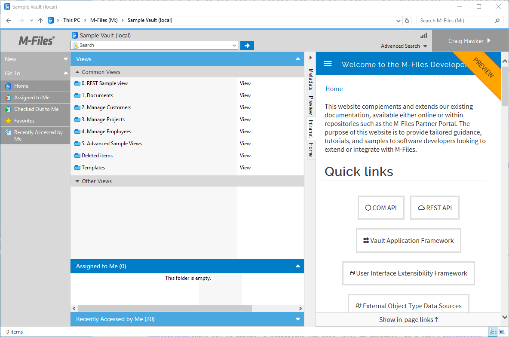

This sample creates a basic User Interface Extensibility Framework application consisting of one [ShellUI module]({{ site.baseurl }}/Frameworks/User-Interface-Extensibility-Framework/Modules/#shellui) which shows a persistent browser window within a tab in the right-pane of M-Files.  This can be useful to display a web page which is not context-sensitive (e.g. an intranet), persisting the user's navigation within the browser window as they navigate within M-Files.

The source code for this sample is available within our <a href="https://github.com/M-Files/MFilesSamplesAndLibraries/tree/master/Samples/UIX%20Applications/DisplayPersistentWebPageInTab">GitHub Samples and Libraries repository</a>.
{:.note}

This sample extends the <a href="../">previous samples</a>.  Whilst all basic steps will be covered, more detail may be found in other samples.
{:.note}

## Overview

This sample does not show how to create a [local development folder]({{ site.baseurl }}/Frameworks/User-Interface-Extensibility-Framework/Development-Practices/Local-Development-Folder/) or to [deploy the code to the M-Files server]({{ site.baseurl }}/Frameworks/User-Interface-Extensibility-Framework/Development-Practices/Deployment/).  It is assumed that a local development folder already exists, and that is the location in which the development is occurring.

## Creating the application structure

### Creating the application definition file

Into this folder we will create an [application definition file]({{ site.baseurl }}/Frameworks/User-Interface-Extensibility-Framework/Application-Definition/).  This file must be named `appdef.xml`.  The application will use [version 3 of the client schema]({{ site.baseurl }}/Frameworks/User-Interface-Extensibility-Framework/Application-Definition/#v3-schema) (as we are only targeting newer M-Files versions), and the [supported platform will be set as desktop only]({{ site.baseurl }}/Frameworks/User-Interface-Extensibility-Framework/Development-Practices/Platform-Targeting/#declaring-compatibility-with-only-the-m-files-desktop-client).  The application will declare a single Shell UI module (with its code in `main.js`), and no dashboards.

```xml
<?xml version="1.0" encoding="UTF-8"?>
<application xmlns:xsi="http://www.w3.org/2001/XMLSchema-instance"
		xsi:noNamespaceSchemaLocation="http://www.m-files.com/schemas/appdef-client-v3.xsd">
	<guid>711441b6-dca0-4c9c-a04e-37bd4717e7ff</guid>	
	<name>Display persistent web page</name>
	<version>0.1</version>
	<description>Shows how to display a persistent web page (e.g. an intranet) in a tab.</description>
	<publisher>M-Files Corporation</publisher>
	<copyright>(c) M-Files Corporation 2017</copyright>
	<required-mfiles-version>11.3.0000.00</required-mfiles-version>
	<platforms>
		<platform>Desktop</platform>
	</platforms>
	<modules>
		<module environment="shellui">
			<file>main.js</file>
		</module>
	</modules>
</application>
```

Ensure that your application has a unique GUID by using a GUID generator, such as <a href="https://guidgenerator.com/">this one</a>.
{:.note}

### Creating the module

Next we will create a [module file]({{ site.baseurl }}/Frameworks/User-Interface-Extensibility-Framework/Modules/) to contain our actual application logic.  We will:

* We will declare a [default entry point]({{ site.baseurl }}/Frameworks/User-Interface-Extensibility-Framework/Development-Practices/Event-Registration-And-Entry-Points/#shellui-modules) for the ShellUI module.
* We will react to the ShellUI's `Started` event (as using the shell UI before this point will result in an exception).
* We will [create the persistent browser content (CreatePersistentBrowserContent)](https://www.m-files.com/UI_Extensibility_Framework/index.html#MFClientScript~IShellUI~CreatePersistentBrowserContent.html) (lines 38-42).
* We will react to the `NewShellFrame` event and obtain a reference to the shell frame.
* We will react to the shell frame's `Started` event (as using the shell frame before this point will result in an exception).
* We will add a tab to the current shell frame's right-hand section, [showing the persistent content (ShowPersistentContent)](https://www.m-files.com/UI_Extensibility_Framework/index.html#MFClientScript~IShellPaneTab~ShowPersistentContent.html) that was created earlier (lines 69-75).
* We will set the tab to [visible](https://www.m-files.com/UI_Extensibility_Framework/index.html#MFClientScript~IShellPaneTab~Visible.html) (line 78).

```javascript
// NOTE! This code is for demonstration purposes only and does not contain any kind of
// 		 error handling. MUST be revised before using in production.
//		 Authored by: Craig Hawker / M-Files

"use strict";

// A handle to the persistent browser that will be used
// across all shell frames.
var persistentContentHandle = null;

function OnNewShellUI( shellUI )
{
	/// <summary>Executed by the UIX when a ShellUI module is started.</summary>
	/// <param name="shellUI" type="MFiles.ShellUI">The shell UI object which was created.</param>
 
	// This is the start point of a ShellUI module.
 
	// Register to be notified when the shell ui is started.
	shellUI.Events.Register(
		Event_Started,
		getShellUIStartedHandler(shellUI) );
 
	// Register to be notified when a new shell frame (Event_NewShellFrame) is created.
	shellUI.Events.Register(
		Event_NewShellFrame,
		handleNewShellFrame );
}

function getShellUIStartedHandler(shellUI)
{
	/// <summary>Returns a function which handles the OnStarted event for an IShellUI.</summary>

	return function()
	{
		// The shell UI is now started and can be used.

		// Create the persistent browser window (but do not show it).
		persistentContentHandle = shellUI.CreatePersistentBrowserContent(
			"http://developer.m-files.com",
			{
				defaultvisibility: false
			} );
	}
}

function handleNewShellFrame(shellFrame)
{
	/// <summary>Handles the OnNewShellFrame event for an IShellUI.</summary>
	/// <param name="shellFrame" type="MFiles.ShellFrame">The shell frame object which was created.</param>
 
	// The shell frame was created but it cannot be used yet.
	// The following line would throw an exception ("The object cannot be accessed, because it is not ready."):
	// shellFrame.ShowMessage("A shell frame was created");
 
	// Register to be notified when the shell frame is started.
	// This time pass a reference to the function to call when the event is fired.
	shellFrame.Events.Register(
		Event_Started,
		getShellFrameStartedHandler( shellFrame) );
}
 
function getShellFrameStartedHandler(shellFrame)
{
	/// <summary>Returns a function which handles the OnStarted event for an IShellFrame.</summary>
 
	return function() {
		// The shell frame is now started and can be used.
		
		// Create a new tab for the content to be shown in.
		// ref: https://www.m-files.com/UI_Extensibility_Framework/index.html#MFClientScript~IShellPaneContainer~AddTab.html
		// Tab ids ref: https://www.m-files.com/UI_Extensibility_Framework/#SidePaneTabs.html
		var tab = shellFrame.RightPane.AddTab( "myPersistentContent", "Intranet", "_last" );

		// Load the content into the tab.
		tab.ShowPersistentContent( persistentContentHandle );

		// Show the tab.
		tab.visible = true;
	}
}
```

## Testing the application

Opening the vault shows a new tab next to home, named `Intranet`.  Selecting the tab shows the web page that was specified.



Note that any navigation within the persistent browser window will be kept when navigating within views in M-Files.
{:.note}

