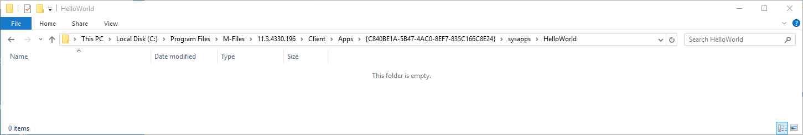
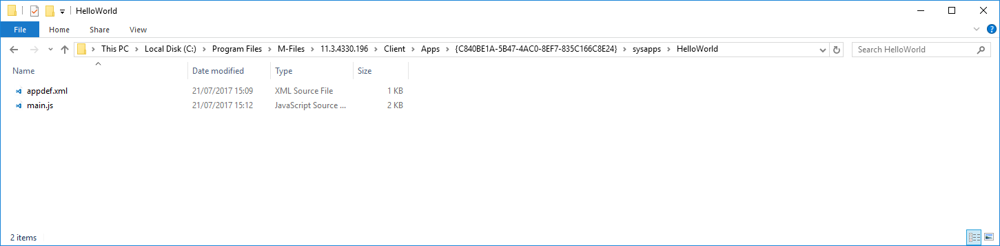
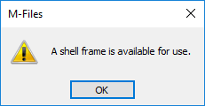
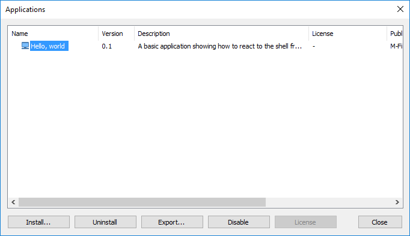

This sample creates a basic User Interface Extensibility Framework application consisting of one [ShellUI module]({{ site.baseurl }}/Frameworks/User-Interface-Extensibility-Framework/Modules/#shellui) which shows a dialog box to the user when the [shell frame (section 2.6)](https://www.m-files.com/UI_Extensibility_Framework/index.html#DevGuide.htm) is available.  The shell frame is a useful object as it allows us to interact with the shell listings and commands (such as buttons) within the user interface.

## Creating a local development folder

Firstly, let's create a [local development folder]({{ site.baseurl }}/Frameworks/User-Interface-Extensibility-Framework/Development-Practices/Local-Development-Folder/) for the application.  For this sample we will assume that the M-Files vault GUID is `{C840BE1A-5B47-4AC0-8EF7-835C166C8E24}` and the M-Files client version is `11.3.4330.196`:



## Creating the application definition file

Into this folder we will create an [application definition file]({{ site.baseurl }}/Frameworks/User-Interface-Extensibility-Framework/Application-Definition/).  This file must be named `appdef.xml`.  The application will use [version 3 of the client schema]({{ site.baseurl }}/Frameworks/User-Interface-Extensibility-Framework/Application-Definition/#v3-schema) (as we are only targeting newer M-Files versions), and the [supported platform will be set as desktop only]({{ site.baseurl }}/Frameworks/User-Interface-Extensibility-Framework/Development-Practices/Platform-Targeting/#declaring-compatibility-with-only-the-m-files-desktop-client).  The application will declare a single Shell UI module (with its code in `main.js`), and no dashboards.

```xml
<?xml version="1.0" encoding="UTF-8"?>
<application xmlns:xsi="http://www.w3.org/2001/XMLSchema-instance"
		xsi:noNamespaceSchemaLocation="http://www.m-files.com/schemas/appdef-client-v3.xsd">
	<guid>711441b6-dca0-4c9c-a04e-37bd4717e7fe</guid>	
	<name>Hello, world</name>
	<version>0.1</version>
	<description>A basic application showing how to react to the shell frame being available.</description>
	<publisher>M-Files Corporation</publisher>
	<copyright>(c) M-Files Corporation 2017</copyright>
	<required-mfiles-version>11.3.0000.00</required-mfiles-version>
	<platforms>
		<platform>Desktop</platform>
	</platforms>
	<modules>
		<module environment="shellui">
			<file>main.js</file>
		</module>
	</modules>
</application>
```

<p class="note">Ensure that your application has a unique GUID by using a GUID generator, such as <a href="https://guidgenerator.com/">this one</a>.</p>

## Creating the module

Next we will create a [module file]({{ site.baseurl }}/Frameworks/User-Interface-Extensibility-Framework/Modules/) to contain our actual application logic.  The logic will be simple:

* We will declare a [default entry point]({{ site.baseurl }}/Frameworks/User-Interface-Extensibility-Framework/Development-Practices/Event-Registration-And-Entry-Points/#shellui-modules) for the ShellUI module.
* We will react to the `NewShellFrame` event and obtain a reference to the shell frame.
* We will react to the shell frame's `Started` event (as using the shell frame before this point will result in an exception).
* We will [display a message](https://www.m-files.com/UI_Extensibility_Framework/index.html#ShowingMessageBoxes.html) to the user that the shell frame is ready for use.

```javascript
// Execute some code when the shell frame is created and available.
var g_shellFrame = null;
 
function OnNewShellUI( shellUI )
{
	/// <summary>Executed by the UIX when a ShellUI module is started.</summary>
	/// <param name="shellUI" type="MFiles.ShellUI">The shell UI object which was created.</param>
 
	// This is the start point of a ShellUI module.
 
	// Register to be notified when a new shell frame (Event_NewShellFrame) is created.
	shellUI.Events.Register(
		Event_NewShellFrame,
		handleNewShellFrame );
}
 
function handleNewShellFrame(shellFrame)
{
	/// <summary>Handles the OnNewShellFrame event for an IShellUI.</summary>
	/// <param name="shellFrame" type="MFiles.ShellFrame">The shell frame object which was created.</param>
 
	// The shell frame was created but it cannot be used yet.
	// The following line would throw an exception ("The object cannot be accessed, because it is not ready."):
	// shellFrame.ShowMessage("A shell frame was created");
 
	// Update global scope variable to point to new shell frame.
	g_shellFrame = shellFrame;
 
	// Register to be notified when the shell frame is started.
	// Pass a reference to the handleShellFrameStarted function to call when the event is fired.
	shellFrame.Events.Register(
		Event_Started,
		handleShellFrameStarted );
}
 
function handleShellFrameStarted()
{
	/// <summary>Handles the OnStarted event for an IShellFrame.</summary>
 
	// The shell frame is now started and can be used.
	// Note: we need to use the global-scope variable.
	g_shellFrame.ShowMessage("A shell frame is available for use.");
}
```

## Testing the application

To test the application, ensure that all the files are saved.  The local development folder should look like this:



Open M-Files and navigate to the vault.  The following message should be shown on-screen:



<p class="note">If the message is not shown, ensure you log out from the vault and log in again to see the changes.</p>

## Deploying the application

To [deploy]({{ site.baseurl }}/Frameworks/User-Interface-Extensibility-Framework/Development-Practices/Deployment/) the application:

1. Zip the contents of the local development folder (e.g. `HelloWorld.zip`).
2. Open the M-Files Admin tool and connect to your M-Files server.
3. Right-click on the vault to install the application to.
4. Select `Applications`.
5. Click `Install...` and select the zip file.
6. Click `Open` and the application should be listed.



<p class="note">The zipped file can be renamed to have a <code class="highlighter-rouge">.mfappx</code> extension if you wish to differentiate it from other zip files.</p>

<p class="note warning">If you are testing the deployed application from your local machine then ensure that the local development folder is removed prior to deployment, otherwise it will override the deployed code.</p>